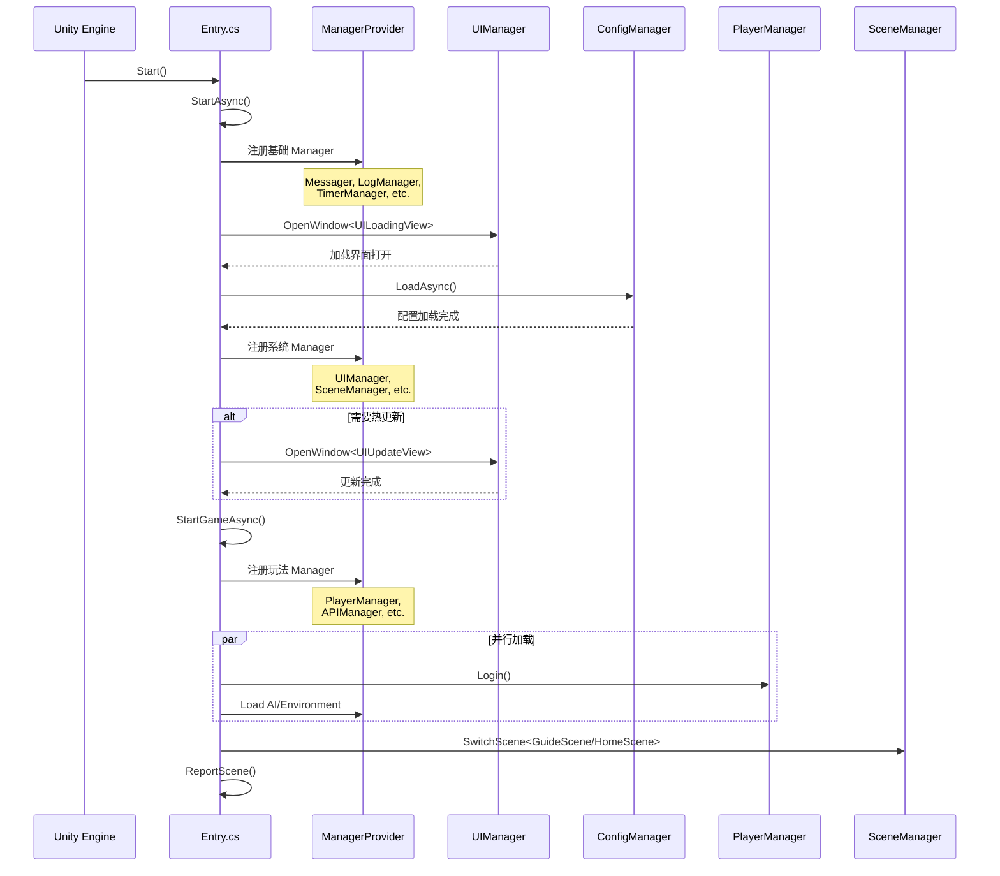

# Entry.cs 注解文档

## 文件基本信息

| 属性 | 值 |
|------|-----|
| **文件名** | Entry.cs |
| **路径** | Assets/Scripts/Code/Entry.cs |
| **所属模块** | 玩法层 → 游戏入口（全局） |
| **文件职责** | 游戏启动入口，负责初始化所有 Manager 并驱动游戏启动流程 |

---

## 类/结构体说明

### Entry

| 属性 | 说明 |
|------|------|
| **职责** | 游戏静态入口类，协调所有系统的初始化和启动流程 |
| **泛型参数** | 无 |
| **继承关系** | 无继承 |
| **实现的接口** | 无 |

**设计模式**: 静态入口模式 + 异步初始化

```csharp
// 静态类，单例访问点
public static class Entry
{
    public static void Start()  // Unity 调用的入口
    {
        StartAsync().Coroutine();
    }
}
```

---

## 字段与属性（按重要程度排序）

| 名称 | 类型 | 访问级别 | 说明 |
|------|------|----------|------|
| `START_TIME` | `long` | `private static` | 游戏启动时间戳，用于性能统计 |
| `Start()` | `void` | `public static` | Unity 生命周期入口（被 Unity 调用） |
| `StartAsync()` | `ETTask` | `private static async` | 主初始化流程（异步） |
| `StartGameAsync()` | `ETTask` | `static async` | 游戏业务初始化（异步） |
| `Login()` | `ETTask` | `static async` | 登录流程（异步） |
| `ReportScene()` | `void` | `static` | 上报场景加载性能数据 |

---

## 方法说明（按重要程度排序）

### Start()

**签名**:
```csharp
public static void Start()
```

**职责**: Unity 生命周期入口，启动异步初始化流程

**核心逻辑**:
```
1. 调用 StartAsync()
2. 通过 .Coroutine() 将 ETTask 转换为 Unity 协程
```

**调用者**: Unity Engine（自动调用）

**被调用者**: `StartAsync()`, `ETTask.Coroutine()`

---

### StartAsync()

**签名**:
```csharp
private static async ETTask StartAsync()
```

**职责**: 游戏主初始化流程，分阶段注册所有 Manager

**核心逻辑**:
```
1. 初始化 GameSetting
2. 注册基础 Manager（Messager, LogManager, AttributeManager）
3. 注册核心 Manager（CoroutineLock, Timer, Cache）
4. 记录启动时间 START_TIME
5. 注册资源 Manager（Config, Resources, GameObjectPool, ImageLoader, Material）
6. 打开加载界面 UILoadingView
7. 异步加载配置 cm.LoadAsync()
8. 注册系统 Manager（I18N, UI, RedDot, Camera, Scene, ServerConfig, Input）
9. 检查是否需要热更新 → 是：打开 UIUpdateView；否：直接 StartGameAsync()
```

**调用者**: `Start()`

**被调用者**: 所有 Manager 的 `RegisterManager`, `UIManager.OpenWindow`, `ConfigManager.LoadAsync`

**异常处理**:
```csharp
try
{
    // 初始化流程
}
catch (Exception e)
{
    Log.Error(e);  // 记录错误
}
```

---

### StartGameAsync()

**签名**:
```csharp
static async ETTask StartGameAsync()
```

**职责**: 游戏业务系统初始化，完成登录和场景切换

**核心逻辑**:
```
1. 注册玩法 Manager（API, Sound, Shock, Player, PlayerData, SDK, Ad, etc.）
2. 预加载 Toast 预制体
3. 并行加载：
   - AI 决策树
   - 环境系统
   - 音效系统
   - 预加载 UI
   - 登录（小游戏平台）
4. 等待所有任务完成 ETTaskHelper.WaitAll(tasks)
5. 卸载未使用资源
6. 预加载 BlendView
7. Shader 预热（非 WebGL 平台）
8. 打开引导界面 UIGuidanceView
9. 判断用户类型：
   - 新用户 → SwitchScene<GuideScene>
   - 老用户 → SwitchScene<HomeScene>
10. 上报场景加载时间
11. 播放主场景音乐
```

**调用者**: `StartAsync()`

**被调用者**: 各 Manager 初始化方法，`SceneManager.SwitchScene`, `SoundManager.PlayMusic`

---

### Login()

**签名**:
```csharp
static async ETTask Login()
```

**职责**: 处理玩家登录流程，支持重试

**核心逻辑**:
```
1. 设置加载提示文字
2. 调用 PlayerManager.Instance.Login(true)
3. 如果登录失败：
   - 打开错误提示框（重试/退出）
   - 等待用户选择
   - 选择重试 → 递归调用 Login()
   - 选择退出 → BridgeHelper.Quit()
4. 登录成功 → 返回
```

**调用者**: `StartGameAsync()`

**被调用者**: `PlayerManager.Login`, `UIManager.OpenBox`, `BridgeHelper.Quit`

**重试机制**:
```csharp
if (!res)
{
    // 显示错误框
    if (await task)  // 用户选择重试
    {
        await Login();  // 递归重试
    }
    else
    {
        BridgeHelper.Quit();  // 退出游戏
    }
}
```

---

### ReportScene()

**签名**:
```csharp
static void ReportScene()
```

**职责**: 上报场景加载性能数据到各小游戏平台

**核心逻辑**:
```
1. 计算加载耗时 during = TimerManager.Instance.GetTimeNow() - START_TIME
2. 记录日志 Log.Info(during)
3. 根据平台调用对应 SDK：
   - 抖音：TTSDK.TT.ReportScene()
   - 微信：WeChatWASM.WX.ReportScene()
   - B 站：WeChatWASM.WX.ReportScene()
   - 快手：KSWASM.KS.ReportScene()
```

**调用者**: `StartGameAsync()`

**被调用者**: 各平台 SDK

**平台宏定义**:
```csharp
#if UNITY_WEBGL_TT        // 抖音
#elif UNITY_WEBGL_WeChat // 微信
#elif UNITY_WEBGL_BILIGAME // B 站
#elif UNITY_WEBGL_KS     // 快手
#endif
```

---

## Unity 生命周期集成

### 与 Unity 的集成

Entry 是静态类，通过 `Start()` 方法集成到 Unity 生命周期：

```csharp
// Unity 自动调用
void Start()  // MonoBehaviour 的 Start
{
    Entry.Start();  // 调用 Entry 的 Start
}
```

### 启动流程图



---

## 阅读指引

### 建议的阅读顺序

1. **先看 Start() 方法** - 了解 Unity 入口
2. **再看 StartAsync()** - 理解初始化阶段划分
3. **重点看 StartGameAsync()** - 理解业务初始化流程
4. **最后看 Login() 和 ReportScene()** - 了解登录和性能上报

### 这个文件中最值得学习的技术点

1. **分阶段初始化**: 基础 → 资源 → 系统 → 玩法，层次清晰
2. **异步并行加载**: 使用 ETTaskHelper.WaitAll 并行执行多个任务
3. **平台适配**: 通过宏定义支持多个小游戏平台
4. **错误处理**: try-catch 包裹整个初始化流程
5. **性能统计**: 记录 START_TIME 并在最后上报耗时

---

## Manager 注册顺序

### 阶段一：基础设施
```csharp
ManagerProvider.RegisterManager<Messager>();           // 消息系统
ManagerProvider.RegisterManager<LogManager>();         // 日志系统
ManagerProvider.RegisterManager<AttributeManager>();   // 属性管理
ManagerProvider.RegisterManager<CoroutineLockManager>(); // 协程锁
ManagerProvider.RegisterManager<TimerManager>();       // 定时器
ManagerProvider.RegisterManager<CacheManager>();       // 缓存管理
```

### 阶段二：资源系统
```csharp
ManagerProvider.RegisterManager<ConfigManager>();      // 配置管理
ManagerProvider.RegisterManager<ResourcesManager>();   // 资源管理
ManagerProvider.RegisterManager<GameObjectPoolManager>(); // 对象池
ManagerProvider.RegisterManager<ImageLoaderManager>(); // 图片加载
ManagerProvider.RegisterManager<MaterialManager>();    // 材质管理
```

### 阶段三：系统模块
```csharp
ManagerProvider.RegisterManager<I18NManager>();        // 国际化
ManagerProvider.RegisterManager<UIManager>();          // UI 框架
ManagerProvider.RegisterManager<RedDotManager>();      // 红点系统
ManagerProvider.RegisterManager<CameraManager>();      // 相机管理
ManagerProvider.RegisterManager<SceneManager>();       // 场景管理
ManagerProvider.RegisterManager<ServerConfigManager>(); // 服务器配置
ManagerProvider.RegisterManager<InputManager>();       // 输入管理
```

### 阶段四：玩法系统
```csharp
ManagerProvider.RegisterManager<APIManager>();         // 网络 API
ManagerProvider.RegisterManager<SoundManager>();       // 音效管理
ManagerProvider.RegisterManager<ShockManager>();       // 震动反馈
ManagerProvider.RegisterManager<PlayerManager>();      // 玩家管理
ManagerProvider.RegisterManager<PlayerDataManager>();  // 玩家数据
ManagerProvider.RegisterManager<SDKManager>();         // 平台 SDK
ManagerProvider.RegisterManager<AdManager>();          // 广告系统
ManagerProvider.RegisterManager<GuidanceManager>();    // 引导系统
// ... 更多
```

---

## 平台宏定义

| 宏 | 平台 | 说明 |
|----|------|------|
| `UNITY_WEBGL_TT` | 抖音小游戏 | 字节跳动平台 |
| `UNITY_WEBGL_WeChat` | 微信小游戏 | 腾讯微信平台 |
| `UNITY_WEBGL_KS` | 快手小游戏 | 快手平台 |
| `UNITY_WEBGL_TAPTAP` | TapTap | 心动网络平台 |
| `UNITY_WEBGL_QG` | OPPO 小游戏 | OPPO 平台 |
| `UNITY_WEBGL_MINIHOST` | 小游戏主机 | 通用小游戏主机 |
| `UNITY_WEBGL_BILIGAME` | B 站游戏 | 哔哩哔哩平台 |
| `UNITY_WEBGL_4399` | 4399 小游戏 | 4399 平台 |

---

## 相关文档

- [ManagerProvider.cs.md](./Mono/Core/Manager/ManagerProvider.cs.md) - Manager 注册机制
- [UILoadingView.cs.md](./Code/Game/UI/UILoading/UILoadingView.cs.md) - 加载界面
- [PlayerManager.cs.md](./Code/Module/Player/PlayerManager.cs.md) - 玩家登录
- [SceneManager.cs.md](./Code/Module/Scene/SceneManager.cs.md) - 场景切换
- [PROJECT_DOCUMENTATION.md](../../PROJECT_DOCUMENTATION.md) - 项目全景文档

---

*文档生成时间：2026-02-27 | OpenClaw AI 助手*
