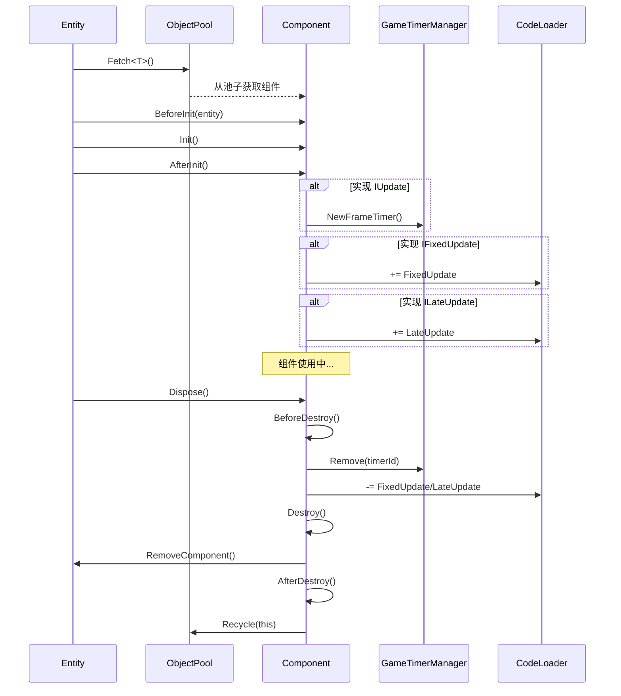

# Component.cs 注解文档

## 文件基本信息

| 属性 | 值 |
|------|-----|
| **文件名** | Component.cs |
| **路径** | Assets/Scripts/Code/Game/Component/Component.cs |
| **所属模块** | 游戏层 → Component |
| **文件职责** | 组件基类，提供组件生命周期管理和对象池支持 |

---

## 类说明

### Component

| 属性 | 说明 |
|------|------|
| **职责** | 所有游戏组件的抽象基类，管理生命周期、对象池回收、更新循环注册 |
| **类型** | `abstract class` |
| **继承** | `IDisposable` |
| **设计模式** | 对象池模式 + 模板方法模式 |

**核心特性**:
- 所有组件从对象池获取，必须通过 `Destroy()` 清理数据
- 支持 `IUpdate`/`IFixedUpdate`/`ILateUpdate` 接口自动注册更新
- 自动管理父子关系和组件回收

---

## 字段与属性

| 名称 | 类型 | 访问级别 | 说明 |
|------|------|----------|------|
| `parent` | `Entity` | `protected` | 父实体对象，组件所属的实体 |
| `Id` | `long` | `public` | 组件 ID（委托给父实体的 ID） |
| `timerId` | `long` | `private` | 定时器 ID（用于 IUpdate 组件） |
| `IsDispose` | `bool` | `public` | 是否已销毁标志 |

---

## 方法说明

### BeforeInit()

**签名**:
```csharp
public void BeforeInit(Entity entity)
```

**职责**: 初始化前准备（由组件系统调用）

**核心逻辑**:
```
1. 设置 IsDispose = false
2. 设置 parent = entity
```

**调用者**: Entity.AddComponent<T>()

---

### AfterInit()

**签名**:
```csharp
public void AfterInit()
```

**职责**: 初始化后处理，注册更新循环

**核心逻辑**:
```
1. 如果实现 IUpdate 接口:
   - 注册 Frame 定时器 GameTimerManager.Instance.NewFrameTimer()
   
2. 如果实现 IFixedUpdate 接口:
   - 订阅 CodeLoader.Instance.FixedUpdate 事件
   
3. 如果实现 ILateUpdate 接口:
   - 订阅 CodeLoader.Instance.LateUpdate 事件
```

**调用者**: Entity.AddComponent<T>()（在组件 Init() 之后）

**设计说明**: 支持三种更新频率：
- `IUpdate`: 每帧更新（使用定时器）
- `IFixedUpdate`: 物理更新（固定时间步长）
- `ILateUpdate`: 延迟更新（在所有 Update 之后）

---

### BeforeDestroy()

**签名**:
```csharp
public void BeforeDestroy()
```

**职责**: 销毁前清理，注销更新循环

**核心逻辑**:
```
1. 设置 IsDispose = true
2. 如果实现 IFixedUpdate:
   - 取消订阅 FixedUpdate 事件
   
3. 如果实现 ILateUpdate:
   - 取消订阅 LateUpdate 事件
   
4. 移除定时器 GameTimerManager.Instance.Remove()
```

**调用者**: Dispose()

---

### AfterDestroy()

**签名**:
```csharp
public void AfterDestroy()
```

**职责**: 销毁后处理，回收到对象池

**核心逻辑**:
```
1. 清空 parent 引用
2. 回收到对象池 ObjectPool.Instance.Recycle(this)
```

**调用者**: Dispose()

---

### Dispose()

**签名**:
```csharp
public void Dispose()
```

**职责**: 销毁组件（标准 IDisposable 模式）

**核心逻辑**:
```
1. 检查 IsDispose → 已销毁则直接返回
2. 调用 BeforeDestroy() 清理资源
3. 如果实现 IComponentDestroy → 调用 Destroy()
4. 如果 parent 不为空 → 从父实体移除组件
5. 调用 AfterDestroy() 回收到对象池
```

**调用者**: Entity.RemoveComponent(), 组件系统

**使用示例**:
```csharp
// 手动销毁组件
component.Dispose();

// 或通过实体移除
entity.RemoveComponent<NumericComponent>();
```

---

### GetParent<T>()

**签名**:
```csharp
public T GetParent<T>() where T : Entity
```

**职责**: 获取父实体（类型转换）

**返回值**: 父实体对象（转换为指定类型）

**使用示例**:
```csharp
var player = component.GetParent<Player>();
if (player != null)
{
    // 访问 Player 特有方法
    player.Attack();
}
```

---

### GetComponent<T>()

**签名**:
```csharp
public T GetComponent<T>() where T : Component, IComponentDestroy
```

**职责**: 获取父实体的其他组件

**返回值**: 指定类型的组件

**使用示例**:
```csharp
// 在 NumericComponent 中访问其他组件
var aiComponent = GetComponent<AIComponent>();
if (aiComponent != null)
{
    // 使用 AI 组件
    aiComponent.StartBehavior();
}
```

---

## 组件生命周期

### 完整生命周期流程



### 状态流转

```
[对象池] → BeforeInit → Init → AfterInit → [活跃状态]
                                              ↓
                                         Dispose()
                                              ↓
                              BeforeDestroy → Destroy → AfterDestroy → [对象池]
```

---

## 接口支持

### IUpdate - 每帧更新

```csharp
public class MyComponent : Component, IComponent, IUpdate
{
    public void Init() { }
    public void Destroy() { }
    
    // 每帧调用（通过定时器）
    public void Update()
    {
        // 更新逻辑
    }
}
```

### IFixedUpdate - 物理更新

```csharp
public class PhysicsComponent : Component, IComponent, IFixedUpdate
{
    public void Init() { }
    public void Destroy() { }
    
    // 固定时间步长调用（物理更新）
    public void FixedUpdate()
    {
        // 物理逻辑
    }
}
```

### ILateUpdate - 延迟更新

```csharp
public class CameraComponent : Component, IComponent, ILateUpdate
{
    public void Init() { }
    public void Destroy() { }
    
    // 在所有 Update 之后调用
    public void LateUpdate()
    {
        // 相机跟随逻辑
    }
}
```

---

## 使用示例

### 示例 1: 基础组件

```csharp
public class TimerComponent : Component, IComponent
{
    private List<Timer> timers;
    
    public void Init()
    {
        timers = new List<Timer>();
    }
    
    public void Destroy()
    {
        timers.Clear();
    }
}

// 使用
var timerComp = entity.AddComponent<TimerComponent>();
```

### 示例 2: 带更新的组件

```csharp
public class MoveComponent : Component, IComponent, IUpdate
{
    private Vector3 velocity;
    
    public void Init()
    {
        velocity = Vector3.zero;
    }
    
    public void Destroy()
    {
        velocity = Vector3.zero;
    }
    
    public void Update()
    {
        // 每帧移动
        var parent = GetParent<Player>();
        parent.transform.position += velocity * Time.deltaTime;
    }
}
```

### 示例 3: 访问其他组件

```csharp
public class AttackComponent : Component, IComponent
{
    public void Init() { }
    public void Destroy() { }
    
    public void Attack()
    {
        // 获取数值组件计算伤害
        var numericComp = GetComponent<NumericComponent>();
        int attack = numericComp.GetAsInt(NumericType.Attack);
        
        // 获取父实体
        var player = GetParent<Player>();
        player.ApplyDamage(attack);
    }
}
```

---

## 设计说明

### 对象池模式

所有组件从对象池获取，避免频繁创建销毁：

```csharp
// 添加组件时
T component = ObjectPool.Instance.Fetch<T>();
component.BeforeInit(entity);
component.Init();
component.AfterInit();

// 移除组件时
component.Dispose();  // 内部调用 AfterDestroy() 回收到池子
```

### 为什么必须调用 Destroy()？

```csharp
// ⚠️ 错误示例 - 直接丢弃组件
var comp = entity.GetComponent<NumericComponent>();
entity.RemoveComponent<NumericComponent>();
// comp 没有调用 Destroy()，内部数据未清理！

// ✅ 正确示例 - 通过 Dispose() 销毁
comp.Dispose();
// 或
entity.RemoveComponent<NumericComponent>();  // 内部会调用 Dispose()
```

### 更新循环自动注册

组件只需实现接口，自动注册到更新循环：

```csharp
// 实现 IUpdate 后，Update() 会自动每帧调用
public class MyComponent : Component, IUpdate
{
    public void Update()
    {
        // 无需手动注册，AfterInit() 会自动处理
    }
}
```

---

## 注意事项

1. **必须清理数据**: 回收前一定要在 `Destroy()` 中清空所有数据
2. **不要持有外部引用**: 组件销毁后可能被池子复用
3. **检查 IsDispose**: 异步操作中检查组件是否已销毁
4. **parent 可能为空**: 访问前检查 parent 是否为 null

---

## 相关文档

- [IComponent.cs.md](./IComponent.cs.md) - 组件接口定义
- [Entity.cs.md](../Entity/Entity.cs.md) - 实体基类
- [ObjectPool.cs.md](../../../Mono/Core/ObjectPool.cs.md) - 对象池
- [GameTimerManager.cs.md](../../../Mono/Module/Timer/GameTimerManager.cs.md) - 游戏定时器

---

*文档生成时间：2026-03-02 | OpenClaw AI 助手*
