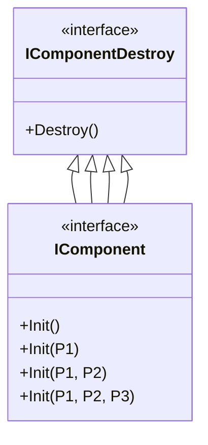

# IComponent.cs 注解文档

## 文件基本信息

| 属性 | 值 |
|------|-----|
| **文件名** | IComponent.cs |
| **路径** | Assets/Scripts/Code/Game/Component/IComponent.cs |
| **所属模块** | 游戏层 → Component |
| **文件职责** | 组件接口定义，规范组件的生命周期方法 |

---

## 接口说明

### IComponentDestroy

| 属性 | 说明 |
|------|------|
| **职责** | 组件销毁接口，定义清理方法 |
| **类型** | 基础接口 |

**方法**:
```csharp
public void Destroy()
```

---

### IComponent

| 属性 | 说明 |
|------|------|
| **职责** | 无参数组件接口，定义初始化和销毁方法 |
| **继承** | `IComponentDestroy` |

**方法**:
```csharp
public void Init()       // 初始化
public void Destroy()    // 销毁（继承自 IComponentDestroy）
```

**使用示例**:
```csharp
public class NumericComponent : Component, IComponent
{
    public void Init()
    {
        NumericDic = new Dictionary<int, decimal>();
    }
    
    public void Destroy()
    {
        NumericDic.Clear();
    }
}
```

---

### IComponent<P1>

| 属性 | 说明 |
|------|------|
| **职责** | 单参数组件接口 |
| **继承** | `IComponentDestroy` |
| **泛型参数** | `P1` - 初始化参数 1 |

**方法**:
```csharp
public void Init(P1 p1)  // 带参数初始化
public void Destroy()    // 销毁
```

**使用示例**:
```csharp
public class BidderComponent : Component, IComponent<int>
{
    public int ConfigId { get; private set; }
    
    public void Init(int id)
    {
        ConfigId = id;
    }
    
    public void Destroy()
    {
        ConfigId = 0;
    }
}
```

---

### IComponent<P1, P2>

| 属性 | 说明 |
|------|------|
| **职责** | 双参数组件接口 |
| **继承** | `IComponentDestroy` |
| **泛型参数** | `P1`, `P2` - 初始化参数 |

**方法**:
```csharp
public void Init(P1 p1, P2 p2)
public void Destroy()
```

**使用示例**:
```csharp
public class SkillComponent : Component, IComponent<int, float>
{
    public int SkillId { get; private set; }
    public float Level { get; private set; }
    
    public void Init(int skillId, float level)
    {
        SkillId = skillId;
        Level = level;
    }
    
    public void Destroy()
    {
        SkillId = 0;
        Level = 0f;
    }
}
```

---

### IComponent<P1, P2, P3>

| 属性 | 说明 |
|------|------|
| **职责** | 三参数组件接口 |
| **继承** | `IComponentDestroy` |
| **泛型参数** | `P1`, `P2`, `P3` - 初始化参数 |

**方法**:
```csharp
public void Init(P1 p1, P2 p2, P3 p3)
public void Destroy()
```

**使用示例**:
```csharp
public class BuffComponent : Component, IComponent<int, float, float>
{
    public int BuffId { get; private set; }
    public float Duration { get; private set; }
    public float Value { get; private set; }
    
    public void Init(int buffId, float duration, float value)
    {
        BuffId = buffId;
        Duration = duration;
        Value = value;
    }
    
    public void Destroy()
    {
        BuffId = 0;
        Duration = 0f;
        Value = 0f;
    }
}
```

---

## 接口继承关系



---

## 使用示例

### 示例 1: 无参数组件

```csharp
// 定义组件
public class TimerComponent : Component, IComponent
{
    public void Init()
    {
        timers = new List<Timer>();
    }
    
    public void Destroy()
    {
        timers.Clear();
    }
}

// 使用
var timerComp = entity.AddComponent<TimerComponent>();
// 自动调用 Init()
```

### 示例 2: 单参数组件

```csharp
// 定义组件
public class ConfigComponent : Component, IComponent<int>
{
    public int ConfigId { get; private set; }
    
    public void Init(int configId)
    {
        ConfigId = configId;
    }
    
    public void Destroy()
    {
        ConfigId = 0;
    }
}

// 使用
var configComp = entity.AddComponent<ConfigComponent>();
configComp.Init(1001);
```

### 示例 3: 多参数组件

```csharp
// 定义组件
public class PositionComponent : Component, IComponent<float, float, float>
{
    public float X { get; private set; }
    public float Y { get; private set; }
    public float Z { get; private set; }
    
    public void Init(float x, float y, float z)
    {
        X = x;
        Y = y;
        Z = z;
    }
    
    public void Destroy()
    {
        X = Y = Z = 0f;
    }
}

// 使用
var posComp = entity.AddComponent<PositionComponent>();
posComp.Init(100f, 200f, 50f);
```

---

## 设计说明

### 组件生命周期

所有组件遵循统一的生命周期：

```
创建 → Init() → 使用 → Destroy() → 销毁
```

### 泛型设计优势

1. **类型安全**: 编译时检查参数类型
2. **代码清晰**: 接口签名明确表达所需参数
3. **避免强制转换**: 不需要运行时类型转换

### 接口选择指南

| 场景 | 推荐接口 |
|------|----------|
| 无需初始化参数 | `IComponent` |
| 需要 1 个参数 | `IComponent<P1>` |
| 需要 2 个参数 | `IComponent<P1, P2>` |
| 需要 3 个参数 | `IComponent<P1, P2, P3>` |
| 需要更多参数 | 使用参数对象或重构设计 |

---

## 相关文档

- [Component.cs.md](./Component.cs.md) - 组件基类
- [NumericComponent.cs.md](./Numeric/NumericComponent.cs.md) - 数值组件（IComponent 实现）
- [BidderComponent.cs.md](./Type/BidderComponent.cs.md) - 竞拍者组件（IComponent<int> 实现）

---

*文档生成时间：2026-03-02 | OpenClaw AI 助手*
