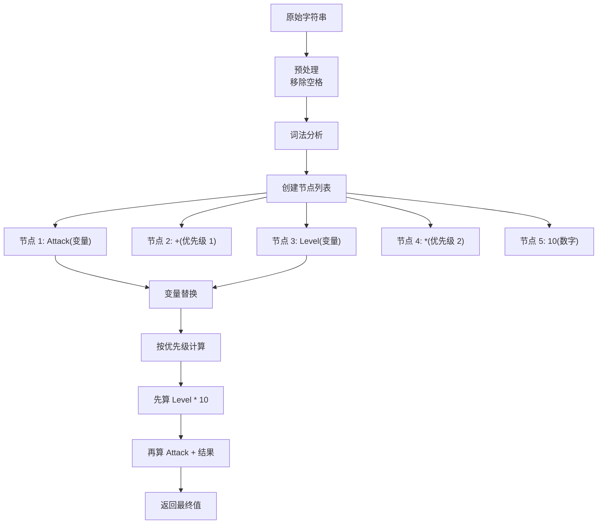
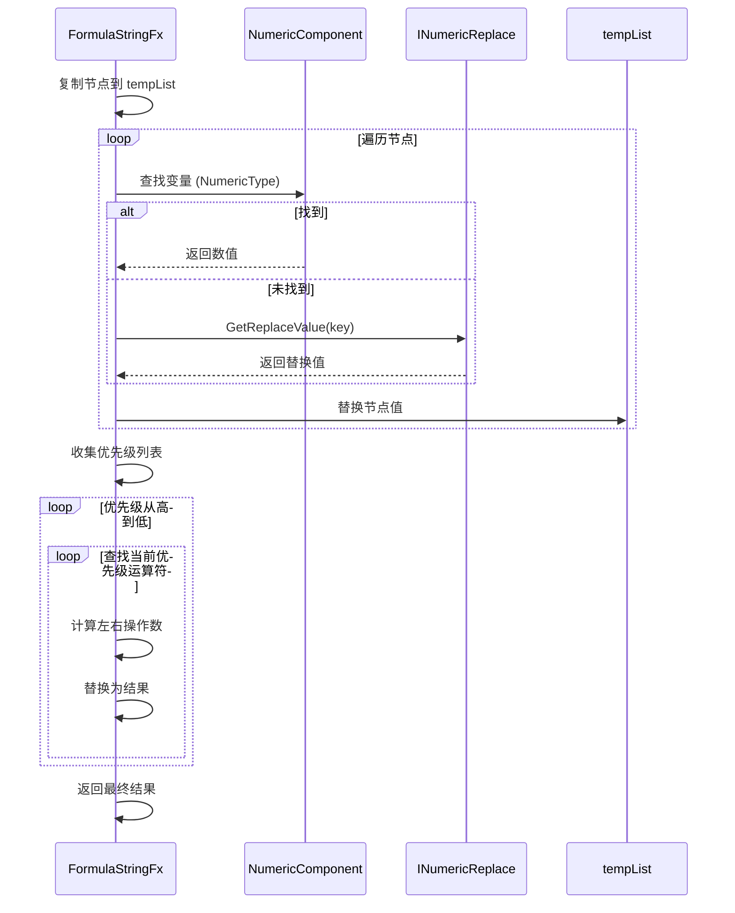

# FormulaStringFx.cs 注解文档

## 文件基本信息

| 属性 | 值 |
|------|-----|
| **文件名** | FormulaStringFx.cs |
| **路径** | Assets/Scripts/Code/Game/Component/Numeric/FormulaStringFx.cs |
| **所属模块** | 游戏层 → Component/Numeric |
| **文件职责** | 公式解析器，将数学公式字符串解析并计算结果 |

---

## 类说明

### FormulaStringFx

| 属性 | 说明 |
|------|------|
| **职责** | 解析数学公式字符串，支持变量替换和数值计算 |
| **泛型参数** | `IManager<string>` - 以公式字符串为键的管理器 |
| **继承关系** | 实现 `IManager<string>` 接口 |
| **设计模式** | 单例模式（通过 ManagerProvider 管理）+ 表达式树解析 |

**支持的运算符**:
- `+` `-` `*` `/` - 四则运算
- `^` - 幂运算
- `()` - 括号优先级

---

## 字段与属性

| 名称 | 类型 | 访问级别 | 说明 |
|------|------|----------|------|
| `formulaNodeList` | `List<FormulaNode>` | `private` | 公式节点列表，存储解析后的公式单元 |
| `priorityMax` | `const int` | `private` | 优先级最大值 = 4（括号优先级） |

### FormulaNode (内部类)

| 字段 | 类型 | 说明 |
|------|------|------|
| `Key` | `int` | 优先级（运算符优先级 + 括号层级） |
| `Value` | `string` | 节点值（数字、变量名或运算符） |

---

## 方法说明

### Init()

**签名**:
```csharp
public void Init(string formatString)
```

**职责**: 初始化并解析公式字符串

**核心逻辑**:
```
1. 预处理公式字符串:
   - 移除空格、换行、制表符
   - 处理负号：(- → (0-, (+ → (0+
   - 处理开头符号：-x → 0-x, +x → 0+x

2. 词法分析:
   - 遍历每个字符
   - 识别数字、变量、运算符
   - 创建 FormulaNode 节点

3. 处理括号优先级:
   - 遇到 ( → operadd += priorityMax
   - 遇到 ) → operadd -= priorityMax
   - 节点优先级 = 基础优先级 + operadd

4. 移除括号节点，保留有效节点
```

**优先级定义**:
```csharp
数字/变量 = 0
+ -       = 1
* /       = 2
^         = 3
( )       = 4
```

**调用者**: `ManagerProvider.RegisterManager<FormulaStringFx, string>()`

---

### Destroy()

**签名**:
```csharp
public void Destroy()
```

**职责**: 销毁公式解析器，清理节点列表

**核心逻辑**:
```
1. 清空 formulaNodeList
```

**调用者**: ManagerProvider 销毁管理器时

---

### Get()

**签名**:
```csharp
public static FormulaStringFx Get(string formatString)
```

**职责**: 获取或创建公式解析器实例（单例）

**核心逻辑**:
```
1. 尝试从 ManagerProvider 获取已存在的实例
2. 如果不存在 → 创建新实例并注册
3. 返回实例
```

**使用示例**:
```csharp
var formula = FormulaStringFx.Get("Attack * 1.5 + Level * 10");
```

---

### GetData()

**签名**:
```csharp
public float GetData(NumericComponent comp, INumericReplace replace = null)
```

**职责**: 计算公式结果

**参数**:
- `comp`: 数值组件，用于获取实体数值
- `replace`: 可选的数值替换器，用于自定义变量

**核心逻辑**:
```
1. 复制公式节点列表到 tempList
2. 替换变量:
   - 如果是 NumericType 中定义的变量 → 从 comp 获取值
   - 否则 → 调用 replace.GetReplaceValue() 获取值
3. 收集所有运算符优先级到 priorityList
4. 按优先级从高到低计算:
   - 找到当前优先级的运算符
   - 计算左右操作数
   - 替换为计算结果
   - 重复直到该优先级运算符全部计算完成
5. 返回最终结果
```

**调用者**: 需要计算公式的代码

**使用示例**:
```csharp
var formula = FormulaStringFx.Get("Attack * (1 + CritRate / 100)");
float damage = formula.GetData(numericComponent, playerReplacer);
```

---

### GetOperactorFinal()

**签名**:
```csharp
private float GetOperactorFinal(string s1, string ope, string s2)
```

**职责**: 执行二元运算

**参数**:
- `s1`: 左操作数（字符串）
- `ope`: 运算符（+ - * / ^）
- `s2`: 右操作数（字符串）

**返回值**: 计算结果

**支持的运算**:
```csharp
+  → num1 + num2
-  → num1 - num2
*  → num1 * num2
/  → num1 / num2 (除数为 0 返回 0)
^  → Math.Pow(num1, num2)
```

**调用者**: `GetData()`

---

### Print()

**签名**:
```csharp
public void Print()
```

**职责**: 打印公式节点列表（调试用）

**输出格式**:
```
[(优先级):(值)] [(优先级):(值)] ...
```

**示例输出**:
```
[(0):(5)] [(1):(+)] [(0):(3)] [(2):(*)] [(0):(10)]
表示：5 + 3 * 10
```

**调用者**: 调试时手动调用

---

## 公式解析流程

### 解析示例： "Attack + Level * 10"



### 计算流程



---

## 使用示例

### 示例 1: 简单公式计算

```csharp
// 计算公式：5 + 3 * 10 = 35
var formula = FormulaStringFx.Get("5 + 3 * 10");
float result = formula.GetData(null);  // 35
```

### 示例 2: 使用实体数值

```csharp
// 计算公式：攻击力 * 2 + 等级 * 5
var formula = FormulaStringFx.Get("Attack * 2 + Level * 5");
float damage = formula.GetData(numericComponent);

// 假设 Attack=100, Level=10
// 结果：100 * 2 + 10 * 5 = 250
```

### 示例 3: 使用自定义替换器

```csharp
// 定义替换器
public class SkillReplacer : INumericReplace
{
    public int skillLevel = 5;
    public float skillMultiplier = 1.5f;
    
    public float GetReplaceValue(string key)
    {
        return key switch
        {
            "SkillLevel" => skillLevel,
            "SkillMult" => skillMultiplier,
            _ => 0f
        };
    }
}

// 计算公式：BaseDamage * SkillMult + SkillLevel * 10
var formula = FormulaStringFx.Get("BaseDamage * SkillMult + SkillLevel * 10");
float damage = formula.GetData(numericComponent, new SkillReplacer());
```

### 示例 4: 复杂公式（带括号）

```csharp
// 计算公式：(攻击力 + 固定加成) * (1 + 百分比加成 / 100)
var formula = FormulaStringFx.Get("(Attack + AddAttack) * (1 + PctAttack / 100)");
float finalAttack = formula.GetData(numericComponent);
```

### 示例 5: 幂运算

```csharp
// 计算公式：基础值 ^ 等级 (指数增长)
var formula = FormulaStringFx.Get("BaseValue ^ Level");
float growthValue = formula.GetData(numericComponent);

// 假设 BaseValue=2, Level=3
// 结果：2^3 = 8
```

---

## 设计说明

### 优先级处理

公式解析器使用**优先级队列**方式处理运算顺序：

```
原始公式：5 + 3 * 10 ^ 2

解析后节点:
[(0):5] [(1):+] [(0):3] [(2):*] [(0):10] [(3):^] [(0):2]

计算顺序:
1. 优先级 3: 10 ^ 2 = 100
   列表变为：[(0):5] [(1):+] [(0):3] [(2):*] [(0):100]

2. 优先级 2: 3 * 100 = 300
   列表变为：[(0):5] [(1):+] [(0):300]

3. 优先级 1: 5 + 300 = 305
   列表变为：[(0):305]

最终结果：305
```

### 括号处理

括号通过增加优先级来处理：

```
公式：(5 + 3) * 10

解析过程:
- 遇到 ( → operadd += 4
- 5 的优先级 = 0 + 4 = 4
- + 的优先级 = 1 + 4 = 5
- 3 的优先级 = 0 + 4 = 4
- 遇到 ) → operadd -= 4
- * 的优先级 = 2 + 0 = 2
- 10 的优先级 = 0

计算顺序:
1. 优先级 5: 5 + 3 = 8
2. 优先级 2: 8 * 10 = 80
```

---

## 注意事项

1. **变量命名**: 变量名只能包含字母、数字、下划线
2. **除零保护**: 除法运算中除数为 0 时返回 0
3. **错误处理**: 公式解析失败时返回 0
4. **资源管理**: 使用 ListComponent 需要手动 Dispose

---

## 相关文档

- [NumericComponent.cs.md](./NumericComponent.cs.md) - 数值组件
- [INumericReplace.cs.md](./INumericReplace.cs.md) - 数值替换接口
- [NumericSystem.cs.md](./NumericSystem.cs.md) - 数值系统

---

*文档生成时间：2026-03-02 | OpenClaw AI 助手*
