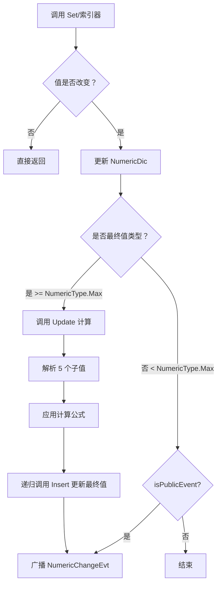
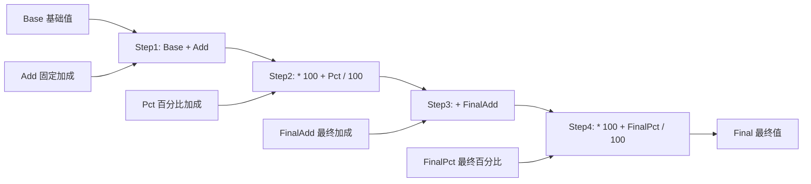

# NumericComponent.cs 注解文档

## 文件基本信息

| 属性 | 值 |
|------|-----|
| **文件名** | NumericComponent.cs |
| **路径** | Assets/Scripts/Code/Game/Component/Numeric/NumericComponent.cs |
| **所属模块** | 游戏层 → Component/Numeric |
| **文件职责** | 数值组件，管理实体所有数值属性（基础值、加成、百分比等） |

---

## 类说明

### NumericComponent

| 属性 | 说明 |
|------|------|
| **职责** | 管理实体的所有数值属性，支持基础值、固定加成、百分比加成等多种计算方式 |
| **泛型参数** | 无 |
| **继承关系** | 继承 `Component` |
| **实现的接口** | `IComponent` |

**设计模式**: 组件模式 + 数值公式计算

```csharp
// 组件注册
ManagerProvider.RegisterManager<NumericSystem>().AddComponent(this);

// 数值键值对存储
private Dictionary<int, decimal> NumericDic;
```

---

## 字段与属性

| 名称 | 类型 | 访问级别 | 说明 |
|------|------|----------|------|
| `NumericDic` | `Dictionary<int, decimal>` | `private` | 数值字典，键为数值类型 ID，值为数值 |
| `this[int numericType]` | `decimal` | `private` | 索引器，获取/设置数值（自动区分基础值和最终值） |

---

## 方法说明

### Init()

**签名**:
```csharp
public void Init()
```

**职责**: 初始化数值组件

**核心逻辑**:
```
1. 创建数值字典 NumericDic = new Dictionary<int, decimal>()
2. 注册到 NumericSystem 管理器
```

**调用者**: 组件系统创建组件时

---

### Destroy()

**签名**:
```csharp
public void Destroy()
```

**职责**: 销毁数值组件，清理资源

**核心逻辑**:
```
1. 从 NumericSystem 管理器移除组件
2. 清空数值字典
3. 释放字典引用
```

**调用者**: 组件系统销毁组件时

---

### GetAsFloat / GetAsInt / GetAsDecimal

**签名**:
```csharp
public float GetAsFloat(int numericType)
public int GetAsInt(int numericType)
public decimal GetAsDecimal(int numericType)
```

**职责**: 获取数值（自动处理浮点精度）

**核心逻辑**:
```
1. 调用 GetByKey() 获取原始值
2. 如果 IsFloat() 返回 true（百分比类型）→ 除以 10000
3. 返回对应类型的值
```

**调用者**: 任何需要读取数值的代码

**设计说明**: 
- 内部存储使用 `decimal` 类型，精度更高
- 百分比值存储时乘以 10000，读取时除以 10000
- 支持 float/int/decimal 三种返回类型

---

### Set()

**签名**:
```csharp
public void Set(int nt, float value, bool isRealValue = false)
public void Set(int nt, int value, bool isRealValue = false)
public void Set(int nt, decimal value, bool isRealValue = false)
```

**职责**: 设置数值（支持重载）

**核心逻辑**:
```
1. 检查是否为浮点类型（IsFloat）
2. 如果 isRealValue=false 且是浮点类型 → 乘以 10000 存储
3. 调用索引器 this[nt] = value 设置值
```

**参数说明**:
- `nt`: 数值类型 ID（必须 > NumericType.Max）
- `value`: 要设置的值
- `isRealValue`: 是否为真实值（默认 false，表示需要转换）

**使用示例**:
```csharp
// 设置攻击力为 100
numericComponent.Set(NumericType.Attack * 10 + 1, 100);

// 设置速度加成 10%（浮点类型）
numericComponent.Set(NumericType.Speed * 10 + 3, 10);
```

---

### SetNoEvent()

**签名**:
```csharp
public void SetNoEvent(int numericType, decimal value)
```

**职责**: 设置数值但不触发事件

**核心逻辑**:
```
1. 调用 Insert(numericType, value, false)
2. isPublicEvent=false，不广播 NumericChangeEvt 消息
```

**调用者**: 内部计算更新时使用（避免触发不必要的事件）

---

### Insert()

**签名**:
```csharp
private void Insert(int numericType, decimal value, bool isPublicEvent = true)
```

**职责**: 插入/更新数值，触发事件和最终值计算

**核心逻辑**:
```
1. 获取旧值 GetByKey(numericType)
2. 如果新旧值相同 → 直接返回（避免无效更新）
3. 更新字典 NumericDic[numericType] = value
4. 如果 numericType >= NumericType.Max（最终值类型）:
   - 调用 Update() 重新计算最终值
   - 返回
5. 如果是基础值类型且 isPublicEvent=true:
   - 创建 NumericChange 事件对象
   - 广播 MessageId.NumericChangeEvt 消息
```

**调用者**: `this[int]` 索引器 setter, `SetNoEvent()`

---

### Update()

**签名**:
```csharp
private void Update(int numericType, bool isPublicEvent)
```

**职责**: 根据公式计算最终数值

**核心逻辑**:
```
1. 解析数值类型:
   - final = numericType / 10          (最终值类型)
   - bas = final * 10 + 1              (基础值)
   - add = final * 10 + 2              (固定加成)
   - pct = final * 10 + 3              (百分比加成)
   - finalAdd = final * 10 + 4         (最终固定加成)
   - finalPct = final * 10 + 5         (最终百分比加成)

2. 应用公式:
   final = (((base + add) * (100 + pct) / 100) + finalAdd) * (100 + finalPct) / 100

3. 调用 Insert(final, result, isPublicEvent) 更新最终值
```

**数值计算公式**:
```
Step 1: base + add           (基础值 + 固定加成)
Step 2: * (100 + pct) / 100  (应用百分比加成)
Step 3: + finalAdd           (加上最终固定加成)
Step 4: * (100 + finalPct) / 100  (应用最终百分比加成)
```

**调用者**: `Insert()`（当更新最终值类型时）

**设计说明**: 
- 一个数值可以由 5 个子值控制（基础、加成、百分比、最终加成、最终百分比）
- 支持复杂的数值计算场景（如 buff 系统）

---

### GetByKey()

**签名**:
```csharp
private decimal GetByKey(int key)
```

**职责**: 从字典获取数值（安全访问）

**核心逻辑**:
```
1. TryGetValue 获取值
2. 如果不存在返回 0
```

**调用者**: `GetAsFloat()`, `GetAsInt()`, `GetAsDecimal()`, `Insert()`, `Update()`

---

### IsFloat()

**签名**:
```csharp
private bool IsFloat(int numericType)
```

**职责**: 判断数值类型是否需要保留小数

**核心逻辑**:
```
1. 如果 numericType > NumericType.Max:
   - 检查 flag = numericType % 10
   - 如果 flag == 3 或 5（百分比类型）→ 返回 true
   - numericType /= 10 还原为基础类型

2. 从配置表 AttributeConfigCategory 获取配置
3. 返回 attr.Type == 1（Type=1 表示浮点类型）
```

**调用者**: `GetAsFloat()`, `GetAsInt()`, `GetAsDecimal()`, `Set()`

---

## 数值类型编码规则

### 数值 ID 结构

```
数值 ID = 基础类型 * 10 + 子类型

基础类型: 1~NumericType.Max (如攻击力=1, 防御力=2, 速度=3)
子类型:
  1 = 基础值 (Base)
  2 = 固定加成 (Add)
  3 = 百分比加成 (Percent)
  4 = 最终固定加成 (FinalAdd)
  5 = 最终百分比加成 (FinalPct)
```

### 示例

```csharp
// 攻击力基础值 = 11 (1 * 10 + 1)
// 攻击力固定加成 = 12 (1 * 10 + 2)
// 攻击力百分比加成 = 13 (1 * 10 + 3)
// 攻击力最终值 = 1 (直接访问最终结果)

// 速度基础值 = 31 (3 * 10 + 1)
// 速度百分比加成 = 33 (3 * 10 + 3) ← 这是小数类型
```

---

## Mermaid 流程图

### 数值更新流程



### 数值计算公式



---

## 使用示例

### 示例 1: 设置和获取数值

```csharp
// 获取组件
var numericComponent = entity.GetComponent<NumericComponent>();

// 设置攻击力基础值 100
numericComponent.Set(NumericType.Attack * 10 + 1, 100);

// 设置攻击力百分比加成 20%
numericComponent.Set(NumericType.Attack * 10 + 3, 20);

// 获取最终攻击力
int attack = numericComponent.GetAsInt(NumericType.Attack);
// 结果：120 (100 * 1.2)
```

### 示例 2: 监听数值变化

```csharp
// 注册数值变化事件
Messager.Instance.AddEventListener(MessageId.NumericChangeEvt, OnNumericChange);

void OnNumericChange(object sender, object args)
{
    var change = args as NumericChange;
    Log.Info($"数值变化：{change.NumericType} 从 {change.Old} 变为 {change.New}");
}
```

### 示例 3: 设置不触发事件的数值

```csharp
// 批量更新时不触发事件（避免多次刷新 UI）
numericComponent.SetNoEvent(NumericType.Attack * 10 + 1, 150);
numericComponent.SetNoEvent(NumericType.Attack * 10 + 3, 25);

// 手动触发一次更新
numericComponent.Set(NumericType.Attack * 10 + 1, 150); // 这次会触发事件
```

### 示例 4: 复杂数值计算

```csharp
// 角色基础攻击力 100
numericComponent.Set(NumericType.Attack * 10 + 1, 100);

// 装备加成 +20
numericComponent.Set(NumericType.Attack * 10 + 2, 20);

// 技能加成 +10%
numericComponent.Set(NumericType.Attack * 10 + 3, 10);

// 最终攻击力 = ((100 + 20) * 1.1) = 132
int finalAttack = numericComponent.GetAsInt(NumericType.Attack);
```

---

## 相关文档

- [NumericSystem.cs.md](./NumericSystem.cs.md) - 数值系统管理器
- [NumericChange.cs.md](./NumericChange.cs.md) - 数值变化事件
- [INumericReplace.cs.md](./INumericReplace.cs.md) - 数值替换接口
- [FormulaStringFx.cs.md](./FormulaStringFx.cs.md) - 公式字符串解析

---

*文档生成时间：2026-03-02 | OpenClaw AI 助手*
