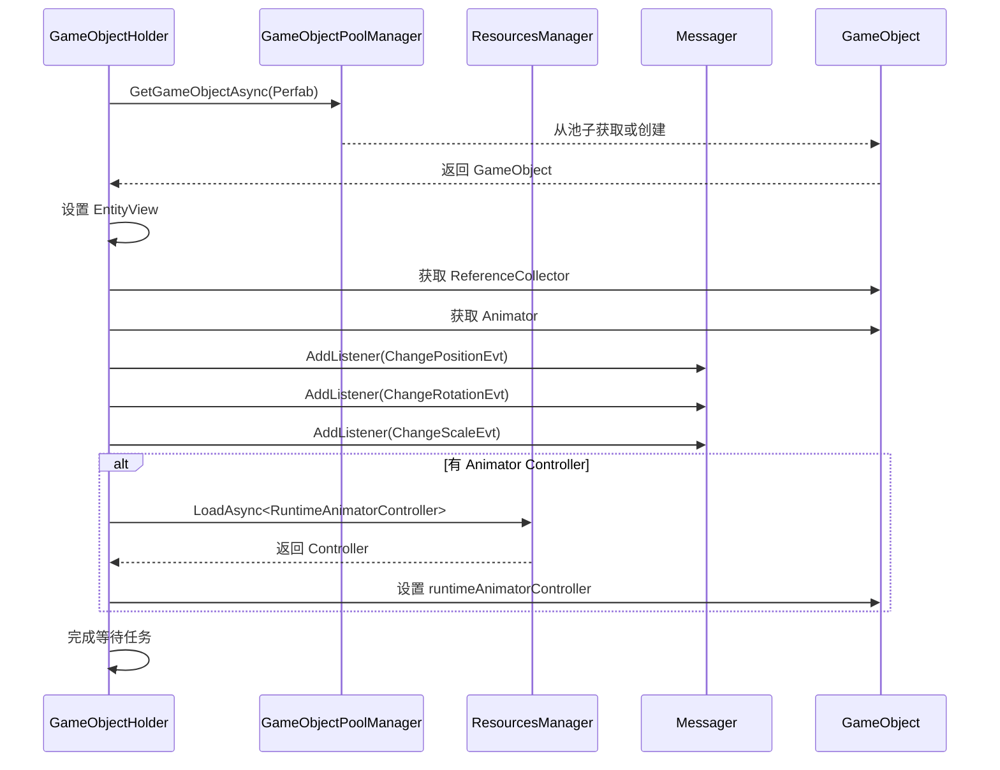
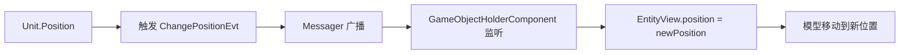

# GameObjectHolderComponent.cs 注解文档

## 文件基本信息

| 属性 | 值 |
|------|-----|
| **文件名** | GameObjectHolderComponent.cs |
| **路径** | Assets/Scripts/Code/Game/Component/View/GameObjectHolderComponent.cs |
| **所属模块** | 游戏层 → Component/View |
| **文件职责** | 游戏对象持有组件，管理实体的 3D 模型加载、动画、事件同步 |

---

## 类说明

### GameObjectHolderComponent

| 属性 | 说明 |
|------|------|
| **职责** | 加载和管理实体的 3D 模型预制体，处理位置/旋转/缩放同步，管理 Animator 和 ReferenceCollector |
| **泛型参数** | `IComponent` - 无参数组件 |
| **继承关系** | 继承 `Component`（partial class） |
| **实现的接口** | `IComponent` |

**设计模式**: 异步加载 + 事件驱动 + 对象池

**核心功能**:
- 异步加载实体预制体
- 同步实体 Transform（位置/旋转/缩放）
- 管理 Animator 控制器
- 提供 ReferenceCollector 访问
- 控制 Renderer 和 HitBox 开关

---

## 字段与属性

| 名称 | 类型 | 访问级别 | 说明 |
|------|------|----------|------|
| `EntityView` | `Transform` | `public` | 实体模型 Transform 根节点 |
| `collector` | `ReferenceCollector` | `private` | 引用收集器（访问子对象） |
| `Animator` | `Animator` | `public` | 动画控制器 |
| `waitFinishTask` | `Queue<ETTask>` | `private` | 等待加载完成的任务队列 |

---

## 方法说明

### Init()

**签名**:
```csharp
public void Init()
```

**职责**: 初始化组件，开始异步加载预制体

**核心逻辑**:
```
1. 启动协程 LoadGameObjectAsync()
```

**调用者**: 组件系统创建组件时

---

### LoadGameObjectAsync()

**签名**:
```csharp
private async ETTask LoadGameObjectAsync()
```

**职责**: 异步加载实体预制体（核心方法）

**核心逻辑**:
```
1. 获取父实体 Unit
2. 从对象池异步获取预制体 GameObjectPoolManager.GetGameObjectAsync()
3. 检查组件是否已销毁 → 是则回收预制体并返回
4. 设置 EntityView = obj.transform
5. 获取 ReferenceCollector 和 Animator 组件
6. 设置父节点为 Entity.GameObjectRoot
7. 添加/获取 EntityComponent 并设置 ID 和类型
8. 同步初始 Transform（位置/旋转/缩放）
9. 注册事件监听:
   - ChangePositionEvt → OnChangePosition
   - ChangeRotationEvt → OnChangeRotation
   - ChangeScaleEvt → OnChangeScale
10. 如果配置了 Animator Controller:
    - 异步加载 RuntimeAnimatorController
    - 设置到 Animator
11. 完成等待任务队列
```

**调用者**: `Init()`

**设计说明**: 
- 使用对象池管理预制体，避免频繁创建销毁
- 异步加载避免卡顿
- 事件驱动同步 Transform 变化

---

### Destroy()

**签名**:
```csharp
public void Destroy()
```

**职责**: 销毁组件，清理资源

**核心逻辑**:
```
1. 移除所有事件监听
2. 如果 EntityView 不为空:
   - 如果 Animator 有 runtimeAnimatorController:
     * 释放资源 ResourcesManager.ReleaseAsset()
     * 清空引用
   - 回收到对象池 GameObjectPoolManager.RecycleGameObject()
   - 清空 EntityView 和 collector 引用
3. 完成等待任务队列
```

**调用者**: 组件系统销毁组件时

---

### OnChangePosition / OnChangeRotation / OnChangeScale

**签名**:
```csharp
private void OnChangePosition(Unit unit, Vector3 old)
private void OnChangeRotation(Unit unit, Quaternion old)
private void OnChangeScale(Unit unit, Vector3 old)
```

**职责**: 事件回调，同步 Transform 变化

**核心逻辑**:
```
1. 检查 EntityView 是否为空 → 空则返回
2. 同步对应的 Transform 属性
```

**调用者**: Messager（事件系统）

**事件注册**:
```csharp
Messager.Instance.AddListener<Unit, Vector3>(Id, MessageId.ChangePositionEvt, OnChangePosition);
Messager.Instance.AddListener<Unit, Quaternion>(Id, MessageId.ChangeRotationEvt, OnChangeRotation);
Messager.Instance.AddListener<Unit, Vector3>(Id, MessageId.ChangeScaleEvt, OnChangeScale);
```

---

### WaitLoadGameObjectOver()

**签名**:
```csharp
public async ETTask<bool> WaitLoadGameObjectOver()
```

**职责**: 等待预制体加载完成

**返回值**: 
- `true`: 加载完成且组件未销毁
- `false`: 组件已销毁

**核心逻辑**:
```
1. 如果 EntityView == null（未加载完成）:
   - 创建等待任务 ETTask.Create()
   - 加入 waitFinishTask 队列
   - 等待任务完成
2. 返回 !IsDispose
```

**调用者**: 需要等待预制体加载完成的代码

**使用示例**:
```csharp
await gameObjectHolder.WaitLoadGameObjectOver();
// 现在可以安全访问 EntityView 和 Animator
```

---

### GetCollectorObj<T>()

**签名**:
```csharp
public T GetCollectorObj<T>(string name) where T : class
```

**职责**: 通过名称获取引用收集器中的对象

**参数**:
- `name`: 对象名称（在 ReferenceCollector 中定义）

**返回值**: 指定类型的对象

**使用示例**:
```csharp
// 获取武器挂点
var weaponPoint = gameObjectHolder.GetCollectorObj<Transform>("WeaponPoint");

// 获取特效挂点
var effectPoint = gameObjectHolder.GetCollectorObj<Transform>("EffectPoint");
```

---

### EnableRenderer()

**签名**:
```csharp
public async ETTask EnableRenderer(bool enable)
```

**职责**: 开启或关闭所有 Renderer 组件

**参数**:
- `enable`: true=显示，false=隐藏

**核心逻辑**:
```
1. 获取协程锁 CoroutineLockManager.Wait()
2. 等待预制体加载完成
3. 检查组件是否已销毁
4. 获取所有子对象的 Renderer 组件
5. 遍历设置 enabled = enable
6. 释放协程锁
```

**调用者**: 需要隐藏/显示模型的代码

**使用示例**:
```csharp
// 隐藏模型（如隐身效果）
await gameObjectHolder.EnableRenderer(false);

// 显示模型
await gameObjectHolder.EnableRenderer(true);
```

**设计说明**: 
- 使用协程锁避免并发修改
- 递归获取所有子对象的 Renderer

---

### EnableHitBox()

**签名**:
```csharp
public async ETTask EnableHitBox(string hitBox, bool enable)
```

**职责**: 开启或关闭指定 HitBox

**参数**:
- `hitBox`: HitBox 名称（在 ReferenceCollector 中定义）
- `enable`: true=启用，false=禁用

**核心逻辑**:
```
1. 等待预制体加载完成
2. 检查组件是否已销毁
3. 从 ReferenceCollector 获取 HitBox 对象
4. 设置 ActiveState
```

**调用者**: 需要控制碰撞检测的代码

**使用示例**:
```csharp
// 启用攻击判定框
await gameObjectHolder.EnableHitBox("AttackHitBox", true);

// 禁用受击判定框
await gameObjectHolder.EnableHitBox("DamageHitBox", false);
```

---

## 预制体加载流程



---

## 事件同步机制

### 位置同步

```csharp
// Unit 改变位置
unit.Position = newPosition;

// 触发事件
Messager.Instance.Broadcast(Id, MessageId.ChangePositionEvt, unit, oldPosition);

// GameObjectHolderComponent 接收事件
void OnChangePosition(Unit unit, Vector3 old)
{
    EntityView.position = unit.Position;  // 同步到模型
}
```

### 数据流



---

## 使用示例

### 示例 1: 基础使用

```csharp
// 创建 Unit 实体
var unit = EntityFactory.CreateEntity<Unit>(scene.Id);
unit.ConfigId = 1001;

// 添加 GameObjectHolderComponent
var gameObjectHolder = unit.AddComponent<GameObjectHolderComponent>();
// 自动开始异步加载预制体

// 等待加载完成
await gameObjectHolder.WaitLoadGameObjectOver();

// 访问 Animator
gameObjectHolder.Animator.Play("Run");
```

### 示例 2: 获取子对象

```csharp
// 获取武器挂点
var weaponPoint = gameObjectHolder.GetCollectorObj<Transform>("WeaponPoint");

// 在挂点上创建武器
var weapon = GameObjectPoolManager.GetInstance().GetGameObjectAsync("Weapon_Sword");
weapon.transform.SetParent(weaponPoint);
weapon.transform.localPosition = Vector3.zero;
```

### 示例 3: 控制显示/隐藏

```csharp
// 隐身效果
await gameObjectHolder.EnableRenderer(false);

// 3 秒后显示
await UniTask.Delay(3000);
await gameObjectHolder.EnableRenderer(true);
```

### 示例 4: 控制 HitBox

```csharp
// 攻击时启用攻击判定框
async void Attack()
{
    await gameObjectHolder.EnableHitBox("AttackHitBox", true);
    
    // 攻击持续 0.5 秒
    await UniTask.Delay(500);
    
    await gameObjectHolder.EnableHitBox("AttackHitBox", false);
}
```

### 示例 5: 播放动画

```csharp
// 等待加载完成
await gameObjectHolder.WaitLoadGameObjectOver();

// 播放攻击动画
gameObjectHolder.Animator.CrossFade("Attack", 0.1f);

// 或设置 Animator 参数
gameObjectHolder.Animator.SetInteger("AttackType", 1);
```

---

## 设计说明

### 对象池管理

```
预制体使用 → GameObjectPoolManager.GetGameObjectAsync()
           ↓
       使用完毕
           ↓
回收 → GameObjectPoolManager.RecycleGameObject()
```

### 资源管理

- **预制体**: 对象池管理，自动复用
- **AnimatorController**: 手动加载和释放
- **Renderer/HitBox**: 通过组件控制开关

### 异步加载优势

1. **避免卡顿**: 大模型加载不阻塞主线程
2. **等待机制**: WaitLoadGameObjectOver() 确保访问安全
3. **销毁检查**: 加载过程中检查 IsDispose 避免内存泄漏

---

## 注意事项

1. **等待加载**: 访问 EntityView/Animator 前必须等待加载完成
2. **销毁检查**: 异步操作中检查 IsDispose 避免空引用
3. **资源释放**: Destroy() 时释放 AnimatorController 资源
4. **事件清理**: Destroy() 时移除所有事件监听
5. **协程锁**: EnableRenderer 使用协程锁避免并发问题

---

## 相关文档

- [Component.cs.md](../Component.cs.md) - 组件基类
- [Unit.cs.md](../../Entity/Unit.cs.md) - 场景单位基类
- [GameObjectPoolManager.cs.md](../../../Module/Resource/GameObjectPoolManager.cs.md) - 游戏对象池
- [ReferenceCollector.cs.md](../../../../Mono/Module/UI/ReferenceCollector.cs.md) - 引用收集器
- [ResourcesManager.cs.md](../../../Module/Resource/ResourcesManager.cs.md) - 资源管理器

---

*文档生成时间：2026-03-02 | OpenClaw AI 助手*
