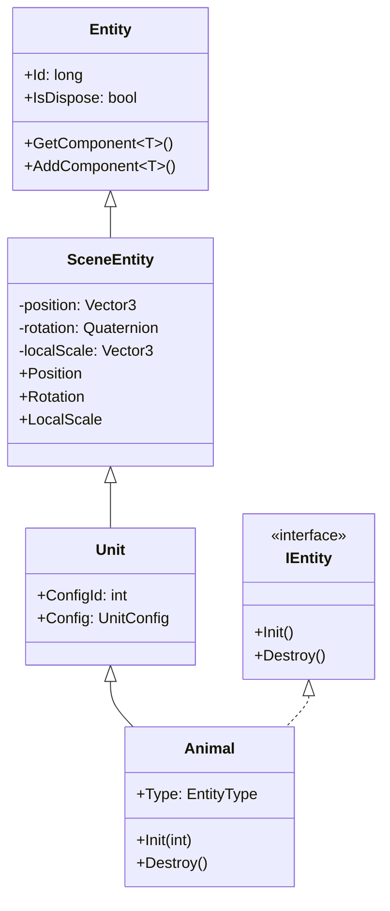
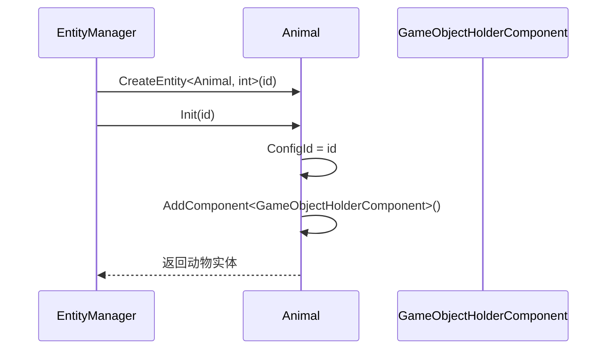

# Animal.cs 注解文档

## 文件基本信息

| 属性 | 值 |
|------|-----|
| **文件名** | Animal.cs |
| **路径** | Assets/Scripts/Code/Game/Entity/Animal.cs |
| **所属模块** | 游戏层 → Code/Game/Entity |
| **文件职责** | 动物实体类，继承 Unit，实现 IEntity 接口，用于表示场景中的动物单位 |

---

## 类/结构体说明

### Animal

| 属性 | 说明 |
|------|------|
| **职责** | 表示场景中的动物实体，支持通过配置 ID 初始化 |
| **泛型参数** | 无 |
| **继承关系** | 继承 `Unit` 类 |
| **实现的接口** | `IEntity<int>` |

**设计模式**: 实体组件模式

```csharp
// 使用方式
// 通过 EntityManager 创建动物实体
var animal = entityManager.CreateEntity<Animal, int>(configId);
```

---

## 字段与属性（按重要程度排序）

| 名称 | 类型 | 访问级别 | 说明 |
|------|------|----------|------|
| `Type` | `EntityType` | `public override` | 实体类型，固定为 `EntityType.Animal` |
| `ConfigId` | `int` | `protected` | 配置表 ID（继承自 Unit） |

---

## 方法说明（按重要程度排序）

### Init(int id)

**签名**:
```csharp
public void Init(int id)
```

**职责**: 初始化动物实体

**核心逻辑**:
```
1. 设置 ConfigId = id
2. 添加 GameObjectHolderComponent 组件（用于管理 GameObject 加载）
```

**调用者**: `EntityManager.CreateEntity<Animal, int>()`

**被调用者**: `AddComponent<GameObjectHolderComponent>()`

---

### Destroy()

**签名**:
```csharp
public void Destroy()
```

**职责**: 销毁动物实体（当前为空实现）

**调用者**: `EntityManager.RemoveEntity()`

---

## Mermaid 流程图

### Animal 类继承关系



### 初始化流程



---

## 使用示例

### 创建动物实体

```csharp
// 通过 EntityManager 创建
var entityManager = ManagerProvider.GetManager<EntityManager>();
var animal = entityManager.CreateEntity<Animal, int>(configId);

// 动物会自动加载对应的 GameObject
var ghc = animal.GetComponent<GameObjectHolderComponent>();
await ghc.WaitLoadGameObjectOver();
```

### 获取动物配置

```csharp
// 通过 ConfigId 获取配置
var config = animal.Config;
Debug.Log($"动物名称：{config.Name}");
Debug.Log($"预制体路径：{config.Perfab}");
```

---

## 相关文档链接

- [Unit.cs.md](Unit.cs.md) - 场景单位基类
- [SceneEntity.cs.md](SceneEntity.cs.md) - 场景实体基类
- [Entity.cs.md](Entity.cs.md) - 实体基类
- [EntityManager.cs.md](../../System/Entity/EntityManager.cs.md) - 实体管理器
- [EntityType.cs.md](../../../Mono/Module/Entity/EntityType.cs.md) - 实体类型枚举

---

*文档生成时间：2026-03-02*
