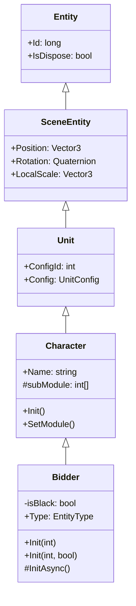
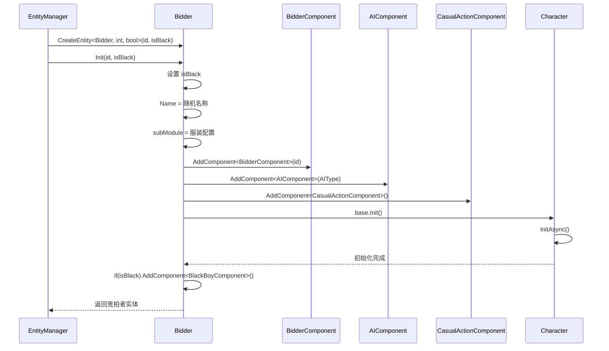

# Bidder.cs 注解文档

## 文件基本信息

| 属性 | 值 |
|------|-----|
| **文件名** | Bidder.cs |
| **路径** | Assets/Scripts/Code/Game/Entity/Bidder.cs |
| **所属模块** | 游戏层 → Code/Game/Entity |
| **文件职责** | 竞拍者实体类，继承 Character，实现 IEntity 接口，用于表示参与拍卖的竞拍者（包括 AI 竞拍者） |

---

## 类/结构体说明

### Bidder

| 属性 | 说明 |
|------|------|
| **职责** | 表示拍卖场景中的竞拍者实体，支持普通竞拍者和黑名单竞拍者，包含 AI 行为和休闲动作组件 |
| **泛型参数** | 无 |
| **继承关系** | 继承 `Character` 类 |
| **实现的接口** | `IEntity<int>`, `IEntity<int, bool>` |

**设计模式**: 实体组件模式 + 策略模式（AI 类型）

```csharp
// 使用方式
// 通过 EntityManager 创建竞拍者实体
var bidder = entityManager.CreateEntity<Bidder, int>(id);
// 或创建黑名单竞拍者
var blackBidder = entityManager.CreateEntity<Bidder, int, bool>(id, true);
```

---

## 字段与属性（按重要程度排序）

| 名称 | 类型 | 访问级别 | 说明 |
|------|------|----------|------|
| `Type` | `EntityType` | `public override` | 实体类型，固定为 `EntityType.Bidder` |
| `isBlack` | `bool` | `private` | 是否为黑名单竞拍者 |
| `Name` | `string` | `public` | 竞拍者名称（继承自 Character） |
| `subModule` | `int[]` | `protected` | 服装模块配置数组（继承自 Character） |

---

## 方法说明（按重要程度排序）

### Init(int id)

**签名**:
```csharp
public void Init(int id)
```

**职责**: 初始化普通竞拍者实体

**核心逻辑**:
```
1. 调用 Init(id, false) 初始化
```

**调用者**: `EntityManager.CreateEntity<Bidder, int>()`

---

### Init(int id, bool isBlack)

**签名**:
```csharp
public void Init(int id, bool isBlack)
```

**职责**: 初始化竞拍者实体（支持黑名单标记）

**核心逻辑**:
```
1. 设置 isBlack 标记
2. 从 CharnameConfig 随机获取名称并国际化
3. 从 ClothGenerateManager 获取下一个服装配置
4. 添加 BidderComponent 组件（传入 id）
5. 根据 BidderComponent 配置添加 AIComponent（AI 类型）
6. 添加 CasualActionComponent 组件（休闲动作，使用配置的动作间隔）
7. 调用 base.Init() 初始化 Character 基类
```

**调用者**: `EntityManager.CreateEntity<Bidder, int, bool>()`

**被调用者**: `I18NManager.Instance.I18NGetText()`, `ClothGenerateManager.Instance.GetNext()`, `AddComponent<>()`

---

### InitAsync()

**签名**:
```csharp
protected override async ETTask InitAsync()
```

**职责**: 异步初始化，处理黑名单竞拍者的特殊组件

**核心逻辑**:
```
1. 调用 base.InitAsync() 等待 Character 基类初始化完成
2. 如果是黑名单竞拍者，添加 BlackBoyComponent 组件
```

**调用者**: `Character.Init()`

**被调用者**: `AddComponent<BlackBoyComponent>()`

---

## Mermaid 流程图

### Bidder 类继承关系



### 初始化流程



---

## 使用示例

### 创建普通竞拍者

```csharp
// 通过 EntityManager 创建普通竞拍者
var entityManager = ManagerProvider.GetManager<EntityManager>();
var bidder = entityManager.CreateEntity<Bidder, int>(bidderId);

// 获取竞拍者信息
Debug.Log($"竞拍者名称：{bidder.Name}");
Debug.Log($"服装配置：{string.Join(",", bidder.SubModule)}");
```

### 创建黑名单竞拍者

```csharp
// 创建黑名单竞拍者
var blackBidder = entityManager.CreateEntity<Bidder, int, bool>(bidderId, true);

// 检查是否为黑名单
var blackComponent = blackBidder.GetComponent<BlackBoyComponent>();
if (blackComponent != null)
{
    Debug.Log("这是黑名单竞拍者");
}
```

### 获取 AI 组件

```csharp
// 获取 AI 组件
var aiComponent = bidder.GetComponent<AIComponent>();
if (aiComponent != null)
{
    // AI 会根据配置自动执行竞拍行为
}
```

---

## 相关文档链接

- [Character.cs.md](Character.cs.md) - 角色基类
- [Unit.cs.md](Unit.cs.md) - 场景单位基类
- [Entity.cs.md](Entity.cs.md) - 实体基类
- [EntityManager.cs.md](../../System/Entity/EntityManager.cs.md) - 实体管理器
- [BidderComponent.cs.md](../../Component/Type/BidderComponent.cs.md) - 竞拍者组件
- [AIComponent.cs.md](../../Component/AI/AIComponent.cs.md) - AI 组件
- [BlackBoyComponent.cs.md](../../Component/Type/BlackBoyComponent.cs.md) - 黑名单竞拍者组件

---

*文档生成时间：2026-03-02*
