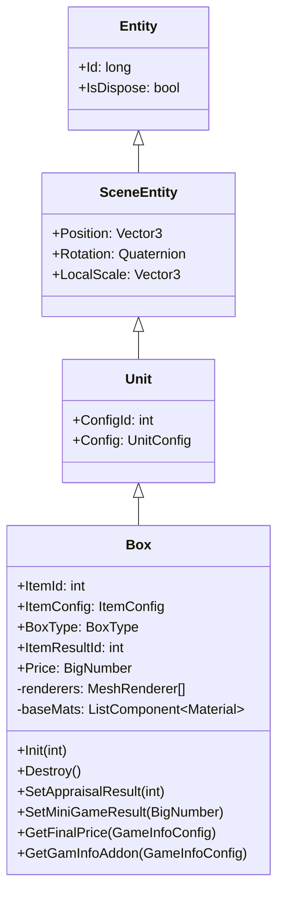
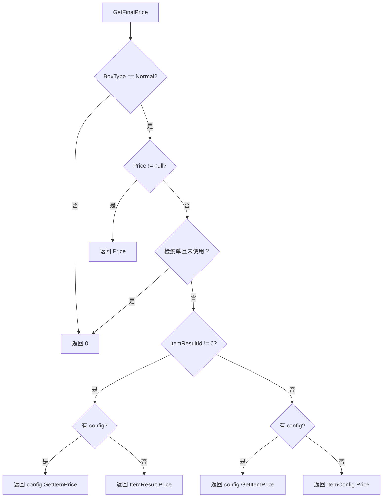
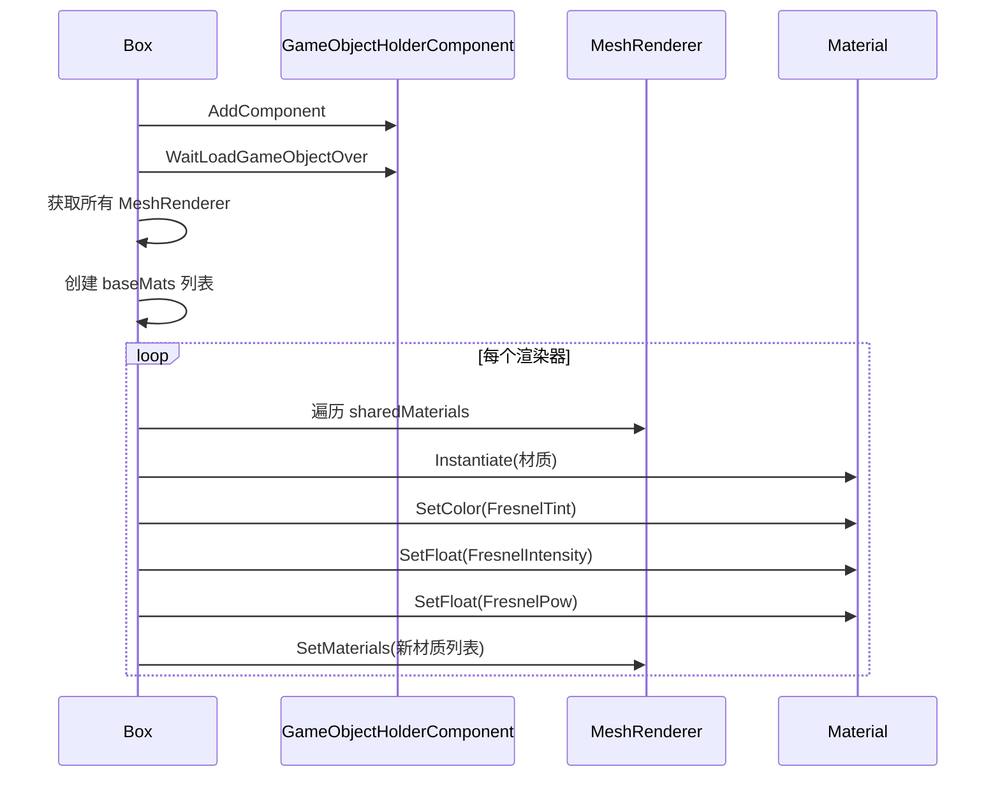

# Box.cs 注解文档

## 文件基本信息

| 属性 | 值 |
|------|-----|
| **文件名** | Box.cs |
| **路径** | Assets/Scripts/Code/Game/Entity/Box.cs |
| **所属模块** | 游戏层 → Code/Game/Entity |
| **文件职责** | 宝盒实体类，继承 Unit，实现 IEntity 接口，用于表示拍卖中的宝盒物品，支持鉴定、小游戏结果和价格计算 |

---

## 类/结构体说明

### Box

| 属性 | 说明 |
|------|------|
| **职责** | 表示拍卖场景中的宝盒实体，管理物品信息、鉴定结果、小游戏结果和最终价格计算，支持特殊材质效果渲染 |
| **泛型参数** | 无 |
| **继承关系** | 继承 `Unit` 类 |
| **实现的接口** | `IEntity<int>` |

**设计模式**: 实体组件模式 + 工厂模式（材质实例化）

```csharp
// 使用方式
// 通过 EntityManager 创建宝盒实体
var box = entityManager.CreateEntity<Box, int>(itemId);
```

---

## 字段与属性（按重要程度排序）

| 名称 | 类型 | 访问级别 | 说明 |
|------|------|----------|------|
| `ItemId` | `int` | `public` | 物品配置 ID |
| `ItemConfig` | `ItemConfig` | `public` | 物品配置数据（通过 ItemId 获取） |
| `Type` | `EntityType` | `public override` | 实体类型，固定为 `EntityType.Box` |
| `BoxType` | `BoxType` | `public` | 宝盒类型（只有 Normal 类型算钱） |
| `ItemResultId` | `int` | `public` | 鉴定后的物品结果 ID |
| `ItemResult` | `ItemConfig` | `public` | 鉴定后的物品配置 |
| `Price` | `BigNumber` | `public` | 小游戏修改后的价格（不需要和情报计算） |
| `renderers` | `MeshRenderer[]` | `private` | 渲染器数组（用于材质效果） |
| `baseMats` | `ListComponent<Material>` | `private` | 原始材质列表（用于恢复） |

---

## 方法说明（按重要程度排序）

### Init(int p1)

**签名**:
```csharp
public void Init(int p1)
```

**职责**: 初始化宝盒实体

**核心逻辑**:
```
1. 设置 BoxType = Normal
2. 设置 ItemId = p1
3. 设置 ConfigId = ItemConfig.UnitId
4. 初始化 ItemResultId = 0, Price = null
5. 异步调用 InitAsync()
```

**调用者**: `EntityManager.CreateEntity<Box, int>()`

---

### InitAsync()

**签名**:
```csharp
private async ETTask InitAsync()
```

**职责**: 异步初始化宝盒，设置特殊材质效果

**核心逻辑**:
```
1. 添加 GameObjectHolderComponent 组件
2. 检查物品类型是否在 PlayTypeConfig 中
   - 不在则直接返回
3. 等待 GameObject 加载完成
4. 检查实体是否已销毁
5. 获取所有 MeshRenderer 组件
6. 创建原始材质列表
7. 获取 PlayType 配置
8. 解析 FresnelTint 颜色（解析失败则使用白色）
9. 遍历所有渲染器：
   - 实例化材质
   - 设置 FresnelTint 颜色
   - 设置 FresnelIntensity
   - 设置 FresnelPow
   - 替换渲染器材质
```

**调用者**: `Init()`

**被调用者**: `Material.Instantiate()`, `Material.SetColor()`, `Material.SetFloat()`, `Renderer.SetMaterials()`

---

### Destroy()

**签名**:
```csharp
public void Destroy()
```

**职责**: 销毁宝盒实体，恢复原始材质

**核心逻辑**:
```
1. 如果存在 renderers：
   - 遍历所有渲染器
   - 恢复原始材质
   - 销毁实例化材质
   - 清空 renderers 引用
2. 释放 baseMats
3. 重置 ItemResultId = 0, Price = null
```

**调用者**: `EntityManager.RemoveEntity()`

**被调用者**: `GameObject.Destroy()`, `Renderer.SetMaterials()`

---

### SetAppraisalResult(int p1)

**签名**:
```csharp
public void SetAppraisalResult(int p1)
```

**职责**: 设置鉴定结果

**核心逻辑**:
```
1. 设置 ItemResultId = p1
```

**调用者**: `AppraisalManager`（鉴定管理器）

---

### SetMiniGameResult(BigNumber p1)

**签名**:
```csharp
public void SetMiniGameResult(BigNumber p1)
```

**职责**: 设置小游戏结果价格

**核心逻辑**:
```
1. 设置 Price = p1
```

**调用者**: `MiniGame Manager`（小游戏管理器）

---

### GetFinalPrice(GameInfoConfig config)

**签名**:
```csharp
public BigNumber GetFinalPrice(GameInfoConfig config)
```

**职责**: 获取最终价格（考虑各种因素）

**核心逻辑**:
```
1. 如果 BoxType != Normal → 返回 0
2. 如果 Price != null → 返回 Price（小游戏结果优先）
3. 如果是检疫单且未使用 → 返回 0
4. 如果存在 ItemResultId：
   - 如果有 config → 返回 config.GetItemPrice(ItemResultId)
   - 否则返回 ItemResult.Price
5. 如果有 config → 返回 config.GetItemPrice(ItemId, Price)
6. 否则返回 ItemConfig.Price
```

**调用者**: `AuctionManager`（拍卖管理器）

**返回值**: 最终价格（BigNumber）

---

### GetGamInfoAddon(GameInfoConfig config)

**签名**:
```csharp
public BigNumber GetGamInfoAddon(GameInfoConfig config)
```

**职责**: 获取情报加成价格

**核心逻辑**:
```
1. 如果 BoxType != Normal 或 config == null → 返回 0
2. 如果存在 ItemResultId → 返回 config.GetItemAddOn(ItemResultId)
3. 否则返回 config.GetItemAddOn(ItemId)
```

**调用者**: `AuctionManager`（拍卖管理器）

**返回值**: 情报加成价格（BigNumber）

---

## Mermaid 流程图

### Box 类继承关系



### 价格计算流程



### 材质效果初始化流程



---

## 使用示例

### 创建宝盒实体

```csharp
// 通过 EntityManager 创建宝盒
var entityManager = ManagerProvider.GetManager<EntityManager>();
var box = entityManager.CreateEntity<Box, int>(itemId);

// 等待加载完成
var ghc = box.GetComponent<GameObjectHolderComponent>();
await ghc.WaitLoadGameObjectOver();
```

### 设置鉴定结果

```csharp
// 鉴定后设置结果
box.SetAppraisalResult(resultItemId);
Debug.Log($"鉴定结果：{box.ItemResult.Name}");
```

### 计算最终价格

```csharp
// 获取游戏情报配置
var gameInfoConfig = GameInfoConfigCategory.Instance.Get(configId);

// 计算最终价格
var finalPrice = box.GetFinalPrice(gameInfoConfig);
Debug.Log($"最终价格：{finalPrice}");

// 获取情报加成
var addon = box.GetGamInfoAddon(gameInfoConfig);
Debug.Log($"情报加成：{addon}");
```

### 销毁宝盒

```csharp
// 销毁时会自动恢复原始材质
box.Destroy();
```

---

## 相关文档链接

- [Unit.cs.md](Unit.cs.md) - 场景单位基类
- [Entity.cs.md](Entity.cs.md) - 实体基类
- [EntityManager.cs.md](../../System/Entity/EntityManager.cs.md) - 实体管理器
- [ItemConfig.cs.md](../../Module/Config/ItemConfig.cs.md) - 物品配置
- [PlayTypeConfig.cs.md](../../Module/Config/PlayTypeConfig.cs.md) - 玩法类型配置
- [GameInfoConfig.cs.md](../../Module/Config/GameInfoConfig.cs.md) - 游戏情报配置
- [BigNumber.cs.md](../../../Mono/Core/Object/BigNumber.cs.md) - 大数类型

---

*文档生成时间：2026-03-02*
