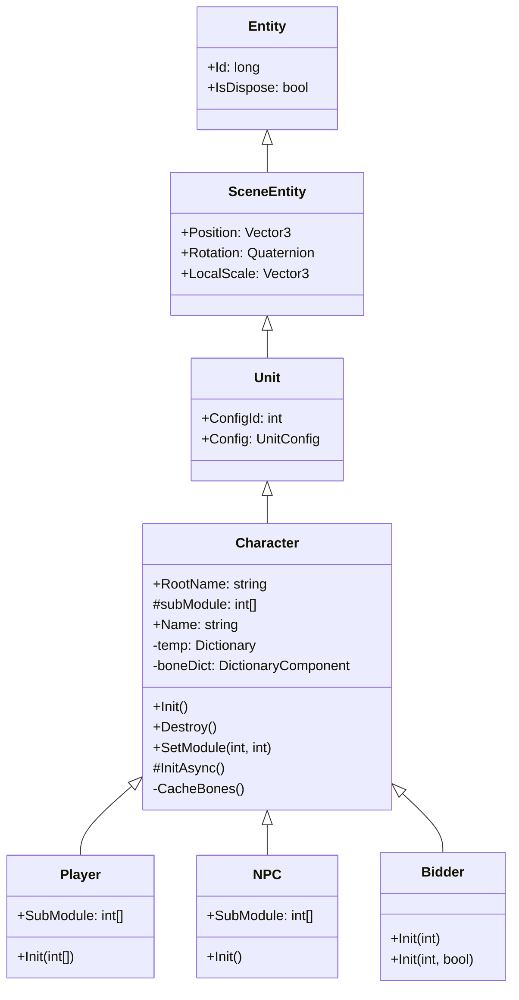
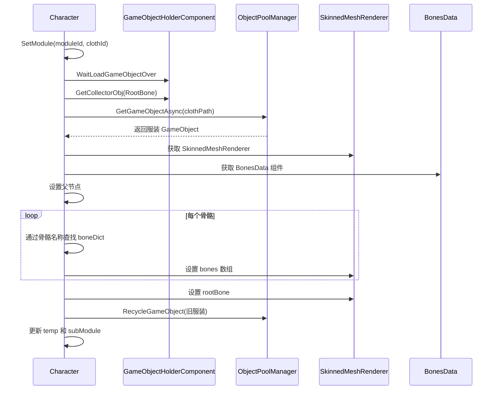
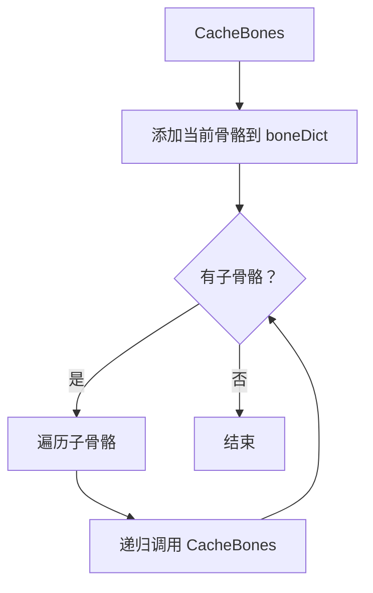

# Character.cs 注解文档

## 文件基本信息

| 属性 | 值 |
|------|-----|
| **文件名** | Character.cs |
| **路径** | Assets/Scripts/Code/Game/Entity/Character.cs |
| **所属模块** | 游戏层 → Code/Game/Entity |
| **文件职责** | 角色实体基类，继承 Unit，实现 IEntity 接口，提供角色服装模块加载、骨骼绑定和换装功能 |

---

## 类/结构体说明

### Character

| 属性 | 说明 |
|------|------|
| **职责** | 作为所有角色实体（Player、NPC、Bidder）的基类，管理角色的 GameObject 加载、骨骼缓存、服装模块换装功能 |
| **泛型参数** | 无 |
| **继承关系** | 继承 `Unit` 类 |
| **实现的接口** | `IEntity` |

**设计模式**: 模板方法模式 + 对象池模式

```csharp
// 使用方式
// Character 是抽象类，通过子类创建
var player = entityManager.CreateEntity<Player, int[]>(modules);
var npc = entityManager.CreateEntity<NPC>();
```

---

## 字段与属性（按重要程度排序）

| 名称 | 类型 | 访问级别 | 说明 |
|------|------|----------|------|
| `RootName` | `string` | `public` | 根骨骼名称 |
| `subModule` | `int[]` | `protected` | 服装模块配置数组（索引 +1 对应 moduleId） |
| `temp` | `Dictionary<int, GameObject>` | `private` | 临时存储已加载的服装模块 GameObject |
| `boneDict` | `DictionaryComponent<string, Transform>` | `private` | 骨骼名称到 Transform 的映射字典 |
| `Name` | `string` | `public` | 角色名称 |

---

## 方法说明（按重要程度排序）

### Init()

**签名**:
```csharp
public virtual void Init()
```

**职责**: 初始化角色（异步启动）

**核心逻辑**:
```
1. 调用 InitAsync().Coroutine() 启动异步初始化
```

**调用者**: 子类（Player、NPC、Bidder）的 Init 方法

---

### InitAsync()

**签名**:
```csharp
protected virtual async ETTask InitAsync()
```

**职责**: 异步初始化角色，加载 GameObject 并缓存骨骼

**核心逻辑**:
```
1. 设置 ConfigId = GameConst.CharacterUnitId
2. 创建 temp 字典
3. 添加 GameObjectHolderComponent 组件
4. 等待 GameObject 加载完成
5. 创建 boneDict 字典
6. 调用 CacheBones() 递归缓存所有骨骼
7. 遍历 subModule 数组：
   - 如果模块 ID 不为 0，调用 SetModule() 加载服装
```

**调用者**: `Init()`

**被调用者**: `CacheBones()`, `SetModule()`

---

### Destroy()

**签名**:
```csharp
public virtual void Destroy()
```

**职责**: 销毁角色，回收服装模块资源

**核心逻辑**:
```
1. 遍历 temp 字典：
   - 获取 SkinnedMeshRenderer
   - 断开 rootBone 连接
   - 回收到对象池
2. 清空 temp 引用
3. 释放 boneDict
4. 清空 RootName 引用
```

**调用者**: `EntityManager.RemoveEntity()`

**被调用者**: `GameObjectPoolManager.GetInstance().RecycleGameObject()`

---

### SetModule(int moduleId, int id)

**签名**:
```csharp
public async ETTask SetModule(int moduleId, int id)
```

**职责**: 设置角色的服装模块（换装核心方法）

**核心逻辑**:
```
1. 如果 id < 0（卸载模块）：
   - 从 temp 获取旧 GameObject
   - 断开 rootBone
   - 回收到对象池
   - 从 temp 移除
   - 设置 subModule 对应位置为 0
   - 返回
2. 通过 ClothConfig 获取配置
3. 检查模块 ID 是否匹配
4. 获取 GameObjectHolderComponent
5. 等待 GameObject 加载完成
6. 检查实体是否已销毁
7. 获取根骨骼 Transform
8. 从对象池获取服装 GameObject
9. 检查实体是否已销毁
10. 获取 SkinnedMeshRenderer
11. 获取 BonesData 组件
12. 设置父节点
13. 重新映射骨骼：
    - 遍历新服装的骨骼数组
    - 通过骨骼名称从 boneDict 查找对应 Transform
    - 设置 smr.bones
14. 设置 rootBone
15. 如果存在旧服装：
    - 断开 rootBone
    - 回收到对象池
16. 更新 temp 字典
17. 更新 subModule 数组
```

**调用者**: `InitAsync()`, UI 换装代码

**被调用者**: `GameObjectPoolManager.GetInstance().GetGameObjectAsync()`, `CacheBones()`

---

### CacheBones()

**签名**:
```csharp
private void CacheBones(DictionaryComponent<string, Transform> boneDict, Transform current)
```

**职责**: 递归缓存骨骼层级

**核心逻辑**:
```
1. 将当前 Transform 添加到 boneDict（key 为名称）
2. 遍历所有子 Transform
3. 递归调用 CacheBones()
```

**调用者**: `InitAsync()`

---

## Mermaid 流程图

### Character 类继承关系



### 换装流程



### 骨骼缓存流程



---

## 使用示例

### 创建玩家角色

```csharp
// 通过 EntityManager 创建玩家
var entityManager = ManagerProvider.GetManager<EntityManager>();
int[] modules = new int[] { 1, 2, 3, 4, 5 }; // 服装模块配置
var player = entityManager.CreateEntity<Player, int[]>(modules);

// 等待加载完成
await player.GetComponent<GameObjectHolderComponent>().WaitLoadGameObjectOver();
Debug.Log($"玩家名称：{player.Name}");
```

### 更换服装

```csharp
// 更换第 1 个模块的服装（moduleId 从 1 开始）
await player.SetModule(1, clothId);

// 卸载第 2 个模块的服装
await player.SetModule(2, -1);
```

### 获取服装模块信息

```csharp
// 获取玩家的服装配置
int[] subModules = player.SubModule;
for (int i = 0; i < subModules.Length; i++)
{
    if (subModules[i] != 0)
    {
        var clothConfig = ClothConfigCategory.Instance.Get(subModules[i]);
        Debug.Log($"模块{i + 1}: {clothConfig.Name}");
    }
}
```

---

## 相关文档链接

- [Unit.cs.md](Unit.cs.md) - 场景单位基类
- [Entity.cs.md](Entity.cs.md) - 实体基类
- [Player.cs.md](Player.cs.md) - 玩家实体
- [NPC.cs.md](NPC.cs.md) - NPC 实体
- [Bidder.cs.md](Bidder.cs.md) - 竞拍者实体
- [EntityManager.cs.md](../../System/Entity/EntityManager.cs.md) - 实体管理器
- [ClothConfig.cs.md](../../Module/Config/ClothConfig.cs.md) - 服装配置
- [BonesData.cs.md](../../../Mono/Module/Entity/BonesData.cs.md) - 骨骼数据组件

---

*文档生成时间：2026-03-02*
