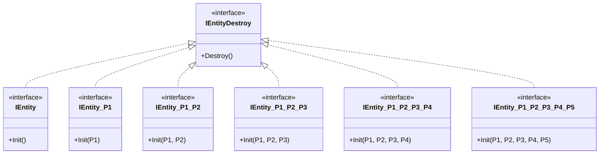
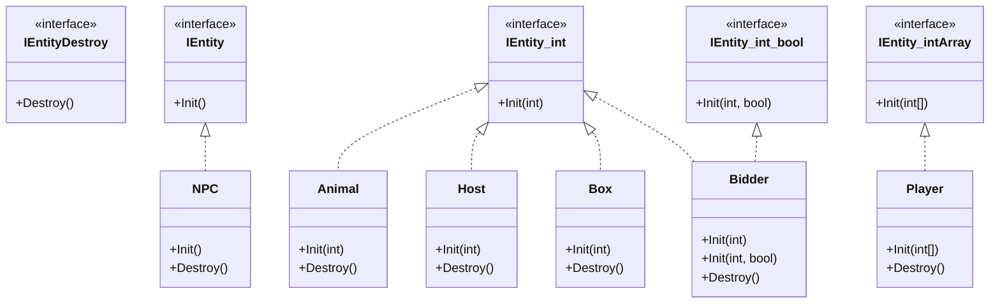
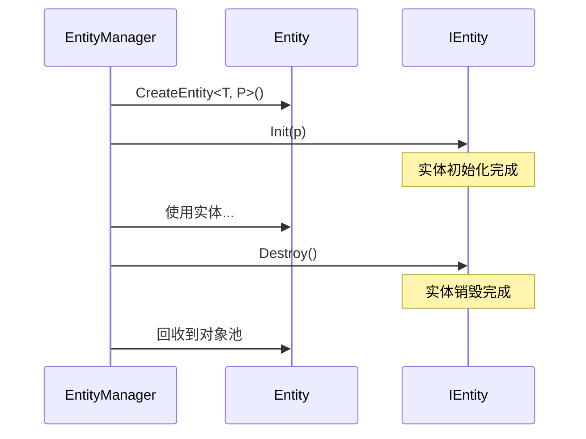

# IEntity.cs 注解文档

## 文件基本信息

| 属性 | 值 |
|------|-----|
| **文件名** | IEntity.cs |
| **路径** | Assets/Scripts/Code/Game/Entity/IEntity.cs |
| **所属模块** | 游戏层 → Code/Game/Entity |
| **文件职责** | 实体接口定义，提供不同参数数量的实体初始化接口，规范实体生命周期管理 |

---

## 类/结构体说明

### 接口概览

| 接口名称 | 参数数量 | 说明 |
|----------|----------|------|
| `IEntityDestroy` | 0 | 销毁接口，所有实体必须实现 |
| `IEntity` | 0 | 无参数初始化接口 |
| `IEntity<P1>` | 1 | 单参数初始化接口 |
| `IEntity<P1, P2>` | 2 | 双参数初始化接口 |
| `IEntity<P1, P2, P3>` | 3 | 三参数初始化接口 |
| `IEntity<P1, P2, P3, P4>` | 4 | 四参数初始化接口 |
| `IEntity<P1, P2, P3, P4, P5>` | 5 | 五参数初始化接口 |

**设计模式**: 接口泛型重载模式

```csharp
// 使用方式
// 实体类根据需要实现对应参数数量的接口
public class Player : Character, IEntity<int[]>
{
    public void Init(int[] modules) { ... }
    public void Destroy() { ... }
}
```

---

## 接口说明（按重要程度排序）

### IEntityDestroy

**签名**:
```csharp
public interface IEntityDestroy
{
    public void Destroy();
}
```

**职责**: 定义实体销毁方法，所有实体接口的基接口

**实现者**: 所有实体类（Animal、Bidder、Box、Character、Host、NPC、Player 等）

**使用场景**: EntityManager 统一销毁实体时调用

---

### IEntity

**签名**:
```csharp
public interface IEntity : IEntityDestroy
{
    public void Init();
}
```

**职责**: 定义无参数初始化方法

**实现者**: NPC 等不需要初始化参数的实体

**使用示例**:
```csharp
public class NPC : Character, IEntity
{
    public override void Init()
    {
        Name = I18NManager.Instance.I18NGetText(...);
        subModule = ClothGenerateManager.Instance.GetNext();
        base.Init();
    }
    
    public void Destroy() { ... }
}
```

---

### IEntity<P1>

**签名**:
```csharp
public interface IEntity<P1> : IEntityDestroy
{
    public void Init(P1 p1);
}
```

**职责**: 定义单参数初始化方法

**实现者**: Animal、Host、Box 等需要一个参数的实体

**使用示例**:
```csharp
public class Animal : Unit, IEntity<int>
{
    public void Init(int id)
    {
        ConfigId = id;
        AddComponent<GameObjectHolderComponent>();
    }
    
    public void Destroy() { ... }
}
```

---

### IEntity<P1, P2>

**签名**:
```csharp
public interface IEntity<P1, P2> : IEntityDestroy
{
    public void Init(P1 p1, P2 p2);
}
```

**职责**: 定义双参数初始化方法

**实现者**: Bidder 等需要两个参数的实体

**使用示例**:
```csharp
public class Bidder : Character, IEntity<int, bool>
{
    public void Init(int id, bool isBlack)
    {
        this.isBlack = isBlack;
        Name = I18NManager.Instance.I18NGetText(...);
        // ...
    }
    
    public void Destroy() { ... }
}
```

---

### IEntity<P1, P2, P3>

**签名**:
```csharp
public interface IEntity<P1, P2, P3> : IEntityDestroy
{
    public void Init(P1 p1, P2 p2, P3 p3);
}
```

**职责**: 定义三参数初始化方法

**实现者**: 需要三个参数的实体（当前项目未使用）

---

### IEntity<P1, P2, P3, P4>

**签名**:
```csharp
public interface IEntity<P1, P2, P3, P4> : IEntityDestroy
{
    public void Init(P1 p1, P2 p2, P3 p3, P4 p4);
}
```

**职责**: 定义四参数初始化方法

**实现者**: 需要四个参数的实体（当前项目未使用）

---

### IEntity<P1, P2, P3, P4, P5>

**签名**:
```csharp
public interface IEntity<P1, P2, P3, P4, P5> : IEntityDestroy
{
    public void Init(P1 p1, P2 p2, P3 p3, P4 p4, P5 p5);
}
```

**职责**: 定义五参数初始化方法

**实现者**: 需要五个参数的实体（当前项目未使用）

---

## Mermaid 流程图

### 接口继承关系



### 实体类实现关系



### 实体生命周期



---

## 使用示例

### 实现无参数接口

```csharp
// NPC 实现 IEntity 接口
public class NPC : Character, IEntity
{
    public override void Init()
    {
        // 初始化逻辑
        Name = I18NManager.Instance.I18NGetText(...);
        base.Init();
    }
    
    public void Destroy()
    {
        // 销毁逻辑
    }
}

// 创建
var npc = entityManager.CreateEntity<NPC>();
```

### 实现单参数接口

```csharp
// Animal 实现 IEntity<int> 接口
public class Animal : Unit, IEntity<int>
{
    public void Init(int id)
    {
        ConfigId = id;
        AddComponent<GameObjectHolderComponent>();
    }
    
    public void Destroy() { }
}

// 创建
var animal = entityManager.CreateEntity<Animal, int>(configId);
```

### 实现双参数接口

```csharp
// Bidder 实现 IEntity<int> 和 IEntity<int, bool> 接口
public class Bidder : Character, IEntity<int>, IEntity<int, bool>
{
    public void Init(int id)
    {
        Init(id, false);
    }
    
    public void Init(int id, bool isBlack)
    {
        // 初始化逻辑
    }
    
    public void Destroy() { }
}

// 创建（普通竞拍者）
var bidder = entityManager.CreateEntity<Bidder, int>(id);

// 创建（黑名单竞拍者）
var blackBidder = entityManager.CreateEntity<Bidder, int, bool>(id, true);
```

### 实现数组参数接口

```csharp
// Player 实现 IEntity<int[]> 接口
public class Player : Character, IEntity<int[]>
{
    public void Init(int[] modules)
    {
        Name = "我";
        subModule = modules ?? GetDefaultModules();
        base.Init();
    }
    
    public void Destroy() { }
}

// 创建
var player = entityManager.CreateEntity<Player, int[]>(modules);
```

---

## 相关文档链接

- [Entity.cs.md](Entity.cs.md) - 实体基类
- [EntityManager.cs.md](../../System/Entity/EntityManager.cs.md) - 实体管理器
- [Animal.cs.md](Animal.cs.md) - 动物实体
- [Bidder.cs.md](Bidder.cs.md) - 竞拍者实体
- [Box.cs.md](Box.cs.md) - 宝盒实体
- [Character.cs.md](Character.cs.md) - 角色基类
- [Host.cs.md](Host.cs.md) - 主机实体
- [NPC.cs.md](NPC.cs.md) - NPC 实体
- [Player.cs.md](Player.cs.md) - 玩家实体

---

*文档生成时间：2026-03-02*
