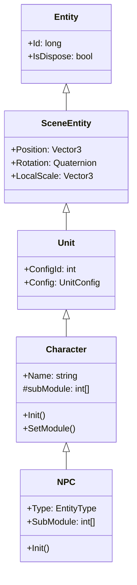
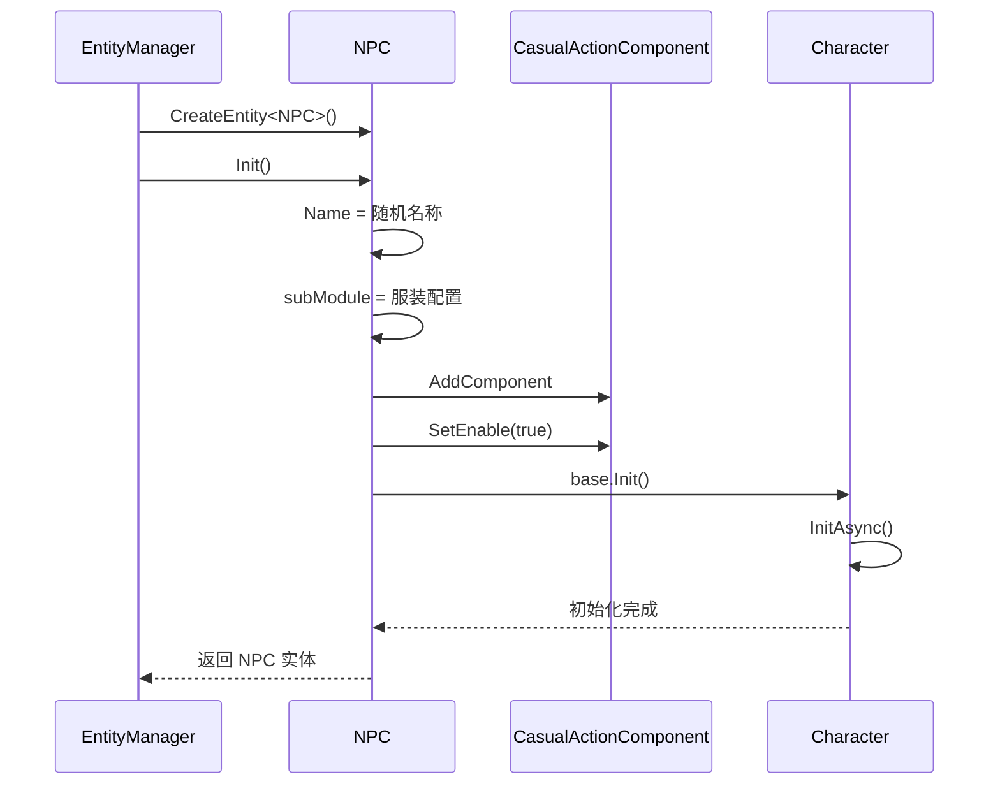

# NPC.cs 注解文档

## 文件基本信息

| 属性 | 值 |
|------|-----|
| **文件名** | NPC.cs |
| **路径** | Assets/Scripts/Code/Game/Entity/NPC.cs |
| **所属模块** | 游戏层 → Code/Game/Entity |
| **文件职责** | NPC 实体类，继承 Character，实现 IEntity 接口，用于表示场景中的非玩家角色 |

---

## 类/结构体说明

### NPC

| 属性 | 说明 |
|------|------|
| **职责** | 表示场景中的非玩家角色，支持随机名称生成、服装配置和休闲动作 |
| **泛型参数** | 无 |
| **继承关系** | 继承 `Character` 类 |
| **实现的接口** | `IEntity` |

**设计模式**: 实体组件模式

```csharp
// 使用方式
// 通过 EntityManager 创建 NPC 实体
var npc = entityManager.CreateEntity<NPC>();
```

---

## 字段与属性（按重要程度排序）

| 名称 | 类型 | 访问级别 | 说明 |
|------|------|----------|------|
| `Type` | `EntityType` | `public override` | 实体类型，固定为 `EntityType.Npc` |
| `SubModule` | `int[]` | `public` | 服装模块配置数组（继承自 Character 的 subModule） |
| `Name` | `string` | `public` | NPC 名称（继承自 Character） |

---

## 方法说明（按重要程度排序）

### Init()

**签名**:
```csharp
public override void Init()
```

**职责**: 初始化 NPC 实体

**核心逻辑**:
```
1. 从 CharnameConfig 随机获取名称并国际化
2. 从 ClothGenerateManager 获取下一个服装配置
3. 添加 CasualActionComponent 组件
4. 启用休闲动作
5. 调用 base.Init() 初始化 Character 基类
```

**调用者**: `EntityManager.CreateEntity<NPC>()`

**被调用者**: `I18NManager.Instance.I18NGetText()`, `ClothGenerateManager.Instance.GetNext()`, `AddComponent<CasualActionComponent>()`

---

## Mermaid 流程图

### NPC 类继承关系



### 初始化流程



---

## 使用示例

### 创建 NPC 实体

```csharp
// 通过 EntityManager 创建
var entityManager = ManagerProvider.GetManager<EntityManager>();
var npc = entityManager.CreateEntity<NPC>();

// 等待加载完成
var ghc = npc.GetComponent<GameObjectHolderComponent>();
await ghc.WaitLoadGameObjectOver();

// 获取 NPC 信息
Debug.Log($"NPC 名称：{npc.Name}");
Debug.Log($"服装配置：{string.Join(",", npc.SubModule)}");
```

### 更换 NPC 服装

```csharp
// 更换第 1 个模块的服装
await npc.SetModule(1, clothId);
```

### 获取 NPC 配置

```csharp
// 通过 ConfigId 获取配置（固定为 CharacterUnitId）
var config = npc.Config;
Debug.Log($"NPC 配置名称：{config.Name}");
```

---

## 相关文档链接

- [Character.cs.md](Character.cs.md) - 角色基类
- [Unit.cs.md](Unit.cs.md) - 场景单位基类
- [Entity.cs.md](Entity.cs.md) - 实体基类
- [EntityManager.cs.md](../../System/Entity/EntityManager.cs.md) - 实体管理器
- [CasualActionComponent.cs.md](../../Component/AI/CasualActionComponent.cs.md) - 休闲动作组件
- [EntityType.cs.md](../../../Mono/Module/Entity/EntityType.cs.md) - 实体类型枚举

---

*文档生成时间：2026-03-02*
