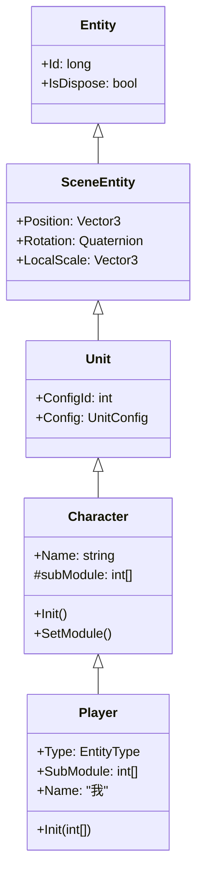
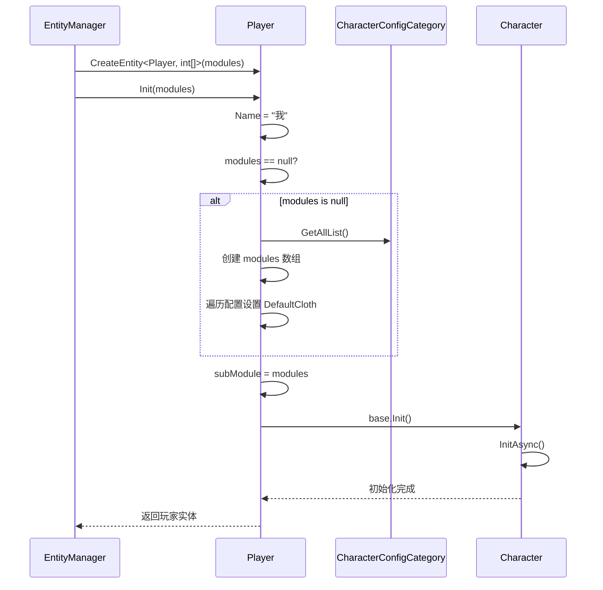

# Player.cs 注解文档

## 文件基本信息

| 属性 | 值 |
|------|-----|
| **文件名** | Player.cs |
| **路径** | Assets/Scripts/Code/Game/Entity/Player.cs |
| **所属模块** | 游戏层 → Code/Game/Entity |
| **文件职责** | 玩家实体类，继承 Character，实现 IEntity 接口，用于表示玩家控制的角色 |

---

## 类/结构体说明

### Player

| 属性 | 说明 |
|------|------|
| **职责** | 表示玩家控制的角色实体，支持自定义服装配置，名称固定为"我" |
| **泛型参数** | 无 |
| **继承关系** | 继承 `Character` 类 |
| **实现的接口** | `IEntity<int[]>` |

**设计模式**: 实体组件模式

```csharp
// 使用方式
// 通过 EntityManager 创建玩家实体
var player = entityManager.CreateEntity<Player, int[]>(modules);
```

---

## 字段与属性（按重要程度排序）

| 名称 | 类型 | 访问级别 | 说明 |
|------|------|----------|------|
| `Type` | `EntityType` | `public override` | 实体类型，固定为 `EntityType.Player` |
| `SubModule` | `int[]` | `public` | 服装模块配置数组（继承自 Character 的 subModule） |
| `Name` | `string` | `public` | 玩家名称，固定为"我"（继承自 Character） |

---

## 方法说明（按重要程度排序）

### Init(int[] modules)

**签名**:
```csharp
public void Init(int[] modules)
```

**职责**: 初始化玩家实体

**核心逻辑**:
```
1. 设置 Name = "我"
2. 如果 modules == null：
   - 获取所有 CharacterConfig 配置
   - 创建 modules 数组
   - 遍历配置，如果存在 DefaultCloth 则设置对应模块
3. 设置 subModule = modules
4. 调用 base.Init() 初始化 Character 基类
```

**调用者**: `EntityManager.CreateEntity<Player, int[]>()`

**被调用者**: `CharacterConfigCategory.Instance.GetAllList()`, `base.Init()`

---

## Mermaid 流程图

### Player 类继承关系



### 初始化流程



---

## 使用示例

### 创建玩家实体（带自定义服装）

```csharp
// 通过 EntityManager 创建
var entityManager = ManagerProvider.GetManager<EntityManager>();
int[] modules = new int[] { 1, 2, 3, 4, 5 }; // 服装模块配置
var player = entityManager.CreateEntity<Player, int[]>(modules);

// 等待加载完成
var ghc = player.GetComponent<GameObjectHolderComponent>();
await ghc.WaitLoadGameObjectOver();

// 获取玩家信息
Debug.Log($"玩家名称：{player.Name}"); // "我"
Debug.Log($"服装配置：{string.Join(",", player.SubModule)}");
```

### 创建玩家实体（使用默认服装）

```csharp
// 传入 null 使用默认服装配置
var player = entityManager.CreateEntity<Player, int[]>(null);

// 会自动从 CharacterConfig 获取 DefaultCloth 配置
```

### 更换玩家服装

```csharp
// 更换第 1 个模块的服装
await player.SetModule(1, clothId);

// 获取更新后的服装配置
int[] currentModules = player.SubModule;
```

### 获取玩家配置

```csharp
// 通过 ConfigId 获取配置（固定为 CharacterUnitId）
var config = player.Config;
Debug.Log($"玩家配置名称：{config.Name}");
```

---

## 相关文档链接

- [Character.cs.md](Character.cs.md) - 角色基类
- [Unit.cs.md](Unit.cs.md) - 场景单位基类
- [Entity.cs.md](Entity.cs.md) - 实体基类
- [EntityManager.cs.md](../../System/Entity/EntityManager.cs.md) - 实体管理器
- [CharacterConfig.cs.md](../../Module/Config/CharacterConfig.cs.md) - 角色配置
- [EntityType.cs.md](../../../Mono/Module/Entity/EntityType.cs.md) - 实体类型枚举

---

*文档生成时间：2026-03-02*
