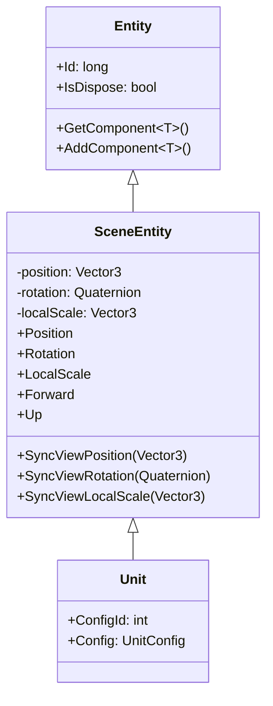
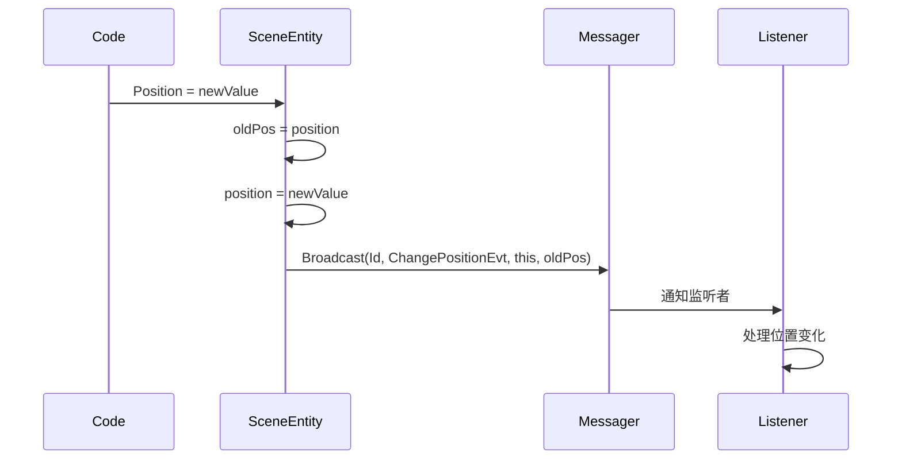
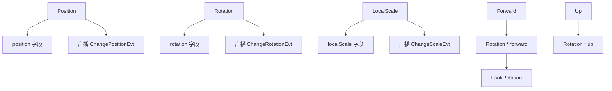

# SceneEntity.cs 注解文档

## 文件基本信息

| 属性 | 值 |
|------|-----|
| **文件名** | SceneEntity.cs |
| **路径** | Assets/Scripts/Code/Game/Entity/SceneEntity.cs |
| **所属模块** | 游戏层 → Code/Game/Entity |
| **文件职责** | 场景实体基类，继承 Entity，提供位置、旋转、缩放的封装和消息通知功能 |

---

## 类/结构体说明

### SceneEntity

| 属性 | 说明 |
|------|------|
| **职责** | 作为所有场景实体的基类，封装 Transform 属性（Position、Rotation、LocalScale），并在属性变化时广播消息通知 |
| **泛型参数** | 无 |
| **继承关系** | 继承 `Entity` 类 |
| **实现的接口** | 无（抽象类） |

**设计模式**: 观察者模式（通过 Messager 广播）

```csharp
// 使用方式
// SceneEntity 是抽象类，通过子类使用
var player = entityManager.CreateEntity<Player, int[]>(modules);
player.Position = new Vector3(0, 0, 0); // 自动广播位置变化消息
```

---

## 字段与属性（按重要程度排序）

| 名称 | 类型 | 访问级别 | 说明 |
|------|------|----------|------|
| `Position` | `Vector3` | `public` | 实体位置（有挂点为 localPosition，无挂点为 worldPosition） |
| `Rotation` | `Quaternion` | `public` | 实体旋转（有挂点为 localRotation，无挂点为 worldRotation） |
| `LocalScale` | `Vector3` | `public` | 实体本地缩放 |
| `Forward` | `Vector3` | `public` | 实体前方向量（通过 Rotation * Vector3.forward 计算） |
| `Up` | `Vector3` | `public` | 实体上方向量（通过 Rotation * Vector3.up 计算） |
| `position` | `Vector3` | `private` | 位置缓存字段 |
| `rotation` | `Quaternion` | `private` | 旋转缓存字段 |
| `localScale` | `Vector3` | `private` | 缩放缓存字段（默认 Vector3.one） |

---

## 方法说明（按重要程度排序）

### Position (属性 Setter)

**签名**:
```csharp
public Vector3 Position { get; set; }
```

**职责**: 设置实体位置并广播消息

**核心逻辑**:
```
1. 保存旧位置 oldPos
2. 设置新位置
3. 广播 MessageId.ChangePositionEvt 消息（包含实体 ID、实体引用、旧位置）
```

**调用者**: 任何需要移动实体的代码

**被调用者**: `Messager.Instance.Broadcast()`

---

### Rotation (属性 Setter)

**签名**:
```csharp
public Quaternion Rotation { get; set; }
```

**职责**: 设置实体旋转并广播消息

**核心逻辑**:
```
1. 保存旧旋转 oldRot
2. 设置新旋转
3. 广播 MessageId.ChangeRotationEvt 消息（包含实体 ID、实体引用、旧旋转）
```

**调用者**: 任何需要旋转实体的代码

**被调用者**: `Messager.Instance.Broadcast()`

---

### LocalScale (属性 Setter)

**签名**:
```csharp
public Vector3 LocalScale { get; set; }
```

**职责**: 设置实体缩放并广播消息

**核心逻辑**:
```
1. 保存旧缩放 oldScale
2. 设置新缩放
3. 广播 MessageId.ChangeScaleEvt 消息（包含实体 ID、实体引用、旧缩放）
```

**调用者**: 任何需要缩放实体的代码

**被调用者**: `Messager.Instance.Broadcast()`

---

### SyncViewPosition()

**签名**:
```csharp
public void SyncViewPosition(Vector3 value)
```

**职责**: 同步视图位置（不广播消息）

**核心逻辑**:
```
1. 直接设置 position 字段
2. 不广播消息（用于视图同步，避免循环通知）
```

**调用者**: 视图同步代码

---

### SyncViewRotation()

**签名**:
```csharp
public void SyncViewRotation(Quaternion value)
```

**职责**: 同步视图旋转（不广播消息）

**核心逻辑**:
```
1. 直接设置 rotation 字段
2. 不广播消息（用于视图同步，避免循环通知）
```

**调用者**: 视图同步代码

---

### SyncViewLocalScale()

**签名**:
```csharp
public void SyncViewLocalScale(Vector3 value)
```

**职责**: 同步视图缩放（不广播消息）

**核心逻辑**:
```
1. 直接设置 localScale 字段
2. 不广播消息（用于视图同步，避免循环通知）
```

**调用者**: 视图同步代码

---

### Forward (属性 Getter)

**签名**:
```csharp
public Vector3 Forward { get; set; }
```

**职责**: 获取/设置实体前方向量

**核心逻辑**:
```
Getter:
- 返回 Rotation * Vector3.forward

Setter:
- 通过 Quaternion.LookRotation(value, Vector3.up) 设置 Rotation
```

**调用者**: 需要获取/设置朝向的代码

---

### Up (属性 Getter)

**签名**:
```csharp
public Vector3 Up { get; }
```

**职责**: 获取实体上方向量

**核心逻辑**:
```
- 返回 Rotation * Vector3.up
```

**调用者**: 需要获取上方向量的代码

---

## Mermaid 流程图

### SceneEntity 类继承关系



### 属性变更通知流程



### Transform 属性关系



---

## 使用示例

### 设置实体位置

```csharp
// 设置位置（会自动广播消息）
player.Position = new Vector3(10, 0, 5);

// 监听位置变化消息
Messager.Instance.AddEventListener<long, SceneEntity, Vector3>(
    MessageId.ChangePositionEvt,
    (entityId, entity, oldPos) =>
    {
        Debug.Log($"实体 {entityId} 从 {oldPos} 移动到 {entity.Position}");
    }
);
```

### 设置实体旋转

```csharp
// 设置旋转（会自动广播消息）
player.Rotation = Quaternion.Euler(0, 90, 0);

// 通过 Forward 设置朝向
player.Forward = new Vector3(1, 0, 0); // 面向 X 轴正方向
```

### 设置实体缩放

```csharp
// 设置缩放（会自动广播消息）
player.LocalScale = new Vector3(1.5f, 1.5f, 1.5f);
```

### 同步视图（不广播消息）

```csharp
// 视图同步时使用 Sync 方法，避免触发消息循环
player.SyncViewPosition(viewPosition);
player.SyncViewRotation(viewRotation);
player.SyncViewLocalScale(viewScale);
```

### 获取方向向量

```csharp
// 获取前方向量
Vector3 forward = player.Forward;

// 获取上方向量
Vector3 up = player.Up;
```

---

## 相关文档链接

- [Entity.cs.md](Entity.cs.md) - 实体基类
- [Unit.cs.md](Unit.cs.md) - 场景单位基类
- [Messager.cs.md](../../Module/Messager/Messager.cs.md) - 消息系统
- [MessageId.cs.md](../../../Mono/Module/Const/MessageId.cs.md) - 消息 ID 常量
- [Player.cs.md](Player.cs.md) - 玩家实体
- [NPC.cs.md](NPC.cs.md) - NPC 实体

---

*文档生成时间：2026-03-02*
