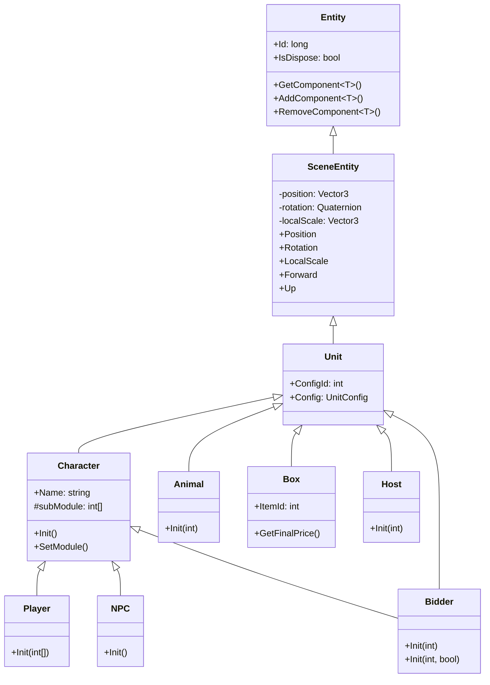
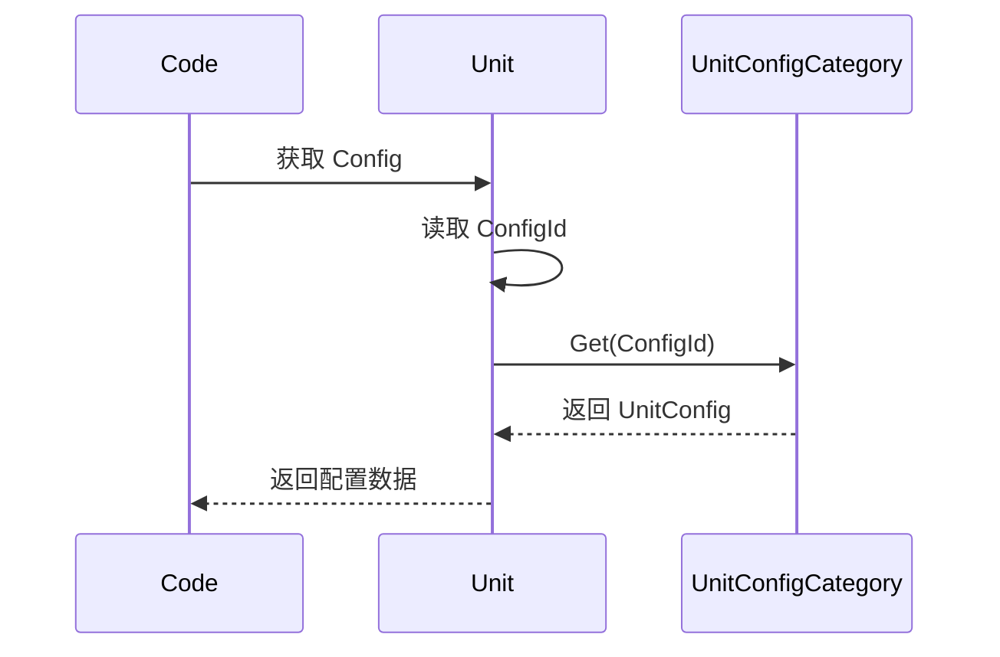

# Unit.cs 注解文档

## 文件基本信息

| 属性 | 值 |
|------|-----|
| **文件名** | Unit.cs |
| **路径** | Assets/Scripts/Code/Game/Entity/Unit.cs |
| **所属模块** | 游戏层 → Code/Game/Entity |
| **文件职责** | 场景单位基类，继承 SceneEntity，提供配置 ID 和配置数据的访问 |

---

## 类/结构体说明

### Unit

| 属性 | 说明 |
|------|------|
| **职责** | 作为所有场景单位（Character、Animal、Box、Host、NPC、Player、Bidder）的基类，提供配置表 ID 和配置数据的访问 |
| **泛型参数** | 无 |
| **继承关系** | 继承 `SceneEntity` 类 |
| **实现的接口** | 无（抽象类） |

**设计模式**: 模板方法模式

```csharp
// 使用方式
// Unit 是抽象类，通过子类使用
var player = entityManager.CreateEntity<Player, int[]>(modules);
var config = player.Config; // 通过 ConfigId 获取配置
```

---

## 字段与属性（按重要程度排序）

| 名称 | 类型 | 访问级别 | 说明 |
|------|------|----------|------|
| `ConfigId` | `int` | `protected` | 配置表 ID，用于查找 UnitConfig |
| `Config` | `UnitConfig` | `public` | 配置表数据（通过 ConfigId 从 UnitConfigCategory 获取） |

---

## 方法说明

Unit 类没有定义自己的方法，所有功能通过继承链获得：

### 继承自 SceneEntity

- `Position` - 位置属性（带消息通知）
- `Rotation` - 旋转属性（带消息通知）
- `LocalScale` - 缩放属性（带消息通知）
- `Forward` - 前方向量
- `Up` - 上方向量
- `SyncViewPosition()` - 同步视图位置
- `SyncViewRotation()` - 同步视图旋转
- `SyncViewLocalScale()` - 同步视图缩放

### 继承自 Entity

- `Id` - 实体唯一 ID
- `IsDispose` - 是否已销毁
- `GetComponent<T>()` - 获取组件
- `AddComponent<T>()` - 添加组件
- `RemoveComponent<T>()` - 移除组件

---

## Mermaid 流程图

### Unit 类继承关系



### 配置访问流程



---

## 使用示例

### 获取单位配置

```csharp
// 通过 Config 属性获取配置
var config = player.Config;
Debug.Log($"单位名称：{config.Name}");
Debug.Log($"预制体路径：{config.Perfab}");
Debug.Log($"移动速度：{config.MoveSpeed}");
```

### 设置 ConfigId

```csharp
// 在子类 Init 方法中设置 ConfigId
public class Animal : Unit, IEntity<int>
{
    public void Init(int id)
    {
        ConfigId = id; // 设置配置 ID
        AddComponent<GameObjectHolderComponent>();
    }
}

// 创建后 ConfigId 已设置
var animal = entityManager.CreateEntity<Animal, int>(configId);
var config = animal.Config; // 可以直接访问
```

### 检查配置是否存在

```csharp
// 检查配置是否存在
if (unit.ConfigId != 0)
{
    var config = unit.Config;
    if (config != null)
    {
        Debug.Log($"配置存在：{config.Name}");
    }
}
```

---

## 相关文档链接

- [SceneEntity.cs.md](SceneEntity.cs.md) - 场景实体基类
- [Entity.cs.md](Entity.cs.md) - 实体基类
- [UnitConfig.cs.md](../../Module/Config/UnitConfig.cs.md) - 单位配置
- [Character.cs.md](Character.cs.md) - 角色基类
- [Animal.cs.md](Animal.cs.md) - 动物实体
- [Box.cs.md](Box.cs.md) - 宝盒实体
- [Host.cs.md](Host.cs.md) - 主机实体
- [NPC.cs.md](NPC.cs.md) - NPC 实体
- [Player.cs.md](Player.cs.md) - 玩家实体
- [Bidder.cs.md](Bidder.cs.md) - 竞拍者实体

---

*文档生成时间：2026-03-02*
