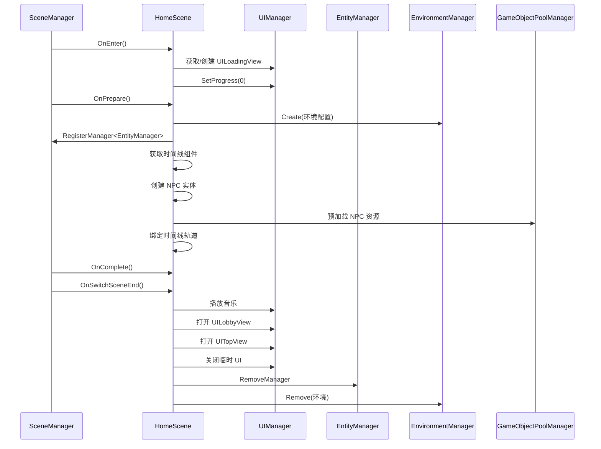
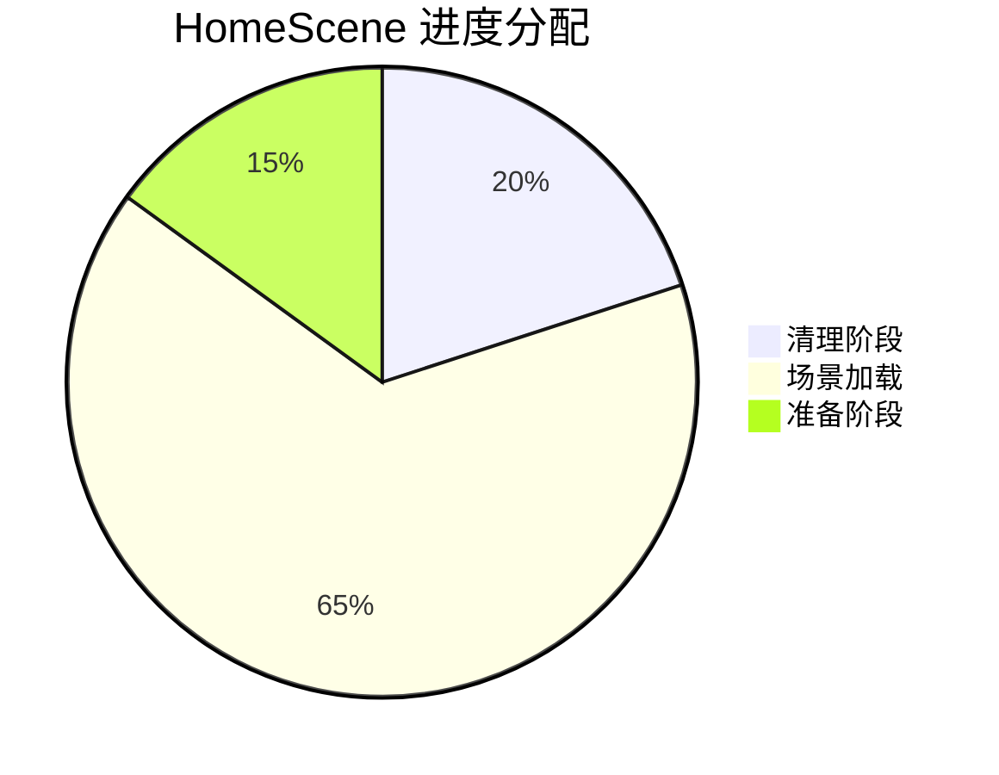

# HomeScene.cs 注解文档

## 文件基本信息

| 属性 | 值 |
|------|-----|
| **文件名** | HomeScene.cs |
| **路径** | Assets/Scripts/Code/Game/Scene/Home/HomeScene.cs |
| **所属模块** | 游戏层 → Code/Game/Scene/Home |
| **文件职责** | 家园场景实现，管理家园场景的加载、切换、资源清理和场景特定逻辑 |

---

## 类/结构体说明

### HomeScene

| 属性 | 说明 |
|------|------|
| **职责** | 实现家园场景的完整生命周期管理，包括场景进入/离开、资源预加载、进度控制、场景结束处理 |
| **泛型参数** | 无 |
| **继承关系** | 继承 `SceneManagerProvider`，实现 `IScene` 接口 |
| **实现的接口** | `IScene` |

**设计模式**: 状态机模式 + 异步加载

```csharp
// 使用方式
// 通过 SceneManager 切换到家园场景
await SceneManager.Instance.SwitchScene<HomeScene>();
```

---

## 字段与属性（按重要程度排序）

| 名称 | 类型 | 访问级别 | 说明 |
|------|------|----------|------|
| `win` | `UILoadingView` | `private` | 加载进度 UI 窗口引用 |
| `blendView` | `UIBlendView` | `private` | 转场淡入淡出效果视图 |
| `envId` | `long` | `private` | 环境配置 ID（用于 EnvironmentManager） |
| `dontDestroyWindow` | `string[]` | `private` | 场景切换时保留的 UI 窗口类型名称列表 |

---

## 方法说明（按重要程度排序）

### GetDontDestroyWindow()

**签名**:
```csharp
public string[] GetDontDestroyWindow()
```

**职责**: 获取场景切换时不需要销毁的 UI 窗口类型列表

**核心逻辑**:
```
返回保留窗口列表：
- UILoadingView
- UIBlendView
- UIEnterView
- UIGuidanceView
- UILoadingView2
```

**调用者**: `SceneManager`（场景切换时）

---

### GetScenesChangeIgnoreClean()

**签名**:
```csharp
public List<string> GetScenesChangeIgnoreClean()
```

**职责**: 获取场景切换时不需要清理的资源路径列表

**核心逻辑**:
```
返回保留资源路径：
- UILoadingView.PrefabPath
- UIEnterView.PrefabPath
- UIBlendView.PrefabPath
- UIGuidanceView.PrefabPath
- UILoadingView2.PrefabPath
```

**调用者**: `SceneManager`（场景切换资源清理时）

---

### GetProgressPercent()

**签名**:
```csharp
public void GetProgressPercent(out float cleanup, out float loadScene, out float prepare)
```

**职责**: 获取场景加载各阶段的进度权重分配

**核心逻辑**:
```
cleanup = 0.2f   // 清理阶段占 20%
loadScene = 0.65f // 场景加载占 65%
prepare = 0.15f   // 准备阶段占 15%
```

**调用者**: `SceneManager.InnerSwitchScene()`

---

### OnEnter()

**签名**:
```csharp
public async ETTask OnEnter()
```

**职责**: 场景进入时的初始化，显示加载界面

**核心逻辑**:
```
1. 尝试获取 UIBlendView（转场视图）
2. 如果没有转场视图且没有 UIEnterView：
   - 尝试获取 UILoadingView
   - 如果不存在则尝试获取 UILoadingView2
   - 如果都不存在则创建 UILoadingView2
3. 设置加载进度为 0
```

**调用者**: `SceneManager.InnerSwitchScene()`

---

### OnLeave()

**签名**:
```csharp
public async ETTask OnLeave()
```

**职责**: 场景离开时的清理工作

**核心逻辑**:
```
1. 恢复阴影距离为 30（性能优化）
2. 移除 EntityManager 管理器
3. 清除 EnvironmentManager 的场景光源引用
4. 移除环境配置（通过 envId）
```

**调用者**: `SceneManager.InnerSwitchScene()`

---

### OnPrepare()

**签名**:
```csharp
public async ETTask OnPrepare(float progressStart, float progressEnd)
```

**职责**: 场景预加载阶段，加载 NPC 和时间线资源

**核心逻辑**:
```
1. 创建环境配置（优先级：Scene）
2. 注册 EntityManager
3. 获取主摄像机的 ReferenceCollector
4. 获取 Character_Timeline 时间线根节点
5. 获取 PlayableDirector 组件
6. 收集所有 NPC_ 开头的动画轨道绑定
   - 性能低于 Mid 级别时跳过 _Add 结尾的轨道
7. 创建对应数量的 NPC 实体
8. 等待所有 NPC 的 GameObject 加载完成
9. 将 NPC 绑定到时间线轨道
10. 设置时间线的 GenericBinding
```

**调用者**: `SceneManager.InnerSwitchScene()`

**被调用者**: `ClothGenerateManager.Instance.Generate()`, `ETTaskHelper.WaitAll()`

---

### OnComplete()

**签名**:
```csharp
public async ETTask OnComplete()
```

**职责**: 场景加载完成回调（当前为空实现）

**调用者**: `SceneManager.InnerSwitchScene()`

---

### SetProgress()

**签名**:
```csharp
public async ETTask SetProgress(float value)
```

**职责**: 设置加载进度显示

**核心逻辑**:
```
1. 如果存在加载窗口，更新进度值
```

**调用者**: `SceneManager.InnerSwitchScene()`

---

### OnSwitchSceneEnd()

**签名**:
```csharp
public async ETTask OnSwitchSceneEnd()
```

**职责**: 场景切换结束后的收尾工作，打开家园主界面

**核心逻辑**:
```
1. 播放家园背景音乐
2. 恢复阴影距离为 50
3. 调整摄像机位置到中间点
4. 执行淡入效果（如果有 blendView）
5. 打开 UILobbyView（家园主界面）
6. 如果玩家已登录，打开 UITopView（顶部信息栏）
7. 执行 enterView 退出动画或预加载
8. 关闭并销毁临时 UI 窗口（UIBlendView, UILoadingView, UILoadingView2, UIEnterView）
9. 清空引用
```

**调用者**: `SceneManager.InnerSwitchScene()`

**被调用者**: `SoundManager.Instance.PlayMusic()`, `UIManager.Instance.OpenWindow()`, `GameObjectPoolManager.GetInstance().PreLoadGameObjectAsync()`

---

### GetName()

**签名**:
```csharp
public override string GetName()
```

**职责**: 获取场景名称

**返回值**: `"main"`

---

### GetScenePath()

**签名**:
```csharp
public string GetScenePath()
```

**职责**: 获取场景资源路径

**返回值**: `"Scenes/Main WBScene/Main WB.unity"`

---

## Mermaid 流程图

### 家园场景生命周期



### 场景切换进度分配



---

## 使用示例

### 切换到家园场景

```csharp
// 通过 SceneManager 切换
await SceneManager.Instance.SwitchScene<HomeScene>();

// 或通过场景名称切换（需要配置）
await SceneManager.Instance.SwitchMapScene("家园");
```

### 获取场景信息

```csharp
// 获取当前场景
var currentScene = SceneManager.Instance.CurrentScene as HomeScene;
if (currentScene != null)
{
    Debug.Log($"当前场景：{currentScene.GetName()}");
    Debug.Log($"场景路径：{currentScene.GetScenePath()}");
}
```

---

## 相关文档链接

- [SceneManager.cs.md](../../Module/Scene/SceneManager.cs.md) - 场景管理器核心
- [IScene.cs.md](../../Module/Scene/IScene.cs.md) - 场景接口定义
- [UIManager.cs.md](../../Module/UI/UIManager.cs.md) - UI 管理系统
- [EntityManager.cs.md](../../Game/System/Entity/EntityManager.cs.md) - 实体管理器
- [EnvironmentManager.cs.md](../../Module/Environment/EnvironmentManager.cs.md) - 环境管理器

---

*文档生成时间：2026-03-02*
