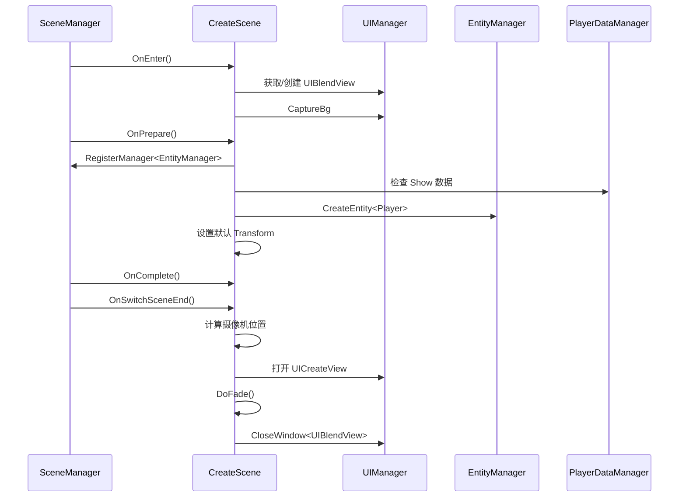
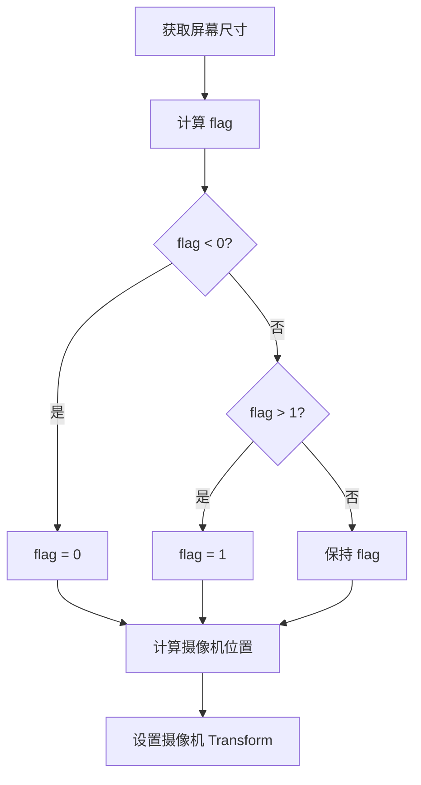
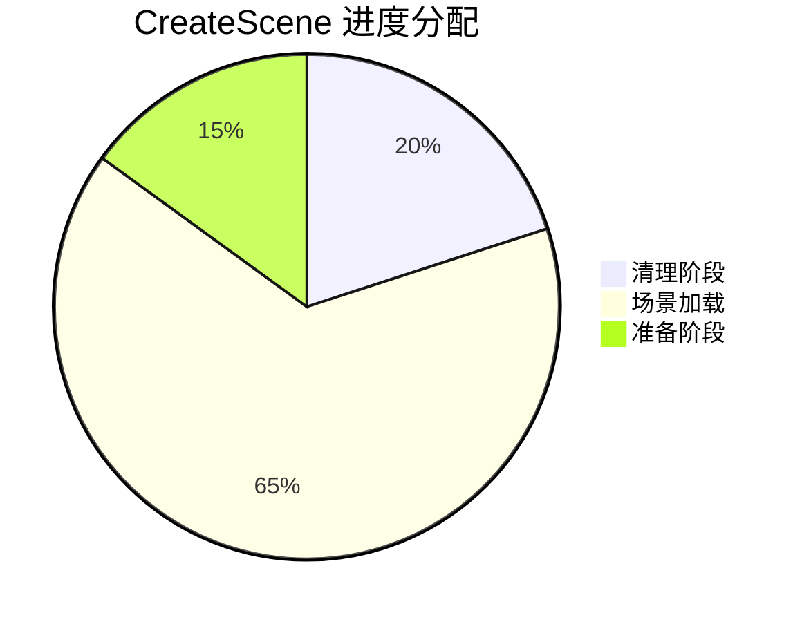

# CreateScene.cs 注解文档

## 文件基本信息

| 属性 | 值 |
|------|-----|
| **文件名** | CreateScene.cs |
| **路径** | Assets/Scripts/Code/Game/Scene/Map/CreateScene.cs |
| **所属模块** | 游戏层 → Code/Game/Scene/Map |
| **文件职责** | 角色创建场景实现，管理角色创建界面的加载、角色预览和场景切换 |

---

## 类/结构体说明

### CreateScene

| 属性 | 说明 |
|------|------|
| **职责** | 实现角色创建场景的完整生命周期管理，包括角色预览、换装界面加载、场景转场效果 |
| **泛型参数** | 无 |
| **继承关系** | 继承 `SceneManagerProvider`，实现 `IScene` 接口 |
| **实现的接口** | `IScene` |

**设计模式**: 状态机模式 + 异步加载

```csharp
// 使用方式
// 通过 SceneManager 切换到角色创建场景
await SceneManager.Instance.SwitchScene<CreateScene>();
```

---

## 字段与属性（按重要程度排序）

| 名称 | 类型 | 访问级别 | 说明 |
|------|------|----------|------|
| `win` | `UIBlendView` | `private` | 转场淡入淡出效果视图 |
| `player` | `Player` | `private` | 当前创建的玩家角色实体 |
| `dontDestroyWindow` | `string[]` | `private` | 场景切换时保留的 UI 窗口类型名称列表 |

---

## 方法说明（按重要程度排序）

### GetDontDestroyWindow()

**签名**:
```csharp
public string[] GetDontDestroyWindow()
```

**职责**: 获取场景切换时不需要销毁的 UI 窗口类型列表

**核心逻辑**:
```
返回保留窗口列表：
- UIEnterView
- UIBlendView
- UIGuidanceView
```

**调用者**: `SceneManager`（场景切换时）

---

### GetScenesChangeIgnoreClean()

**签名**:
```csharp
public List<string> GetScenesChangeIgnoreClean()
```

**职责**: 获取场景切换时不需要清理的资源路径列表

**核心逻辑**:
```
返回保留资源路径：
- UIEnterView.PrefabPath
- UIBlendView.PrefabPath
- UIGuidanceView.PrefabPath
```

**调用者**: `SceneManager`（场景切换资源清理时）

---

### GetProgressPercent()

**签名**:
```csharp
public void GetProgressPercent(out float cleanup, out float loadScene, out float prepare)
```

**职责**: 获取场景加载各阶段的进度权重分配

**核心逻辑**:
```
cleanup = 0.2f   // 清理阶段占 20%
loadScene = 0.65f // 场景加载占 65%
prepare = 0.15f   // 准备阶段占 15%
```

**调用者**: `SceneManager.InnerSwitchScene()`

---

### OnEnter()

**签名**:
```csharp
public async ETTask OnEnter()
```

**职责**: 场景进入时的初始化，显示转场效果

**核心逻辑**:
```
1. 尝试获取 UIBlendView
2. 如果不存在则创建 UIBlendView
3. 捕获背景（CaptureBg）
```

**调用者**: `SceneManager.InnerSwitchScene()`

**被调用者**: `UIManager.Instance.OpenWindow<UIBlendView>()`

---

### OnLeave()

**签名**:
```csharp
public async ETTask OnLeave()
```

**职责**: 场景离开时的清理工作

**核心逻辑**:
```
1. 打开 UIEnterView（入场动画）
2. 将玩家角色绑定到入场动画目标
3. 销毁 UICreateView（角色创建界面）
4. 移除 EntityManager 管理器
```

**调用者**: `SceneManager.InnerSwitchScene()`

**被调用者**: `UIManager.Instance.OpenWindow<UIEnterView>()`, `UIManager.Instance.DestroyWindow<UICreateView>()`

---

### OnPrepare()

**签名**:
```csharp
public async ETTask OnPrepare(float progressStart, float progressEnd)
```

**职责**: 场景预加载阶段，创建玩家角色实体

**核心逻辑**:
```
1. 注册 EntityManager
2. 检查 PlayerDataManager.Instance.Show 是否存在
3. 如果存在：
   - 复制装备数组
   - 创建带装备的 Player 实体
4. 如果不存在：
   - 创建默认 Player 实体
5. 设置角色位置、旋转、缩放为默认值
```

**调用者**: `SceneManager.InnerSwitchScene()`

**被调用者**: `EntityManager.CreateEntity<Player>()`

---

### OnComplete()

**签名**:
```csharp
public async ETTask OnComplete()
```

**职责**: 场景加载完成回调（当前为空实现）

**调用者**: `SceneManager.InnerSwitchScene()`

---

### SetProgress()

**签名**:
```csharp
public async ETTask SetProgress(float value)
```

**职责**: 设置加载进度显示（当前为空实现）

**调用者**: `SceneManager.InnerSwitchScene()`

---

### OnSwitchSceneEnd()

**签名**:
```csharp
public async ETTask OnSwitchSceneEnd()
```

**职责**: 场景切换结束后的收尾工作，打开角色创建界面

**核心逻辑**:
```
1. 获取主摄像机 Transform
2. 根据屏幕比例计算摄像机位置和角度
   - 计算 flag = (设计高 * 屏宽) / (设计宽 * (屏高 + 安全区下))
   - flag 归一化到 [0, 1] 范围
   - 根据 flag 插值计算摄像机位置 (Z 轴 6~7.5) 和旋转 (X 轴 17~20 度)
3. 打开 UICreateView（传入 Player 实体）
4. 执行淡入效果
5. 清空引用
```

**调用者**: `SceneManager.InnerSwitchScene()`

**被调用者**: `UIManager.Instance.OpenWindow<UICreateView>()`, `DoFade()`

---

### GetName()

**签名**:
```csharp
public override string GetName()
```

**职责**: 获取场景名称

**返回值**: `"Create"`

---

### GetScenePath()

**签名**:
```csharp
public string GetScenePath()
```

**职责**: 获取场景资源路径

**返回值**: `"Scenes/CreateScene/Create.unity"`

---

### DoFade()

**签名**:
```csharp
private async ETTask DoFade()
```

**职责**: 执行淡入效果并关闭转场视图

**核心逻辑**:
```
1. 等待 UIBlendView 的淡入动画完成
2. 关闭 UIBlendView
3. 清空引用
```

**调用者**: `OnSwitchSceneEnd()`

---

## Mermaid 流程图

### 角色创建场景生命周期



### 摄像机位置计算



### 场景切换进度分配



---

## 使用示例

### 切换到角色创建场景

```csharp
// 通过 SceneManager 切换
await SceneManager.Instance.SwitchScene<CreateScene>();
```

### 获取玩家角色

```csharp
// 在 CreateScene 中获取玩家角色
var createScene = SceneManager.Instance.CurrentScene as CreateScene;
// player 是私有字段，需要通过 EntityManager 获取
var player = EntityManager.Instance.GetEntity<Player>();
```

---

## 相关文档链接

- [SceneManager.cs.md](../../Module/Scene/SceneManager.cs.md) - 场景管理器核心
- [IScene.cs.md](../../Module/Scene/IScene.cs.md) - 场景接口定义
- [UIManager.cs.md](../../Module/UI/UIManager.cs.md) - UI 管理系统
- [Player.cs.md](../../Game/Entity/Player.cs.md) - 玩家实体
- [UICreateView.cs.md](../../Game/UIGame/UICreate/UICreateView.cs.md) - 角色创建界面

---

*文档生成时间：2026-03-02*
