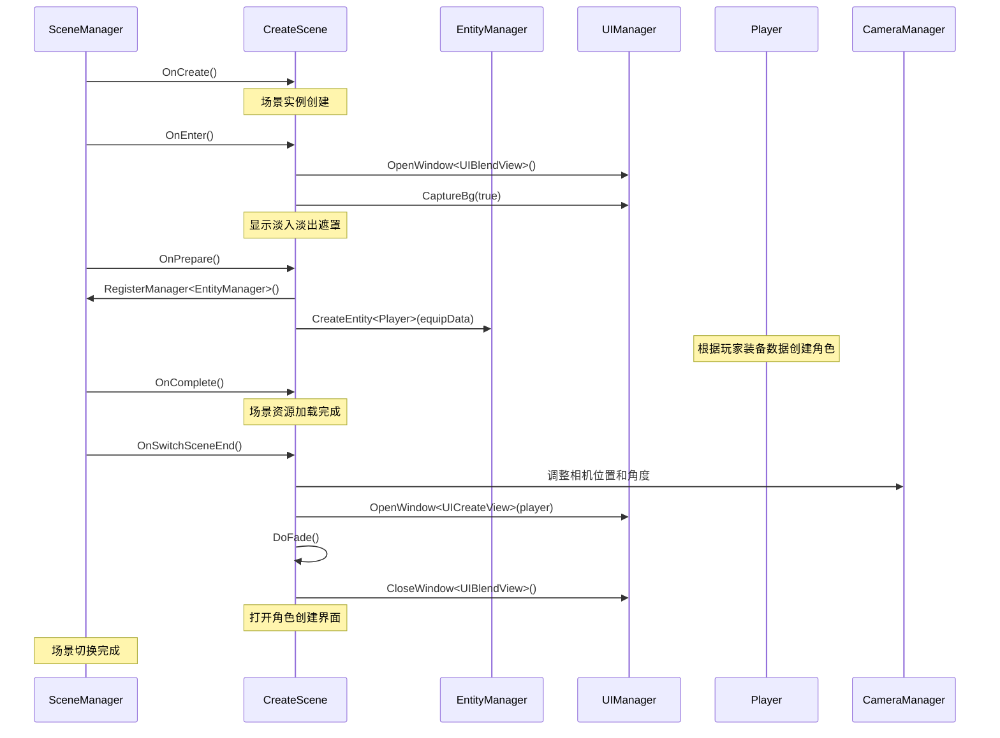

# CreateScene.cs 注解文档

## 文件基本信息

| 属性 | 值 |
|------|-----|
| **文件名** | CreateScene.cs |
| **路径** | Assets/Scripts/Code/Game/Scene/Map/CreateScene.cs |
| **所属模块** | 游戏逻辑层 → 场景系统 → 地图场景 |
| **文件职责** | 角色创建场景实现，处理角色创建流程、相机适配、UI 展示 |

---

## 类/结构体说明

### CreateScene

| 属性 | 说明 |
|------|------|
| **职责** | 实现角色创建场景的完整生命周期，包括角色预览、相机适配、UI 管理 |
| **泛型参数** | 无 |
| **继承关系** | 继承 `SceneManagerProvider`，实现 `IScene` 接口 |
| **实现的接口** | `IScene` |

**设计模式**: 场景模式 + 单例模式（通过 ManagerProvider 注册）

```csharp
// 场景注册与切换
await SceneManager.Instance.SwitchScene<CreateScene>();
```

---

## 字段与属性（按重要程度排序）

| 名称 | 类型 | 访问级别 | 说明 |
|------|------|----------|------|
| `dontDestroyWindow` | `string[]` | `private` | 场景切换时保留的 UI 窗口类型名列表 |
| `player` | `Player` | `private` | 当前创建的玩家角色实例 |
| `win` | `UIBlendView` | `private` | 淡入淡出转场 UI 视图 |

---

## IScene 接口实现

### 生命周期方法

| 方法 | 调用时机 | 职责 |
|------|----------|------|
| `OnCreate()` | 场景实例创建时 | 初始化场景（当前为空实现） |
| `OnEnter()` | 进入场景时 | 打开淡入淡出 UI，准备转场 |
| `OnPrepare()` | 资源预加载阶段 | 创建 EntityManager，生成玩家角色 |
| `OnComplete()` | 场景资源加载完成 | 空实现 |
| `OnLeave()` | 离开场景时 | 播放入场动画，清理创建 UI，移除 Manager |
| `OnSwitchSceneEnd()` | 场景切换结束时 | 调整相机位置，打开角色创建 UI，执行淡出 |

### 资源配置方法

| 方法 | 返回值 | 说明 |
|------|--------|------|
| `GetScenePath()` | `"Scenes/CreateScene/Create.unity"` | 场景资源路径 |
| `GetName()` | `"Create"` | 场景名称 |
| `GetDontDestroyWindow()` | `string[]` | 保留的 UI 窗口（UIEnterView, UIBlendView, UIGuidanceView） |
| `GetScenesChangeIgnoreClean()` | `List<string>` | 资源清理时保留的 Prefab 路径 |
| `GetProgressPercent()` | `cleanup=0.2, loadScene=0.65, prepare=0.15` | 进度分配比例 |

---

## 核心流程

### 场景切换完整流程


```mermaid
sequenceDiagram
    participant SM as SceneManager
    participant CS as CreateScene
    participant EM as EntityManager
    participant UM as UIManager
    participant Player as Player
    participant CM as CameraManager

    SM->>CS: OnCreate()
    Note over CS: 场景实例创建
    
    SM->>CS: OnEnter()
    CS->>UM: OpenWindow<UIBlendView>()
    CS->>UM: CaptureBg(true)
    Note over CS: 显示淡入淡出遮罩
    
    SM->>CS: OnPrepare()
    CS->>SM: RegisterManager<EntityManager>()
    CS->>EM: CreateEntity<Player>(equipData)
    Note over Player: 根据玩家装备数据创建角色
    
    SM->>CS: OnComplete()
    Note over CS: 场景资源加载完成
    
    SM->>CS: OnSwitchSceneEnd()
    CS->>CM: 调整相机位置和角度
    CS->>UM: OpenWindow<UICreateView>(player)
    CS->>CS: DoFade()
    CS->>UM: CloseWindow<UIBlendView>()
    Note over CS: 打开角色创建界面
    
    Note over SM: 场景切换完成
```

### 相机适配逻辑

```csharp
// 根据屏幕比例动态调整相机位置和角度
var flagStart = 1;
var flagEnd = 0.8003906f;
var flag = (Define.DesignScreenHeight * SystemInfoHelper.screenWidth) / 
           (Define.DesignScreenWidth * (SystemInfoHelper.screenHeight + SystemInfoHelper.safeArea.yMin));

flag = (flag - flagStart) / (flagEnd - flagStart);
if (flag < 0) flag = 0;

// 相机位置：Z 轴根据屏幕比例在 6~7.5 之间插值
trans.position = new Vector3(0, 1, 6 + 1.5f * flag);
// 相机角度：X 轴旋转在 20°~17°之间插值
trans.eulerAngles = new Vector3(20 - 3 * flag, 180, 0);
```

**适配逻辑**:
- 计算屏幕比例因子 `flag`（考虑安全区域）
- 根据 `flag` 插值相机位置（Z 轴 6~7.5）
- 根据 `flag` 插值相机角度（X 旋转 20°~17°）

---

## 方法说明

### OnEnter()

**职责**: 进入场景时显示淡入淡出 UI

**核心逻辑**:
```
1. 获取或创建 UIBlendView 实例
2. 捕获背景（CaptureBg(true)）
3. 显示渐变遮罩
```

---

### OnPrepare()

**职责**: 预加载阶段创建玩家角色

**核心逻辑**:
```
1. 注册 EntityManager
2. 检查 PlayerDataManager.Instance.Show（装备数据）
3. 创建 Player 实体（带装备数据或 null）
4. 设置玩家位置、旋转、缩放为默认值
```

**代码示例**:
```csharp
var em = RegisterManager<EntityManager>();
if (PlayerDataManager.Instance.Show != null)
{
    int[] temp = new int[PlayerDataManager.Instance.Show.Length];
    for (int i = 0; i < temp.Length; i++)
    {
        temp[i] = PlayerDataManager.Instance.Show[i];
    }
    player = em.CreateEntity<Player, int[]>(temp);
}
else
{
    player = em.CreateEntity<Player, int[]>(null);
}
player.Position = Vector3.zero;
player.Rotation = Quaternion.identity;
player.LocalScale = Vector3.one;
```

---

### OnLeave()

**职责**: 离开场景时播放入场动画并清理

**核心逻辑**:
```
1. 打开 UIEnterView（入场动画 UI）
2. 执行入场动画（EnterTarget）
3. 销毁 UICreateView
4. 移除 EntityManager
```

**调用者**: SceneManager.InnerSwitchScene()

---

### OnSwitchSceneEnd()

**职责**: 场景切换结束时调整相机并打开创建 UI

**核心逻辑**:
```
1. 获取主相机 Transform
2. 计算屏幕比例因子 flag
3. 插值调整相机位置和角度
4. 打开 UICreateView（传入 player）
5. 执行淡出动画（DoFade）
6. 关闭 UIBlendView
```

---

### DoFade()

**职责**: 执行淡出动画并关闭遮罩

**核心逻辑**:
```
1. 等待 UIBlendView.DoFade() 完成
2. 关闭 UIBlendView
3. 清空 win 引用
```

---

## 保留资源列表

### 不销毁的 UI 窗口

```csharp
private string[] dontDestroyWindow =
{
    TypeInfo<UIEnterView>.TypeName,      // 入场动画 UI
    TypeInfo<UIBlendView>.TypeName,      // 淡入淡出 UI
    TypeInfo<UIGuidanceView>.TypeName,   // 引导 UI
};
```

### 资源清理时保留的 Prefab

```csharp
public List<string> GetScenesChangeIgnoreClean()
{
    var res = new List<string>();
    res.Add(UIEnterView.PrefabPath); 
    res.Add(UIBlendView.PrefabPath); 
    res.Add(UIGuidanceView.PrefabPath); 
    return res;
}
```

---

## 进度分配

### 场景加载进度权重

| 阶段 | 权重 | 说明 |
|------|------|------|
| `cleanup` | 20% | 清理旧场景资源 |
| `loadScene` | 65% | 加载新场景资源 |
| `prepare` | 15% | 预加载资源 |

---

## 使用示例

### 示例 1: 切换到创建场景

```csharp
// 从其他场景切换到角色创建场景
await SceneManager.Instance.SwitchScene<CreateScene>();
```

### 示例 2: 检查是否在创建场景

```csharp
if (SceneManager.Instance.IsInTargetScene<CreateScene>())
{
    // 创建场景特定逻辑
    var createScene = SceneManager.Instance.GetCurrentScene<CreateScene>();
}
```

### 示例 3: 访问创建的玩家角色

```csharp
// 在 CreateScene 内部访问 player
if (player != null)
{
    var numeric = player.GetComponent<NumericComponent>();
    var view = player.GetComponent<GameObjectHolderComponent>();
}
```

---

## 与其他模块的交互

```mermaid
graph TD
    subgraph CreateScene["CreateScene"]
        CS[CreateScene]
    end
    
    subgraph Managers["管理器"]
        EM[EntityManager]
        UM[UIManager]
        CM[CameraManager]
        SM[SceneManager]
    end
    
    subgraph UI["UI 组件"]
        UICreate[UICreateView]
        UIBlend[UIBlendView]
        UIEnter[UIEnterView]
        UIGuide[UIGuidanceView]
    end
    
    subgraph Entity["实体"]
        Player[Player]
    end
    
    CS --> EM
    CS --> UM
    CS --> CM
    CS --> SM
    
    UM --> UICreate
    UM --> UIBlend
    UM --> UIEnter
    UM --> UIGuide
    
    EM --> Player
    
    note right of CS "CreateScene 协调所有组件<br/>完成角色创建流程"
    
    style CreateScene fill:#e1f5ff
    style Managers fill:#fff4e1
    style UI fill:#e8f5e9
    style Entity fill:#fce4ec
```

---

## 学习重点与陷阱

### ✅ 学习重点

1. **相机适配**: 根据屏幕比例动态调整相机位置和角度
2. **角色预览**: 使用 Player 实体展示角色外观
3. **转场动画**: UIBlendView 实现平滑过渡
4. **资源保留**: 正确配置 dontDestroyWindow 和 GetScenesChangeIgnoreClean

### ⚠️ 陷阱与注意事项

| 问题 | 说明 | 解决方案 |
|------|------|----------|
| **相机位置错误** | 未考虑安全区域导致 UI 被遮挡 | 使用 `SystemInfoHelper.safeArea.yMin` 计算 |
| **角色数据丢失** | 切换场景时 Player 被销毁 | 在 OnPrepare 中重新创建 |
| **UI 残留** | 忘记关闭 UIBlendView | 在 OnSwitchSceneEnd 中确保关闭 |
| **Manager 泄漏** | 忘记移除 EntityManager | 在 OnLeave 中调用 RemoveManager |

---

## 相关文档

- [IScene.cs.md](./IScene.cs.md) - 场景接口定义
- [SceneManager.cs.md](./SceneManager.cs.md) - 场景管理器
- [Player.cs.md](../Entity/Player.cs.md) - 玩家实体
- [UICreateView.cs.md](../../UIGame/UICreate/UICreateView.cs.md) - 角色创建 UI
- [UIBlendView.cs.md](../../UI/UILoading/UIBlendView.cs.md) - 淡入淡出 UI
- [CameraManager.cs.md](../../../Mono/Module/Camera/CameraManager.cs.md) - 相机管理器

---

*文档生成时间：2026-03-02 | OpenClaw AI 助手*
