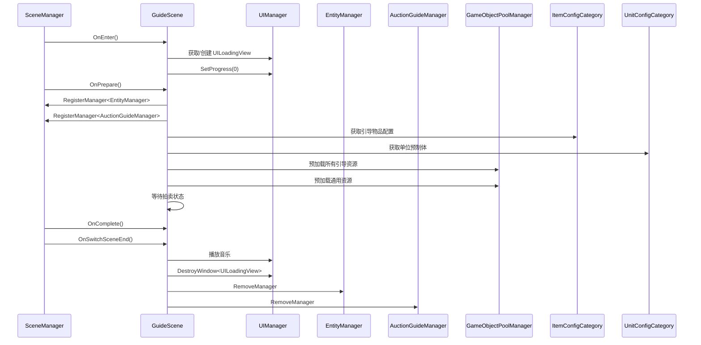
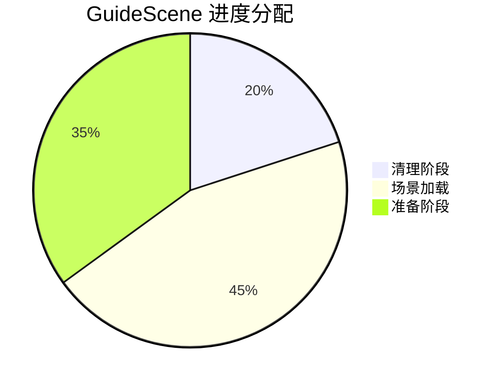
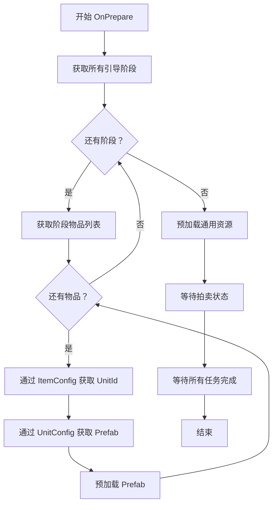

# GuideScene.cs 注解文档

## 文件基本信息

| 属性 | 值 |
|------|-----|
| **文件名** | GuideScene.cs |
| **路径** | Assets/Scripts/Code/Game/Scene/Map/GuideScene.cs |
| **所属模块** | 游戏层 → Code/Game/Scene/Map |
| **文件职责** | 引导场景实现，管理新手引导场景的加载、引导阶段资源预加载和拍卖系统初始化 |

---

## 类/结构体说明

### GuideScene

| 属性 | 说明 |
|------|------|
| **职责** | 实现新手引导场景的完整生命周期管理，包括引导阶段资源预加载、拍卖系统初始化和场景切换 |
| **泛型参数** | 无 |
| **继承关系** | 继承 `SceneManagerProvider`，实现 `IScene` 接口 |
| **实现的接口** | `IScene` |

**设计模式**: 模板方法模式 + 异步加载

```csharp
// 使用方式
// 通过 SceneManager 切换到引导场景
await SceneManager.Instance.SwitchScene<GuideScene>();
```

---

## 字段与属性（按重要程度排序）

| 名称 | 类型 | 访问级别 | 说明 |
|------|------|----------|------|
| `ConfigId` | `int` | `public const` | 引导场景固定配置 ID（-2） |
| `Config` | `LevelConfig` | `public` | 引导场景配置数据 |
| `Collector` | `ReferenceCollector` | `public` | 引用收集器，用于获取场景中的对象引用 |
| `Volume` | `UnityEngine.Rendering.Volume` | `public` | 后处理体积组件 |
| `win` | `UILoadingView` | `private` | 加载进度 UI 窗口引用 |
| `dontDestroyWindow` | `string[]` | `private` | 场景切换时保留的 UI 窗口类型名称列表 |

---

## 方法说明（按重要程度排序）

### GetName()

**签名**:
```csharp
public override string GetName()
```

**职责**: 获取场景名称（从配置中读取）

**返回值**: `Config.Name`

---

### GetScenePath()

**签名**:
```csharp
public string GetScenePath()
```

**职责**: 获取场景资源路径（从配置中读取）

**返回值**: `Config.Perfab`

---

### GetProgressPercent()

**签名**:
```csharp
public void GetProgressPercent(out float cleanup, out float loadScene, out float prepare)
```

**职责**: 获取场景加载各阶段的进度权重分配

**核心逻辑**:
```
cleanup = 0.2f   // 清理阶段占 20%
loadScene = 0.45f // 场景加载占 45%
prepare = 0.35f   // 准备阶段占 35%
```

**调用者**: `SceneManager.InnerSwitchScene()`

---

### GetDontDestroyWindow()

**签名**:
```csharp
public string[] GetDontDestroyWindow()
```

**职责**: 获取场景切换时不需要销毁的 UI 窗口类型列表

**核心逻辑**:
```
返回保留窗口列表：
- UILoadingView
- UIGuidanceView
```

**调用者**: `SceneManager`（场景切换时）

---

### GetScenesChangeIgnoreClean()

**签名**:
```csharp
public List<string> GetScenesChangeIgnoreClean()
```

**职责**: 获取场景切换时不需要清理的资源路径列表

**核心逻辑**:
```
返回保留资源路径：
- UILoadingView.PrefabPath
- UIGuidanceView.PrefabPath
```

**调用者**: `SceneManager`（场景切换资源清理时）

---

### OnEnter()

**签名**:
```csharp
public async ETTask OnEnter()
```

**职责**: 场景进入时的初始化，显示加载界面

**核心逻辑**:
```
1. 尝试获取 UILoadingView
2. 如果不存在则创建 UILoadingView
3. 设置加载进度为 0
```

**调用者**: `SceneManager.InnerSwitchScene()`

**被调用者**: `UIManager.Instance.OpenWindow<UILoadingView>()`

---

### OnLeave()

**签名**:
```csharp
public async ETTask OnLeave()
```

**职责**: 场景离开时的清理工作

**核心逻辑**:
```
1. 移除 AuctionGuideManager 管理器
2. 移除 EntityManager 管理器
```

**调用者**: `SceneManager.InnerSwitchScene()`

---

### OnPrepare()

**签名**:
```csharp
public async ETTask OnPrepare(float progressStart, float progressEnd)
```

**职责**: 场景预加载阶段，加载引导阶段所需的所有资源

**核心逻辑**:
```
1. 注册 EntityManager
2. 获取主摄像机的 ReferenceCollector
3. 获取 Volume 组件并禁用 ActionLineVolume
4. 注册 AuctionGuideManager（传入 GuideScene 引用）
5. 获取所有引导阶段配置（GuidanceStageConfigCategory）
6. 遍历所有引导阶段和物品：
   - 通过 ItemConfig 获取 UnitId
   - 通过 UnitConfig 获取预制体路径
   - 预加载单位预制体
7. 预加载以下通用资源：
   - 烟雾特效 (GameConst.SmokePrefab)
   - UIGuideGameView（引导游戏界面）
   - UIEmojiItem（表情道具）
   - UIBubbleItem（气泡道具）
   - UIButtonView（按钮视图）
   - UIItemsView（物品视图）
   - PlayTypeMat 材质
   - TaskMat 材质
8. 等待拍卖状态变为 Prepare 或 EnterAnim
9. 等待所有加载任务完成
```

**调用者**: `SceneManager.InnerSwitchScene()`

**被调用者**: `GameObjectPoolManager.GetInstance().PreLoadGameObjectAsync()`, `MaterialManager.Instance.PreLoadMaterial()`, `ETTaskHelper.WaitAll()`

---

### OnComplete()

**签名**:
```csharp
public async ETTask OnComplete()
```

**职责**: 场景加载完成回调（当前为空实现）

**调用者**: `SceneManager.InnerSwitchScene()`

---

### SetProgress()

**签名**:
```csharp
public async ETTask SetProgress(float value)
```

**职责**: 设置加载进度显示

**核心逻辑**:
```
1. 如果存在加载窗口，更新进度值
```

**调用者**: `SceneManager.InnerSwitchScene()`

---

### OnSwitchSceneEnd()

**签名**:
```csharp
public virtual async ETTask OnSwitchSceneEnd()
```

**职责**: 场景切换结束后的收尾工作

**核心逻辑**:
```
1. 播放游戏背景音乐
2. 销毁 UILoadingView 加载窗口
3. 记录日志
```

**调用者**: `SceneManager.InnerSwitchScene()`

**被调用者**: `SoundManager.Instance.PlayMusic()`, `UIManager.Instance.DestroyWindow<UILoadingView>()`

---

## Mermaid 流程图

### 引导场景生命周期



### 场景切换进度分配



### 引导资源预加载流程



---

## 使用示例

### 切换到引导场景

```csharp
// 通过 SceneManager 切换
await SceneManager.Instance.SwitchScene<GuideScene>();

// 或通过场景名称切换
await SceneManager.Instance.SwitchMapScene("引导");
```

### 获取引导场景配置

```csharp
// 在 GuideScene 中获取配置
var guideScene = SceneManager.Instance.CurrentScene as GuideScene;
if (guideScene != null)
{
    Debug.Log($"引导场景 ID: {GuideScene.ConfigId}"); // -2
    Debug.Log($"场景名称：{guideScene.Config.Name}");
}
```

---

## 相关文档链接

- [SceneManager.cs.md](../../Module/Scene/SceneManager.cs.md) - 场景管理器核心
- [IScene.cs.md](../../Module/Scene/IScene.cs.md) - 场景接口定义
- [UIManager.cs.md](../../Module/UI/UIManager.cs.md) - UI 管理系统
- [AuctionGuideManager.cs.md](../../Game/System/Auction/AuctionGuideManager.cs.md) - 引导拍卖管理器
- [GuidanceStageConfig.cs.md](../../Module/Config/GuidanceStageConfig.cs.md) - 引导阶段配置

---

*文档生成时间：2026-03-02*
