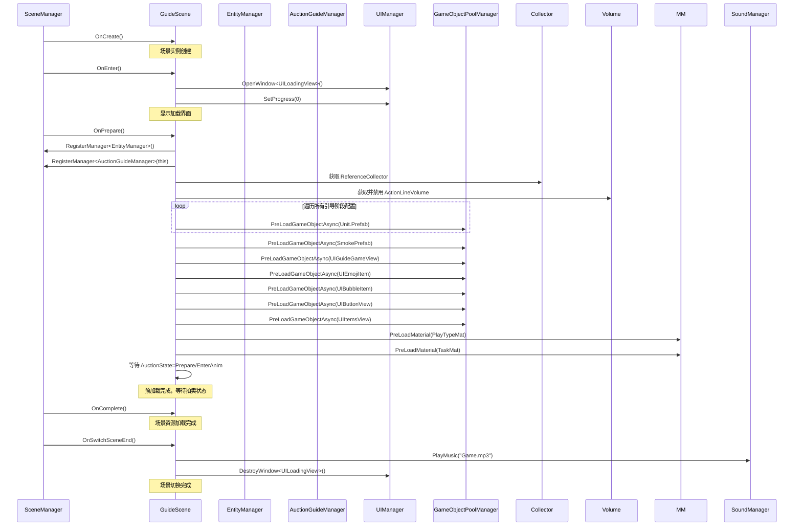

# GuideScene.cs 注解文档

## 文件基本信息

| 属性 | 值 |
|------|-----|
| **文件名** | GuideScene.cs |
| **路径** | Assets/Scripts/Code/Game/Scene/Map/GuideScene.cs |
| **所属模块** | 游戏逻辑层 → 场景系统 → 引导场景 |
| **文件职责** | 新手引导场景实现，处理引导关卡的资源预加载和拍卖引导系统初始化 |

---

## 类/结构体说明

### GuideScene

| 属性 | 说明 |
|------|------|
| **职责** | 实现新手引导场景的完整生命周期，包括引导关卡配置、资源预加载、引导系统初始化 |
| **泛型参数** | 无 |
| **继承关系** | 继承 `SceneManagerProvider`，实现 `IScene` 接口 |
| **实现的接口** | `IScene` |

**设计模式**: 场景模式 + 单例模式

```csharp
// 切换到引导场景
await SceneManager.Instance.SwitchScene<GuideScene>();
```

---

## 常量定义

### ConfigId

```csharp
public const int ConfigId = -2;
```

**说明**: 引导场景使用固定的配置 ID `-2`，用于从 `LevelConfigCategory` 获取引导关卡配置。

---

## 字段与属性（按重要程度排序）

| 名称 | 类型 | 访问级别 | 说明 |
|------|------|----------|------|
| `ConfigId` | `const int` | `public` | 引导场景固定配置 ID（-2） |
| `Config` | `LevelConfig` | `public` | 引导关卡配置数据 |
| `Collector` | `ReferenceCollector` | `public` | 场景引用收集器 |
| `Volume` | `UnityEngine.Rendering.Volume` | `public` | 后处理体积组件 |
| `win` | `UILoadingView` | `private` | 加载界面 UI |
| `dontDestroyWindow` | `string[]` | `private` | 场景切换时保留的 UI 窗口列表 |

---

## IScene 接口实现

### 生命周期方法

| 方法 | 调用时机 | 职责 |
|------|----------|------|
| `OnCreate()` | 场景实例创建时 | 初始化（空实现） |
| `OnEnter()` | 进入场景时 | 打开加载界面 |
| `OnPrepare()` | 资源预加载阶段 | 注册 Manager，预加载引导单位资源 |
| `OnComplete()` | 场景资源加载完成 | 空实现 |
| `OnLeave()` | 离开场景时 | 移除 AuctionGuideManager 和 EntityManager |
| `OnSwitchSceneEnd()` | 场景切换结束时 | 播放音乐，清理 UI |

### 资源配置方法

| 方法 | 返回值 | 说明 |
|------|--------|------|
| `GetScenePath()` | `Config.Perfab` | 从配置获取场景路径 |
| `GetName()` | `Config.Name` | 从配置获取场景名称 |
| `GetDontDestroyWindow()` | `string[]` | 保留的 UI 窗口（UILoadingView, UIGuidanceView） |
| `GetScenesChangeIgnoreClean()` | `List<string>` | 保留的 Prefab 路径 |
| `GetProgressPercent()` | `cleanup=0.2, loadScene=0.45, prepare=0.35` | 进度分配比例 |

---

## 核心流程

### 引导场景加载流程


```mermaid
sequenceDiagram
    participant SM as SceneManager
    participant GS as GuideScene
    participant EM as EntityManager
    participant AGM as AuctionGuideManager
    participant UM as UIManager
    participant GPM as GameObjectPoolManager

    SM->>GS: OnCreate()
    Note over GS: 场景实例创建
    
    SM->>GS: OnEnter()
    GS->>UM: OpenWindow<UILoadingView>()
    GS->>UM: SetProgress(0)
    Note over GS: 显示加载界面
    
    SM->>GS: OnPrepare()
    GS->>SM: RegisterManager<EntityManager>()
    GS->>SM: RegisterManager<AuctionGuideManager>(this)
    GS->>Collector: 获取 ReferenceCollector
    GS->>Volume: 获取并禁用 ActionLineVolume
    
    loop 遍历所有引导阶段配置
        GS->>GPM: PreLoadGameObjectAsync(Unit.Prefab)
    end
    
    GS->>GPM: PreLoadGameObjectAsync(SmokePrefab)
    GS->>GPM: PreLoadGameObjectAsync(UIGuideGameView)
    GS->>GPM: PreLoadGameObjectAsync(UIEmojiItem)
    GS->>GPM: PreLoadGameObjectAsync(UIBubbleItem)
    GS->>GPM: PreLoadGameObjectAsync(UIButtonView)
    GS->>GPM: PreLoadGameObjectAsync(UIItemsView)
    GS->>MM: PreLoadMaterial(PlayTypeMat)
    GS->>MM: PreLoadMaterial(TaskMat)
    
    GS->>GS: 等待 AuctionState=Prepare/EnterAnim
    Note over GS: 预加载完成，等待拍卖状态
    
    SM->>GS: OnComplete()
    Note over GS: 场景资源加载完成
    
    SM->>GS: OnSwitchSceneEnd()
    GS->>SoundManager: PlayMusic("Game.mp3")
    GS->>UM: DestroyWindow<UILoadingView>()
    Note over GS: 场景切换完成
```

---

## 方法说明

### OnEnter()

**职责**: 进入场景时显示加载界面

**核心逻辑**:
```
1. 获取或创建 UILoadingView 实例
2. 设置进度为 0
```

**代码示例**:
```csharp
win = UIManager.Instance.GetView<UILoadingView>(1);
if (win == null)
{
    win = await UIManager.Instance.OpenWindow<UILoadingView>(
        UILoadingView.PrefabPath, UILayerNames.TipLayer);
}
win.SetProgress(0);
```

---

### OnPrepare()

**职责**: 预加载阶段初始化 Manager 和引导资源

**核心逻辑**:
```
1. 注册 EntityManager
2. 获取 ReferenceCollector 和 Volume 组件
3. 禁用 ActionLineVolume
4. 注册 AuctionGuideManager（传入当前 GuideScene）
5. 遍历所有引导阶段配置，预加载单位 Prefab
6. 预加载通用游戏资源
7. 等待拍卖状态进入 Prepare 或 EnterAnim
```

**引导单位预加载**:
```csharp
var gStep = GuidanceStageConfigCategory.Instance.GetAllList();
for (int i = 0; i < gStep.Count; i++)
{
    for (int j = 0; j < gStep[i].Items.Length; j++)
    {
        var unitId = ItemConfigCategory.Instance.Get(gStep[i].Items[i]).UnitId;
        var unit = UnitConfigCategory.Instance.Get(unitId);
        tasks.Add(GameObjectPoolManager.GetInstance().PreLoadGameObjectAsync(unit.Perfab, 1));
    }
}
```

**说明**: 
- 遍历所有引导阶段（GuidanceStageConfigCategory）
- 根据物品配置获取单位 ID
- 根据单位配置预加载 Prefab

---

### OnLeave()

**职责**: 离开场景时清理 Manager

**核心逻辑**:
```
1. 移除 AuctionGuideManager
2. 移除 EntityManager
```

---

### OnSwitchSceneEnd()

**职责**: 场景切换结束时播放音乐和清理 UI

**核心逻辑**:
```
1. 播放背景音乐 "Audio/Music/Game.mp3"
2. 销毁 UILoadingView
3. 记录日志
```

---

## 保留资源列表

### 不销毁的 UI 窗口

```csharp
private string[] dontDestroyWindow =
{
    TypeInfo<UILoadingView>.TypeName,      // 加载界面 UI
    TypeInfo<UIGuidanceView>.TypeName,     // 引导 UI
};
```

### 资源清理时保留的 Prefab

```csharp
public List<string> GetScenesChangeIgnoreClean()
{
    var res = new List<string>();
    res.Add(UILoadingView.PrefabPath); 
    res.Add(UIGuidanceView.PrefabPath); 
    return res;
}
```

---

## 进度分配

### 场景加载进度权重

| 阶段 | 权重 | 说明 |
|------|------|------|
| `cleanup` | 20% | 清理旧场景资源 |
| `loadScene` | 45% | 加载新场景资源 |
| `prepare` | 35% | 预加载资源（引导单位较多） |

---

## 后处理配置

### Volume 组件处理

```csharp
Collector = CameraManager.Instance.MainCamera()?.GetComponent<ReferenceCollector>();
Volume = Collector?.Get<UnityEngine.Rendering.Volume>("Volume");
if (Volume == null) Volume = GameObject.FindObjectOfType<UnityEngine.Rendering.Volume>();
if (Volume != null)
{
    if(Volume.sharedProfile.TryGet<ActionLineVolume>(out var co))
    {
        co.active = false;  // 禁用 ActionLineVolume
    }
}
```

---

## 使用示例

### 示例 1: 切换到引导场景

```csharp
// 切换到引导场景
await SceneManager.Instance.SwitchScene<GuideScene>();
```

### 示例 2: 检查是否在引导场景

```csharp
if (SceneManager.Instance.IsInTargetScene<GuideScene>())
{
    // 引导场景特定逻辑
    var guideScene = SceneManager.Instance.GetCurrentScene<GuideScene>();
    Log.Info($"引导关卡：{guideScene.Config.Name}");
}
```

### 示例 3: 访问引导配置

```csharp
// 在 GuideScene 内部访问配置
var configName = Config.Name;
var scenePath = Config.Perfab;
```

---

## 与其他模块的交互

```mermaid
graph TD
    subgraph GuideScene["GuideScene"]
        GS[GuideScene]
    end
    
    subgraph Managers["管理器"]
        EM[EntityManager]
        AGM[AuctionGuideManager]
        UM[UIManager]
        GPM[GameObjectPoolManager]
    end
    
    subgraph UI["UI 组件"]
        UILoad[UILoadingView]
        UIGuide[UIGuidanceView]
        UIGuideGame[UIGuideGameView]
    end
    
    subgraph Config["配置"]
        GSC[GuidanceStageConfigCategory]
        IC[ItemConfigCategory]
        UC[UnitConfigCategory]
    end
    
    GS --> EM
    GS --> AGM
    GS --> UM
    GS --> GPM
    GS --> GSC
    
    GSC --> IC
    IC --> UC
    UC --> GPM
    
    UM --> UILoad
    UM --> UIGuide
    GPM --> UIGuideGame
    
    note right of GS "GuideScene 预加载所有引导单位<br/>确保引导流程流畅"
    
    style GuideScene fill:#e1f5ff
    style Managers fill:#fff4e1
    style UI fill:#e8f5e9
    style Config fill:#fce4ec
```

---

## 学习重点与陷阱

### ✅ 学习重点

1. **引导单位预加载**: 遍历所有引导阶段配置预加载单位
2. **配置链**: GuidanceStageConfig → ItemConfig → UnitConfig → Prefab
3. **引导系统初始化**: AuctionGuideManager 在 OnPrepare 中注册

### ⚠️ 陷阱与注意事项

| 问题 | 说明 | 解决方案 |
|------|------|----------|
| **单位未预加载** | 引导过程中卡顿 | 确保遍历所有引导阶段预加载 |
| **配置缺失** | 物品配置无 UnitId | 检查 ItemConfig 配置表 |
| **Manager 泄漏** | 忘记移除 Manager | 在 OnLeave 中调用 RemoveManager |

---

## 相关文档

- [IScene.cs.md](./IScene.cs.md) - 场景接口定义
- [SceneManager.cs.md](./SceneManager.cs.md) - 场景管理器
- [AuctionGuideManager.cs.md](../../System/Auction/AuctionGuideManager.cs.md) - 拍卖引导管理器
- [GuidanceStageConfig.cs.md](../../../Module/Config/GuidanceStageConfig.cs.md) - 引导阶段配置
- [UILoadingView.cs.md](../../UI/UILoading/UILoadingView.cs.md) - 加载界面 UI

---

*文档生成时间：2026-03-02 | OpenClaw AI 助手*
