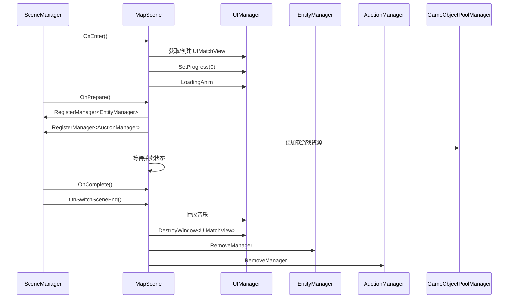
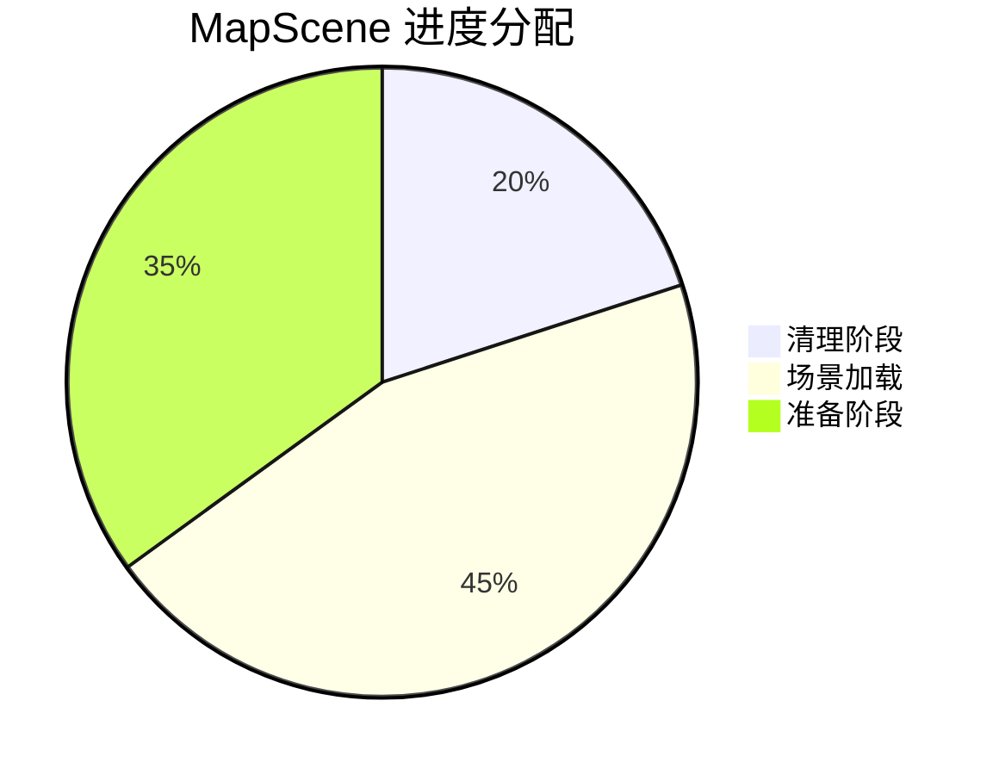

# MapScene.cs 注解文档

## 文件基本信息

| 属性 | 值 |
|------|-----|
| **文件名** | MapScene.cs |
| **路径** | Assets/Scripts/Code/Game/Scene/Map/MapScene.cs |
| **所属模块** | 游戏层 → Code/Game/Scene/Map |
| **文件职责** | 地图场景基类，管理通用地图场景的加载、切换、拍卖系统初始化和资源预加载 |

---

## 类/结构体说明

### MapScene

| 属性 | 说明 |
|------|------|
| **职责** | 实现地图场景的完整生命周期管理，包括场景进入/离开、资源预加载、进度控制、拍卖系统初始化 |
| **泛型参数** | 无 |
| **继承关系** | 继承 `SceneManagerProvider`，实现 `IScene` 接口 |
| **实现的接口** | `IScene` |

**设计模式**: 模板方法模式 + 异步加载

```csharp
// 使用方式
// MapScene 通常通过配置 ID 切换
await SceneManager.Instance.SwitchMapScene("地图名称");
```

---

## 字段与属性（按重要程度排序）

| 名称 | 类型 | 访问级别 | 说明 |
|------|------|----------|------|
| `ConfigId` | `int` | `public` | 地图配置 ID，用于查找 LevelConfig |
| `Config` | `LevelConfig` | `public` | 地图配置数据（通过 ConfigId 获取） |
| `Collector` | `ReferenceCollector` | `public` | 引用收集器，用于获取场景中的对象引用 |
| `Volume` | `UnityEngine.Rendering.Volume` | `public` | 后处理体积组件 |
| `win` | `UIMatchView` | `private` | 加载进度 UI 窗口引用 |

---

## 方法说明（按重要程度排序）

### GetName()

**签名**:
```csharp
public override string GetName()
```

**职责**: 获取场景名称（从配置中读取）

**返回值**: `Config.Name`

---

### GetScenePath()

**签名**:
```csharp
public string GetScenePath()
```

**职责**: 获取场景资源路径（从配置中读取）

**返回值**: `Config.Perfab`

---

### GetProgressPercent()

**签名**:
```csharp
public void GetProgressPercent(out float cleanup, out float loadScene, out float prepare)
```

**职责**: 获取场景加载各阶段的进度权重分配

**核心逻辑**:
```
cleanup = 0.2f   // 清理阶段占 20%
loadScene = 0.45f // 场景加载占 45%
prepare = 0.35f   // 准备阶段占 35%
```

**调用者**: `SceneManager.InnerSwitchScene()`

---

### GetDontDestroyWindow()

**签名**:
```csharp
public string[] GetDontDestroyWindow()
```

**职责**: 获取场景切换时不需要销毁的 UI 窗口类型列表

**核心逻辑**:
```
返回保留窗口列表：
- UIEnterView
- UIGuidanceView
- UIMatchView
```

**调用者**: `SceneManager`（场景切换时）

---

### GetScenesChangeIgnoreClean()

**签名**:
```csharp
public List<string> GetScenesChangeIgnoreClean()
```

**职责**: 获取场景切换时不需要清理的资源路径列表

**核心逻辑**:
```
返回保留资源路径：
- UIEnterView.PrefabPath
- UIGuidanceView.PrefabPath
- UIMatchView.PrefabPath
```

**调用者**: `SceneManager`（场景切换资源清理时）

---

### OnEnter()

**签名**:
```csharp
public async ETTask OnEnter()
```

**职责**: 场景进入时的初始化，显示加载界面

**核心逻辑**:
```
1. 尝试获取 UIMatchView
2. 如果不存在则创建 UIMatchView（传入 ConfigId）
3. 设置加载进度为 0
4. 执行加载动画（true → false）
```

**调用者**: `SceneManager.InnerSwitchScene()`

**被调用者**: `UIManager.Instance.OpenWindow<UIMatchView>()`

---

### OnLeave()

**签名**:
```csharp
public async ETTask OnLeave()
```

**职责**: 场景离开时的清理工作

**核心逻辑**:
```
1. 移除 AuctionManager 管理器
2. 移除 EntityManager 管理器
```

**调用者**: `SceneManager.InnerSwitchScene()`

---

### OnPrepare()

**签名**:
```csharp
public async ETTask OnPrepare(float progressStart, float progressEnd)
```

**职责**: 场景预加载阶段，加载拍卖系统和游戏资源

**核心逻辑**:
```
1. 注册 EntityManager
2. 获取主摄像机的 ReferenceCollector
3. 获取 Volume 组件并禁用 ActionLineVolume
4. 注册 AuctionManager（传入 MapScene 引用）
5. 预加载以下资源：
   - 烟雾特效 (GameConst.SmokePrefab)
   - UIGameView（游戏主界面）
   - UIEmojiItem（表情道具）
   - UIBubbleItem（气泡道具）
   - UIButtonView（按钮视图）
   - UIItemsView（物品视图）
   - PlayTypeMat 材质
   - TaskMat 材质
6. 设置进度为 progressStart
7. 等待所有加载任务完成
8. 设置进度为 1
9. 等待拍卖状态变为 Prepare 或 EnterAnim
```

**调用者**: `SceneManager.InnerSwitchScene()`

**被调用者**: `GameObjectPoolManager.GetInstance().PreLoadGameObjectAsync()`, `MaterialManager.Instance.PreLoadMaterial()`, `ETTaskHelper.WaitAll()`

---

### OnComplete()

**签名**:
```csharp
public async ETTask OnComplete()
```

**职责**: 场景加载完成回调（当前为空实现）

**调用者**: `SceneManager.InnerSwitchScene()`

---

### SetProgress()

**签名**:
```csharp
public async ETTask SetProgress(float value)
```

**职责**: 设置加载进度显示

**核心逻辑**:
```
1. 更新 UIMatchView 的进度值
```

**调用者**: `SceneManager.InnerSwitchScene()`

---

### OnSwitchSceneEnd()

**签名**:
```csharp
public virtual async ETTask OnSwitchSceneEnd()
```

**职责**: 场景切换结束后的收尾工作，打开游戏主界面

**核心逻辑**:
```
1. 播放游戏背景音乐
2. 如果设备性能低于 Mid 级别，禁用环境对象（性能优化）
3. 销毁 UIMatchView 加载窗口
4. 清空引用
5. 记录日志
```

**调用者**: `SceneManager.InnerSwitchScene()`

**被调用者**: `SoundManager.Instance.PlayMusic()`, `UIManager.Instance.DestroyWindow<UIMatchView>()`

---

## Mermaid 流程图

### 地图场景生命周期



### 场景切换进度分配



---

## 使用示例

### 切换到地图场景

```csharp
// 通过场景名称切换（推荐）
await SceneManager.Instance.SwitchMapScene("家园");

// 或通过配置 ID 切换
var config = LevelConfigCategory.Instance.GetByName("家园");
await SceneManager.Instance.SwitchScene<MapScene>();
```

### 获取地图配置

```csharp
// 在 MapScene 中获取配置
var mapScene = SceneManager.Instance.CurrentScene as MapScene;
if (mapScene != null)
{
    Debug.Log($"地图名称：{mapScene.Config.Name}");
    Debug.Log($"地图路径：{mapScene.Config.Perfab}");
    Debug.Log($"配置 ID: {mapScene.ConfigId}");
}
```

---

## 相关文档链接

- [SceneManager.cs.md](../../Module/Scene/SceneManager.cs.md) - 场景管理器核心
- [IScene.cs.md](../../Module/Scene/IScene.cs.md) - 场景接口定义
- [UIManager.cs.md](../../Module/UI/UIManager.cs.md) - UI 管理系统
- [AuctionManager.cs.md](../../Game/System/Auction/AuctionManager.cs.md) - 拍卖管理器
- [LevelConfig.cs.md](../../Module/Config/LevelConfig.cs.md) - 关卡配置

---

*文档生成时间：2026-03-02*
