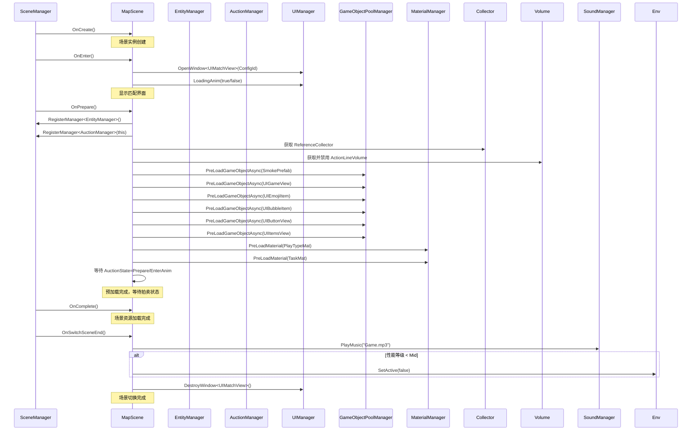

# MapScene.cs 注解文档

## 文件基本信息

| 属性 | 值 |
|------|-----|
| **文件名** | MapScene.cs |
| **路径** | Assets/Scripts/Code/Game/Scene/Map/MapScene.cs |
| **所属模块** | 游戏逻辑层 → 场景系统 → 地图场景 |
| **文件职责** | 通用地图场景基类，处理拍卖对局场景的加载、资源预加载、环境管理 |

---

## 类/结构体说明

### MapScene

| 属性 | 说明 |
|------|------|
| **职责** | 实现地图场景的完整生命周期，包括拍卖系统初始化、资源预加载、环境配置 |
| **泛型参数** | 无 |
| **继承关系** | 继承 `SceneManagerProvider`，实现 `IScene` 接口 |
| **实现的接口** | `IScene` |

**设计模式**: 场景模式 + 模板方法模式（可被子类重写）

```csharp
// 使用方式
await SceneManager.Instance.SwitchMapScene("关卡 1-1");
```

---

## 字段与属性（按重要程度排序）

| 名称 | 类型 | 访问级别 | 说明 |
|------|------|----------|------|
| `ConfigId` | `int` | `public` | 关卡配置 ID |
| `Config` | `LevelConfig` | `public` | 关卡配置数据（通过 ConfigId 获取） |
| `Collector` | `ReferenceCollector` | `public` | 场景引用收集器（获取场景中的对象） |
| `Volume` | `UnityEngine.Rendering.Volume` | `public` | 后处理体积组件 |
| `win` | `UIMatchView` | `private` | 匹配/加载界面 UI |
| `dontDestroyWindow` | `string[]` | `private` | 场景切换时保留的 UI 窗口列表 |

---

## IScene 接口实现

### 生命周期方法

| 方法 | 调用时机 | 职责 |
|------|----------|------|
| `OnCreate()` | 场景实例创建时 | 初始化（空实现） |
| `OnEnter()` | 进入场景时 | 打开匹配界面，显示加载动画 |
| `OnPrepare()` | 资源预加载阶段 | 注册 Manager，预加载游戏资源 |
| `OnComplete()` | 场景资源加载完成 | 空实现 |
| `OnLeave()` | 离开场景时 | 移除 AuctionManager 和 EntityManager |
| `OnSwitchSceneEnd()` | 场景切换结束时 | 播放音乐，隐藏环境，清理 UI |

### 资源配置方法

| 方法 | 返回值 | 说明 |
|------|--------|------|
| `GetScenePath()` | `Config.Perfab` | 从配置获取场景路径 |
| `GetName()` | `Config.Name` | 从配置获取场景名称 |
| `GetDontDestroyWindow()` | `string[]` | 保留的 UI 窗口（UIEnterView, UIGuidanceView, UIMatchView） |
| `GetScenesChangeIgnoreClean()` | `List<string>` | 保留的 Prefab 路径 |
| `GetProgressPercent()` | `cleanup=0.2, loadScene=0.45, prepare=0.35` | 进度分配比例 |

---

## 核心流程

### 场景加载完整流程


```mermaid
sequenceDiagram
    participant SM as SceneManager
    participant MS as MapScene
    participant EM as EntityManager
    participant AM as AuctionManager
    participant UM as UIManager
    participant GPM as GameObjectPoolManager
    participant MM as MaterialManager

    SM->>MS: OnCreate()
    Note over MS: 场景实例创建
    
    SM->>MS: OnEnter()
    MS->>UM: OpenWindow<UIMatchView>(ConfigId)
    MS->>UM: LoadingAnim(true/false)
    Note over MS: 显示匹配界面
    
    SM->>MS: OnPrepare()
    MS->>SM: RegisterManager<EntityManager>()
    MS->>SM: RegisterManager<AuctionManager>(this)
    MS->>Collector: 获取 ReferenceCollector
    MS->>Volume: 获取并禁用 ActionLineVolume
    
    MS->>GPM: PreLoadGameObjectAsync(SmokePrefab)
    MS->>GPM: PreLoadGameObjectAsync(UIGameView)
    MS->>GPM: PreLoadGameObjectAsync(UIEmojiItem)
    MS->>GPM: PreLoadGameObjectAsync(UIBubbleItem)
    MS->>GPM: PreLoadGameObjectAsync(UIButtonView)
    MS->>GPM: PreLoadGameObjectAsync(UIItemsView)
    MS->>MM: PreLoadMaterial(PlayTypeMat)
    MS->>MM: PreLoadMaterial(TaskMat)
    
    MS->>MS: 等待 AuctionState=Prepare/EnterAnim
    Note over MS: 预加载完成，等待拍卖状态
    
    SM->>MS: OnComplete()
    Note over MS: 场景资源加载完成
    
    SM->>MS: OnSwitchSceneEnd()
    MS->>SoundManager: PlayMusic("Game.mp3")
    alt 性能等级 < Mid
        MS->>Env: SetActive(false)
    end
    MS->>UM: DestroyWindow<UIMatchView>()
    Note over MS: 场景切换完成
```

---

## 方法说明

### OnEnter()

**职责**: 进入场景时显示匹配界面

**核心逻辑**:
```
1. 获取或创建 UIMatchView 实例
2. 设置进度为 0
3. 播放加载动画（LoadingAnim）
```

**代码示例**:
```csharp
win = UIManager.Instance.GetView<UIMatchView>(1);
if (win == null)
{
    win = await UIManager.Instance.OpenWindow<UIMatchView, int>(
        UIMatchView.PrefabPath, ConfigId, UILayerNames.TipLayer);
}
win.SetProgress(0);
await win.LoadingAnim(true);
await win.LoadingAnim(false);
```

---

### OnPrepare()

**职责**: 预加载阶段初始化 Manager 和资源

**核心逻辑**:
```
1. 注册 EntityManager
2. 获取 ReferenceCollector 和 Volume 组件
3. 禁用 ActionLineVolume（性能优化）
4. 注册 AuctionManager（传入当前 MapScene）
5. 预加载游戏资源（Prefab 和 Material）
6. 等待拍卖状态进入 Prepare 或 EnterAnim
```

**预加载资源列表**:
```csharp
tasks.Add(GameObjectPoolManager.GetInstance().PreLoadGameObjectAsync(GameConst.SmokePrefab, 1));
tasks.Add(GameObjectPoolManager.GetInstance().PreLoadGameObjectAsync(UIGameView.PrefabPath, 1));
tasks.Add(GameObjectPoolManager.GetInstance().PreLoadGameObjectAsync(UIEmojiItem.PrefabPath, 1));
tasks.Add(GameObjectPoolManager.GetInstance().PreLoadGameObjectAsync(UIBubbleItem.PrefabPath, 1));
tasks.Add(GameObjectPoolManager.GetInstance().PreLoadGameObjectAsync(UIButtonView.PrefabPath, 1));
tasks.Add(GameObjectPoolManager.GetInstance().PreLoadGameObjectAsync(UIItemsView.PrefabPath, 1));
tasks.Add(MaterialManager.Instance.PreLoadMaterial(GameConst.PlayTypeMat));
tasks.Add(MaterialManager.Instance.PreLoadMaterial(GameConst.TaskMat));
```

**等待拍卖状态**:
```csharp
while (IAuctionManager.Instance.AState != AuctionState.Prepare 
       && IAuctionManager.Instance.AState != AuctionState.EnterAnim)
{
    await TimerManager.Instance.WaitFrameAsync();
}
```

---

### OnLeave()

**职责**: 离开场景时清理 Manager

**核心逻辑**:
```
1. 移除 AuctionManager
2. 移除 EntityManager
```

**注释代码**（环境系统）:
```csharp
// EnvironmentManager.Instance.SceneLight = null;
// EnvironmentManager.Instance.Remove(envId);
```

---

### OnSwitchSceneEnd()

**职责**: 场景切换结束时播放音乐和性能优化

**核心逻辑**:
```
1. 播放背景音乐 "Audio/Music/Game.mp3"
2. 检查性能等级，低端设备隐藏环境对象
3. 销毁 UIMatchView
4. 记录日志
```

**性能优化**:
```csharp
if (PerformanceManager.Instance.Level < PerformanceManager.DevicePerformanceLevel.Mid)
{
    Collector.Get<GameObject>("Env")?.SetActive(false);
}
```

---

## 保留资源列表

### 不销毁的 UI 窗口

```csharp
private string[] dontDestroyWindow =
{
    TypeInfo<UIEnterView>.TypeName,      // 入场动画 UI
    TypeInfo<UIGuidanceView>.TypeName,   // 引导 UI
    TypeInfo<UIMatchView>.TypeName,      // 匹配界面 UI
};
```

### 资源清理时保留的 Prefab

```csharp
public List<string> GetScenesChangeIgnoreClean()
{
    var res = new List<string>();
    res.Add(UIEnterView.PrefabPath);
    res.Add(UIGuidanceView.PrefabPath); 
    res.Add(UIMatchView.PrefabPath); 
    return res;
}
```

---

## 进度分配

### 场景加载进度权重

| 阶段 | 权重 | 说明 |
|------|------|------|
| `cleanup` | 20% | 清理旧场景资源 |
| `loadScene` | 45% | 加载新场景资源 |
| `prepare` | 35% | 预加载资源（比 CreateScene 更高） |

**说明**: MapScene 的 prepare 权重更高（35% vs 15%），因为需要预加载更多游戏资源。

---

## 后处理配置

### Volume 组件处理

```csharp
Collector = CameraManager.Instance.MainCamera()?.GetComponent<ReferenceCollector>();
Volume = Collector?.Get<UnityEngine.Rendering.Volume>("Volume");
if (Volume == null) Volume = GameObject.FindObjectOfType<UnityEngine.Rendering.Volume>();
if (Volume != null)
{
    if(Volume.sharedProfile.TryGet<ActionLineVolume>(out var co))
    {
        co.active = false;  // 禁用 ActionLineVolume 提升性能
    }
}
```

**说明**: 
- 通过 ReferenceCollector 获取场景中的 Volume 组件
- 禁用 ActionLineVolume（一种后处理效果）以优化性能

---

## 使用示例

### 示例 1: 切换到地图场景

```csharp
// 通过场景名称切换
await SceneManager.Instance.SwitchMapScene("关卡 1-1");
await SceneManager.Instance.SwitchMapScene("家园");
```

### 示例 2: 访问关卡配置

```csharp
// 在 MapScene 内部访问配置
var configName = Config.Name;
var scenePath = Config.Perfab;
// var dayNightConfig = Config.DayNight;  // 昼夜配置（已注释）
```

### 示例 3: 检查当前场景

```csharp
if (SceneManager.Instance.IsInTargetScene<MapScene>())
{
    var mapScene = SceneManager.Instance.GetCurrentScene<MapScene>();
    Log.Info($"当前关卡：{mapScene.Config.Name}");
}
```

---

## 与其他模块的交互

```mermaid
graph TD
    subgraph MapScene["MapScene"]
        MS[MapScene]
    end
    
    subgraph Managers["管理器"]
        EM[EntityManager]
        AM[AuctionManager]
        UM[UIManager]
        GPM[GameObjectPoolManager]
        MM[MaterialManager]
        PM[PerformanceManager]
    end
    
    subgraph UI["UI 组件"]
        UIMatch[UIMatchView]
        UIGame[UIGameView]
        UIEmoji[UIEmojiItem]
        UIBubble[UIBubbleItem]
    end
    
    subgraph Config["配置"]
        LC[LevelConfig]
    end
    
    MS --> EM
    MS --> AM
    MS --> UM
    MS --> GPM
    MS --> MM
    MS --> PM
    MS --> LC
    
    UM --> UIMatch
    GPM --> UIGame
    GPM --> UIEmoji
    GPM --> UIBubble
    
    note right of MS "MapScene 是拍卖对局的核心场景<br/>协调所有游戏系统"
    
    style MapScene fill:#e1f5ff
    style Managers fill:#fff4e1
    style UI fill:#e8f5e9
    style Config fill:#fce4ec
```

---

## 学习重点与陷阱

### ✅ 学习重点

1. **资源预加载**: 在 OnPrepare 中预加载所有游戏资源
2. **状态等待**: 使用 while 循环等待拍卖状态
3. **性能优化**: 根据设备性能等级隐藏环境对象
4. **后处理管理**: 禁用不必要的 Volume 效果

### ⚠️ 陷阱与注意事项

| 问题 | 说明 | 解决方案 |
|------|------|----------|
| **资源未预加载** | 游戏过程中卡顿 | 确保所有 Prefab 在 OnPrepare 中预加载 |
| **状态不同步** | 拍卖状态未就绪 | 使用 while 循环等待正确状态 |
| **性能问题** | 低端设备卡顿 | 检查 PerformanceManager.Level 隐藏环境 |
| **Manager 泄漏** | 忘记移除 Manager | 在 OnLeave 中调用 RemoveManager |

---

## 相关文档

- [IScene.cs.md](./IScene.cs.md) - 场景接口定义
- [SceneManager.cs.md](./SceneManager.cs.md) - 场景管理器
- [AuctionManager.cs.md](../../System/Auction/AuctionManager.cs.md) - 拍卖管理器
- [LevelConfig.cs.md](../../../Module/Config/LevelConfig.cs.md) - 关卡配置
- [UIMatchView.cs.md](../../UIGame/UILobby/UIMatchView.cs.md) - 匹配界面 UI
- [PerformanceManager.cs.md](../../../Mono/Module/Performance/PerformanceManager.cs.md) - 性能管理器

---

*文档生成时间：2026-03-02 | OpenClaw AI 助手*
