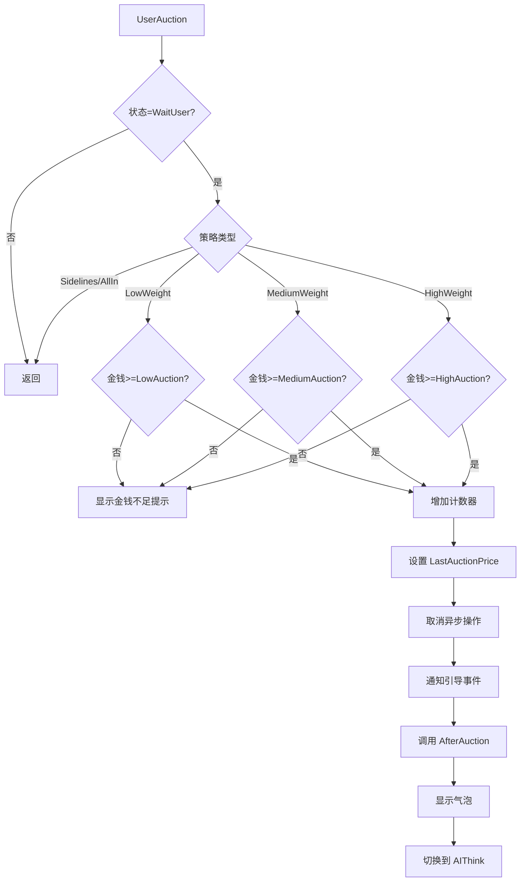
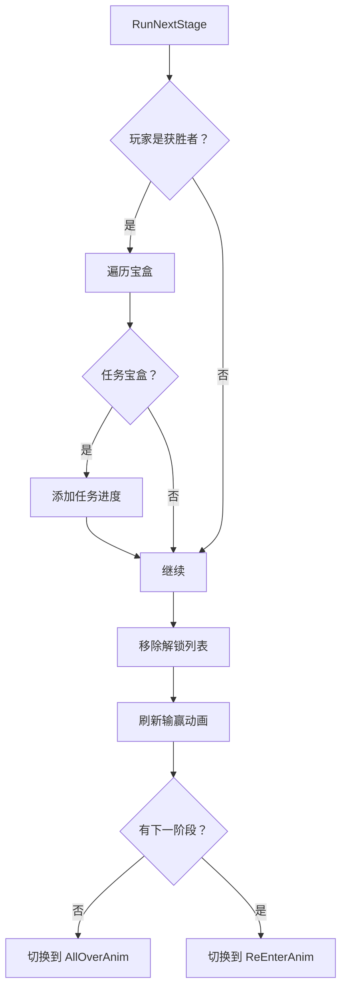
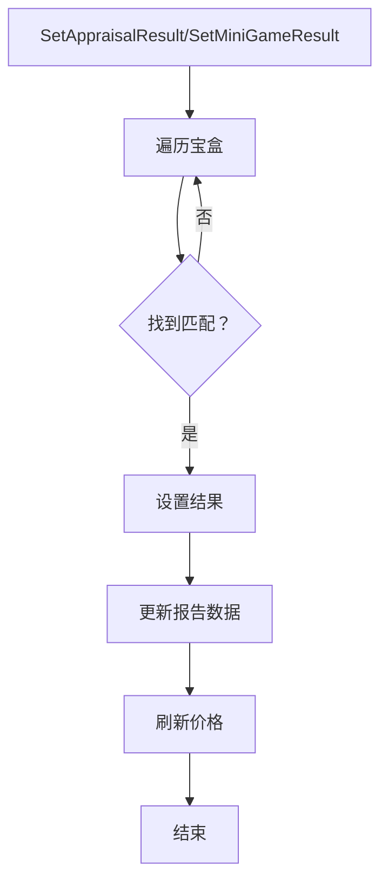

# AuctionGuideManager.API.cs 注解文档

## 文件基本信息

| 属性 | 值 |
|------|-----|
| **文件名** | AuctionGuideManager.API.cs |
| **路径** | Assets/Scripts/Code/Game/System/Auction/AuctionGuideManager.API.cs |
| **所属模块** | 游戏系统 → 拍卖系统 → 引导管理器 |
| **文件职责** | 拍卖引导系统的外部接口实现，提供玩家交互和系统调用入口 |

---

## 类/结构体说明

### AuctionGuideManager (Partial)

| 属性 | 说明 |
|------|------|
| **职责** | 拍卖引导系统的外部 API 接口，处理玩家操作和系统调用 |
| **泛型参数** | 无 |
| **继承关系** | `IAuctionManager` |
| **实现的接口** | `IAuctionManager` |

**设计模式**: 部分类 (Partial Class) + 接口实现

```csharp
// 外部接口实现
public partial class AuctionGuideManager : IAuctionManager
{
    public void ForceAllOver() { ... }
    public void UserAuction(AITactic type) { ... }
    public void RunNextStage() { ... }
    // ...
}
```

---

## 字段与属性（按重要程度排序）

| 名称 | 类型 | 访问级别 | 说明 |
|------|------|----------|------|
| `isDispose` | `bool` | `private` | 是否已销毁 |
| `AState` | `AuctionState` | `private` | 当前拍卖状态 |
| `Player` | `Player` | `private` | 玩家实体引用 |
| `LastAuctionPrice` | `BigNumber` | `private` | 最后竞拍价格 |
| `LastAuctionPlayerId` | `long` | `private` | 最后竞拍玩家 ID |
| `LowAuction` | `BigNumber` | `private` | 低权重出价金额 |
| `MediumAuction` | `BigNumber` | `private` | 中权重出价金额 |
| `HighAuction` | `BigNumber` | `private` | 高权重出价金额 |
| `playerLowAuctionCount` | `int` | `private` | 玩家低权重出价次数 |
| `playerMidAuctionCount` | `int` | `private` | 玩家中权重出价次数 |
| `playerHighAuctionCount` | `int` | `private` | 玩家高权重出价次数 |
| `cancellationToken` | `ETCancellationToken` | `private` | 异步操作取消令牌 |
| `Boxes` | `List<long>` | `private` | 宝盒实体 ID 列表 |
| `Bidders` | `List<long>` | `private` | 竞拍者实体 ID 列表 |
| `Level` | `int` | `private` | 当前关卡等级 |
| `Stage` | `int` | `private` | 当前阶段 |
| `Report` | `AuctionReport` | `private` | 拍卖报告数据 |
| `AllPrice` | `BigNumber` | `private` | 总估价 |
| `centerCharacter` | `Character` | `private` | 焦点角色 |
| `IsRaising` | `bool` | `private` | 是否正在抬价 |

---

## 方法说明（按重要程度排序）

### ForceAllOver()

**签名**:
```csharp
public void ForceAllOver()
```

**职责**: 强行退出拍卖，返回家园场景

**核心逻辑**:
```
1. 设置 isDispose = true
2. 切换到家园场景 SceneManager.Instance.SwitchScene<HomeScene>()
```

**调用者**: 玩家主动退出、异常处理

**被调用者**: 无

**使用示例**:
```csharp
// 玩家点击退出按钮时调用
IAuctionManager.Instance.ForceAllOver();
```

---

### UserAuction(AITactic type)

**签名**:
```csharp
public void UserAuction(AITactic type)
```

**职责**: 玩家出价接口

**参数**:
- `type`: 出价策略（低权重/中权重/高权重）

**核心逻辑**:
```
1. 检查当前状态是否为 WaitUser
2. 如果是 sidelines 或 AllIn 策略，返回（无效）
3. 根据策略检查玩家金钱是否足够：
   - LowWeight: 检查 LowAuction
   - MediumWeight: 检查 MediumAuction
   - HighWeight: 检查 HighAuction
4. 如果金钱不足，显示提示 UIToast
5. 增加对应出价计数器
6. 设置 LastAuctionPrice
7. 取消之前的异步操作
8. 通知引导系统 User_Auction 事件
9. 调用 AfterAuction() 处理后续逻辑
10. 显示玩家出价气泡 UIBubbleItem
11. 切换到 AIThink 状态
```

**调用者**: UIGuideGameView（玩家点击出价按钮）

**使用示例**:
```csharp
// 玩家选择低权重出价
IAuctionManager.Instance.UserAuction(AITactic.LowWeight);

// 玩家选择中权重出价
IAuctionManager.Instance.UserAuction(AITactic.MediumWeight);

// 玩家选择高权重出价
IAuctionManager.Instance.UserAuction(AITactic.HighWeight);
```

---

### RunNextStage()

**签名**:
```csharp
public void RunNextStage()
```

**职责**: 进行下一场拍卖

**核心逻辑**:
```
1. 如果玩家是最后竞拍者：
   - 遍历所有宝盒
   - 如果是任务宝盒，添加任务进度
2. 移除已解锁列表
3. 刷新输赢动画（false = 不播放）
4. 检查是否有下一阶段：
   - 如果没有，切换到 AllOverAnim 状态
   - 如果有，切换到 ReEnterAnim 状态
```

**调用者**: UIButtonView（玩家点击"下一场"按钮）

**使用示例**:
```csharp
// 玩家点击下一场按钮
IAuctionManager.Instance.RunNextStage();
```

---

### SetAppraisalResult(int configId, int newId)

**签名**:
```csharp
public void SetAppraisalResult(int configId, int newId)
```

**职责**: 设置鉴定小游戏结果

**参数**:
- `configId`: 物品配置 ID
- `newId`: 鉴定结果 ID

**核心逻辑**:
```
1. 遍历所有宝盒
2. 找到匹配配置 ID 的宝盒
3. 调用 box.SetAppraisalResult(newId)
4. 更新报告数据 Report.PlayData[i]
5. 刷新价格 RefreshPrice()
```

**调用者**: UIAppraisalView（鉴定小游戏完成）

**使用示例**:
```csharp
// 鉴定完成后设置结果
IAuctionManager.Instance.SetAppraisalResult(itemId, resultId);
```

---

### SetMiniGameResult(int configId, BigNumber newPrice)

**签名**:
```csharp
public void SetMiniGameResult(int configId, BigNumber newPrice)
```

**职责**: 设置小游戏结果（价格变化）

**参数**:
- `configId`: 物品配置 ID
- `newPrice`: 新的价格变化值

**核心逻辑**:
```
1. 遍历所有宝盒
2. 找到匹配配置 ID 的宝盒
3. 调用 box.SetMiniGameResult(newPrice)
4. 更新报告数据 Report.PlayData[i]
5. 刷新价格 RefreshPrice()
```

**调用者**: 各种小游戏视图（验货/修理/检疫/拆弹）

**使用示例**:
```csharp
// 验货小游戏完成后设置价格变化
IAuctionManager.Instance.SetMiniGameResult(itemId, priceChange);
```

---

### GetFinalGameInfoConfig()

**签名**:
```csharp
public GameInfoConfig GetFinalGameInfoConfig()
```

**职责**: 根据当前状态判断是否应用情报并返回

**核心逻辑**:
```
1. 返回 null（引导模式下不使用情报）
```

**调用者**: UIGameInfoView

**使用示例**:
```csharp
// 获取最终应用的情报配置
var config = IAuctionManager.Instance.GetFinalGameInfoConfig();
```

---

### SelectGameInfo(int id)

**签名**:
```csharp
public void SelectGameInfo(int id)
```

**职责**: 选择情报（引导模式下为空实现）

**参数**:
- `id`: 情报 ID

**核心逻辑**:
```
1. 空实现（引导模式不使用情报系统）
```

**调用者**: UIGameInfoView

---

### SelectDice(int id, Action onSelectOver)

**签名**:
```csharp
public void SelectDice(int id, Action onSelectOver)
```

**职责**: 选择命运骰子（引导模式下为空实现）

**参数**:
- `id`: 骰子 ID
- `onSelectOver`: 选择完成回调

**核心逻辑**:
```
1. 空实现（引导模式不使用骰子系统）
```

**调用者**: UIDiceWin

---

### RefreshWinLossAnim(bool play)

**签名**:
```csharp
public void RefreshWinLossAnim(bool play)
```

**职责**: 播放输赢动画

**参数**:
- `play`: 是否播放动画

**核心逻辑**:
```
1. 检查 centerCharacter 是否存在
2. 计算是否赢（AllPrice >= LastAuctionPrice）
3. 获取休闲动作组件
4. 设置输赢状态：
   - play=true: 赢=1, 输=-1
   - play=false: 0（无表情）
5. 如果玩家不是最后竞拍者：
   - 创建取消令牌
   - 获取角色头部位置
   - 显示对话气泡（赢/输台词）
```

**调用者**: AuctionGuideManager.State.cs → Over(), RunNextStage()

**使用示例**:
```csharp
// 播放输赢动画
IAuctionManager.Instance.RefreshWinLossAnim(true);

// 重置表情
IAuctionManager.Instance.RefreshWinLossAnim(false);
```

---

### Leave(long id, int type)

**签名**:
```csharp
public void Leave(long id, int type)
```

**职责**: AI 离场

**参数**:
- `id`: 竞拍者实体 ID
- `type`: 离场类型（0=走开，其他=直接移除）

**核心逻辑**:
```
1. 从 Bidders 列表移除
2. 根据 type：
   - 0 或 1: 播放离场动画 LevelAuction()
   - 其他：直接移除实体
```

**调用者**: AI 逻辑（当 AI 决定离场时）

**使用示例**:
```csharp
// AI 走开离场
IAuctionManager.Instance.Leave(bidderId, 0);

// AI 直接移除
IAuctionManager.Instance.Leave(bidderId, 2);
```

---

### GetLevelCount()

**签名**:
```csharp
public int GetLevelCount()
```

**职责**: 获取剩余关卡数量

**核心逻辑**:
```
1. 返回 decisions.Length - Bidders.Count
```

**调用者**: UI 显示（剩余关卡数）

**使用示例**:
```csharp
// 获取剩余关卡数
int remaining = IAuctionManager.Instance.GetLevelCount();
```

---

## Mermaid 流程图

### 玩家出价流程



### 下一场流程



### 小游戏结果设置流程



---

## 使用示例

### 完整的玩家竞拍流程

```csharp
// 1. 玩家点击出价按钮
public void OnLowWeightBid()
{
    IAuctionManager.Instance.UserAuction(AITactic.LowWeight);
}

// 2. 小游戏完成后设置结果
public void OnAppraisalComplete(int itemId, int resultId)
{
    IAuctionManager.Instance.SetAppraisalResult(itemId, resultId);
}

// 3. 结算后进入下一场
public void OnNextStage()
{
    IAuctionManager.Instance.RunNextStage();
}

// 4. 玩家主动退出
public void OnForceExit()
{
    IAuctionManager.Instance.ForceAllOver();
}
```

### 监听拍卖事件

```csharp
// 监听状态变化
Messager.Instance.AddListener(MessageId.RefreshAuctionState, (state) => {
    Log.Info("拍卖状态：" + state);
});

// 监听引导事件
GuidanceManager.Instance.AddListener("User_Auction", () => {
    Log.Info("玩家出价了");
});
```

---

## 相关文档链接

- [[AuctionGuideManager.State.cs.md]] - 拍卖引导状态机
- [[AuctionGuideManager.Anim.cs.md]] - 拍卖引导动画
- [[AuctionManager.AIMiniPlay.cs.md]] - AI 小游戏逻辑
- [[IAuctionManager.cs.md]] - 拍卖管理器接口定义
- [[UIGuideGameView.cs.md]] - 引导游戏视图
- [[UIAppraisalView.cs.md]] - 鉴定小游戏视图

---

*文档生成时间：2026-03-02*
