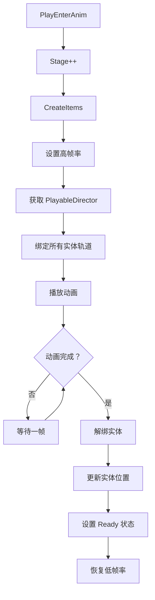
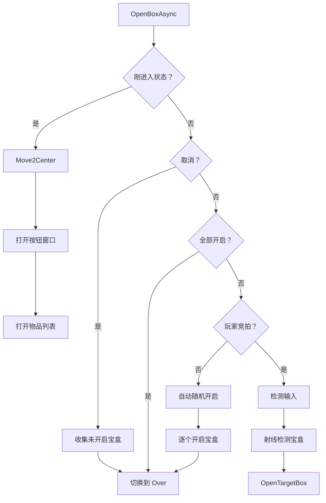
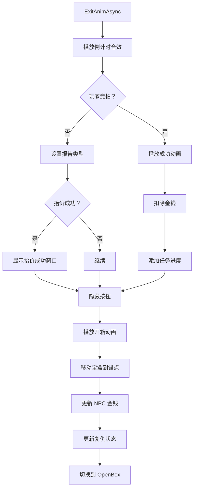

# AuctionGuideManager.Anim.cs 注解文档

## 文件基本信息

| 属性 | 值 |
|------|-----|
| **文件名** | AuctionGuideManager.Anim.cs |
| **路径** | Assets/Scripts/Code/Game/System/Auction/AuctionGuideManager.Anim.cs |
| **所属模块** | 游戏系统 → 拍卖系统 → 引导管理器 |
| **文件职责** | 拍卖引导系统的动画播放与视觉效果控制 |

---

## 类/结构体说明

### AuctionGuideManager (Partial)

| 属性 | 说明 |
|------|------|
| **职责** | 拍卖引导系统的动画播放、入场/出场/开箱等视觉效果 |
| **泛型参数** | 无 |
| **继承关系** | 无（部分类） |
| **实现的接口** | 无 |

**设计模式**: 部分类 (Partial Class) + 协程模式

```csharp
// 动画相关方法实现
public partial class AuctionGuideManager
{
    private async ETTask WaitPrepare() { ... }
    private async ETTask PlayEnterAnim() { ... }
    async ETTask ExitAnimAsync() { ... }
    // ...
}
```

---

## 字段与属性（按重要程度排序）

| 名称 | 类型 | 访问级别 | 说明 |
|------|------|----------|------|
| `mapScene` | `MapScene` | `private` | 当前地图场景引用 |
| `HostId` | `long` | `private` | 主持人实体 ID |
| `Player` | `Player` | `private` | 玩家实体引用 |
| `Bidders` | `List<long>` | `private` | 竞拍者实体 ID 列表 |
| `Npcs` | `List<long>` | `private` | NPC 实体 ID 列表 |
| `Boxes` | `List<long>` | `private` | 宝盒实体 ID 列表 |
| `OpenBoxes` | `List<long>` | `private` | 已开启的宝盒 ID 列表 |
| `LastAuctionPrice` | `BigNumber` | `private` | 最后竞拍价格 |
| `LastAuctionPlayerId` | `long` | `private` | 最后竞拍玩家 ID |
| `IsRaising` | `bool` | `private` | 是否正在抬价 |
| `RaiseSuccessCount` | `int` | `private` | 抬价成功次数 |
| `cancellationToken` | `ETCancellationToken` | `private` | 异步操作取消令牌 |
| `Stage` | `int` | `private` | 当前阶段 |
| `isEnterState` | `bool` | `private` | 是否刚进入状态 |
| `lastClickTime` | `long` | `private` | 最后点击时间（用于防抖） |
| `isGuide` | `bool` | `private` | 是否正在显示引导 |

---

## 方法说明（按重要程度排序）

### WaitPrepare()

**签名**:
```csharp
private async ETTask WaitPrepare()
```

**职责**: 等待所有实体加载完成，显示首次引导界面

**核心逻辑**:
```
1. 获取 PlayableDirector 组件（开场动画）
2. 如果存在，设置 Hold 模式并播放一帧后暂停
3. 等待所有实体加载完成：
   - 主持人 Host
   - 玩家 Player
   - 所有竞拍者 Bidders
4. 显示玩家旗帜 Flag
5. 打开首次引导窗口 UIFirstGuidanceView
6. 切换到 Prepare 状态
```

**调用者**: AuctionGuideManager.State.cs → Awake()

**被调用者**: 无

**使用示例**:
```csharp
// 在 Awake 状态中自动调用
WaitPrepare().Coroutine();
```

---

### PlayEnterAnim()

**签名**:
```csharp
private async ETTask PlayEnterAnim()
```

**职责**: 场景加载完成后播放入场动画

**核心逻辑**:
```
1. 检查 isEnterState
2. Stage++
3. 创建物品 CreateItems()
4. 设置高性能帧率 PerformanceManager.Instance.SetHighFrame()
5. 获取 PlayableDirector（Character 动画）
6. 绑定所有实体的动画轨道：
   - HostTrack / HostRoot
   - PlayerTrack / PlayerRoot
   - BidderTrack / BidderRoot
   - NPCTrack / NPCRoot
7. 播放动画并等待完成
8. 将实体从动画父节点移回场景根节点
9. 更新实体位置/旋转
10. 切换到 Ready 状态
11. 恢复低帧率
```

**调用者**: AuctionGuideManager.State.cs → Update() (EnterAnim 状态)

---

### ExitAnimAsync()

**签名**:
```csharp
async ETTask ExitAnimAsync()
```

**职责**: 播放结算动画（开箱前）

**核心逻辑**:
```
1. 播放倒计时音效
2. 更新最后竞拍价格显示
3. 如果玩家不是最后竞拍者：
   - 设置报告类型（Pass/Others）
   - 如果是抬价，显示抬价成功窗口
4. 如果玩家是最后竞拍者：
   - 播放竞拍成功动画
   - 扣除玩家金钱
   - 添加任务进度
5. 设置高性能帧率
6. 创建取消令牌
7. 隐藏游戏界面按钮
8. 播放开箱动画（openbox PlayableDirector）
9. 在动画 40% 时将宝盒移动到对应锚点
10. 更新 NPC 金钱
11. 更新复仇状态
12. 切换到 OpenBox 状态
```

**调用者**: AuctionGuideManager.State.cs → ExitAnim()

---

### ShowReady()

**签名**:
```csharp
async ETTask ShowReady()
```

**职责**: 显示准备就绪提示，主持人开场白

**核心逻辑**:
```
1. 获取集装箱配置
2. 播放气泡音效
3. 更新主持人说话内容（阶段 + 集装箱名称）
4. 等待开场间隔时间
5. 移动角色回原位 MoveBack()
6. 显示刷新拍卖价格助手对话
7. 显示/打开游戏视图 UIGuideGameView
8. 等待显示价格范围
9. 主持人播报起拍价
10. 切换到 AIThink 状态
```

**调用者**: AuctionGuideManager.State.cs → Ready()

---

### OpenBoxAsync()

**签名**:
```csharp
private async ETTask OpenBoxAsync()
```

**职责**: 开箱逻辑（玩家选择宝盒）

**核心逻辑**:
```
1. 如果是刚进入状态：
   - 记录点击时间
   - 移动到中心 Move2Center()
   - 打开按钮窗口 UIButtonView
   - 打开物品列表窗口 UIItemsView
2. 如果取消令牌已取消：
   - 遍历所有宝盒
   - 将未开启的普通/任务宝盒加入 OpenBoxes
   - 移除并销毁其他类型宝盒
   - 切换到 Over 状态
3. 如果所有宝盒已开启，切换到 Over 状态
4. 如果玩家是最后竞拍者：
   - 检测玩家攻击输入
   - 射线检测选中的宝盒
   - 播放开箱动画
   - 如果全部开启，切换到 Over 状态
5. 如果不是玩家竞拍：
   - 自动随机顺序开启所有宝盒
```

**调用者**: AuctionGuideManager.State.cs → OpenBox()

---

### OpenTargetBox()

**签名**:
```csharp
private async ETTask OpenTargetBox(UIItemsView view, long id)
```

**职责**: 开启指定宝盒

**核心逻辑**:
```
1. 检查宝盒是否存在且未开启
2. 获取宝盒实体和 GameObjectHolderComponent
3. 根据宝盒类型：
   - Empty/RandOpenEvt: 播放烟雾特效，移除宝盒
   - 其他类型：加入 OpenBoxes，播放特效，播放开箱动画
```

**调用者**: OpenBoxAsync()

---

### ReEnterAnimAsync()

**签名**:
```csharp
private async ETTask ReEnterAnimAsync()
```

**职责**: 重新进入动画（下一轮）

**核心逻辑**:
```
1. 取消之前的异步操作
2. 创建新的取消令牌
3. Stage++
4. 移除并清空所有宝盒
5. 创建新物品 CreateItems()
6. 设置高性能帧率
7. 播放新宝盒出现动画（NewBox PlayableDirector）
8. 切换到 Ready 状态
```

**调用者**: AuctionGuideManager.State.cs → ReEnterAnim()

---

### ClipStartPlay()

**签名**:
```csharp
private void ClipStartPlay(string key, double time, double total)
```

**职责**: 动画片段开始播放回调

**核心逻辑**:
```
1. 根据 key 执行对应逻辑：
   - "RunNextState": 切换到 Ready 状态
   - "Drop": 移动到中心 Move2Center()
   - "Shock": 
     - 如果是 ReEnterAnim 状态，切换到 Ready
     - 移动回原位 MoveBack()
     - 长震动 ShockManager.Instance.LongVibrate()
     - 摄像机震动 CameraManager.Instance.Shake()
```

**调用者**: PlayableDirector 回调

---

### AllOverAnimAsync()

**签名**:
```csharp
private async ETTask AllOverAnimAsync()
```

**职责**: 全部结束动画（离场）

**核心逻辑**:
```
1. 移除并清空所有宝盒
2. 设置高性能帧率
3. 创建/重置取消令牌
4. 调用游戏视图的 ReEnter() 方法
5. 播放离场动画（Exit PlayableDirector）
6. 支持取消操作
7. 切换到 AllOver 状态
```

**调用者**: AuctionGuideManager.State.cs → AllOverAnim()

---

### ShowRefreshAuctionPriceAssistantTalk()

**签名**:
```csharp
private void ShowRefreshAuctionPriceAssistantTalk()
```

**职责**: 显示助手提示刷新拍卖价格

**核心逻辑**:
```
1. 获取集装箱配置
2. 格式化集装箱名称（带颜色）
3. 计算最小估价（AllPrice * SysJudgePriceMin）
4. 计算最大估价（AllPrice * SysJudgePriceMax）
5. 广播助手对话消息（I18NKey.Assistant_21）
```

**调用者**: ShowReady()

---

### Move2Center()

**签名**:
```csharp
private async ETTask Move2Center()
```

**职责**: 移动角色到场上中心位置

**核心逻辑**:
```
1. 获取动画位置锚点 AnimPos
2. 获取焦点角色 centerCharacter
3. 如果已在目标位置或跳过动画，返回
4. 使用 EaseOutQuart 缓动函数
5. 记录起始位置/旋转
6. 禁用休闲动作组件
7. 500ms 内插值移动到目标位置
```

**调用者**: ClipStartPlay(), OpenBoxAsync()

---

### MoveBack()

**签名**:
```csharp
private async ETTask MoveBack()
```

**职责**: 移动角色回到原始位置

**核心逻辑**:
```
1. 获取焦点角色
2. 如果跳过动画，直接重置位置
3. 使用 EaseOutQuart 缓动函数（反向）
4. 启用休闲动作组件
5. 500ms 内插值移动回起始位置
```

**调用者**: ClipStartPlay(), ShowReady()

---

## Mermaid 流程图

### 入场动画流程



### 开箱流程



### 结算动画流程



---

## 使用示例

### 监听动画事件

```csharp
// 通过 Messager 监听动画相关消息
Messager.Instance.AddListener(MessageId.GuideBox2, (trans, configId) => {
    Log.Info("引导宝盒：" + configId);
});
```

### 手动触发移动动画

```csharp
// 移动到中心
Move2Center().Coroutine();

// 移动回原位
MoveBack().Coroutine();
```

### 播放特效

```csharp
// 播放烟雾特效
AuctionHelper.PlayFx(GameConst.SmokePrefab, position).Coroutine();
```

---

## 相关文档链接

- [[AuctionGuideManager.State.cs.md]] - 拍卖引导状态机
- [[AuctionGuideManager.API.cs.md]] - 拍卖引导外部接口
- [[AuctionManager.AIMiniPlay.cs.md]] - AI 小游戏逻辑
- [[PlayableDirector](Unity 官方文档)] - Unity PlayableDirector 组件
- [[UIManager.cs.md]] - UI 管理器

---

*文档生成时间：2026-03-02*
