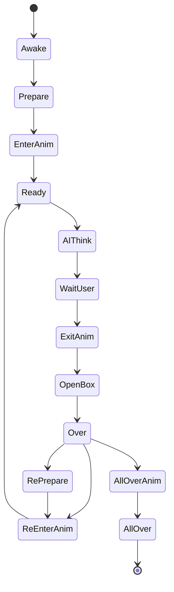
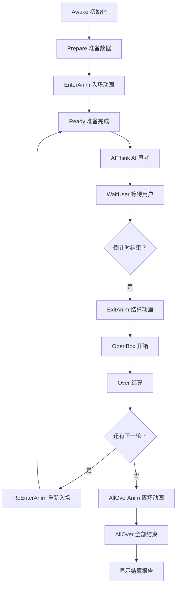
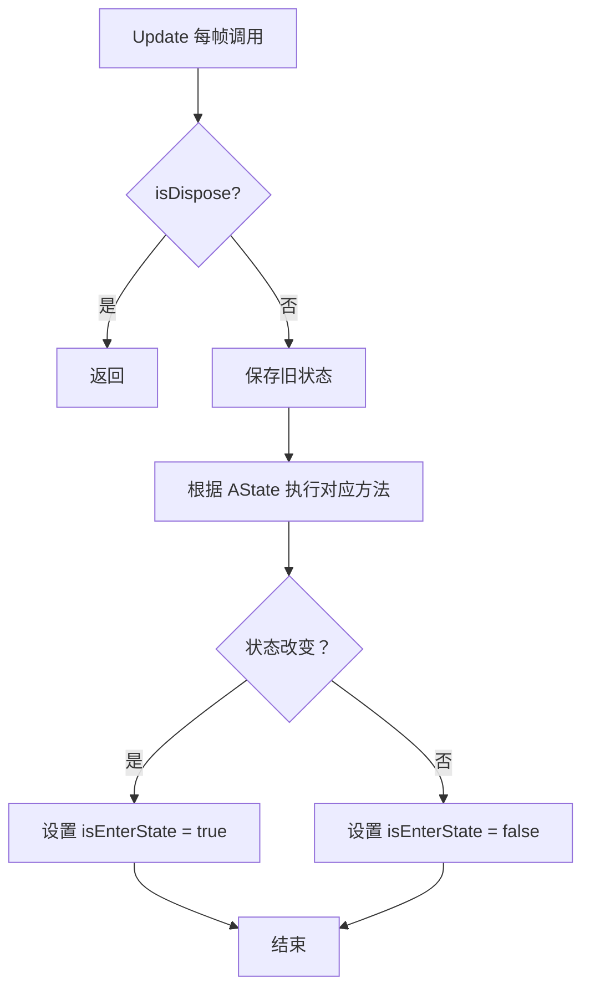

# AuctionGuideManager.State.cs 注解文档

## 文件基本信息

| 属性 | 值 |
|------|-----|
| **文件名** | AuctionGuideManager.State.cs |
| **路径** | Assets/Scripts/Code/Game/System/Auction/AuctionGuideManager.State.cs |
| **所属模块** | 游戏系统 → 拍卖系统 → 引导管理器 |
| **文件职责** | 拍卖引导状态机核心实现，管理拍卖流程各阶段的状态切换与更新逻辑 |

---

## 类/结构体说明

### AuctionGuideManager (Partial)

| 属性 | 说明 |
|------|------|
| **职责** | 拍卖引导系统的状态管理与流程控制 |
| **泛型参数** | 无 |
| **继承关系** | `IUpdate` |
| **实现的接口** | `IUpdate` |

**设计模式**: 状态机模式 + 部分类 (Partial Class)

```csharp
// 状态机实现
public partial class AuctionGuideManager : IUpdate
{
    private void SetState(AuctionState state) { ... }
    public void Update() { ... }
}
```

---

## 字段与属性（按重要程度排序）

| 名称 | 类型 | 访问级别 | 说明 |
|------|------|----------|------|
| `AState` | `AuctionState` | `private` | 当前拍卖状态枚举 |
| `isEnterState` | `bool` | `private` | 是否刚进入状态（用于触发一次性逻辑） |
| `Stage` | `int` | `private` | 当前关卡阶段（第几轮拍卖） |
| `HostId` | `long` | `private` | 主持人实体 ID |
| `Player` | `Player` | `private` | 玩家实体引用 |
| `Bidders` | `List<long>` | `private` | 竞拍者实体 ID 列表 |
| `Npcs` | `List<long>` | `private` | NPC 实体 ID 列表 |
| `Boxes` | `List<long>` | `private` | 宝盒实体 ID 列表 |
| `OpenBoxes` | `List<long>` | `private` | 已开启的宝盒 ID 列表 |
| `decisions` | `AIDecision[]` | `private` | AI 决策数组 |
| `cancellationToken` | `ETCancellationToken` | `private` | 异步操作取消令牌 |
| `centerCharacter` | `Character` | `private` | 当前焦点角色（用于动画） |
| `startPos` | `Vector3` | `private` | 移动动画起始位置 |
| `startRot` | `Quaternion` | `private` | 移动动画起始旋转 |

---

## 方法说明（按重要程度排序）

### SetState(AuctionState state)

**签名**:
```csharp
private void SetState(AuctionState state)
```

**职责**: 切换拍卖状态，触发状态变更事件

**核心逻辑**:
```
1. 检查状态是否改变
2. 更新 AState
3. 设置 isEnterState = true（标记刚进入状态）
4. 通知引导系统 GuidanceManager.Instance.NoticeEvent()
5. 广播消息 Messager.Instance.Broadcast()
6. 记录日志
```

**调用者**: 所有状态切换点

**被调用者**: 无

**使用示例**:
```csharp
// 切换到准备状态
SetState(AuctionState.Prepare);

// 切换到 AI 思考状态
SetState(AuctionState.AIThink);
```

---

### Update()

**签名**:
```csharp
public void Update()
```

**职责**: 每帧更新，根据当前状态执行对应逻辑

**核心逻辑**:
```
1. 检查是否已销毁 (isDispose)
2. 保存旧状态 lAState
3. 根据 AState 执行对应状态方法：
   - Awake: 初始化
   - Prepare: 准备数据
   - EnterAnim: 播放入场动画
   - Ready: 准备完成
   - AIThink: AI 思考
   - WaitUser: 等待用户
   - ExitAnim: 结算动画
   - OpenBox: 开箱
   - Over: 结算
   - ReEnterAnim: 重新入场动画
   - AllOverAnim: 全部结束动画
   - AllOver: 全部结束
   - RePrepare: 重新准备
4. 如果状态未变，设置 isEnterState = false
```

**调用者**: TimerManager（每帧调用）

**状态流转图**:


---

### Awake()

**签名**:
```csharp
private void Awake()
```

**职责**: 第一次进入拍卖前的初始化（情报、命运骰子）

**核心逻辑**:
```
1. 设置 Stage = 0
2. 创建主持人实体 Host
3. 设置主持人位置/旋转
4. 获取场景中的 NPC 锚点
5. 创建玩家实体 Player
6. 添加休闲动作组件 CasualActionComponent
7. 根据关卡配置创建 AI 竞拍者 (Bidder)
8. 根据需要创建 NPC
9. 初始化 AI 决策数组
10. 启动 WaitPrepare() 协程
```

**调用者**: Update() 当 AState == AuctionState.Awake

---

### Prepare()

**签名**:
```csharp
private void Prepare()
```

**职责**: 第一次进入准备数据，开场动画等

**核心逻辑**:
```
1. 检查 isEnterState
2. 如果 UIFirstGuidanceView 不存在，切换到 EnterAnim 状态
3. 调用 CreateContainer() 生成集装箱
```

**调用者**: Update() 当 AState == AuctionState.Prepare

---

### Ready()

**签名**:
```csharp
private void Ready()
```

**职责**: 当前轮准备完成，初始化拍卖数据

**核心逻辑**:
```
1. 检查 isEnterState
2. 计算预制误差 prefabDeviation（根据配置随机）
3. 为所有 AI 竞拍者调用 ai.GetKnowledge().Ready()
4. 禁用上一轮获胜者的动作组件
5. 创建价格范围 CreateRangePrice()
6. 创建 AI 评判 CreateAiJudge()
7. 重置所有拍卖计数器
8. 启动 ShowReady() 协程
```

**调用者**: Update() 当 AState == AuctionState.Ready

---

### AIThink()

**签名**:
```csharp
private void AIThink()
```

**职责**: AI 思考阶段，计算每个 AI 的竞拍决策

**核心逻辑**:
```
1. 检查是否可以抬价 (GameSetting.RaiseCount)
2. 遍历所有竞拍者：
   - 如果是上一轮获胜者，设置为 sidelines
   - 否则调用 ai.Think() 获取决策
   - 如果玩家是上一轮获胜者且可以抬价，AI 强制低权重出价
3. 重置主持人说话计数器
4. 切换到 WaitUser 状态
```

**调用者**: Update() 当 AState == AuctionState.AIThink

---

### WaitUser()

**签名**:
```csharp
private void WaitUser()
```

**职责**: 等待玩家或下一个 AI 竞价，处理倒计时

**核心逻辑**:
```
1. 获取当前时间
2. 如果是刚进入状态，记录开始等待时间
3. 计算 AI 叫价：
   - 检查每个 AI 的延迟时间
   - 如果时间到且不是 sidelines，调用 AIAuction()
   - 如果是 sidelines 且有表情，显示表情
4. 根据引导配置判断倒计时类型：
   - 玩家出价后倒计时
   - AI 出价后倒计时
   - 正常倒计时
5. 主持人倒计时逻辑：
   - hostSayCount == 0: 第一次叫价
   - hostSayCount == 1: 第二次叫价
   - hostSayCount == 2: 第三次叫价
   - hostSayCount == 3: 成交/流拍，切换到 ExitAnim
```

**调用者**: Update() 当 AState == AuctionState.WaitUser

---

### ExitAnim()

**签名**:
```csharp
private void ExitAnim()
```

**职责**: 结算动画阶段

**核心逻辑**:
```
1. 检查 isEnterState
2. 启动 ExitAnimAsync() 协程
```

**调用者**: Update() 当 AState == AuctionState.ExitAnim

---

### OpenBox()

**签名**:
```csharp
private void OpenBox()
```

**职责**: 开箱阶段

**核心逻辑**:
```
1. 启动 OpenBoxAsync() 协程
```

**调用者**: Update() 当 AState == AuctionState.OpenBox

---

### Over()

**签名**:
```csharp
private void Over()
```

**职责**: 结算阶段

**核心逻辑**:
```
1. 检查 isEnterState
2. 播放 UIItemsView 动画
3. 广播引导消息
4. 刷新价格显示
5. 刷新输赢动画
6. 打开结算按钮窗口
7. 释放纹理资源
```

**调用者**: Update() 当 AState == AuctionState.Over

---

### ReEnterAnim()

**签名**:
```csharp
private void ReEnterAnim()
```

**职责**: 再次进入动画（下一轮）

**核心逻辑**:
```
1. 检查 isEnterState
2. 启动 ReEnterAnimAsync() 协程
```

**调用者**: Update() 当 AState == AuctionState.ReEnterAnim

---

### AllOverAnim()

**签名**:
```csharp
private void AllOverAnim()
```

**职责**: 全部完成离场动画

**核心逻辑**:
```
1. 检查 isEnterState
2. 启动 AllOverAnimAsync() 协程
```

**调用者**: Update() 当 AState == AuctionState.AllOverAnim

---

### AllOver()

**签名**:
```csharp
private void AllOver()
```

**职责**: 全部结束，显示结算报告

**核心逻辑**:
```
1. 检查 isEnterState
2. 调用 PlayerDataManager.Instance.GuideSceneDone()
3. 打开结算报告窗口 UIReportWin
```

**调用者**: Update() 当 AState == AuctionState.AllOver

---

### RePrepare()

**签名**:
```csharp
private void RePrepare()
```

**职责**: 再来一局的准备阶段

**核心逻辑**:
```
1. 检查 isEnterState
2. 设置 Stage = 0
3. 调用 CreateContainer() 生成集装箱
4. 切换到 ReEnterAnim 状态
```

**调用者**: Update() 当 AState == AuctionState.RePrepare

---

### Move2Center()

**签名**:
```csharp
private async ETTask Move2Center()
```

**职责**: 移动角色到场上中心位置（动画）

**核心逻辑**:
```
1. 获取动画位置锚点 AnimPos
2. 获取焦点角色 centerCharacter
3. 如果已在目标位置，返回
4. 使用 EaseOutQuart 缓动函数
5. 记录起始位置/旋转
6. 500ms 内插值移动到目标位置
7. 禁用休闲动作组件
```

**调用者**: ClipStartPlay(), OpenBoxAsync()

---

### MoveBack()

**签名**:
```csharp
private async ETTask MoveBack()
```

**职责**: 移动角色回到原始位置（动画）

**核心逻辑**:
```
1. 获取焦点角色
2. 如果跳过动画，直接重置位置
3. 使用 EaseOutQuart 缓动函数（反向）
4. 500ms 内插值移动回起始位置
5. 启用休闲动作组件
```

**调用者**: ClipStartPlay()

---

## Mermaid 流程图

### 完整拍卖流程



### 状态机更新循环



---

## 使用示例

### 状态切换示例

```csharp
// 从外部切换状态（通过 SetState 内部调用）
SetState(AuctionState.Prepare);  // 进入准备阶段
SetState(AuctionState.AIThink);  // AI 开始思考
SetState(AuctionState.WaitUser); // 等待玩家出价
```

### 监听状态变化

```csharp
// 通过 Messager 监听状态变化
Messager.Instance.AddListener(MessageId.RefreshAuctionState, (state) => {
    Log.Info("当前拍卖状态：" + state);
});
```

### 引导事件监听

```csharp
// 引导系统监听状态事件
GuidanceManager.Instance.NoticeEvent("AuctionState_Prepare");
GuidanceManager.Instance.NoticeEvent("AuctionState_WaitUser");
```

---

## 相关文档链接

- [[AuctionGuideManager.Anim.cs.md]] - 拍卖引导动画实现
- [[AuctionGuideManager.API.cs.md]] - 拍卖引导外部接口
- [[AuctionManager.AIMiniPlay.cs.md]] - AI 小游戏逻辑
- [[SceneManager.cs.md]] - 场景管理器
- [[GuidanceManager.cs.md]] - 引导管理器
- [[UIManager.cs.md]] - UI 管理器

---

*文档生成时间：2026-03-02*
