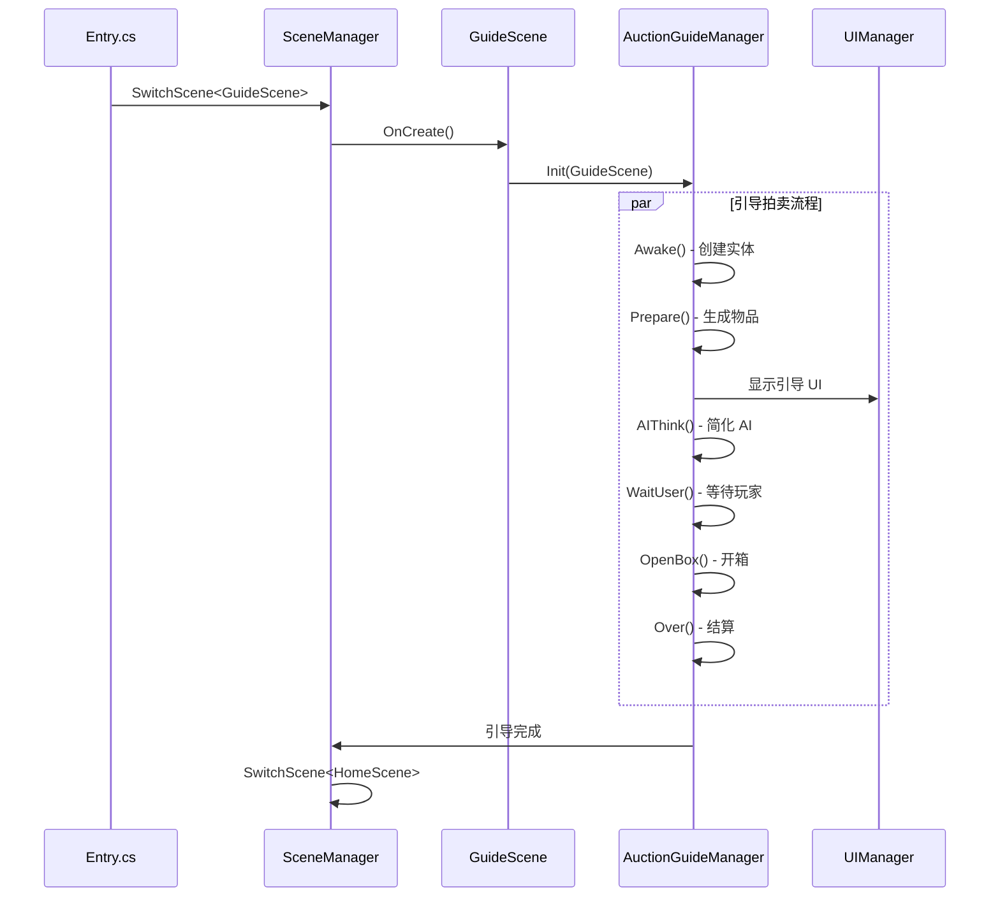

# AuctionGuideManager.cs 注解文档

## 文件基本信息

| 属性 | 值 |
|------|-----|
| **文件名** | AuctionGuideManager.cs |
| **路径** | Assets/Scripts/Code/Game/System/Auction/AuctionGuideManager.cs |
| **所属模块** | 玩法层 → Code/Game/System/Auction |
| **文件职责** | 拍卖引导系统管理器，负责新手引导拍卖流程 |

---

## 文件结构

AuctionGuideManager 使用 **Partial Class** 拆分为多个文件：

| 文件 | 行数 | 职责 |
|------|------|------|
| `AuctionGuideManager.cs` | ~29KB | 核心逻辑、数据管理 |
| `AuctionGuideManager.State.cs` | ~15KB | 状态机实现 |
| `AuctionGuideManager.Anim.cs` | ~24KB | 动画控制 |
| `AuctionGuideManager.API.cs` | ~7KB | 网络 API |

---

## 类/结构体说明

### AuctionGuideManager (Partial Class)

| 属性 | 说明 |
|------|------|
| **职责** | 引导拍卖系统核心，实现简化版拍卖流程用于教学 |
| **泛型参数** | 无 |
| **继承关系** | 无继承（partial 类） |
| **实现的接口** | `IManager<GuideScene>`, `IUpdate`, `IAuctionManager` |

**与 AuctionManager 的关系**:
- 实现相同的接口 `IAuctionManager`
- 使用相同的状态机 `AuctionState`
- 简化流程，固定配置，用于新手引导

---

## 核心特性

### 与正式拍卖的区别

| 特性 | AuctionManager (正式) | AuctionGuideManager (引导) |
|------|----------------------|---------------------------|
| **场景** | MapScene | GuideScene |
| **配置** | 随机生成 | 固定配置（GuidanceStageConfig） |
| **AI 竞拍者** | 多个，使用决策树 | 简化，固定行为 |
| **黑市商人** | 支持 | 不支持（Blacks = null） |
| **命运骰子** | 支持 | 不支持（DiceId = 0） |
| **情报系统** | 支持 | 不支持（GameInfoId = -1） |
| **小玩法** | 部分支持 | 不支持（IsAllPlayBox = false） |

---

## 字段与属性（关键差异）

### 固定配置

```csharp
// 引导模式固定值
public int GameInfoId { get; } = -1;      // 无情报
public int DiceId { get; } = 0;           // 无骰子
public List<long> Blacks => null;         // 无黑市商人
public bool IsAllPlayBox => false;        // 无小玩法
public StartEventConfig StartEventConfig => null;  // 无开局事件
```

### 引导配置

```csharp
// 使用引导配置
var guide = GuidanceStageConfigCategory.Instance.Get(Stage);
AuctionReports[i].ContainerId = guide.ContainerId;  // 固定集装箱
```

---

## 核心方法

### Init(GuideScene map)

**签名**:
```csharp
public void Init(GuideScene map)
```

**职责**: 初始化引导拍卖系统

**核心逻辑**:
```
1. 读取全局配置（HostSayStart, HostSayInterval, MiniPlayPercent）
2. 设置单例 IAuctionManager.Instance = this
3. 保存 GuideScene 引用
4. 设置 Level = mapScene.Config.Id
5. 设置初始状态 SetState(AuctionState.Awake)
6. 注册事件监听
```

**与正式拍卖的区别**:
- 参数是 `GuideScene` 而非 `MapScene`
- 其他逻辑基本相同

---

### CreateContainer()

**签名**:
```csharp
private void CreateContainer()
```

**职责**: 生成引导集装箱盲盒

**核心逻辑**:
```
1. 获取引导关卡配置 GuidanceStageConfigCategory
2. 为每轮创建 AuctionReport
3. 设置固定的 ContainerId（来自引导配置）
4. 加载集装箱皮肤纹理
5. 应用到 3D 模型
```

**与正式拍卖的区别**:
```csharp
// 正式拍卖：随机生成
RandomSpecialCount(), RandomSort(), etc.

// 引导拍卖：固定配置
var guide = GuidanceStageConfigCategory.Instance.Get(i + 1);
AuctionReports[i].ContainerId = guide.ContainerId;  // 固定
```

---

### CreateItems()

**签名**:
```csharp
private void CreateItems()
```

**职责**: 生成引导关卡的物品

**核心逻辑**:
```
1. 从 GuidanceStageConfig 获取物品 ID 列表
2. 加载物品配置 ItemConfigCategory
3. 计算总价值 AllPrice
4. 按优先级排序（大物品优先）
5. 使用 AuctionHelper.PackBoxes() 装箱
6. 创建 Box 实体并摆放
```

**与正式拍卖的区别**:
```csharp
// 正式拍卖：从集装箱配置随机
var container = ContainerConfigCategory.Instance.Get(containerId);
container.Items.RandomSort();

// 引导拍卖：固定物品
var guidance = GuidanceStageConfigCategory.Instance.Get(Stage);
for (int i = 0; i < guidance.Items.Length; i++)
{
    var itemConfig = ItemConfigCategory.Instance.Get(guidance.Items[i]);
    // ...
}
```

---

## 使用场景

### 新手引导流程



---

## 阅读指引

### 建议的阅读顺序

1. **理解引导系统作用** - 为什么需要 AuctionGuideManager
2. **对比 AuctionManager** - 理解简化的地方
3. **看 CreateContainer** - 理解固定配置
4. **看 CreateItems** - 理解固定物品生成

### 最值得学习的技术点

1. **接口复用**: 实现相同接口，支持不同场景
2. **配置分离**: 正式配置 vs 引导配置
3. **流程简化**: 保留核心流程，移除复杂功能
4. **Partial Class**: 大文件拆分到多个文件

---

## 相关文档

- [AuctionManager.cs.md](./AuctionManager.cs.md) - 正式拍卖管理器
- [AuctionState.cs.md](./AuctionState.cs.md) - 状态枚举
- [IAuctionManager.cs.md](./IAuctionManager.cs.md) - 接口定义
- [GuidanceStageConfig.cs.md](../../Module/Config/GuidanceStageConfig.cs.md) - 引导配置

---

*文档生成时间：2026-02-27 | OpenClaw AI 助手*
