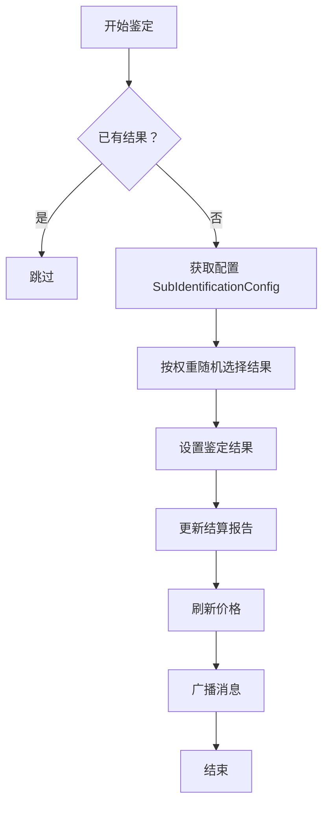
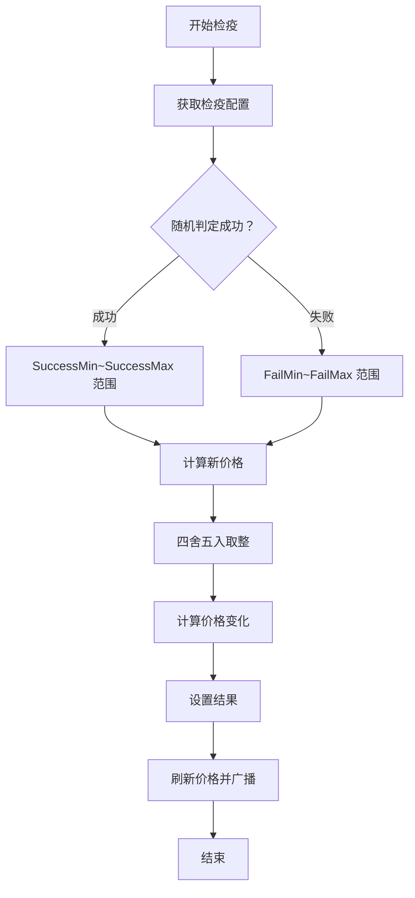
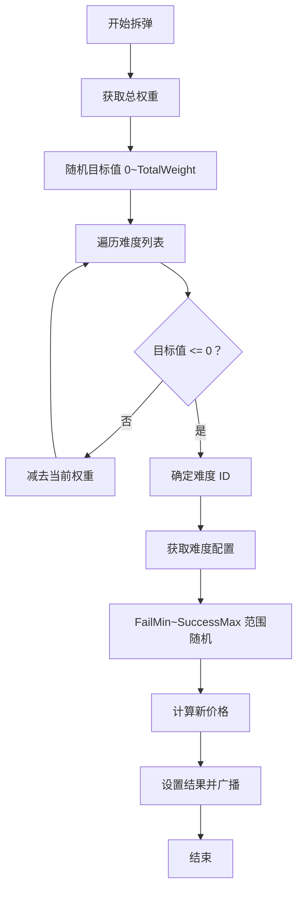
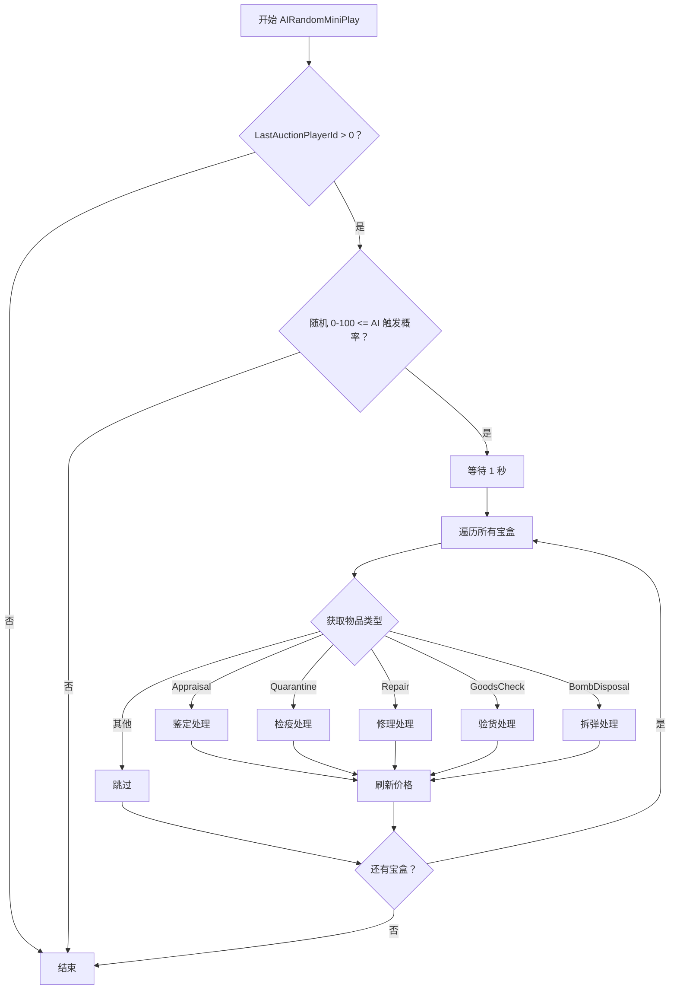

# AuctionManager.AIMiniPlay.cs 注解文档

## 文件基本信息

| 属性 | 值 |
|------|-----|
| **文件名** | AuctionManager.AIMiniPlay.cs |
| **路径** | Assets/Scripts/Code/Game/System/Auction/AuctionManager.AIMiniPlay.cs |
| **所属模块** | 游戏逻辑层 → Code/Game/System/Auction |
| **文件职责** | 拍卖系统 AI 小玩法模拟，处理 AI 自动参与小游戏的结果计算 |

---

## 类/结构体说明

### AuctionManager (部分类)

| 属性 | 说明 |
|------|------|
| **职责** | 拍卖系统管理器，本文件包含 AI 小玩法的模拟逻辑 |
| **泛型参数** | 无 |
| **继承关系** | 无继承（partial 类扩展） |
| **实现的接口** | 无 |

**设计模式**: 部分类扩展 + 策略模式（按物品类型分发）

```csharp
// 作为 AuctionManager 的部分类扩展
public partial class AuctionManager
{
    private async ETTask AIRandomMiniPlay()
    {
        // AI 小玩法模拟逻辑
    }
}
```

---

## 字段与属性（按重要程度排序）

| 名称 | 类型 | 访问级别 | 说明 |
|------|------|----------|------|
| `LastAuctionPlayerId` | `long` | `private` | 上一轮竞拍玩家 ID，用于检查是否有有效竞拍 |
| `LevelConfig.AIMiniPlayPercent` | `int` | `public static` | AI 小玩法触发概率百分比（0-100） |
| `Boxes` | `List<long>` | `private` | 当前拍卖的宝盒 ID 列表 |
| `EntityManager.Instance` | `EntityManager` | `public static` | 实体管理器单例 |
| `Report.PlayData` | `PlayData[]` | `private` | 结算报告数据数组 |

---

## 方法说明（按重要程度排序）

### AIRandomMiniPlay()

**签名**:
```csharp
private async ETTask AIRandomMiniPlay()
```

**职责**: AI 随机参与小游戏，根据配置概率自动完成鉴定/检疫/修理等小游戏并计算结果

**核心逻辑**:
```
1. 检查 LastAuctionPlayerId 是否有效 → 无效则返回
2. 随机判定是否触发 AI 小玩法（0-100 > 配置概率则返回）
3. 等待 1 秒（模拟 AI 思考时间）
4. 遍历所有宝盒 Boxes
5. 根据物品类型执行不同的小游戏逻辑：
   - Appraisal（鉴定）: 根据配置权重随机选择结果
   - Quarantine（检疫）: 按成功率计算价格变化
   - Repair（修理）: 50% 成功率计算价格变化
   - GoodsCheck（验货）: 50% 成功率计算价格变化
   - BombDisposal（拆弹）: 按难度权重随机选择结果
   - 其他类型：不处理
6. 每次处理后刷新价格并广播消息
```

**调用者**: `AuctionManager` 内部调用（具体调用点需查看主类）

**被调用者**: 
- `TimerManager.Instance.WaitAsync()`
- `EntityManager.Instance.Get<Box>()`
- `box.SetAppraisalResult()` / `box.SetMiniGameResult()`
- `RefreshPrice()`
- `Messager.Instance.Broadcast()`

---

## 小游戏类型处理逻辑

### 1. 鉴定 (ItemType.Appraisal)

```csharp
case (int) ItemType.Appraisal:
    if (box.ItemResultId == 0 && // 尚未鉴定
        SubIdentificationConfigCategory.Instance.TryGet(box.ItemId, out var sConfig))
    {
        // 按权重随机选择鉴定结果
        var rand = Random.Range(0, sConfig.TotalAIWidget * 10) % sConfig.TotalAIWidget;
        for (int j = 0; j < sConfig.AIWidget.Length; j++)
        {
            rand -= sConfig.AIWidget[j];
            if (rand <= 0)
            {
                box.SetAppraisalResult(sConfig.Result[j]);
                Report.PlayData[i] = box.ItemResult;
                RefreshPrice();
                Messager.Instance.Broadcast(0, MessageId.SetChangeItemResult, 
                    box.ItemId, box.ItemResultId, true);
                break;
            }
        }
    }
    break;
```

**流程**:


---

### 2. 检疫 (ItemType.Quarantine)

```csharp
case (int) ItemType.Quarantine:
    var qConfig = QuarantineConfigCategory.Instance.Get(box.ItemId);
    bool isSuccess = Random.Range(0, 100) < qConfig.Percent;
    var price = IAuctionManager.Instance.AllPrice;
    if (isSuccess)
    {
        price = Random.Range(qConfig.SuccessMin, qConfig.SuccessMax + 1) / 100f * price;
    }
    else
    {
        price = Random.Range(qConfig.FailMin, qConfig.FailMax + 1) / 100f * price;
    }
    BigNumber.Round2Integer(price);
    var newPrice = price - IAuctionManager.Instance.AllPrice;
    box.SetMiniGameResult(newPrice);
    RefreshPrice();
    Messager.Instance.Broadcast(0, MessageId.SetChangePriceResult, box.ItemId, newPrice, true);
    break;
```

**流程**:


---

### 3. 修理 (ItemType.Repair)

```csharp
case (int) ItemType.Repair:
    var rConfig = RepairConfigCategory.Instance.Get(box.ItemId);
    isSuccess = Random.Range(0, 2) < 1;  // 50% 成功率
    price = IAuctionManager.Instance.AllPrice;
    if (isSuccess)
    {
        price = Random.Range(rConfig.SuccessMin, rConfig.SuccessMax + 1) / 100f * price;
    }
    else
    {
        price = Random.Range(rConfig.FailMin, rConfig.FailMax + 1) / 100f * price;
    }
    BigNumber.Round2Integer(price);
    box.SetMiniGameResult(price);
    RefreshPrice();
    Messager.Instance.Broadcast(0, MessageId.SetChangePriceResult, box.ItemId, price, true);
    break;
```

**特点**: 固定 50% 成功率，成功/失败范围由配置决定

---

### 4. 验货 (ItemType.GoodsCheck)

```csharp
case (int) ItemType.GoodsCheck:
    var gConfig = GoodsCheckConfigCategory.Instance.Get(box.ItemId);
    isSuccess = Random.Range(0, 2) < 1;  // 50% 成功率
    price = IAuctionManager.Instance.AllPrice;
    if (isSuccess)
    {
        price = Random.Range(gConfig.SuccessMin, gConfig.SuccessMax + 1) / 100f * price;
    }
    else
    {
        price = Random.Range(gConfig.FailMin, gConfig.FailMax + 1) / 100f * price;
    }
    BigNumber.Round2Integer(price);
    box.SetMiniGameResult(price);
    RefreshPrice();
    Messager.Instance.Broadcast(0, MessageId.SetChangePriceResult, box.ItemId, price, true);
    break;
```

**特点**: 与修理逻辑相同，50% 成功率

---

### 5. 拆弹 (ItemType.BombDisposal)

```csharp
case (int) ItemType.BombDisposal:
    var weight = BombDisposalConfigCategory.Instance.TotalWeight;
    var target = Random.Range(0, weight);
    var list = BombDisposalConfigCategory.Instance.GetAllList();
    int diffId = 0;
    for (int j = 0; j < list.Count; j++)
    {
        diffId = list[j].Id;
        target -= list[j].Weight;
        if (target <= 0)
        {
            break;
        }
    }
    var bConfig = BombDisposalConfigCategory.Instance.Get(diffId);
    
    price = IAuctionManager.Instance.AllPrice;
    price = Random.Range(bConfig.FailMin, bConfig.SuccessMax + 1) / 100f * price;
    BigNumber.Round2Integer(price);
    box.SetMiniGameResult(price);
    RefreshPrice();
    Messager.Instance.Broadcast(0, MessageId.SetChangePriceResult, box.ItemId, price, true);
    break;
```

**流程**:


**特点**: 按权重随机选择难度等级，价格变化范围跨越失败到成功

---

### 6. 不处理的类型

```csharp
case (int) ItemType.Const:
case (int) ItemType.Story:
case (int) ItemType.None:
case (int) ItemType.Container:
case (int) ItemType.AppraisalResult:
    break;  // 这些类型不需要小游戏处理
```

---

## 完整流程图

### AI 小玩法主流程



---

## 使用示例

### 示例 1: 调用 AI 小玩法

```csharp
// 在拍卖流程中调用（通常在玩家操作后）
await auctionManager.AIRandomMiniPlay();
```

### 示例 2: 配置 AI 触发概率

```csharp
// 在 LevelConfig 中配置
public class LevelConfig
{
    public static int AIMiniPlayPercent = 30;  // 30% 概率触发 AI 小玩法
}
```

### 示例 3: 配置鉴定结果权重

```csharp
// SubIdentificationConfig 配置示例
public class SubIdentificationConfig
{
    public int[] AIWidget = { 30, 50, 20 };  // 权重：30%, 50%, 20%
    public int[] Result = { 1, 2, 3 };       // 对应结果 ID
    public int TotalAIWidget = 100;          // 总权重
}
```

---

## 配置依赖

### 相关配置表

| 配置表 | 用途 | 关键字段 |
|--------|------|----------|
| `SubIdentificationConfigCategory` | 鉴定结果配置 | `AIWidget[]`, `Result[]`, `TotalAIWidget` |
| `QuarantineConfigCategory` | 检疫配置 | `Percent`, `SuccessMin/Max`, `FailMin/Max` |
| `RepairConfigCategory` | 修理配置 | `SuccessMin/Max`, `FailMin/Max` |
| `GoodsCheckConfigCategory` | 验货配置 | `SuccessMin/Max`, `FailMin/Max` |
| `BombDisposalConfigCategory` | 拆弹配置 | `Weight`, `SuccessMin/Max`, `FailMin/Max` |
| `LevelConfig` | 关卡配置 | `AIMiniPlayPercent` |

---

## 消息广播

### 广播的消息类型

| 消息 ID | 参数 | 用途 |
|--------|------|------|
| `MessageId.SetChangeItemResult` | `itemId`, `resultId`, `isAI` | 通知鉴定结果变更 |
| `MessageId.SetChangePriceResult` | `itemId`, `priceChange`, `isAI` | 通知价格变更结果 |

**注意**: 所有 AI 操作都会设置 `isAI = true` 参数，用于区分玩家操作

---

## 阅读指引

### 建议的阅读顺序

1. **理解 AI 小玩法的作用** - 为什么需要 AI 自动参与小游戏
2. **看触发条件** - LastAuctionPlayerId 和概率判定
3. **重点看各类型处理逻辑** - 理解不同小游戏的计算方式
4. **了解配置依赖** - 理解配置表如何影响结果
5. **掌握消息广播机制** - 理解如何通知 UI 更新

### 最值得学习的技术点

1. **权重随机算法**: 鉴定和拆弹使用的权重随机选择
2. **配置驱动设计**: 所有数值通过配置表控制，便于平衡调整
3. **部分类扩展**: 将 AI 逻辑独立到单独文件，保持主类清晰
4. **异步等待**: 使用 TimerManager.WaitAsync 模拟 AI 思考时间
5. **统一消息广播**: 所有结果通过 Messager 广播，解耦 UI 更新

---

## 相关文档

- [AuctionManager.cs.md](./AuctionManager.cs.md) - 拍卖管理器主类
- [Box.cs.md](../../Entity/Box.cs.md) - 宝盒实体
- [MessageType.cs.md](../../../Module/Const/MessageId.cs.md) - 消息 ID 定义
- [QuarantineConfig.cs.md](../../../Config/QuarantineConfig.cs.md) - 检疫配置
- [RepairConfig.cs.md](../../../Config/RepairConfig.cs.md) - 修理配置
- [GoodsCheckConfig.cs.md](../../../Config/GoodsCheckConfig.cs.md) - 验货配置
- [BombDisposalConfig.cs.md](../../../Config/BombDisposalConfig.cs.md) - 拆弹配置

---

*文档生成时间：2026-03-02 | OpenClaw AI 助手*
