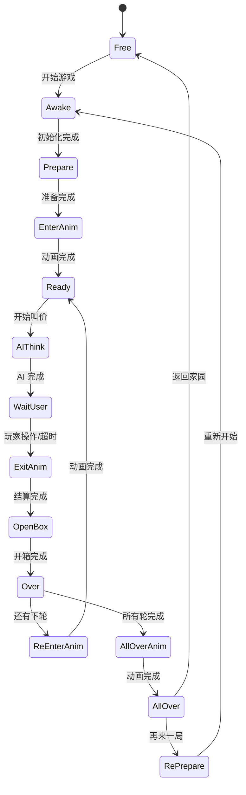

# AuctionManager.cs 注解文档

## 文件基本信息

| 属性 | 值 |
|------|-----|
| **文件名** | AuctionManager.cs |
| **路径** | Assets/Scripts/Code/Game/System/Auction/AuctionManager.cs |
| **所属模块** | 玩法层 → Code/Game/System/Auction |
| **文件职责** | 拍卖系统核心管理器，负责拍卖流程、状态机、AI 决策、动画控制 |

---

## 文件结构

AuctionManager 使用 **Partial Class** 拆分为多个文件：

| 文件 | 行数 | 职责 |
|------|------|------|
| `AuctionManager.cs` | ~58KB | 核心逻辑、数据管理 |
| `AuctionManager.State.cs` | ~16KB | 状态机实现 |
| `AuctionManager.Anim.cs` | ~31KB | 动画控制 |
| `AuctionManager.API.cs` | ~10KB | 网络 API |
| `AuctionManager.AIMiniPlay.cs` | ~5KB | AI 和小玩法 |
| `AuctionState.cs` | ~1KB | 状态枚举 |
| `IAuctionManager.cs` | ~4KB | 接口定义 |
| `AuctionHelper.cs` | ~7KB | 辅助工具 |

---

## 类/结构体说明

### AuctionManager (Partial Class)

| 属性 | 说明 |
|------|------|
| **职责** | 拍卖系统核心，实现状态机驱动的游戏流程 |
| **泛型参数** | 无 |
| **继承关系** | 无继承（partial 类） |
| **实现的接口** | `IManager<MapScene>`, `IUpdate`, `IAuctionManager` |

**设计模式**: 状态机模式 + 单例模式 + 对象池

```csharp
// 通过 ManagerProvider 注册（带参数）
ManagerProvider.RegisterManager<AuctionManager, MapScene>(mapScene);

// 单例访问（通过接口）
IAuctionManager.Instance.UserAuction(AITactic.Low);
```

---

## 字段与属性（按重要程度排序）

### 核心状态

| 名称 | 类型 | 访问级别 | 说明 |
|------|------|----------|------|
| `AState` | `AuctionState` | `public` | 当前拍卖状态 |
| `isEnterState` | `bool` | `private` | 是否刚进入状态（用于初始化） |
| `Level` | `int` | `public` | 难度等级 |
| `Stage` | `int` | `public` | 轮次（从 1 开始） |

### 配置相关

| 名称 | 类型 | 访问级别 | 说明 |
|------|------|----------|------|
| `Config` | `StageConfig` | `public` | 当前关卡配置 |
| `LevelConfig` | `LevelConfig` | `public` | 难度配置 |
| `GameInfoConfig` | `GameInfoConfig` | `public` | 情报配置 |
| `DiceConfig` | `DiceConfig` | `public` | 骰子配置 |

### 拍卖数据

| 名称 | 类型 | 访问级别 | 说明 |
|------|------|----------|------|
| `AuctionReports` | `AuctionReport[]` | `public` | 所有轮的集装箱盲盒数据 |
| `Report` | `AuctionReport` | `public` | 当前轮数据 |
| `LowAuction` | `BigNumber` | `public` | 低价（低档叫价） |
| `MediumAuction` | `BigNumber` | `public` | 中价（中档叫价） |
| `HighAuction` | `BigNumber` | `public` | 高价（高档叫价） |
| `LastAuctionPrice` | `BigNumber` | `public` | 上一次叫价 |
| `LastAuctionPlayerId` | `long` | `public` | 上一个叫价的人（-1 没有，0 玩家，其他 AI id） |

### 参与者

| 名称 | 类型 | 访问级别 | 说明 |
|------|------|----------|------|
| `Bidders` | `List<long>` | `public` | 竞拍者 ID 列表 |
| `Npcs` | `List<long>` | `public` | NPC ID 列表（背景人物） |
| `Boxes` | `List<long>` | `public` | 集装箱 ID 列表 |
| `Player` | `Player` | `public` | 玩家实体 |
| `HostId` | `long` | `public` | 拍卖师 ID |

### 统计计数

| 名称 | 类型 | 访问级别 | 说明 |
|------|------|----------|------|
| `RaiseCount` | `int` | `public` | 抬价次数 |
| `PlayerAuctionCount` | `int` | `public` | 玩家出价次数 |
| `AuctionCount` | `int` | `public` | 总出价次数 |
| `RaiseSuccessCount` | `int` | `public` | 玩家成功抬价次数 |

---

## 方法说明（按重要程度排序）

### Init(MapScene map)

**签名**:
```csharp
public void Init(MapScene map)
```

**职责**: 初始化拍卖系统

**核心逻辑**:
```
1. 读取全局配置（HostSayStart, HostSayInterval, MiniPlayPercent）
2. 设置单例 IAuctionManager.Instance = this
3. 保存 MapScene 引用
4. 设置 Level = mapScene.Config.Id
5. 设置初始状态 SetState(AuctionState.Awake)
6. 注册事件监听 MessageId.ClipStartPlay
```

**调用者**: ManagerProvider.RegisterManager<AuctionManager, MapScene>()

---

### Destroy()

**签名**:
```csharp
public void Destroy()
```

**职责**: 销毁拍卖系统，清理资源

**核心逻辑**:
```
1. 销毁掉落物品
2. 移除 UFO 实体
3. 移除事件监听
4. 释放图片资源
5. 取消异步任务（cancellationToken）
6. 清空所有列表（Bidders, Npcs, Blacks）
7. 设置状态为 Free
8. 恢复玩家旗帜
9. 设置单例为 null
```

**调用者**: ManagerProvider.RemoveManager<AuctionManager>()

---

### Update()

**签名**:
```csharp
public void Update()
```

**职责**: 状态机主循环（每帧调用）

**核心逻辑**:
```
1. 检查是否已销毁（isDispose）
2. 根据 AState 执行对应状态逻辑：
   - Awake → Awake()
   - Prepare → Prepare()
   - EnterAnim → PlayEnterAnim()
   - Ready → Ready()
   - AIThink → AIThink()
   - WaitUser → WaitUser()
   - ExitAnim → ExitAnim()
   - OpenBox → OpenBox()
   - Over → Over()
   - ReEnterAnim → ReEnterAnim()
   - AllOverAnim → AllOverAnim()
   - AllOver → AllOver()
   - RePrepare → RePrepare()
3. 如果状态未变化，设置 isEnterState = false
```

**调用者**: ManagerProvider.Update()（每帧）

**被调用者**: 各状态处理方法

---

### SetState(AuctionState state)

**签名**:
```csharp
private void SetState(AuctionState state)
```

**职责**: 切换拍卖状态

**核心逻辑**:
```
1. 检查状态是否变化
2. 如果变化：
   - 设置 AState = state
   - 设置 isEnterState = true（标记刚进入）
   - 广播事件 MessageId.RefreshAuctionState
   - 记录日志
```

**调用者**: 所有状态切换的地方

**被调用者**: `Messager.Instance.Broadcast()`

---

### UserAuction(AITactic type)

**签名**:
```csharp
public void UserAuction(AITactic type)
```

**职责**: 玩家叫价

**核心逻辑**:
```
1. 检查当前状态是否为 WaitUser
2. 根据 type 计算叫价：
   - Low → LowAuction
   - Medium → MediumAuction
   - High → HighAuction
3. 更新 LastAuctionPrice
4. 更新 LastAuctionPlayerId = 0（玩家）
5. 更新统计计数
6. 切换到 AIThink 状态
```

**调用者**: UI 按钮点击事件

**使用示例**:
```csharp
// 玩家选择低价叫价
AuctionManager.Instance.UserAuction(AITactic.Low);

// 玩家选择中价叫价
AuctionManager.Instance.UserAuction(AITactic.Medium);

// 玩家选择高价叫价
AuctionManager.Instance.UserAuction(AITactic.High);
```

---

### RunNextStage()

**签名**:
```csharp
public void RunNextStage()
```

**职责**: 进入下一轮拍卖

**核心逻辑**:
```
1. Stage++
2. 检查是否还有下一轮
3. 如果有：
   - 切换到 ReEnterAnim（再次入场动画）
   - 或 RePrepare（重新准备）
4. 如果没有：
   - 切换到 AllOverAnim（结束动画）
```

**调用者**: `Over()`（当前轮结算完成后）

---

### Awake()

**签名**:
```csharp
private void Awake()
```

**职责**: 第一次进入拍卖前初始化

**核心逻辑**:
```
1. 设置 Stage = 0, DiceId = 0
2. 生成情报 CreateGameInfo()
3. 如果选择了骰子，打开骰子选择 UI
4. 创建拍卖师实体 EntityManager.CreateEntity<Host>()
5. 创建玩家实体 EntityManager.CreateEntity<Player>()
6. 创建竞拍者 AI 实体 EntityManager.CreateEntity<Bidder>()
7. 创建背景 NPC（高性能设备）
8. 初始化 AI 决策数组 decisions[]
9. 调用 WaitPrepare() 等待准备
```

**调用者**: `Update()`（当 AState == AuctionState.Awake）

---

### Prepare()

**签名**:
```csharp
private void Prepare()
```

**职责**: 第一次进入准备阶段

**核心逻辑**:
```
1. 检查是否刚进入状态（isEnterState）
2. 开始游戏录制 GameRecorderManager.Instance.StartRecorder()
3. 生成集装箱盲盒 CreateContainer()
4. 计算总价值 AllPrice
5. 计算系统判断价格区间 SysJudgePriceMin/Max
6. 等待玩家准备（如果选择了情报/骰子）
7. 切换到 EnterAnim 状态
```

**调用者**: `Update()`（当 AState == AuctionState.Prepare）

---

### AIThink()

**签名**:
```csharp
private void AIThink()
```

**职责**: AI 思考并叫价

**核心逻辑**:
```
1. 遍历所有 AI 竞拍者
2. 对每个 AI：
   - 调用 AIDecision.Decide() 决策
   - 根据决策结果叫价或离场
3. 检查是否所有 AI 都完成决策
4. 如果还有 AI 未决策，等待
5. 如果所有 AI 完成，切换到 WaitUser
```

**调用者**: `Update()`（当 AState == AuctionState.AIThink）

---

### WaitUser()

**签名**:
```csharp
private void WaitUser()
```

**职责**: 等待玩家操作

**核心逻辑**:
```
1. 显示叫价按钮（低/中/高）
2. 启动倒计时
3. 拍卖师倒计时语音
4. 如果玩家超时未操作：
   - 自动跳过
   - 切换到 ExitAnim
5. 如果玩家操作：
   - 等待动画完成
   - 切换到 ExitAnim
```

**调用者**: `Update()`（当 AState == AuctionState.WaitUser）

---

### OpenBox()

**签名**:
```csharp
private void OpenBox()
```

**职责**: 玩家开箱

**核心逻辑**:
```
1. 显示集装箱
2. 播放开箱动画
3. 显示物品列表
4. 检查是否有小玩法物品
5. 如果有小玩法：
   - 进入小玩法流程
6. 如果没有：
   - 直接结算
```

**调用者**: `Update()`（当 AState == AuctionState.OpenBox）

---

### Over()

**签名**:
```csharp
private void Over()
```

**职责**: 当前轮结算

**核心逻辑**:
```
1. 计算收益
2. 更新玩家金钱
3. 显示结算界面
4. 检查是否还有下一轮
5. 如果有：
   - 调用 RunNextStage()
6. 如果没有：
   - 切换到 AllOverAnim
```

**调用者**: `Update()`（当 AState == AuctionState.Over）

---

## 拍卖状态机

### AuctionState 枚举

```csharp
public enum AuctionState
{
    Free,          // 空闲
    Awake,         // 第一场进入前
    Prepare,       // 第一场进入准备中
    EnterAnim,     // 开场动画
    Ready,         // 当前轮准备完成
    AIThink,       // 当前轮进行中（AI 思考）
    WaitUser,      // 等待玩家操作
    ExitAnim,      // 当前轮结束动画
    OpenBox,       // 等待玩家开箱
    Over,          // 当前轮结算
    ReEnterAnim,   // 再次入场动画
    AllOverAnim,   // 所有结束动画
    AllOver,       // 所有轮结束
    RePrepare,     // 再来一局
}
```

### 状态流转图



---

## 阅读指引

### 建议的阅读顺序

1. **看 AuctionState 枚举** - 理解状态定义
2. **看 Update() 方法** - 理解状态机主循环
3. **看 SetState()** - 理解状态切换机制
4. **看 Awake/Prepare** - 理解初始化流程
5. **看 AIThink/WaitUser** - 理解核心玩法循环
6. **看 OpenBox/Over** - 理解结算流程

### 最值得学习的技术点

1. **状态机模式**: 清晰的游戏流程控制
2. **Partial Class**: 大文件拆分到多个文件
3. **isEnterState 标志**: 区分状态首帧和后续帧
4. **接口单例**: IAuctionManager.Instance 全局访问
5. **异步动画**: ETTask 处理动画序列
6. **AI 决策树**: AIDecision 驱动 AI 行为

---

## 使用示例

### 示例 1: 启动拍卖

```csharp
// MapScene.cs 中
ManagerProvider.RegisterManager<AuctionManager, MapScene>(this);
```

### 示例 2: 玩家叫价

```csharp
// UI 按钮点击事件
public void OnLowBidClick()
{
    IAuctionManager.Instance.UserAuction(AITactic.Low);
}

public void OnMidBidClick()
{
    IAuctionManager.Instance.UserAuction(AITactic.Medium);
}

public void OnHighBidClick()
{
    IAuctionManager.Instance.UserAuction(AITactic.High);
}
```

### 示例 3: 获取当前状态

```csharp
// UI 根据状态显示不同内容
var state = AuctionManager.Instance.AState;
switch (state)
{
    case AuctionState.WaitUser:
        ShowBidButtons();
        break;
    case AuctionState.OpenBox:
        ShowOpenBoxUI();
        break;
    case AuctionState.AllOver:
        ShowResultUI();
        break;
}
```

### 示例 4: 监听状态变化

```csharp
// 注册事件
Messager.Instance.AddListener<AuctionState>(0, MessageId.RefreshAuctionState, OnAuctionStateChanged);

// 处理状态变化
void OnAuctionStateChanged(AuctionState state)
{
    Log.Info($"拍卖状态变化：{state}");
    // 更新 UI
}
```

---

## 相关文档

- [AuctionState.cs.md](./AuctionState.cs.md) - 状态枚举
- [IAuctionManager.cs.md](./IAuctionManager.cs.md) - 接口定义
- [AuctionManager.State.cs.md](./AuctionManager.State.cs.md) - 状态机实现
- [AuctionManager.Anim.cs.md](./AuctionManager.Anim.cs.md) - 动画控制
- [AuctionHelper.cs.md](./AuctionHelper.cs.md) - 辅助工具
- [EntityManager.cs.md](../Entity/EntityManager.cs.md) - 实体管理
- [MapScene.cs.md](../../Scene/Map/MapScene.cs.md) - 地图场景

---

*文档生成时间：2026-02-27 | OpenClaw AI 助手*
