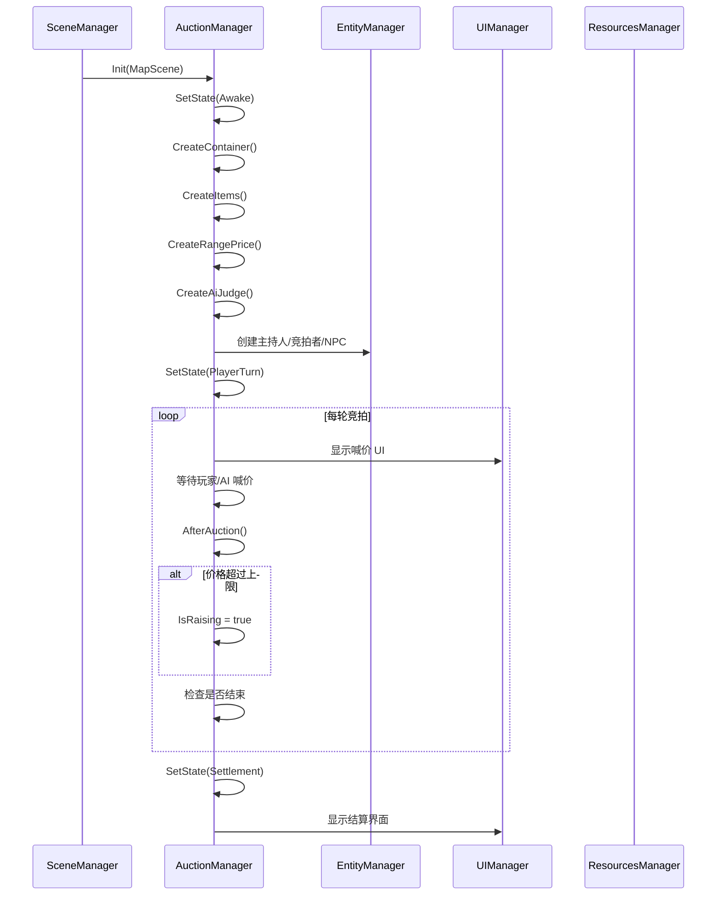

# AuctionManager.cs 注解文档

## 文件基本信息

| 属性 | 值 |
|------|-----|
| **文件名** | AuctionManager.cs |
| **路径** | Assets/Scripts/Code/Game/System/Auction/AuctionManager.cs |
| **所属模块** | 游戏系统 → Auction (拍卖系统) |
| **文件职责** | 拍卖游戏核心管理器，负责竞拍流程、集装箱生成、物品生成、AI 喊价、抬价逻辑 |

---

## 类/结构体说明

### AuctionManager

| 属性 | 说明 |
|------|------|
| **职责** | 拍卖游戏核心管理器，管理竞拍流程、集装箱盲盒生成、物品分配、AI 决策、喊价逻辑 |
| **泛型参数** | 无 |
| **继承关系** | `partial class` (与 API/State/Anim/AIMiniPlay 文件共同组成完整类) |
| **实现的接口** | `IManager<MapScene>` |

**设计模式**: 状态机 + 部分类 + 单例

```csharp
// 单例实现
IAuctionManager.Instance = this;

// 通过 ManagerProvider 注册
ManagerProvider.RegisterManager<AuctionManager, MapScene>(mapScene);
```

---

## 字段与属性（按重要程度排序）

| 名称 | 类型 | 访问级别 | 说明 |
|------|------|----------|------|
| `Instance` | `IAuctionManager` | `public static` | 单例实例（通过接口访问） |
| `AState` | `AuctionState` | `public` | 当前拍卖状态 |
| `Level` | `int` | `public` | 难度等级 |
| `Stage` | `int` | `public` | 轮次（从 1 开始） |
| `Player` | `Player` | `public` | 玩家实体 |
| `HostId` | `long` | `public` | 主持人实体 ID |
| `Bidders` | `List<long>` | `public` | 竞拍者 ID 列表 |
| `Npcs` | `List<long>` | `public` | NPC ID 列表 |
| `Boxes` | `List<long>` | `public` | 宝盒 ID 列表 |
| `AuctionReports` | `AuctionReport[]` | `public` | 本场集装箱盲盒数据数组 |
| `Report` | `AuctionReport` | `public` | 本轮数据（当前 Stage） |
| `AllPrice` | `BigNumber` | `public` | 物品总价值 |
| `LastAuctionPrice` | `BigNumber` | `public` | 上一次叫价 |
| `LastAuctionPlayerId` | `long` | `public` | 上一个叫价的人（-1 没有，0 玩家，其他 AIid） |
| `IsRaising` | `bool` | `public` | 是否抬价阶段 |
| `RaiseCount` | `int` | `public` | 抬价次数 |
| `RaiseSuccessCount` | `int` | `public` | 玩家成功抬价次数 |
| `SysJudgePriceMin` | `float` | `public` | 系统判断价格最小值 |
| `SysJudgePriceMax` | `float` | `public` | 系统判断价格最大值 |
| `GameInfoId` | `int` | `public` | 情报 ID |
| `DiceId` | `int` | `public` | 命运骰子 ID |
| `StartEventId` | `int` | `public` | 开局事件 ID |
| `HasMiniPlayItem` | `bool` | `public` | 是否有小玩法物品 |
| `HasTaskItem` | `bool` | `public` | 是否有任务物品 |
| `Skip` | `bool` | `public` | 快速跳过模式 |

---

## 方法说明（按重要程度排序）

### Init(MapScene map)

**签名**:
```csharp
public void Init(MapScene map)
```

**职责**: 初始化拍卖管理器

**核心逻辑**:
```
1. 读取全局配置 HostSayStart, HostSayInterval, MiniPlayPercent
2. 设置单例 IAuctionManager.Instance = this
3. 保存 MapScene 引用
4. 设置难度等级 Level
5. 设置初始状态 AuctionState.Awake
6. 注册消息监听 ClipStartPlay
```

**调用者**: ManagerProvider.RegisterManager<AuctionManager, MapScene>()

---

### Destroy()

**签名**:
```csharp
public void Destroy()
```

**职责**: 销毁拍卖管理器，清理资源

**核心逻辑**:
```
1. 销毁掉落物品
2. 移除 UFO 实体
3. 移除消息监听
4. 释放图片资源
5. 取消所有异步任务
6. 清空所有列表
7. 设置状态为 Free
8. 恢复玩家旗帜显示
9. 清空单例引用
```

**调用者**: ManagerProvider.RemoveManager<AuctionManager>()

---

### CreateContainer()

**签名**:
```csharp
private void CreateContainer()
```

**职责**: 生成集装箱盲盒序列

**核心逻辑**:
```
1. 获取当前等级的所有轮次配置
2. 初始化 AuctionReports 数组
3. 如果骰子指定集装箱，直接使用指定配置
4. 否则根据权重随机选择特殊集装箱和普通集装箱
5. 考虑科技树解锁的集装箱
6. 打乱顺序（除非触发新解锁科技树）
7. 替换集装箱纹理
```

**调用者**: 状态机流程（Awake 状态）

---

### CreateItems()

**签名**:
```csharp
private void CreateItems()
```

**职责**: 生成本轮物品并装箱

**核心逻辑**:
```
1. 判断是否为全玩法集装箱
2. 随机任务物品
3. 随机全局玩法物品
4. 随机特殊玩法物品
5. 随机剧情物品
6. 生成白色普通物品（6 个总物品数）
7. 调整总价格到配置区间内
8. 使用 AuctionHelper.PackBoxes 进行 3D 装箱
9. 创建 Box 实体并设置位置旋转
10. 创建 UFO 实体
```

**调用者**: 状态机流程

**价格区间调整算法**:
```
1. 如果总价 > maxPrice: 移除最贵的，找便宜的替换
2. 如果总价 < minPrice: 移除最便宜的，找贵的替换
3. 最多尝试 100 次
```

---

### CreateRangePrice()

**签名**:
```csharp
private void CreateRangePrice()
```

**职责**: 生成系统判断价格的低区间与高区间

**核心逻辑**:
```
1. 根据配置权重随机选择最小值区间
2. 根据配置权重随机选择最大值区间
3. 应用服装效果减免 (JudgePriceReduce)
```

**调用者**: 状态机流程

---

### CreateAiJudge()

**签名**:
```csharp
private void CreateAiJudge()
```

**职责**: 为每个 AI 生成判断价值

**核心逻辑**:
```
1. 遍历所有竞拍者
2. 获取 AI 知识组件
3. 根据偏差范围随机生成判断价值：judge = AllPrice * Random(minDeviation, maxDeviation)
```

**调用者**: 状态机流程

---

### AIAuction(long id, AIDecision decision)

**签名**:
```csharp
private void AIAuction(long id, AIDecision decision)
```

**职责**: AI 喊价执行

**核心逻辑**:
```
1. 检查决策类型不能是观望
2. 根据策略类型计算喊价金额：
   - LowWeight: LowAuction
   - MediumWeight: MediumAuction
   - HighWeight: HighAuction
   - AllIn: AI 全部金钱
3. 检查 AI 金钱是否足够
4. 更新 AI 状态（消极次数、复仇次数、抬价次数）
5. 显示喊价气泡
6. 调用 AfterAuction 处理后续
7. 切换到 AIThink 状态
```

**调用者**: 状态机流程（AIThink 状态）

---

### AfterAuction(long id, AITactic type)

**签名**:
```csharp
private void AfterAuction(long id, AITactic type)
```

**职责**: 喊价后数据处理

**核心逻辑**:
```
1. 播放喊价音效
2. 更新出价次数统计
3. 如果是玩家喊价，更新玩家抬价成功次数
4. 播放喊价气泡动画
5. 更新抬价阶段状态（如果价格超过 SysJudgePriceMax）
6. 更新所有 AI 的高价震慑状态
7. 更新所有 AI 的生气状态
8. 检查是否触发大转盘掉落物品
```

**调用者**: AIAuction(), PlayerAuction()

---

### LowAuction / MediumAuction / HighAuction

**签名**:
```csharp
public BigNumber LowAuction { get; }
public BigNumber MediumAuction { get; }
public BigNumber HighAuction { get; }
```

**职责**: 计算低/中/高价

**计算公式**:
```
LowAuction = LastAuctionPrice + Config.Auction1 + Config.RaiseAuctionAddon * RaiseCount
MediumAuction = LastAuctionPrice + Config.Auction2 + Config.RaiseAuctionAddon * RaiseCount
HighAuction = LastAuctionPrice + Config.Auction3 + Config.RaiseAuctionAddon * RaiseCount
```

---

### CreateDropItem()

**签名**:
```csharp
private async ETTask CreateDropItem()
```

**职责**: 创建大转盘掉落物品动画

**核心逻辑**:
```
1. 销毁旧掉落物品
2. 创建转盘动物实体
3. 设置初始位置（上方 5 单位）
4. 模拟自由落体动画
5. 落地后归零位置
```

**调用者**: AfterAuction()（随机触发）

---

## 拍卖状态机流程

### 完整流程图


```mermaid
sequenceDiagram
    participant SM as SceneManager
    participant AM as AuctionManager
    participant EM as EntityManager
    participant UM as UIManager
    participant RM as ResourcesManager

    SM->>AM: Init(MapScene)
    AM->>AM: SetState(Awake)
    
    AM->>AM: CreateContainer()
    AM->>AM: CreateItems()
    AM->>AM: CreateRangePrice()
    AM->>AM: CreateAiJudge()
    
    AM->>EM: 创建主持人/竞拍者/NPC
    AM->>AM: SetState(PlayerTurn)
    
    loop 每轮竞拍
        AM->>UM: 显示喊价 UI
        AM->>AM: 等待玩家/AI 喊价
        AM->>AM: AfterAuction()
        alt 价格超过上限
            AM->>AM: IsRaising = true
        end
        AM->>AM: 检查是否结束
    end
    
    AM->>AM: SetState(Settlement)
    AM->>UM: 显示结算界面
```

### 状态转换

```
Awake → CreateContainer → CreateItems → CreateRangePrice → CreateAiJudge
  ↓
InitBidder → CreateHost → PlayerTurn (等待玩家喊价)
  ↓
AIThink (AI 决策) → AIAuction → AfterAuction
  ↓
循环直到所有玩家 Pass → Settlement (结算)
```

---

## 核心算法

### 3D 装箱算法

```csharp
// 使用 AuctionHelper.PackBoxes
// 1. 按体积降序排序（大箱子优先）
// 2. 尝试每个剩余空间
// 3. 尝试每种旋转方向
// 4. 分割剩余空间（X/Y/Z 三个方向）
// 5. 递归放置直到所有箱子放置完成或失败
```

### 价格区间调整

```
目标：总价格在 [minPrice, maxPrice] 区间内

算法:
1. 排序物品（价格从低到高）
2. 如果总价 > maxPrice:
   - 移除最贵的物品
   - 找一个便宜的物品替换（保证新总价在区间内）
3. 如果总价 < minPrice:
   - 移除最便宜的物品
   - 找一个贵的物品替换
4. 最多尝试 100 次
```

### 特殊集装箱随机

```csharp
// 根据权重随机特殊集装箱数量
totalWeight = Sum(weights)
random = Random(0, totalWeight)
for each (count, weight):
    random -= weight
    if random <= 0: return count
```

---

## 使用示例

### 获取拍卖管理器

```csharp
// 通过接口获取
var auction = IAuctionManager.Instance as AuctionManager;

// 访问当前状态
var state = auction.AState;
var stage = auction.Stage;
var allPrice = auction.AllPrice;
```

### 检查抬价阶段

```csharp
if (IAuctionManager.Instance.IsRaising)
{
    // 抬价阶段逻辑
    var raiseCount = IAuctionManager.Instance.RaiseCount;
    var mul = AuctionHelper.GetRaiseMul(raiseCount);
}
```

### 获取当前轮数据

```csharp
var report = IAuctionManager.Instance.Report;
var items = report.Items;
var containerId = report.ContainerId;
var allPriceStr = report.AllPriceStr;
```

---

## 相关文档

- [AuctionHelper.cs.md](./AuctionHelper.cs.md) - 拍卖辅助工具
- [AuctionGuideManager.cs.md](./AuctionGuideManager.cs.md) - 引导场景拍卖管理器
- [IAuctionManager.cs.md](./IAuctionManager.cs.md) - 拍卖管理器接口
- [AuctionState.cs.md](./AuctionState.cs.md) - 拍卖状态枚举
- [AuctionReport.cs](../../Config/Generate/Config/AuctionReport.cs) - 拍卖报告数据结构

---

*文档生成时间：2026-03-02 | OpenClaw AI 助手*
