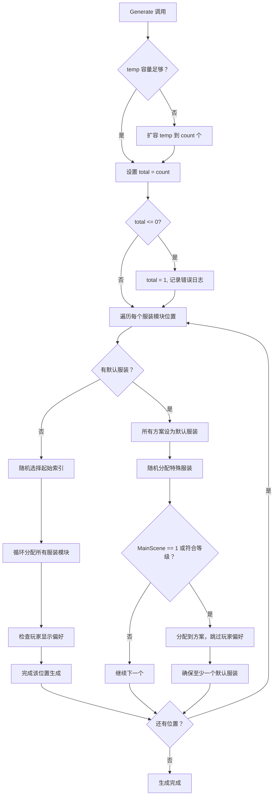

# ClothGenerateManager.cs 注解文档

## 文件基本信息

| 属性 | 值 |
|------|-----|
| **文件名** | ClothGenerateManager.cs |
| **路径** | Assets/Scripts/Code/Game/System/Entity/ClothGenerateManager.cs |
| **所属模块** | 游戏层 → Code/Game/System/Entity |
| **文件职责** | 服装生成管理器，负责批量生成 NPC/角色的随机服装搭配方案 |

---

## 类/结构体说明

### ClothGenerateManager

| 属性 | 说明 |
|------|------|
| **职责** | 预生成一批随机服装搭配方案，支持按等级过滤，用于 NPC 外观多样化 |
| **泛型参数** | 无 |
| **继承关系** | 无继承 |
| **实现的接口** | `IManager` |

**设计模式**: 单例模式 + 对象池 + 预生成策略

```csharp
// 单例实现
public static ClothGenerateManager Instance { get; private set; }

// 通过 ManagerProvider 注册
ManagerProvider.RegisterManager<ClothGenerateManager>();
```

**核心设计理念**:
- **预生成策略**: 提前生成一批服装搭配方案，避免运行时频繁计算
- **循环复用**: 使用 offset 循环获取方案，超出数量时自动回绕
- **等级过滤**: 支持按角色等级过滤可用的服装模块

---

## 字段与属性（按重要程度排序）

| 名称 | 类型 | 访问级别 | 说明 |
|------|------|----------|------|
| `Instance` | `ClothGenerateManager` | `public static` | 单例实例，全局访问点 |
| `temp` | `ListComponent<int[]>` | `private` | 预生成的服装搭配方案池（对象池复用） |
| `total` | `int` | `private` | 生成的总方案数量 |
| `offset` | `int` | `private` | 当前获取方案的偏移索引（循环使用） |

---

## 方法说明（按重要程度排序）

### Init()

**签名**:
```csharp
public void Init()
```

**职责**: 初始化服装生成管理器

**核心逻辑**:
```
1. 设置单例 Instance = this
2. 初始化 total = 0
3. 创建 ListComponent 对象池 temp
```

**调用者**: ManagerProvider.RegisterManager<ClothGenerateManager>()

---

### Destroy()

**签名**:
```csharp
public void Destroy()
```

**职责**: 销毁服装生成管理器，释放资源

**核心逻辑**:
```
1. 重置 total = 0
2. 释放对象池 temp.Dispose()
3. 设置 Instance = null
```

**调用者**: ManagerProvider.RemoveManager<ClothGenerateManager>()

---

### Generate(count, level)

**签名**:
```csharp
public void Generate(int count, int? level)
```

**职责**: 预生成指定数量的随机服装搭配方案

**参数说明**:
| 参数 | 类型 | 说明 |
|------|------|------|
| `count` | `int` | 需要生成的方案数量 |
| `level` | `int?` | 可选，角色等级（用于过滤服装） |

**核心逻辑**:
```
1. 获取所有角色配置列表 CharacterConfigCategory.Instance.GetAllList()
2. 如果 temp 容量不足，扩容到 count 个
3. 设置 total = count（至少为 1）
4. 遍历每个服装模块位置（头部、身体、腿部等）：
   a. 获取该位置的服装模块配置 ClothConfigCategory.Instance.GetModule()
   b. 如果角色有默认服装 (DefaultCloth != 0)：
      - 所有方案先设置为默认服装
      - 随机分配特殊服装（MainScene == 1 或符合等级）
      - 确保至少一个方案使用默认服装
   c. 如果角色无默认服装：
      - 随机选择一个起始索引
      - 循环分配所有可用服装模块
      - 检查玩家显示偏好（如果已设置）
5. 完成生成
```

**调用者**: NPC 生成逻辑、角色创建流程

**被调用者**: `CharacterConfigCategory`, `ClothConfigCategory`, `PlayerDataManager`, `Random.Range()`, `models.RandomSort()`

**使用示例**:
```csharp
// 为家园场景生成 50 个 NPC 的服装方案（无等级限制）
ClothGenerateManager.Instance.Generate(50, null);

// 为等级 3 的角色生成 30 个服装方案
ClothGenerateManager.Instance.Generate(30, level: 3);
```

---

### GetNext()

**签名**:
```csharp
public int[] GetNext()
```

**职责**: 获取下一个预生成的服装搭配方案

**返回值**: `int[]` - 服装 ID 数组，每个元素对应一个服装模块位置的 ID

**核心逻辑**:
```
1. 计算最大数量 max = Max(total, temp.Count)
2. 更新偏移量 offset = (offset + 1) % max（循环回绕）
3. 返回 temp[offset] 方案
```

**调用者**: NPC 实例化时获取外观配置

**使用示例**:
```csharp
// 获取下一个服装方案
int[] clothScheme = ClothGenerateManager.Instance.GetNext();

// 应用到 NPC
for (int i = 0; i < clothScheme.Length; i++)
{
    npc.SetClothModule(i, clothScheme[i]);
}
```

---

## 核心流程

### 服装生成流程



### 获取方案流程


---

## 使用示例

### 基础使用

```csharp
// 1. 初始化（由 ManagerProvider 自动完成）
// ManagerProvider.RegisterManager<ClothGenerateManager>();

// 2. 生成 100 个 NPC 的服装方案（无等级限制）
ClothGenerateManager.Instance.Generate(100, null);

// 3. 为每个 NPC 分配服装
for (int i = 0; i < 100; i++)
{
    int[] clothScheme = ClothGenerateManager.Instance.GetNext();
    SpawnNPC(clothScheme);
}
```

### 按等级生成

```csharp
// 为等级 5 的玩家生成服装方案（只显示等级 5 可用的服装）
ClothGenerateManager.Instance.Generate(50, level: 5);

// 获取方案
int[] playerCloth = ClothGenerateManager.Instance.GetNext();
```

### 与 NPC 系统集成

```csharp
public class NPCManager : IManager
{
    public void SpawnNPCs(int count)
    {
        // 预生成服装方案
        ClothGenerateManager.Instance.Generate(count, null);
        
        // 批量生成 NPC
        for (int i = 0; i < count; i++)
        {
            int[] clothScheme = ClothGenerateManager.Instance.GetNext();
            var npc = EntityManager.Instance.Create<NPC>();
            npc.ApplyClothScheme(clothScheme);
            npc.Spawn();
        }
    }
}
```

---

## 相关文档链接

- [EntityManager.cs.md](./EntityManager.cs.md) - 实体管理器
- [CharacterConfigCategory.cs.md](../../../Module/Config/Category/CharacterConfigCategory.cs.md) - 角色配置分类
- [ClothConfigCategory.cs.md](../../../Module/Config/Category/ClothConfigCategory.cs.md) - 服装配置分类
- [PlayerDataManager.cs.md](../Player/PlayerDataManager.cs.md) - 玩家数据管理
- [IManager.cs.md](../../../../Mono/Core/Manager/IManager.cs.md) - 管理器接口定义
- [ManagerProvider.cs.md](../../../../Mono/Core/Manager/ManagerProvider.cs.md) - 管理器提供者

---

## 注意事项

### 性能优化

1. **对象池复用**: 使用 `ListComponent<int[]>` 避免频繁 GC
2. **预生成策略**: 提前计算所有方案，运行时只读取
3. **循环索引**: offset 循环使用，避免数组越界

### 潜在问题

1. **线程安全**: 该方法不是线程安全的，避免在多线程环境下调用
2. **内存占用**: 大量生成方案会占用较多内存，建议根据实际需求调整 count
3. **随机性**: 使用 Unity 的 Random.Range()，确保在游戏主线程调用

### 扩展建议

1. 支持权重配置：某些服装可以设置更高的出现概率
2. 支持套装搭配：确保同一套装的服装部件一起出现
3. 支持季节性服装：根据现实时间或游戏时间切换可用服装池

---

*文档生成时间：2026-03-02*
