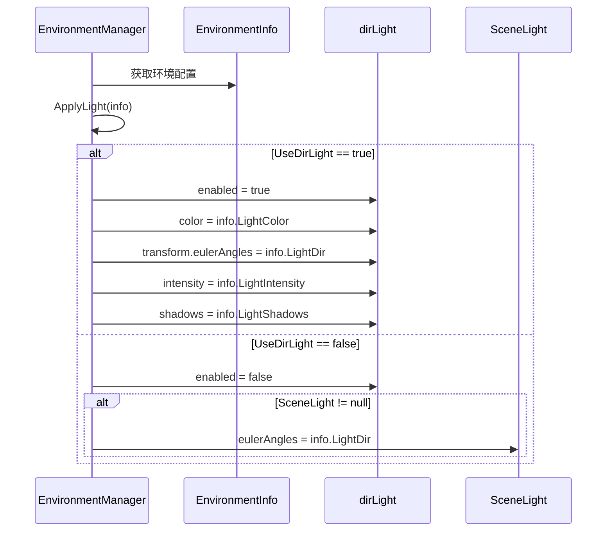

# EnvironmentManager.Light.cs 注解文档

## 文件基本信息

| 属性 | 值 |
|------|-----|
| **文件名** | EnvironmentManager.Light.cs |
| **路径** | Assets/Scripts/Code/Game/System/Environment/EnvironmentManager.Light.cs |
| **所属模块** | 游戏系统 → Environment (环境系统) |
| **文件职责** | EnvironmentManager 的部分类实现，负责环境光照系统的应用 |

---

## 类/结构体说明

### EnvironmentManager (部分类)

| 属性 | 说明 |
|------|------|
| **职责** | 环境管理器 - 光照应用部分，负责将环境配置应用到场景光源 |
| **泛型参数** | 无 |
| **继承关系** | `partial class EnvironmentManager` |
| **实现的接口** | 无 (主类实现 `IManager`, `IUpdate`) |

**设计模式**: 部分类 (Partial Class) - 将大型类按功能拆分到多个文件

```csharp
// 部分类实现 - 光照相关功能
public partial class EnvironmentManager
{
    private partial void ApplyLight(EnvironmentInfo info);
}
```

---

## 字段与属性（按重要程度排序）

| 名称 | 类型 | 访问级别 | 说明 |
|------|------|----------|------|
| `dirLight` | `Light` | `private` | 方向光组件，用于场景主光源 |
| `SceneLight` | `Transform` | `public` | 场景光源 Transform，用于备用光源控制 |

---

## 方法说明（按重要程度排序）

### ApplyLight(EnvironmentInfo info)

**签名**:
```csharp
private partial void ApplyLight(EnvironmentInfo info)
```

**职责**: 应用环境配置到光照系统

**核心逻辑**:
```
1. 检查是否使用方向光 (info.UseDirLight)
2. 如果使用方向光:
   - 启用 dirLight
   - 设置光源颜色 (LightColor)
   - 设置光源旋转角度 (LightDir)
   - 设置光源强度 (LightIntensity)
   - 设置阴影类型 (LightShadows)
3. 如果不使用方向光但有 SceneLight:
   - 仅设置 SceneLight 的旋转角度
```

**调用者**: `EnvironmentManager.ApplyEnvironmentInfo()` (主类)

**被调用者**: 无

**使用示例**:
```csharp
// 内部调用，无需手动调用
// 当环境配置变更时自动应用
var envManager = ManagerProvider.GetManager<EnvironmentManager>();
// ApplyLight 会在 Update 中自动调用
```

---

## 光照应用流程

### 流程图



---

## 光照配置参数

### EnvironmentInfo 光照相关属性

| 属性 | 类型 | 说明 |
|------|------|------|
| `UseDirLight` | `bool` | 是否使用方向光 |
| `LightColor` | `Color` | 光源颜色 |
| `LightDir` | `Vector3` | 光源方向 (欧拉角) |
| `LightIntensity` | `float` | 光源强度 |
| `LightShadows` | `LightShadows` | 阴影类型 (None/Hard/Soft) |

---

## 使用示例

### 示例 1: 创建白天环境

```csharp
// 创建白天环境 (自动应用光照)
var envId = EnvironmentManager.Instance.Create(1, EnvironmentPriorityType.Default);
// 光照会自动设置为白天配置 (强光、白色、短阴影)
```

### 示例 2: 创建夜晚环境

```csharp
// 创建夜晚环境
var envId = EnvironmentManager.Instance.Create(2, EnvironmentPriorityType.Default);
// 光照会自动设置为夜晚配置 (弱光、蓝色、长阴影)
```

### 示例 3: 切换环境

```csharp
// 创建高优先级环境 (如室内)
var indoorEnvId = EnvironmentManager.Instance.Create(3, EnvironmentPriorityType.Indoor);
// 光照会自动切换到室内配置

// 移除室内环境，恢复到默认环境
EnvironmentManager.Instance.Remove(indoorEnvId);
// 光照会自动恢复到默认环境配置
```

---

## 与其他模块的交互

```mermaid
graph TD
    subgraph Env["环境系统"]
        EM[EnvironmentManager]
        EI[EnvironmentInfo]
    end
    
    subgraph Unity["Unity 引擎"]
        DL[Directional Light]
        SL[Scene Light Transform]
    end
    
    EM --> EI
    EM --> DL
    EM --> SL
    
    note right of EM "ApplyLight 方法将<br/>EnvironmentInfo 配置<br/>应用到 Unity 光源"
    
    style Env fill:#e1f5ff
    style Unity fill:#fff4e1
```

**依赖关系**:
- **依赖**: `EnvironmentInfo` (环境配置数据)
- **被依赖**: 无 (光照应用是终端操作)

---

## 阅读指引

### 建议的阅读顺序

1. **理解部分类设计** - 为什么使用 partial class
2. **看字段定义** - 了解 dirLight 和 SceneLight 的作用
3. **重点看 ApplyLight** - 理解光照应用逻辑
4. **了解配置参数** - 理解 EnvironmentInfo 的光照属性

### 最值得学习的技术点

1. **部分类拆分**: 将大型类按功能拆分到多个文件，便于维护
2. **条件光照**: 支持方向光和 Transform 两种光源模式
3. **配置驱动**: 所有光照参数来自配置，支持动态切换

---

## 相关文档

- [EnvironmentManager.cs.md](./EnvironmentManager.cs.md) - 环境管理器主类
- [EnvironmentManager.Skybox.cs.md](./EnvironmentManager.Skybox.cs.md) - 天空盒应用部分
- [EnvironmentInfo.cs.md](./Data/EnvironmentInfo.cs.md) - 环境配置数据结构
- [EnvironmentPriorityType.cs.md](./EnvironmentPriorityType.cs.md) - 环境优先级类型
- [DayEnvironmentRunner.cs.md](./Runner/DayEnvironmentRunner.cs.md) - 昼夜环境运行器

---

*文档生成时间：2026-03-02 | OpenClaw AI 助手*
