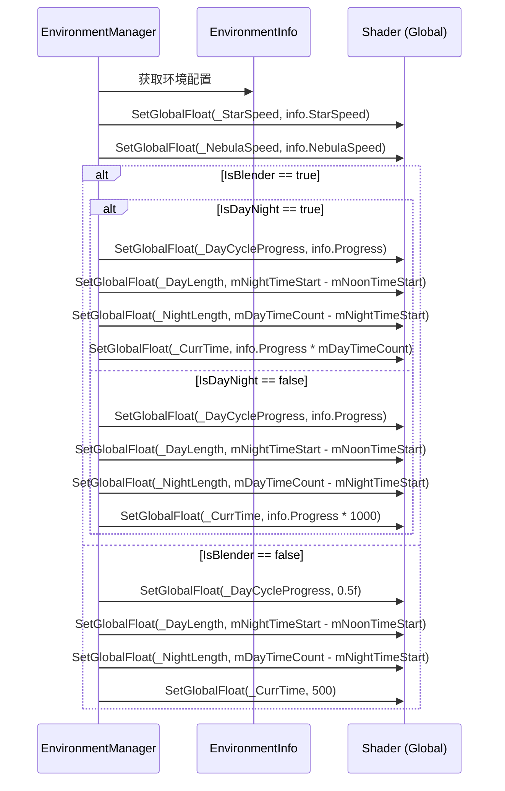

# EnvironmentManager.Skybox.cs 注解文档

## 文件基本信息

| 属性 | 值 |
|------|-----|
| **文件名** | EnvironmentManager.Skybox.cs |
| **路径** | Assets/Scripts/Code/Game/System/Environment/EnvironmentManager.Skybox.cs |
| **所属模块** | 游戏系统 → Environment (环境系统) |
| **文件职责** | EnvironmentManager 的部分类实现，负责天空盒着色器参数的应用 |

---

## 类/结构体说明

### EnvironmentManager (部分类)

| 属性 | 说明 |
|------|------|
| **职责** | 环境管理器 - 天空盒应用部分，负责将环境配置应用到天空盒着色器 |
| **泛型参数** | 无 |
| **继承关系** | `partial class EnvironmentManager` |
| **实现的接口** | 无 (主类实现 `IManager`, `IUpdate`) |

**设计模式**: 部分类 (Partial Class) - 将大型类按功能拆分到多个文件

```csharp
// 部分类实现 - 天空盒相关功能
public partial class EnvironmentManager
{
    private partial void ApplySkybox(EnvironmentInfo info);
}
```

---

## 字段与属性（按重要程度排序）

| 名称 | 类型 | 访问级别 | 说明 |
|------|------|----------|------|
| `StarSpeed` | `int` | `private` | 星星速度着色器属性 ID |
| `NebulaSpeed` | `int` | `private` | 星云速度着色器属性 ID |
| `DayCycleProgress` | `int` | `private` | 昼夜循环进度着色器属性 ID |
| `DayLength` | `int` | `private` | 白天时长着色器属性 ID |
| `NightLength` | `int` | `private` | 夜晚时长着色器属性 ID |
| `CurrTime` | `int` | `private` | 当前时间着色器属性 ID |

**着色器属性 ID 缓存**:
```csharp
// 使用 Shader.PropertyToID 缓存属性 ID，避免每次查找
private int StarSpeed = Shader.PropertyToID("_StarSpeed");
private int NebulaSpeed = Shader.PropertyToID("_NebulaSpeed");
private int DayCycleProgress = Shader.PropertyToID("_DayCycleProgress");
private int DayLength = Shader.PropertyToID("_DayLength");
private int NightLength = Shader.PropertyToID("_NightLength");
private int CurrTime = Shader.PropertyToID("_CurrTime");
```

---

## 方法说明（按重要程度排序）

### ApplySkybox(EnvironmentInfo info)

**签名**:
```csharp
private partial void ApplySkybox(EnvironmentInfo info)
```

**职责**: 应用环境配置到天空盒着色器

**核心逻辑**:
```
1. 设置星星速度 (StarSpeed)
2. 设置星云速度 (NebulaSpeed)
3. 检查是否为 Blender 模式 (info.IsBlender)
4. 如果是 Blender 模式:
   - 检查是否为昼夜循环 (info.IsDayNight)
   - 设置昼夜循环进度、白天时长、夜晚时长、当前时间
5. 如果不是 Blender 模式:
   - 设置固定进度 0.5
   - 设置固定时间 500
```

**调用者**: `EnvironmentManager.ApplyEnvironmentInfo()` (主类)

**被调用者**: 无

**使用示例**:
```csharp
// 内部调用，无需手动调用
// 当环境配置变更时自动应用
var envManager = ManagerProvider.GetManager<EnvironmentManager>();
// ApplySkybox 会在 Update 中自动调用
```

---

## 天空盒着色器参数

### 全局着色器参数

| 参数名 | 类型 | 说明 | 取值范围 |
|--------|------|------|----------|
| `_StarSpeed` | `float` | 星星动画速度 | 0-1 |
| `_NebulaSpeed` | `float` | 星云动画速度 | 0-1 |
| `_DayCycleProgress` | `float` | 昼夜循环进度 | 0-1 |
| `_DayLength` | `float` | 白天时长 (毫秒) | 0-1200000 |
| `_NightLength` | `float` | 夜晚时长 (毫秒) | 0-1200000 |
| `_CurrTime` | `float` | 当前时间 (毫秒) | 0-1200000 |

### EnvironmentInfo 天空盒相关属性

| 属性 | 类型 | 说明 |
|------|------|------|
| `StarSpeed` | `float` | 星星速度 |
| `NebulaSpeed` | `float` | 星云速度 |
| `IsBlender` | `bool` | 是否为混合模式 |
| `IsDayNight` | `bool` | 是否为昼夜循环 |
| `Progress` | `float` | 循环进度 (0-1) |

---

## 天空盒应用流程

### 流程图



### 时间常量说明

```csharp
// 游戏世界一天的总时长 (毫秒)
const int mDayTimeCount = 1200_000;  // 1200 秒 = 20 分钟

// 中午开始时间 (毫秒)
const int mNoonTimeStart = 0;

// 晚上开始时间 (毫秒)
const int mNightTimeStart = 800_000;  // 800 秒 = 13 分 20 秒

// 计算:
// 白天时长 = mNightTimeStart - mNoonTimeStart = 800_000ms = 13 分 20 秒
// 夜晚时长 = mDayTimeCount - mNightTimeStart = 400_000ms = 6 分 40 秒
```

---

## 使用示例

### 示例 1: 创建昼夜循环环境

```csharp
// 创建昼夜循环环境 (自动应用天空盒)
var envId = EnvironmentManager.Instance.CreateDayNight(
    noonId: 1,      // 白天环境 ID
    nightId: 2,     // 夜晚环境 ID
    priority: EnvironmentPriorityType.DayNight
);
// 天空盒会自动设置昼夜循环参数
```

### 示例 2: 创建混合环境

```csharp
// 创建混合环境 (如黄昏过渡)
var envId = EnvironmentManager.Instance.Create(3, EnvironmentPriorityType.Default);
// 天空盒会自动设置为混合模式
```

### 示例 3: 自定义天空盒材质

```csharp
// 在 Shader 中访问全局参数
Shader.GetGlobalFloat("_DayCycleProgress");  // 获取当前昼夜进度
Shader.GetGlobalFloat("_CurrTime");          // 获取当前时间
```

---

## 与其他模块的交互

```mermaid
graph TD
    subgraph Env["环境系统"]
        EM[EnvironmentManager]
        EI[EnvironmentInfo]
    end
    
    subgraph Shader["Unity Shader"]
        GS[Global Shader Parameters]
        SB[Skybox Material]
    end
    
    EM --> EI
    EM --> GS
    GS --> SB
    
    note right of EM "ApplySkybox 方法将<br/>EnvironmentInfo 配置<br/>应用到全局 Shader 参数"
    
    style Env fill:#e1f5ff
    style Shader fill:#fff4e1
```

**依赖关系**:
- **依赖**: `EnvironmentInfo` (环境配置数据)
- **被依赖**: 天空盒材质 (读取全局 Shader 参数)

---

## 阅读指引

### 建议的阅读顺序

1. **理解部分类设计** - 为什么使用 partial class
2. **看字段定义** - 了解着色器属性 ID 的作用
3. **重点看 ApplySkybox** - 理解天空盒参数应用逻辑
4. **了解时间常量** - 理解昼夜循环的时间计算

### 最值得学习的技术点

1. **部分类拆分**: 将大型类按功能拆分到多个文件，便于维护
2. **Shader 属性 ID 缓存**: 使用 `Shader.PropertyToID` 避免每次查找
3. **全局 Shader 参数**: 使用 `Shader.SetGlobalFloat` 统一控制天空盒
4. **昼夜循环计算**: 基于时间常量和进度计算当前时间

---

## 相关文档

- [EnvironmentManager.cs.md](./EnvironmentManager.cs.md) - 环境管理器主类
- [EnvironmentManager.Light.cs.md](./EnvironmentManager.Light.cs.md) - 光照应用部分
- [EnvironmentInfo.cs.md](./Data/EnvironmentInfo.cs.md) - 环境配置数据结构
- [DayEnvironmentRunner.cs.md](./Runner/DayEnvironmentRunner.cs.md) - 昼夜环境运行器
- [BlenderEnvironmentRunner.cs.md](./Runner/BlenderEnvironmentRunner.cs.md) - 混合环境运行器

---

*文档生成时间：2026-03-02 | OpenClaw AI 助手*
