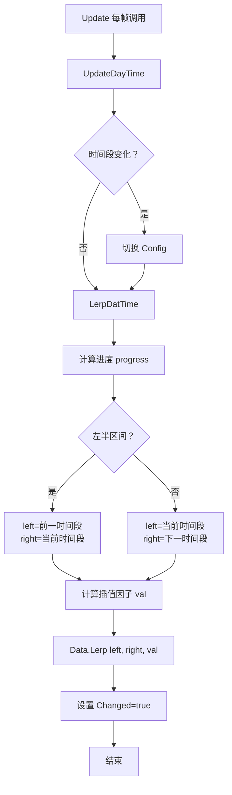

# DayEnvironmentRunner.cs 注解文档

## 文件基本信息

| 属性 | 值 |
|------|-----|
| **文件名** | DayEnvironmentRunner.cs |
| **路径** | Assets/Scripts/Code/Game/System/Environment/Runner/DayEnvironmentRunner.cs |
| **所属模块** | 游戏层 → System/Environment/Runner |
| **文件职责** | 昼夜环境运行器，处理白天/夜晚环境的平滑过渡 |

---

## 类说明

### DayEnvironmentRunner

| 属性 | 说明 |
|------|------|
| **职责** | 根据游戏时间自动切换白天/夜晚环境配置，支持平滑过渡 |
| **继承关系** | 继承 `NormalEnvironmentRunner` |
| **设计模式** | 对象池模式 + 状态机 + 线性插值 |

**核心功能**:
- 根据游戏时间判断当前时间段（白天/夜晚）
- 计算时间段过渡进度
- 使用缓动函数平滑过渡环境参数
- 对象池复用

---

## 字段与属性

| 名称 | 类型 | 访问级别 | 说明 |
|------|------|----------|------|
| `datas` | `ConfigEnvironment[]` | `private` | 环境配置数组 [白天，夜晚] |
| `dayTimes` | `int[]` | `private` | 时间段开始时间 [白天开始，夜晚开始] |
| `dayHalfInterval` | `int[]` | `private` | 时间段半区间（过渡时间） |
| `daytimetype` | `DayTimeType` | `private` | 当前时间段类型 |
| `lerpFunc` | `EasingFunction.Function` | `private` | 缓动函数（线性插值） |

**继承字段** (来自 NormalEnvironmentRunner):
- `environmentManager`: 环境管理器引用
- `Id`: 运行器 ID
- `Priority`: 优先级
- `Data`: 当前环境数据
- `Config`: 当前环境配置
- `IsOver`: 是否结束

---

## 方法说明

### Create() (静态工厂方法)

**签名**:
```csharp
public static DayEnvironmentRunner Create(
    ConfigEnvironment noon,
    ConfigEnvironment night,
    EnvironmentPriorityType priority,
    EnvironmentManager environmentManager)
```

**职责**: 创建并初始化昼夜环境运行器

**参数**:
- `noon`: 白天环境配置
- `night`: 夜晚环境配置
- `priority`: 环境优先级
- `environmentManager`: 环境管理器

**核心逻辑**:
```
1. 从对象池获取实例 ObjectPool.Instance.Fetch<DayEnvironmentRunner>()
2. 设置 environmentManager 和生成 Id
3. 设置 datas = [noon, night]
4. 设置 Priority
5. 设置 dayTimes = [NoonTimeStart, NightTimeStart]
6. 计算 dayHalfInterval (过渡时间):
   - 每个时间段的半区间 = (周期 + 开始时间差) / 2
   - 对 DayTimeCount 取模
7. 获取线性缓动函数 EasingFunction.Linear
8. 调用 UpdateDayTime() 初始化时间段
9. 创建 EnvironmentInfo 数据
10. 调用 LerpDatTime() 计算初始插值
11. 设置 IsOver = false
12. 返回实例
```

**调用者**: EnvironmentManager.AddDayEnvironment()

**使用示例**:
```csharp
var dayRunner = DayEnvironmentRunner.Create(
    noonConfig,      // 白天配置
    nightConfig,     // 夜晚配置
    EnvironmentPriorityType.DayNight,
    environmentManager
);
```

---

### Update()

**签名**:
```csharp
public override void Update()
```

**职责**: 每帧更新昼夜环境

**核心逻辑**:
```
1. 重置 Data.Changed = false
2. 调用 UpdateDayTime() 更新时间段判断
3. 调用 LerpDatTime() 计算插值过渡
```

**调用者**: EnvironmentManager.Update()

---

### UpdateDayTime()

**签名**:
```csharp
private bool UpdateDayTime()
```

**职责**: 更新当前时间段类型

**返回值**: 
- `true`: 时间段发生变化
- `false`: 时间段未变化

**核心逻辑**:
```
1. 从后向前遍历 dayTimes 数组
2. 找到第一个 当前时间 >= dayTimes[i] 的索引
3. 设置 nextType = (DayTimeType)i
4. 如果 nextType != daytimetype:
   - 更新 daytimetype = nextType
   - 设置 Config = datas[(int)daytimetype]
   - 返回 true
5. 否则返回 false
```

**设计说明**: 
- 从后向前遍历确保选择最高优先级的时间段
- 时间段变化时切换基础配置

---

### LerpDatTime()

**签名**:
```csharp
private void LerpDatTime()
```

**职责**: 计算环境参数的线性插值（核心方法）

**核心逻辑**:
```
1. 调用 UpdateDayTime() 检查时间段变化
2. 获取当前时间段索引 dayTimeIndex
3. 计算进度 progress = NowTime - dayTimes[dayTimeIndex]
4. 判断是否在左半区间 (过渡前半段):
   - ifLeftHalf = progress < dayHalfInterval[dayTimeIndex]
   
5. 确定左右索引:
   - 左半区间：leftIndex = 前一个时间段，rightIndex = 当前时间段
   - 右半区间：leftIndex = 当前时间段，rightIndex = 下一个时间段
   
6. 计算起止时间 start/end:
   - 处理跨天情况 (end < start 时 end += DayTimeCount)
   
7. 计算插值因子:
   - progress %= dayHalfInterval[dayTimeIndex]
   - val = lerpFunc(progress / (end - start) / 2 + offset)
   - offset: 左半区间=0.5, 右半区间=0
   
8. 调用 Data.Lerp(datas[leftIndex], datas[rightIndex], val)
9. 设置 Data.Changed = true, Data.IsBlender = true, Data.IsDayNight = true
```

**插值曲线**:
```
白天 ←→ 过渡 ←→ 夜晚 ←→ 过渡 ←→ 白天
  │       │        │       │
  │    50% 插值   │    50% 插值
  │←───→│←────→│←───→│
  正午  黄昏    午夜   黎明
```

**设计说明**:
- 使用缓动函数实现平滑过渡
- 过渡发生在时间段的边界区域（半区间）
- 支持跨天循环（24 小时制）

---

### Dispose()

**签名**:
```csharp
public override void Dispose()
```

**职责**: 销毁运行器，回收到对象池

**核心逻辑**:
```
1. 从管理器移除 environmentManager.RemoveFromMap(Id)
2. 重置基类字段 (Id, Priority, IsOver)
3. 释放 Data 资源
4. 清空引用 (Config, lerpFunc, datas 等)
5. 回收到对象池 ObjectPool.Instance.Recycle(this)
```

**调用者**: EnvironmentManager.RemoveEnvironment()

---

## 昼夜过渡流程



---

## 时间计算示例

### 示例配置

```csharp
// EnvironmentManager 配置
NoonTimeStart = 600;      // 白天从 6:00 开始
NightTimeStart = 1080;    // 夜晚从 18:00 开始
DayTimeCount = 1440;      // 一天 1440 分钟 (24 小时)

// 计算 dayHalfInterval
dayHalfInterval[0] (白天) = (1440 + 1080 - 600) / 2 = 960 / 2 = 480 分钟 (8 小时)
dayHalfInterval[1] (夜晚) = (1440 + 600 - 1080) / 2 = 960 / 2 = 480 分钟 (8 小时)
```

### 时间线

```
0:00    6:00        14:00       18:00       2:00     24:00
 │       │           │           │           │         │
 │   白天开始    白天中点    夜晚开始    夜晚中点    │
 │       │←──── 白天 ────→│←──── 夜晚 ────→│
 │       │               │           │         │
 └──过渡←─┘               └──过渡←────┘         │
 (黎明)                   (黄昏)                │
                                              循环
```

### 插值计算

```
假设当前时间 = 17:00 (1020 分钟)

1. 判断时间段:
   - 1020 >= 1080 (NightTimeStart)? 否
   - 1020 >= 600 (NoonTimeStart)? 是
   - daytimetype = Noon (白天)

2. 计算进度:
   - progress = 1020 - 600 = 420 分钟
   - dayHalfInterval[Noon] = 480 分钟
   - ifLeftHalf = 420 < 480? 是 (左半区间)

3. 确定索引:
   - leftIndex = (0 - 1 + 2) % 2 = 1 (Night)
   - rightIndex = 0 (Noon)

4. 计算插值:
   - start = 600, end = 600 + 480 = 1080
   - val = Linear(420 / 480 / 2 + 0.5) = Linear(0.9375) = 0.9375

5. 插值结果:
   - 环境参数 = Lerp(NightConfig, NoonConfig, 0.9375)
   - 接近白天配置 (93.75%)
```

---

## 使用示例

### 示例 1: 创建昼夜运行器

```csharp
// 获取配置
var noonConfig = ConfigEnvironmentCategory.Instance.Get(1001);  // 白天
var nightConfig = ConfigEnvironmentCategory.Instance.Get(1002); // 夜晚

// 创建运行器
var dayRunner = DayEnvironmentRunner.Create(
    noonConfig,
    nightConfig,
    EnvironmentPriorityType.DayNight,
    EnvironmentManager.Instance
);

// 添加到管理器
EnvironmentManager.Instance.AddEnvironment(dayRunner);
```

### 示例 2: 自定义时间段

```csharp
// 修改 EnvironmentManager 配置
EnvironmentManager.Instance.NoonTimeStart = 360;   // 6:00
EnvironmentManager.Instance.NightTimeStart = 1200; // 20:00

// 创建运行器（会自动使用新配置）
var dayRunner = DayEnvironmentRunner.Create(...);
```

### 示例 3: 移除昼夜效果

```csharp
// 移除运行器
EnvironmentManager.Instance.RemoveEnvironment(dayRunner.Id);

// 或销毁运行器
dayRunner.Dispose();
```

---

## 设计说明

### 对象池复用

```csharp
// 创建时从池子获取
DayEnvironmentRunner res = ObjectPool.Instance.Fetch<DayEnvironmentRunner>();

// 销毁时回收到池子
ObjectPool.Instance.Recycle(this);
```

### 缓动函数

```csharp
// 当前使用线性插值
lerpFunc = EasingFunction.GetEasingFunction(EasingFunction.Ease.Linear);

// 可替换为其他缓动函数实现非线性过渡
// 如：EaseInOut, Quadratic, Cubic 等
```

### 跨天处理

```csharp
// 处理 end < start 的跨天情况
if (end < start) end += environmentManager.DayTimeCount;

// 进度取模确保在周期内
progress %= dayHalfInterval[dayTimeIndex];
```

---

## 注意事项

1. **时间单位**: 使用分钟 (0-1439) 表示一天时间
2. **配置依赖**: 确保 ConfigEnvironment 配置已加载
3. **对象池**: Dispose() 时必须回收到对象池
4. **内存管理**: 释放 Data 和清空引用避免泄漏

---

## 相关文档

- [EnvironmentManager.cs.md](../EnvironmentManager.cs.md) - 环境管理器
- [NormalEnvironmentRunner.cs.md](./NormalEnvironmentRunner.cs.md) - 普通环境运行器基类
- [DayTimeType.cs.md](../Data/DayTimeType.cs.md) - 昼夜类型
- [EasingFunction.cs.md](../../../../../Mono/Helper/EasingFunction.cs.md) - 缓动函数

---

*文档生成时间：2026-03-02 | OpenClaw AI 助手*
