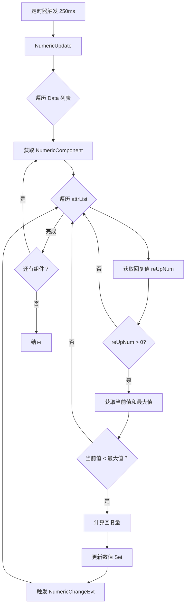

# NumericSystem.cs 注解文档

## 文件基本信息

| 属性 | 值 |
|------|-----|
| **文件名** | NumericSystem.cs |
| **路径** | Assets/Scripts/Code/Game/System/Numeric/NumericSystem.cs |
| **所属模块** | 游戏层 → System/Numeric |
| **文件职责** | 数值系统管理器，管理所有 NumericComponent，处理自动回复（回血/回蓝） |

---

## 类说明

### NumericSystem

| 属性 | 说明 |
|------|------|
| **职责** | 管理所有实体的数值组件，定时更新自动回复数值（HP/MP 等） |
| **泛型参数** | `IManager`, `IUpdate` |
| **继承关系** | 无继承 |
| **实现的接口** | `IManager` (管理器), `IUpdate` (每帧更新) |

**设计模式**: 单例模式 + 定时器 + 批量更新

**核心功能**:
- 注册/注销 NumericComponent
- 定时检测并更新自动回复数值
- 支持配置表定义的回复公式

---

## 字段与属性

| 名称 | 类型 | 访问级别 | 说明 |
|------|------|----------|------|
| `ATTRCHANGE_CHECKTIME` | `const int` | `private` | 数值变化检测间隔 = 250ms |
| `ATTRCHANGE_DELTATIME` | `const int` | `private` | 数值变化间隔基准 = 1000ms |
| `Data` | `List<NumericComponent>` | `public` | 所有数值组件列表 |
| `Timer` | `long` | `private` | 定时器 ID |
| `attrList` | `List<int>` | `private` | 需要回复的属性 ID 列表（如 HP） |
| `reUpList` | `List<int>` | `private` | 回复值属性 ID 列表（如 HPRecovery） |
| `maxList` | `List<int>` | `private` | 最大值属性 ID 列表（如 MaxHP） |

---

## 内部类

### NumericUpdateTimer

**签名**:
```csharp
[Timer(TimerType.NumericUpdate)]
public class NumericUpdateTimer : ATimer<NumericSystem>
```

**职责**: 定时器触发器，调用 NumericUpdate()

**核心逻辑**:
```csharp
public override void Run(NumericSystem t)
{
    t.NumericUpdate();
}
```

**设计说明**: 
- 使用 `[Timer]` 特性标记定时器类型
- 定时器框架自动调用 `Run()` 方法

---

## 方法说明

### Init()

**签名**:
```csharp
public void Init()
```

**职责**: 初始化数值系统

**核心逻辑**:
```
1. 创建 attrList, reUpList, maxList
2. 从 AttributeConfigCategory 获取所有属性配置
3. 遍历配置:
   - 如果配置定义了 AttrReUp (回复属性) 和 MaxAttr (最大属性):
     * 获取回复属性 ID (reup)
     * 获取最大属性 ID (max)
     * 如果有效 (>=0):
       - attrList 添加属性基础值 ID (Id * 10 + 1)
       - reUpList 添加回复值 ID (reup * 10 + 1)
       - maxList 添加最大值 ID (max * 10 + 1)
4. 创建 Data 列表
```

**配置示例**:
```json
// AttributeConfig
{
    Id: 1,  // HP
    AttrReUp: "HPRecovery",  // 回复属性
    MaxAttr: "MaxHP"         // 最大值属性
}

// 解析后:
attrList.Add(1 * 10 + 1) = 11   // HP 基础值
reUpList.Add(HPRecovery * 10 + 1)  // HPRecovery 基础值
maxList.Add(MaxHP * 10 + 1)        // MaxHP 基础值
```

**调用者**: ManagerProvider.RegisterManager<NumericSystem>()

---

### Destroy()

**签名**:
```csharp
public void Destroy()
```

**职责**: 销毁数值系统

**核心逻辑**:
```
1. 移除定时器
2. 清空并释放 Data 列表
```

**调用者**: ManagerProvider.RemoveManager<NumericSystem>()

---

### Update()

**签名**:
```csharp
public void Update()
```

**职责**: 每帧检查并确保定时器运行

**核心逻辑**:
```
1. 如果 GameTimerManager 为空 → Timer = 0
2. 如果 Timer == 0 且 GameTimerManager 不为空:
   - 创建重复定时器 NewRepeatedTimer()
   - 间隔 = ATTRCHANGE_CHECKTIME (250ms)
   - 类型 = TimerType.NumericUpdate
```

**调用者**: GameTimerManager（通过 IUpdate 接口自动注册）

**设计说明**: 
- 懒加载定时器：只在需要时创建
- 自动恢复：如果定时器被意外移除，Update 会重新创建

---

### NumericUpdate()

**签名**:
```csharp
public void NumericUpdate()
```

**职责**: 更新所有数值的自动回复（核心方法）

**核心逻辑**:
```
1. 遍历所有 NumericComponent (Data 列表)
2. 对于每个组件:
   - 遍历所有需要回复的属性 (attrList)
   - 获取回复值 reUpNum = GetAsFloat(reUpList[j])
   - 计算本次回复量 = reUpNum * CHECKTIME / DELTATIME
     (250ms / 1000ms = 0.25，即每秒回复值的 1/4)
   - 如果回复值 > 0:
     * 获取最大值 maxValue = GetAsInt(maxList[j])
     * 获取当前值 nowValue = GetAsInt(attrList[j])
     * 如果当前值 < 最大值:
       - 增加 nowValue += reUpNum
       - 如果超过最大值 → 限制为最大值
       - 调用 Set() 更新数值（触发事件）
```

**回复公式**:
```
本次回复量 = 每秒回复值 × (检测间隔 / 基准间隔)
          = reUpNum × (250ms / 1000ms)
          = reUpNum × 0.25
```

**调用者**: NumericUpdateTimer.Run()

**使用示例**:
```
假设:
- HPRecovery = 10 (每秒回复 10 点 HP)
- MaxHP = 100
- Current HP = 50

每次 NumericUpdate() (250ms):
- 回复量 = 10 × 0.25 = 2.5
- 新 HP = 50 + 2.5 = 52.5

4 次更新后 (1 秒):
- HP = 50 + 10 = 60
```

---

### AddComponent()

**签名**:
```csharp
public void AddComponent(NumericComponent component)
```

**职责**: 注册数值组件

**参数**:
- `component`: 要注册的 NumericComponent

**核心逻辑**:
```
1. 添加到 Data 列表
```

**调用者**: NumericComponent.Init()

---

### RemoveComponent()

**签名**:
```csharp
public void RemoveComponent(NumericComponent component)
```

**职责**: 注销数值组件

**参数**:
- `component`: 要移除的 NumericComponent

**核心逻辑**:
```
1. 从 Data 列表移除
```

**调用者**: NumericComponent.Destroy()

---

## 自动回复流程



---

## 配置表依赖

### AttributeConfig

```csharp
// 配置字段
{
    Id: 1,                    // 属性 ID (如 HP=1)
    Name: "HP",               // 属性名称
    AttrReUp: "HPRecovery",   // 回复属性名称
    MaxAttr: "MaxHP",         // 最大值属性名称
    Type: 0,                  // 值类型 (0=整数，1=浮点)
    // ...
}
```

### NumericType

```csharp
// 数值类型映射
{
    "HP" => 1,
    "MaxHP" => 2,
    "HPRecovery" => 3,
    "MP" => 4,
    "MaxMP" => 5,
    "MPRecovery" => 6,
    "Attack" => 10,
    "Defense" => 11,
    // ...
}
```

---

## 使用示例

### 示例 1: 系统自动运行

```csharp
// 系统启动时自动注册
ManagerProvider.RegisterManager<NumericSystem>();

// 创建实体并添加数值组件
var entity = EntityFactory.CreateEntity<Player>(scene.Id);
var numericComp = entity.AddComponent<NumericComponent>();

// 设置 HP 和回复
numericComp.Set(NumericType.HP * 10 + 1, 50);           // 当前 HP
numericComp.Set(NumericType.HPRecovery * 10 + 1, 10);   // 每秒回复 10
numericComp.Set(NumericType.MaxHP * 10 + 1, 100);       // 最大 HP

// 系统每 250ms 自动更新 HP
// 1 秒后 HP = 50 + 10 = 60
```

### 示例 2: 监听 HP 变化

```csharp
// 注册 HP 变化事件
Messager.Instance.AddEventListener(MessageId.NumericChangeEvt, OnHPChange);

void OnHPChange(object sender, object args)
{
    var change = (NumericChange)args;
    if (change.NumericType == NumericType.HP)
    {
        Log.Info($"HP 变化：{change.Old} → {change.New}");
        UpdateHPBar(change.New);
    }
}
```

### 示例 3: 禁用自动回复

```csharp
// 设置回复值为 0 禁用自动回复
numericComp.Set(NumericType.HPRecovery * 10 + 1, 0);

// 或移除 NumericComponent
entity.RemoveComponent<NumericComponent>();
```

---

## 设计说明

### 定时器设计

```
每帧 Update()
    ↓
检查 Timer 是否存在
    ↓
不存在 → 创建 250ms 重复定时器
    ↓
定时器触发 → NumericUpdate()
    ↓
遍历所有 NumericComponent 更新回复
```

### 性能优化

1. **批量更新**: 所有组件在一次 NumericUpdate() 中处理
2. **配置预计算**: Init() 时解析配置，避免运行时查找
3. **条件检查**: 只更新需要回复的属性 (reUpNum > 0)
4. **早退出**: 当前值已满时跳过更新

### 数值精度

- 使用 `float` 计算回复量（支持小数回复）
- 使用 `Set()` 更新（自动处理浮点转换）
- 限制不超过最大值

---

## 注意事项

1. **定时器管理**: Destroy() 时必须移除定时器
2. **配置依赖**: 确保 AttributeConfigCategory 已加载
3. **线程安全**: NumericUpdate() 在主线程执行
4. **性能**: 大量实体时考虑分帧处理

---

## 相关文档

- [NumericComponent.cs.md](../../Component/Numeric/NumericComponent.cs.md) - 数值组件
- [NumericChange.cs.md](../../Component/Numeric/NumericChange.cs.md) - 数值变化事件
- [GameTimerManager.cs.md](../../../../Mono/Module/Timer/GameTimerManager.cs.md) - 游戏定时器
- [AttributeConfig.cs.md](../../../Module/Config/AttributeConfig.cs.md) - 属性配置表

---

*文档生成时间：2026-03-02 | OpenClaw AI 助手*
