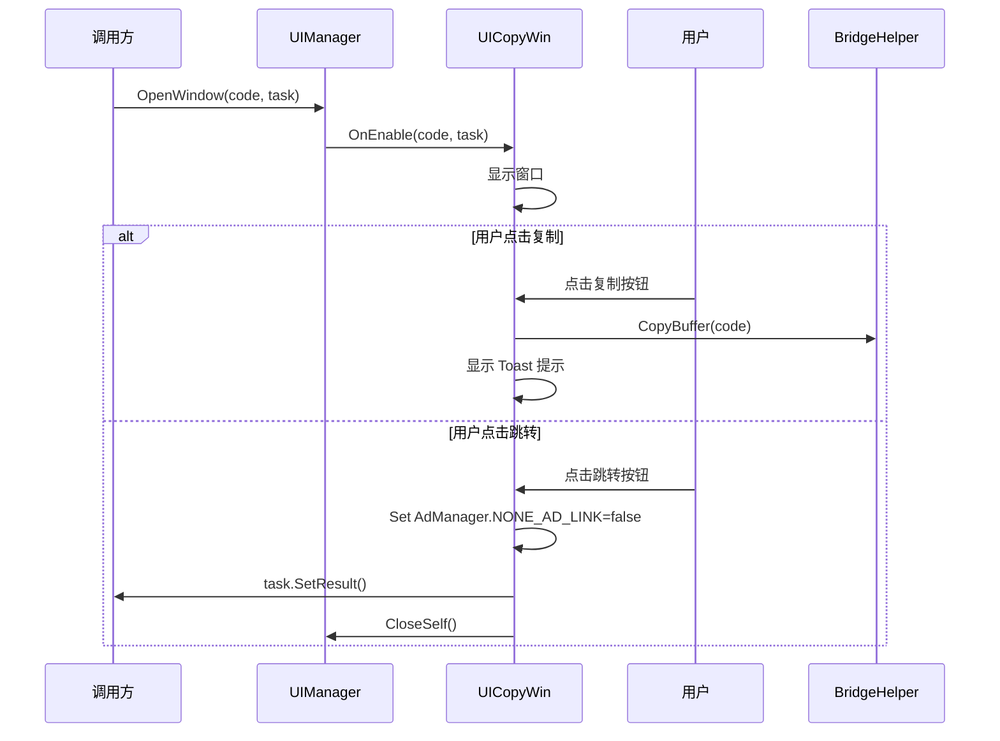

# UICopyWin.cs 注解文档

## 文件基本信息

| 属性 | 值 |
|------|-----|
| **文件名** | UICopyWin.cs |
| **路径** | Assets/Scripts/Code/Game/UI/UICommon/UICopyWin.cs |
| **所属模块** | 玩法层 → UI 通用组件 |
| **文件职责** | 复制码窗口，用于输入/复制兑换码并跳转登录 |

---

## 类/结构体说明

### UICopyWin

| 属性 | 说明 |
|------|------|
| **职责** | 复制码窗口视图类 |
| **泛型参数** | 无 |
| **继承关系** | 继承 `UIBaseView` |
| **实现的接口** | `IOnCreate`, `IOnEnable<string, ETTask>` |

**设计模式**: 任务完成模式（Task Completion Pattern）

```csharp
// 使用示例
var task = ETTask<string>.Create();
UIManager.Instance.OpenWindow<UICopyWin, string, ETTask>(
    UICopyWin.PrefabPath,
    copyCode,
    task
);
await task; // 等待用户完成操作
```

---

## 字段与属性（按重要程度排序）

| 名称 | 类型 | 访问级别 | 说明 |
|------|------|----------|------|
| `PrefabPath` | `string` | `public static` | 预制体路径：`"UI/UICommon/Prefabs/UICopyWin.prefab"` |
| `BtnLogin` | `UIButton` | `public` | 登录/跳转按钮 |
| `BtnCopy` | `UIButton` | `public` | 复制按钮 |
| `InputField` | `UIInputTextmesh` | `public` | 输入框组件 |
| `task` | `ETTask` | `private` | 任务完成句柄 |

---

## 生命周期方法

### OnCreate()

**签名**:
```csharp
public void OnCreate()
```

**职责**: 初始化组件引用

**核心逻辑**:
```
1. 获取 BtnLogin 按钮（"Win/Jump"）
2. 获取 BtnCopy 按钮（"Win/Confirm"）
3. 获取 InputField 输入框（"Win/Psw/UserName"）
```

**调用者**: UIManager（窗口创建时自动调用）

---

### OnEnable(string code, ETTask task)

**签名**:
```csharp
public void OnEnable(string code, ETTask task)
```

**职责**: 窗口启用时设置复制码和任务句柄

**核心逻辑**:
```
1. 保存 task 引用
2. 播放打开音效 "Audio/Sound/Win_Open.mp3"
3. 设置输入框文本为 code
4. 绑定登录按钮点击事件 → OnClickBtnLogin
5. 绑定复制按钮点击事件 → OnClickBtnCopy
```

**参数说明**:
- `code`: 要显示的复制码
- `task`: 任务完成句柄，用户操作完成后触发

**调用者**: UIManager（窗口打开时自动调用）

---

## 事件处理方法

### OnClickBtnCopy()

**签名**:
```csharp
public void OnClickBtnCopy()
```

**职责**: 处理复制按钮点击

**核心逻辑**:
```
1. 获取输入框文本
2. 如果文本不为空:
   - 调用 BridgeHelper.CopyBuffer(text) 复制到剪贴板
   - 显示 Toast 提示 "复制成功"（I18NKey.Text_Copy_Over）
```

**调用者**: BtnCopy 点击事件

**依赖**:
- `BridgeHelper.CopyBuffer()` - 平台剪贴板 API
- `UIToast.ShowToast()` - 轻提示组件

---

### OnClickBtnLogin()

**签名**:
```csharp
public void OnClickBtnLogin()
```

**职责**: 处理登录/跳转按钮点击

**核心逻辑**:
```
1. 获取输入框文本
2. 如果文本不为空:
   - 设置 AdManager.NONE_AD_LINK = false（允许广告链接）
   - 设置任务结果 task.SetResult()
   - 清空 task 引用
   - 关闭自身窗口
```

**调用者**: BtnLogin 点击事件

**副作用**:
- 修改 AdManager.NONE_AD_LINK 标志
- 完成异步任务

---

## 使用场景

### 1. 显示兑换码窗口
```csharp
// 等待用户复制或跳转
var task = ETTask.Create();
UIManager.Instance.OpenWindow<UICopyWin, string, ETTask>(
    UICopyWin.PrefabPath,
    "GAME2026",
    task
);

// 等待用户操作完成
await task;
Debug.Log("用户已完成复制或跳转");
```

### 2. 活动兑换码分享
```csharp
public async ETTask ShowEventCode(string eventCode)
{
    var task = ETTask.Create();
    UIManager.Instance.OpenWindow<UICopyWin, string, ETTask>(
        UICopyWin.PrefabPath,
        eventCode,
        task
    );
    
    // 等待用户操作
    await task;
    
    // 记录用户已查看兑换码
    Analytics.Log("event_code_viewed");
}
```

---

## UI 结构

```
UICopyWin (UIBaseView)
└── Win
    ├── Jump (UIButton) - BtnLogin 跳转按钮
    ├── Confirm (UIButton) - BtnCopy 复制按钮
    └── Psw
        └── UserName (UIInputTextmesh) - InputField 输入框
```

---

## 音效资源

| 音效 | 路径 | 触发时机 |
|------|------|----------|
| 打开音效 | `Audio/Sound/Win_Open.mp3` | OnEnable 时 |

---

## 任务完成模式



---

## 关键设计点

### 1. 任务完成模式
使用 `ETTask` 实现异步等待，调用方可以等待用户操作完成：
```csharp
await task; // 等待用户点击跳转或关闭
```

### 2. 剪贴板集成
通过 `BridgeHelper.CopyBuffer()` 调用平台原生剪贴板 API，支持多平台：
- WebGL（小游戏）
- iOS/Android
- PC

### 3. 广告链接标志
点击跳转按钮时设置 `AdManager.NONE_AD_LINK = false`，允许后续广告链接行为

---

## 相关文档

- [UIManager.cs.md](../../Module/UI/UIManager.cs.md) - UI 管理器
- [UIBaseView.cs.md](../../Module/UI/UIBaseView.cs.md) - UI 视图基类
- [UIButton.cs.md](../../Module/UIComponent/UIButton.cs.md) - 按钮组件
- [UIInputTextmesh.cs.md](../../Module/UIComponent/UIInputTextmesh.cs.md) - 输入框组件
- [UIToast.cs.md](./UIToast.cs.md) - Toast 提示
- [BridgeHelper.cs](#) - 平台桥接工具
- [AdManager.cs.md](../../Module/Player/AdManager.cs.md) - 广告管理器

---

*文档生成时间：2026-03-01 | OpenClaw AI 助手*
