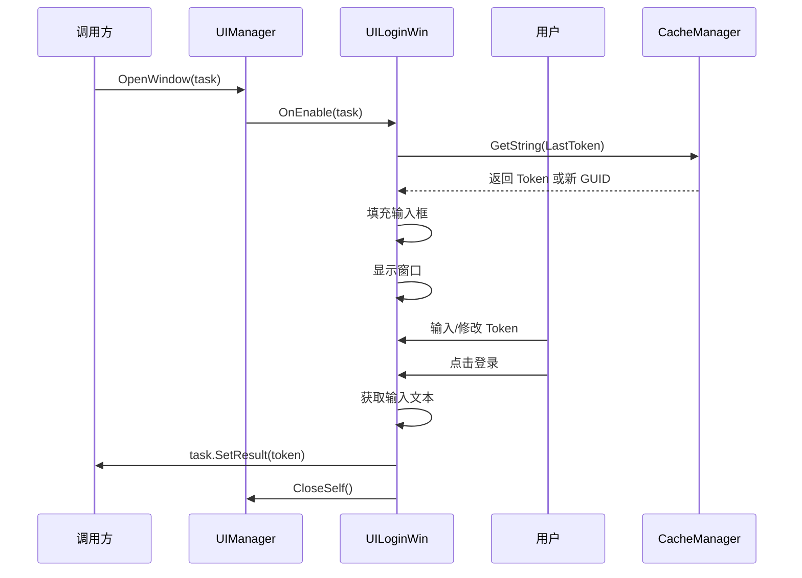

# UILoginWin.cs 注解文档

## 文件基本信息

| 属性 | 值 |
|------|-----|
| **文件名** | UILoginWin.cs |
| **路径** | Assets/Scripts/Code/Game/UI/UICommon/UILoginWin.cs |
| **所属模块** | 玩法层 → UI 通用组件 |
| **文件职责** | 登录窗口，用于输入 Token 并完成任务 |

---

## 类/结构体说明

### UILoginWin

| 属性 | 说明 |
|------|------|
| **职责** | 登录窗口视图类 |
| **泛型参数** | 无 |
| **继承关系** | 继承 `UIBaseView` |
| **实现的接口** | `IOnCreate`, `IOnEnable<ETTask<string>>` |

**设计模式**: 任务完成模式（Task Completion Pattern）

```csharp
// 使用示例
var task = ETTask<string>.Create();
UIManager.Instance.OpenWindow<UILoginWin, ETTask<string>>(
    UILoginWin.PrefabPath,
    task
);

// 等待用户输入并登录
string token = await task;
Debug.Log($"用户输入的 Token: {token}");
```

---

## 字段与属性（按重要程度排序）

| 名称 | 类型 | 访问级别 | 说明 |
|------|------|----------|------|
| `PrefabPath` | `string` | `public static` | 预制体路径：`"UI/UICommon/Prefabs/UILoginWin.prefab"` |
| `BtnLogin` | `UIButton` | `public` | 登录按钮 |
| `InputField` | `UIInputTextmesh` | `public` | Token 输入框 |
| `task` | `ETTask<string>` | `private` | 任务完成句柄（返回 Token） |

---

## 生命周期方法

### OnCreate()

**签名**:
```csharp
public void OnCreate()
```

**职责**: 初始化组件引用

**核心逻辑**:
```
1. 获取 BtnLogin 按钮（"Win/Confirm"）
2. 获取 InputField 输入框（"Win/Psw/UserName"）
```

**调用者**: UIManager（窗口创建时自动调用）

---

### OnEnable(ETTask<string> task)

**签名**:
```csharp
public void OnEnable(ETTask<string> task)
```

**职责**: 窗口启用时初始化 Token 和任务句柄

**核心逻辑**:
```
1. 播放打开音效 "Audio/Sound/Win_Open.mp3"
2. 从缓存获取上次 Token，如果没有则生成新 GUID:
   - CacheManager.Instance.GetString(CacheKeys.LastToken, Guid.NewGuid().ToString())
3. 设置输入框文本为获取的 Token
4. 保存 task 引用
5. 绑定登录按钮点击事件 → OnClickBtnLogin
```

**参数说明**:
- `task`: 任务完成句柄，用户登录完成后返回 Token 字符串

**调用者**: UIManager（窗口打开时自动调用）

**依赖**:
- `CacheManager` - 缓存管理器
- `CacheKeys.LastToken` - 上次 Token 缓存键

---

## 事件处理方法

### OnClickBtnLogin()

**签名**:
```csharp
public void OnClickBtnLogin()
```

**职责**: 处理登录按钮点击

**核心逻辑**:
```
1. 获取输入框文本
2. 如果文本不为空:
   - 设置任务结果 task.SetResult(text) 返回 Token
   - 关闭自身窗口
   - 清空 task 引用
```

**调用者**: BtnLogin 点击事件

**返回值**: 通过 task.SetResult(text) 返回用户输入的 Token

---

## 使用场景

### 1. 开发者调试登录
```csharp
// 在开发模式下显示登录窗口
#if DEVELOPMENT
var task = ETTask<string>.Create();
UIManager.Instance.OpenWindow<UILoginWin, ETTask<string>>(
    UILoginWin.PrefabPath,
    task
);

// 等待用户输入 Token
string token = await task;

// 使用 Token 登录
await PlayerManager.Instance.LoginWithToken(token);
#endif
```

### 2. 测试账号切换
```csharp
public async ETTask SwitchAccount()
{
    var task = ETTask<string>.Create();
    UIManager.Instance.OpenWindow<UILoginWin, ETTask<string>>(
        UILoginWin.PrefabPath,
        task
    );
    
    string newToken = await task;
    
    // 保存新 Token 到缓存
    CacheManager.Instance.SetString(CacheKeys.LastToken, newToken);
    
    // 使用新 Token 重新登录
    await PlayerManager.Instance.LoginWithToken(newToken);
}
```

### 3. 自动填充上次 Token
```csharp
// 窗口自动填充上次使用的 Token（来自缓存）
// 如果没有缓存，则生成新的 GUID 作为默认值
// 用户可以直接使用或修改
```

---

## UI 结构

```
UILoginWin (UIBaseView)
└── Win
    ├── Confirm (UIButton) - BtnLogin 登录按钮
    └── Psw
        └── UserName (UIInputTextmesh) - InputField Token 输入框
```

---

## 音效资源

| 音效 | 路径 | 触发时机 |
|------|------|----------|
| 打开音效 | `Audio/Sound/Win_Open.mp3` | OnEnable 时 |

---

## 缓存机制

### CacheKeys.LastToken

| 属性 | 值 |
|------|-----|
| **用途** | 存储上次登录使用的 Token |
| **默认值** | `Guid.NewGuid().ToString()`（新 GUID） |
| **读取时机** | 窗口打开时自动填充 |
| **写入时机** | 用户登录成功后（由调用方负责） |

**使用示例**:
```csharp
// 读取
string lastToken = CacheManager.Instance.GetString(
    CacheKeys.LastToken, 
    Guid.NewGuid().ToString()
);

// 写入
CacheManager.Instance.SetString(CacheKeys.LastToken, token);
```

---

## 任务完成模式



---

## 关键设计点

### 1. 任务完成模式
使用 `ETTask<string>` 实现异步等待，调用方可以获取用户输入的 Token：
```csharp
string token = await task; // 等待用户输入并返回
```

### 2. 缓存自动填充
窗口打开时自动从缓存读取上次 Token，提升用户体验：
- 有缓存 → 填充上次 Token
- 无缓存 → 生成新 GUID

### 3. 输入验证
点击登录时检查输入是否为空，确保有效 Token

---

## 与 UICopyWin 的区别

| 特性 | UILoginWin | UICopyWin |
|------|------------|-----------|
| **用途** | 输入 Token 登录 | 显示/复制兑换码 |
| **返回值** | `ETTask<string>`（Token） | `ETTask`（无返回值） |
| **默认值** | 缓存 Token 或 GUID | 传入的兑换码 |
| **按钮** | 登录 | 复制 + 跳转 |

---

## 相关文档

- [UIManager.cs.md](../../Module/UI/UIManager.cs.md) - UI 管理器
- [UIBaseView.cs.md](../../Module/UI/UIBaseView.cs.md) - UI 视图基类
- [UIButton.cs.md](../../Module/UIComponent/UIButton.cs.md) - 按钮组件
- [UIInputTextmesh.cs.md](../../Module/UIComponent/UIInputTextmesh.cs.md) - 输入框组件
- [CacheManager.cs.md](../../Module/Player/CacheManager.cs.md) - 缓存管理器
- [CacheKeys.cs.md](../../Module/Const/CacheKeys.cs.md) - 缓存键常量
- [PlayerManager.cs.md](../../Module/Player/PlayerManager.cs.md) - 玩家管理器

---

*文档生成时间：2026-03-01 | OpenClaw AI 助手*
