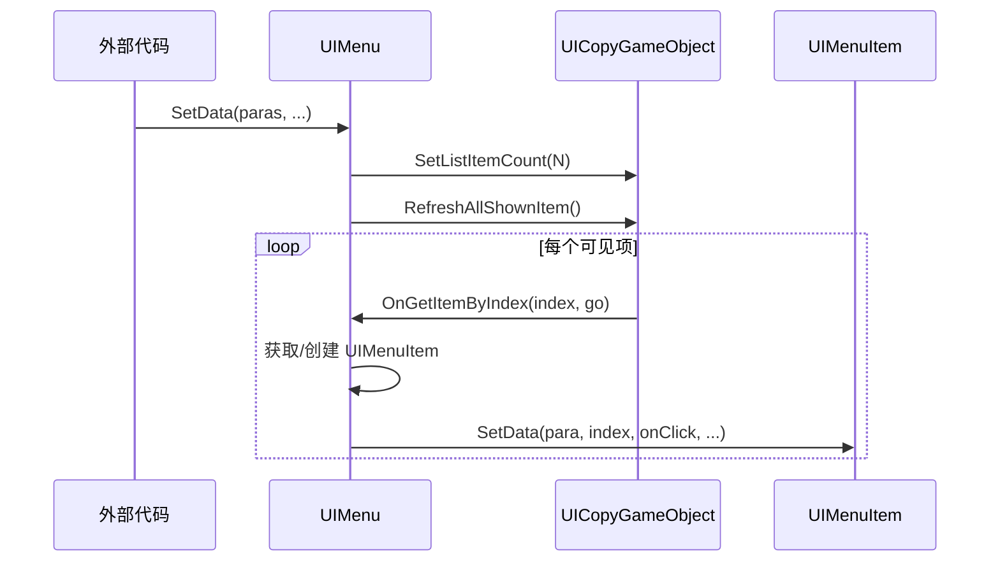
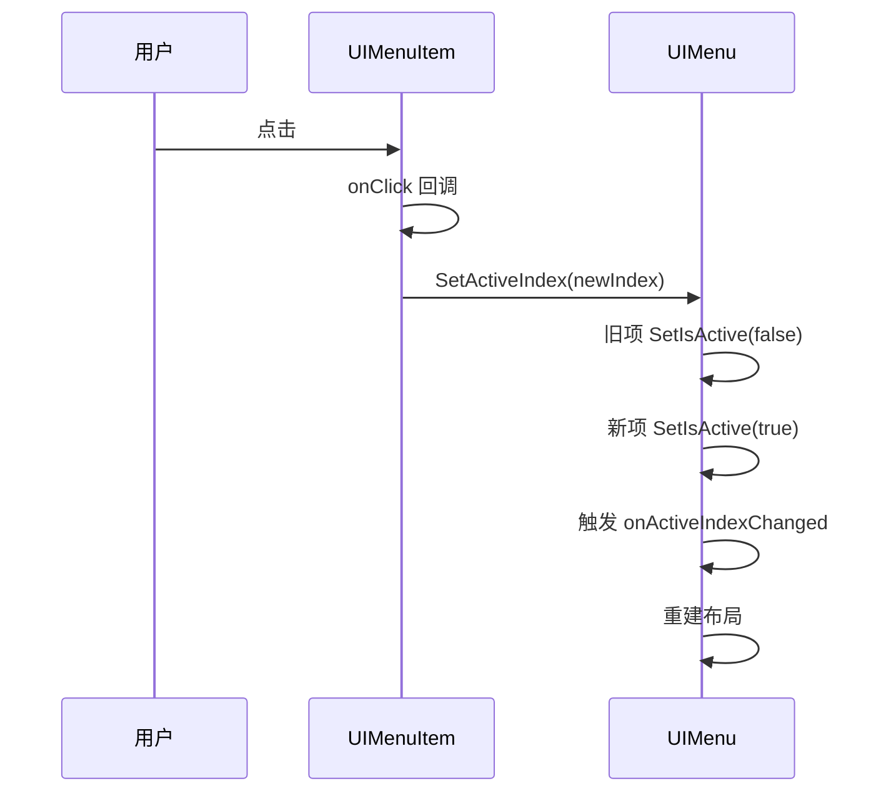

# UIMenu.cs 注解文档

## 文件基本信息

| 属性 | 值 |
|------|-----|
| **文件名** | UIMenu.cs |
| **路径** | Assets/Scripts/Code/Game/UI/UICommon/UIMenu.cs |
| **所属模块** | 玩法层 → UI 通用组件 |
| **文件职责** | 横向菜单容器，支持动态数据绑定和选中状态管理 |

---

## 类/结构体说明

### MenuPara

| 属性 | 说明 |
|------|------|
| **职责** | 菜单项参数数据结构 |
| **泛型参数** | 无 |
| **继承关系** | 无继承 |

**字段说明**:

| 字段 | 类型 | 说明 | 默认值 |
|------|------|------|--------|
| `Id` | `int` | 菜单唯一标识 | - |
| `Name` | `string` | 菜单名称 | - |
| `ImgPath` | `string` | 图标资源路径 | - |
| `RedDot` | `string` | 红点标识 | - |
| `ActiveColor` | `Color` | 选中状态颜色 | `Color.white` |
| `UnActiveColor` | `Color` | 未选中状态颜色 | `Color.white` |

---

### UIMenu

| 属性 | 说明 |
|------|------|
| **职责** | 横向菜单容器视图类 |
| **泛型参数** | 无 |
| **继承关系** | 继承 `UIBaseContainer` |
| **实现的接口** | `IOnCreate` |

**设计模式**: 列表视图模式 + 数据驱动

```csharp
// 使用示例
var menu = container.AddComponent<UIMenu>();
var menuItems = new List<MenuPara>
{
    new MenuPara { Id = 1, Name = "首页" },
    new MenuPara { Id = 2, Name = "任务" },
    new MenuPara { Id = 3, Name = "商城" }
};

menu.SetData(menuItems, (para) => {
    Debug.Log($"选中菜单：{para.Name}");
}, activeIndex: 0);
```

---

## 字段与属性（按重要程度排序）

| 名称 | 类型 | 访问级别 | 说明 |
|------|------|----------|------|
| `Space` | `UICopyGameObject` | `public` | 列表空间组件 |
| `Paras` | `List<MenuPara>` | `public` | 菜单数据列表 |
| `UIMenuItems` | `UIMenuItem[]` | `public` | 菜单项组件数组 |
| `ActiveIndex` | `int` | `public` | 当前选中索引 |
| `onActiveIndexChanged` | `Action<MenuPara>` | `private` | 选中变化回调 |
| `onClickItem` | `Func<MenuPara, bool>` | `private` | 点击拦截回调 |
| `changeScale` | `bool` | `private` | 是否应用缩放效果 |

---

## 生命周期方法

### OnCreate()

**签名**:
```csharp
public void OnCreate()
```

**职责**: 初始化列表空间组件

**核心逻辑**:
```
1. 获取 Space 复制组件
2. 初始化列表视图 Space.InitListView(0, OnGetItemByIndex)
   - 初始数量：0
   - 获取项回调：OnGetItemByIndex
```

**调用者**: UIManager（组件创建时自动调用）

---

## 列表回调方法

### OnGetItemByIndex(int index, GameObject go)

**签名**:
```csharp
public void OnGetItemByIndex(int index, GameObject go)
```

**职责**: 列表项获取/刷新回调

**核心逻辑**:
```
1. 获取对应索引的菜单数据 para = Paras[index]
2. 如果 go 上还没有 UIMenuItem 组件:
   - 添加组件 Space.AddItemViewComponent<UIMenuItem>(go)
3. 获取 UIMenuItem 组件
4. 保存到 UIMenuItems[index]
5. 调用 item.SetData() 设置数据:
   - 菜单数据 para
   - 索引 index
   - 点击回调 (type, inx) => { 检查 onClickItem → SetActiveIndex }
   - 是否选中 index == ActiveIndex
   - 缩放设置 changeScale
```

**调用者**: Space 列表组件（列表刷新时）

---

## 公共方法

### SetData(...)

**签名**:
```csharp
public void SetData(List<MenuPara> paras, Action<MenuPara> onActiveIndexChanged, 
                    int activeIndex = -1, Func<MenuPara, bool> onClickItem = null, 
                    bool changeScale = true)
```

**职责**: 设置菜单数据和回调

**参数说明**:
- `paras`: 菜单数据列表
- `onActiveIndexChanged`: 选中变化回调（参数：选中的 MenuPara）
- `activeIndex`: 初始选中索引（默认 -1 表示无选中）
- `onClickItem`: 点击拦截回调（返回 false 可阻止选中变化）
- `changeScale`: 是否应用缩放效果（默认 true）

**核心逻辑**:
```
1. 保存 changeScale 和 onClickItem
2. 保存 onActiveIndexChanged 回调
3. 保存 Paras 数据列表
4. 初始化 UIMenuItems 数组
5. 设置列表项数量 Space.SetListItemCount(Paras.Count)
6. 刷新所有显示项 Space.RefreshAllShownItem()
7. 设置初始选中索引 SetActiveIndex(activeIndex)
```

**调用者**: 外部代码

---

### SetActiveIndex(int index, bool force = false)

**签名**:
```csharp
public void SetActiveIndex(int index, bool force = false)
```

**职责**: 设置选中索引

**参数说明**:
- `index`: 目标索引
- `force`: 是否强制刷新（忽略边界检查和重复检查）

**核心逻辑**:
```
1. 如果非强制且（索引<0 或 已是当前索引）→ 直接返回
2. 如果 ActiveIndex >= 0:
   - 设置旧项为未选中状态 UIMenuItems[ActiveIndex].SetIsActive(false)
3. 更新 ActiveIndex = index
4. 设置新项为选中状态 UIMenuItems[ActiveIndex].SetIsActive(true)
5. 触发回调 onActiveIndexChanged(Paras[index])
6. 强制重建布局 LayoutRebuilder.ForceRebuildLayoutImmediate()
```

**调用者**: SetData(), 列表项点击回调

**副作用**: 
- 触发选中变化回调
- 重建 UI 布局

---

## 使用场景

### 1. 主界面导航菜单
```csharp
var menuItems = new List<MenuPara>
{
    new MenuPara { Id = 1, Name = "首页", ImgPath = "Icons/Home" },
    new MenuPara { Id = 2, Name = "任务", ImgPath = "Icons/Task", RedDot = "Task" },
    new MenuPara { Id = 3, Name = "商城", ImgPath = "Icons/Shop" },
    new MenuPara { Id = 4, Name = "背包", ImgPath = "Icons/Bag" }
};

menu.SetData(menuItems, (para) => {
    switch (para.Id)
    {
        case 1: OpenHome(); break;
        case 2: OpenTask(); break;
        case 3: OpenShop(); break;
        case 4: OpenBag(); break;
    }
}, activeIndex: 0);
```

### 2. 设置页面切换（无缩放）
```csharp
var settings = new List<MenuPara>
{
    new MenuPara { Id = 1, Name = "音效", ActiveColor = Color.green },
    new MenuPara { Id = 2, Name = "画面", ActiveColor = Color.green },
    new MenuPara { Id = 3, Name = "控制", ActiveColor = Color.green }
};

menu.SetData(settings, (para) => {
    SwitchSettingPage(para.Id);
}, changeScale: false); // 禁用缩放效果
```

### 3. 带点击拦截的菜单
```csharp
menu.SetData(menuItems, (para) => {
    NavigateTo(para.Id);
}, onClickItem: (para) => {
    // 某些条件下阻止切换
    if (IsInBattle && para.Id != 1)
    {
        UIToast.ShowToast("战斗中无法切换页面");
        return false; // 阻止选中变化
    }
    return true; // 允许切换
});
```

---

## UI 结构

```
UIMenu (UIBaseContainer)
└── Space (UICopyGameObject) - 列表空间
    └── [动态生成的 UIMenuItem]
        ├── Content
        │   ├── Icon (UIImage)
        │   └── Text (UITextmesh)
        ├── TabFocus (UIImage)
        ├── Btn (UIPointerClick)
        └── RedDot (UIRedDot)
```

---

## 列表刷新机制



---

## 选中状态变化流程



---

## 相关文档

- [MenuPara.cs](#) - 菜单参数数据结构（同文件内）
- [UIMenuItem.cs.md](./UIMenuItem.cs.md) - 菜单项组件
- [UIBaseContainer.cs.md](../../Module/UI/UIBaseContainer.cs.md) - UI 容器基类
- [UICopyGameObject.cs.md](../../Module/UIComponent/UICopyGameObject.cs.md) - 列表空间组件
- [UIRedDot.cs.md](../../Module/UI/RedDot/UIRedDot.cs.md) - 红点组件

---

*文档生成时间：2026-03-01 | OpenClaw AI 助手*
