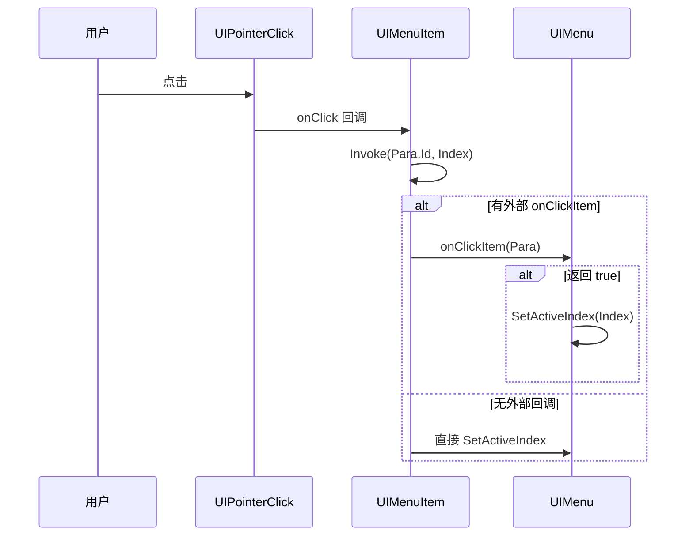

# UIMenuItem.cs 注解文档

## 文件基本信息

| 属性 | 值 |
|------|-----|
| **文件名** | UIMenuItem.cs |
| **路径** | Assets/Scripts/Code/Game/UI/UICommon/UIMenuItem.cs |
| **所属模块** | 玩法层 → UI 通用组件 |
| **文件职责** | 菜单项组件，支持图标、文本、红点、选中状态 |

---

## 类/结构体说明

### UIMenuItem

| 属性 | 说明 |
|------|------|
| **职责** | 菜单项视图组件 |
| **泛型参数** | 无 |
| **继承关系** | 继承 `UIBaseContainer` |
| **实现的接口** | `IOnCreate` |

**设计模式**: 数据驱动 + 状态管理

```csharp
// 使用示例
var menuItem = container.AddComponent<UIMenuItem>();
menuItem.SetData(menuPara, index, (id, idx) => {
    Debug.Log($"点击了菜单项 {id}");
}, isActive: false);
```

---

## 字段与属性（按重要程度排序）

| 名称 | 类型 | 访问级别 | 说明 |
|------|------|----------|------|
| `Para` | `MenuPara` | `public` | 当前菜单项数据 |
| `Index` | `int` | `public` | 当前菜单项索引 |
| `onClick` | `Action<int, int>` | `public` | 点击回调（参数：菜单 ID, 索引） |
| `Text` | `UITextmesh` | `public` | 文本组件 |
| `TabFocus` | `UIImage` | `public` | 选中状态背景图 |
| `Btn` | `UIPointerClick` | `public` | 点击事件组件 |
| `RedDot` | `UIRedDot` | `public` | 红点组件 |
| `Icon` | `UIImage` | `public` | 图标组件 |
| `para` | `MenuPara` | `private` | 内部数据引用 |

---

## 方法说明（按重要程度排序）

### OnCreate()

**签名**:
```csharp
public void OnCreate()
```

**职责**: 初始化组件引用和事件绑定

**核心逻辑**:
```
1. 获取 Icon 图标组件（"Content/Icon"）
2. 获取 Text 文本组件（"Content/Text"）
3. 获取 TabFocus 选中背景（"TabFocus"）
4. 创建 Btn 点击组件
5. 绑定点击事件 → 调用 onClick?.Invoke(Para.Id, Index)
6. 获取 RedDot 红点组件（"RedDot"）
```

**调用者**: UIManager（组件创建时自动调用）

---

### SetData(...)

**签名**:
```csharp
public void SetData(MenuPara para, int index, Action<int, int> onClick, 
                    bool isActive = false, bool changeScale = true)
```

**职责**: 设置菜单项数据和状态

**参数说明**:
- `para`: 菜单数据（包含 ID、名称、图标路径等）
- `index`: 菜单项索引
- `onClick`: 点击回调（参数：菜单 ID, 索引）
- `isActive`: 是否选中状态（默认 false）
- `changeScale`: 是否应用缩放效果（默认 true）

**核心逻辑**:
```
1. 保存 para 引用
2. 如果有图标路径 → 异步加载图标 Icon.SetSpritePath(para.ImgPath)
3. 保存 onClick 回调
4. 保存 Index 和 Para
5. 根据名称是否为空设置 Text 可见性
6. 设置文本内容 Text.SetText(para.Name)
7. 调用 SetIsActive(isActive, changeScale) 设置选中状态
8. 重置红点 RedDot.ReSetTarget(para.RedDot)
```

**调用者**: UIMenu.OnGetItemByIndex

---

### SetIsActive(bool isActive, bool changeScale)

**签名**:
```csharp
public void SetIsActive(bool isActive, bool changeScale)
```

**职责**: 设置菜单项选中状态

**参数说明**:
- `isActive`: 是否选中
- `changeScale`: 是否应用缩放效果

**核心逻辑**:
```
1. 设置 TabFocus 背景可见性（选中时显示）
2. 如果 isActive 且 changeScale:
   - 设置缩放为 1.2 倍
   - 否则 → 缩放为 1 倍
3. 如果选中:
   - 设置图标颜色为 ActiveColor
   - 设置文本颜色为 ActiveColor
4. 如果未选中:
   - 设置图标颜色为 UnActiveColor
   - 设置文本颜色为 UnActiveColor
```

**视觉效果**:
```
选中状态:
- TabFocus 背景显示
- 缩放 1.2 倍
- 使用 ActiveColor（高亮色）

未选中状态:
- TabFocus 背景隐藏
- 缩放 1.0 倍
- 使用 UnActiveColor（普通色）
```

**调用者**: SetData(), UIMenu.SetActiveIndex

---

## MenuPara 数据结构

| 字段 | 类型 | 说明 | 默认值 |
|------|------|------|--------|
| `Id` | `int` | 菜单唯一标识 | - |
| `Name` | `string` | 菜单名称 | - |
| `ImgPath` | `string` | 图标资源路径 | - |
| `RedDot` | `string` | 红点标识 | - |
| `ActiveColor` | `Color` | 选中状态颜色 | `Color.white` |
| `UnActiveColor` | `Color` | 未选中状态颜色 | `Color.white` |

---

## 使用场景

### 1. 主菜单导航
```csharp
var menuItems = new List<MenuPara>
{
    new MenuPara { Id = 1, Name = "首页", ImgPath = "Icons/Home" },
    new MenuPara { Id = 2, Name = "任务", ImgPath = "Icons/Task", RedDot = "Task" },
    new MenuPara { Id = 3, Name = "商城", ImgPath = "Icons/Shop" }
};

menu.SetData(menuItems, (para) => {
    NavigateTo(para.Id);
}, activeIndex: 0);
```

### 2. 设置页面切换
```csharp
var settings = new List<MenuPara>
{
    new MenuPara { Id = 1, Name = "音效", ActiveColor = Color.green },
    new MenuPara { Id = 2, Name = "画面", ActiveColor = Color.green }
};

menu.SetData(settings, (para) => {
    SwitchSettingPage(para.Id);
}, changeScale: false); // 不缩放
```

---

## UI 结构

```
UIMenuItem (UIBaseContainer)
├── Content
│   ├── Icon (UIImage) - 图标
│   └── Text (UITextmesh) - 文本
├── TabFocus (UIImage) - 选中背景
├── Btn (UIPointerClick) - 点击事件
└── RedDot (UIRedDot) - 红点
```

---

## 状态变化

| 状态 | TabFocus | 缩放 | 颜色 |
|------|----------|------|------|
| 选中 | 显示 | 1.2x | ActiveColor |
| 未选中 | 隐藏 | 1.0x | UnActiveColor |

---

## 事件流程



---

## 相关文档

- [MenuPara.cs](#) - 菜单参数数据结构（同文件内）
- [UIMenu.cs.md](./UIMenu.cs.md) - 菜单容器
- [UIBaseContainer.cs.md](../../Module/UI/UIBaseContainer.cs.md) - UI 容器基类
- [UIImage.cs.md](../../Module/UIComponent/UIImage.cs.md) - 图片组件
- [UITextmesh.cs.md](../../Module/UIComponent/UITextmesh.cs.md) - 文本组件
- [UIRedDot.cs.md](../../Module/UI/RedDot/UIRedDot.cs.md) - 红点组件
- [UIPointerClick.cs.md](../../Module/UIComponent/UIPointerClick.cs.md) - 点击事件组件

---

*文档生成时间：2026-03-01 | OpenClaw AI 助手*
