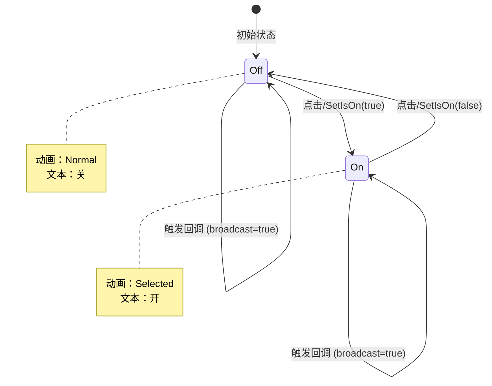

# UISliderToggle.cs 注解文档

## 文件基本信息

| 属性 | 值 |
|------|-----|
| **文件名** | UISliderToggle.cs |
| **路径** | Assets/Scripts/Code/Game/UI/UICommon/UISliderToggle.cs |
| **所属模块** | 玩法层 → UI 通用组件 |
| **文件职责** | 滑动开关组件，支持动画切换和状态回调 |

---

## 类/结构体说明

### UISliderToggle

| 属性 | 说明 |
|------|------|
| **职责** | 滑动开关视图组件 |
| **泛型参数** | 无 |
| **继承关系** | 继承 `UIBaseContainer` |
| **实现的接口** | `IOnCreate`, `IOnEnable` |

**设计模式**: 状态模式 + 观察者模式

```csharp
// 使用示例
var toggle = container.AddComponent<UISliderToggle>();
toggle.SetOnValueChanged((isOn) => {
    Debug.Log($"开关状态：{isOn}");
});
toggle.SetIsOn(true); // 设置为开启状态
```

---

## 字段与属性（按重要程度排序）

| 名称 | 类型 | 访问级别 | 说明 |
|------|------|----------|------|
| `Animator` | `UIAnimator` | `public` | 动画组件 |
| `Pointer` | `UIButton` | `public` | 滑动按钮组件 |
| `Text` | `UITextmesh` | `public` | 状态文本组件 |
| `callBack` | `UnityAction<bool>` | `private` | 状态变化回调 |
| `isOn` | `bool` | `private` | 当前开关状态 |

---

## 生命周期方法

### OnCreate()

**签名**:
```csharp
public void OnCreate()
```

**职责**: 初始化组件引用

**核心逻辑**:
```
1. 获取 Animator 动画组件
2. 获取 Pointer 滑动按钮
3. 获取 Text 文本组件（"tog/Text"）
```

**调用者**: UIManager（组件创建时自动调用）

---

### OnEnable()

**签名**:
```csharp
public void OnEnable()
```

**职责**: 启用时绑定事件并初始化状态

**核心逻辑**:
```
1. 绑定 Pointer 点击事件 → OnClickThis
2. 调用 SetIsOn(isOn, false) 初始化显示状态
```

**调用者**: UIManager（组件启用时自动调用）

---

## 公共方法

### GetIsOn()

**签名**:
```csharp
public bool GetIsOn()
```

**职责**: 获取当前开关状态

**返回值**: 当前状态（true=开启，false=关闭）

**调用者**: 需要读取开关状态的代码

---

### OnClickThis()

**签名**:
```csharp
public void OnClickThis()
```

**职责**: 处理点击事件，切换开关状态

**核心逻辑**:
```
1. 调用 OnClickThisAsync(!isOn) 切换状态
2. 启动协程执行
```

**调用者**: Pointer 点击事件

---

### OnClickThisAsync(bool ison)

**签名**:
```csharp
private async ETTask OnClickThisAsync(bool ison)
```

**职责**: 异步执行开关切换动画

**核心逻辑**:
```
1. 播放当前状态的动画（"Selected" 或 "Normal"）
2. 更新 isOn 状态
3. 等待 1ms
4. 交叉淡入目标状态动画 CrossFade(目标状态，0.1s)
5. 设置文本为国际化键（开启/关闭）
6. 触发回调 callBack?.Invoke(ison)
```

**动画流程**:
```
点击 → 播放当前状态动画 → 切换状态 → 交叉淡入新状态 → 触发回调
```

**调用者**: OnClickThis()

**异步行为**: 等待动画过渡完成

---

### SetIsOn(bool ison, bool broadcast = true)

**签名**:
```csharp
public void SetIsOn(bool ison, bool broadcast = true)
```

**职责**: 设置开关状态

**参数说明**:
- `ison`: 目标状态（true=开启，false=关闭）
- `broadcast`: 是否触发回调（默认 true）

**核心逻辑**:
```
1. 更新 isOn 状态
2. 播放目标状态动画
3. 设置文本为国际化键
4. 如果 broadcast=true → 触发回调
```

**国际化文本**:
- 开启：`I18NKey.Text_Toggle_Open`
- 关闭：`I18NKey.Text_Toggle_Close`

**调用者**: OnEnable(), 外部代码

---

### SetOnValueChanged(Action<bool> cb)

**签名**:
```csharp
public void SetOnValueChanged(Action<bool> cb)
```

**职责**: 设置状态变化回调

**核心逻辑**:
```
1. 包装回调函数（兼容 UnityAction 和 Action）
2. 保存到 callBack
```

**调用者**: 需要监听状态变化的代码

---

### RemoveOnValueChanged()

**签名**:
```csharp
public void RemoveOnValueChanged()
```

**职责**: 移除状态变化回调

**核心逻辑**:
```
1. 清空 callBack = null
```

**调用者**: 需要清理回调的代码（如窗口关闭时）

---

## 使用场景

### 1. 音效开关
```csharp
var soundToggle = soundContainer.AddComponent<UISliderToggle>();
soundToggle.SetOnValueChanged((isOn) => {
    SoundManager.Instance.SetMute(!isOn);
    CacheManager.Instance.SetBool("SoundEnabled", isOn);
});
// 从缓存恢复状态
var saved = CacheManager.Instance.GetBool("SoundEnabled", true);
soundToggle.SetIsOn(saved);
```

### 2. 通知开关
```csharp
var notifyToggle = notifyContainer.AddComponent<UISliderToggle>();
notifyToggle.SetOnValueChanged((isOn) => {
    NotificationManager.Instance.SetEnabled(isOn);
});
```

### 3. 自动播放开关
```csharp
var autoToggle = autoContainer.AddComponent<UISliderToggle>();
autoToggle.SetOnValueChanged((isOn) => {
    GameManager.Instance.SetAutoPlay(isOn);
});
```

---

## UI 结构

```
UISliderToggle (UIBaseContainer)
├── Animator (UIAnimator) - 动画组件
├── Pointer (UIButton) - 滑动按钮
└── tog
    └── Text (UITextmesh) - 状态文本
```

---

## 动画状态

| 状态 | 动画名 | 说明 |
|------|--------|------|
| 开启 | `Selected` | 滑块在右侧 |
| 关闭 | `Normal` | 滑块在左侧 |

**动画过渡**: 使用 `CrossFade` 实现 0.1 秒平滑过渡

---

## 国际化键

| 键 | 显示文本 | 状态 |
|----|----------|------|
| `I18NKey.Text_Toggle_Open` | "开" | 开启状态 |
| `I18NKey.Text_Toggle_Close` | "关" | 关闭状态 |

---

## 状态变化流程



---

## 相关文档

- [UIBaseContainer.cs.md](../../Module/UI/UIBaseContainer.cs.md) - UI 容器基类
- [UIAnimator.cs.md](../../Module/UIComponent/UIAnimator.cs.md) - 动画组件
- [UIButton.cs.md](../../Module/UIComponent/UIButton.cs.md) - 按钮组件
- [UITextmesh.cs.md](../../Module/UIComponent/UITextmesh.cs.md) - 文本组件
- [I18NKey.cs.md](../../Module/Const/I18NKey.cs.md) - 国际化键

---

*文档生成时间：2026-03-01 | OpenClaw AI 助手*
