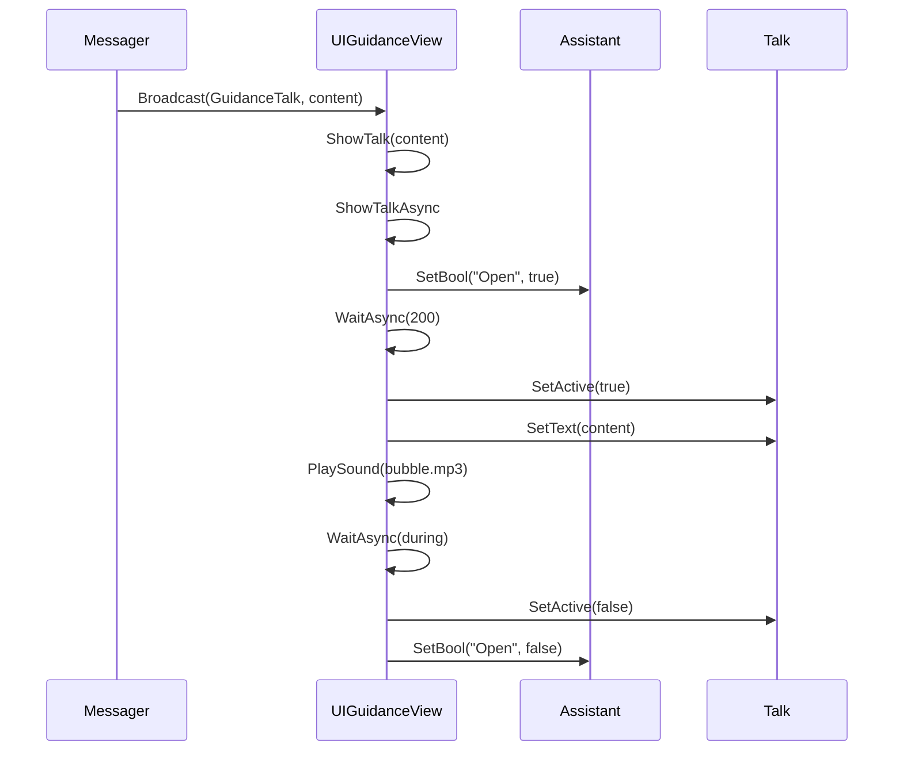
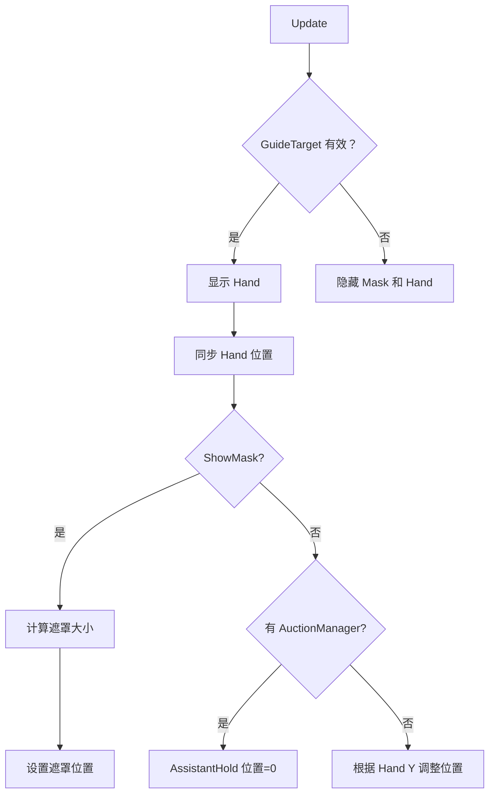

# UIGuidanceView.cs 注解文档

## 文件基本信息

| 属性 | 值 |
|------|-----|
| **文件名** | UIGuidanceView.cs |
| **路径** | Assets/Scripts/Code/Game/UI/UIGuidance/UIGuidanceView.cs |
| **所属模块** | 游戏层 → Code/Game/UI/UIGuidance |
| **文件职责** | 引导 UI 视图，显示引导助手、对话气泡、手势指示器和遮罩 |

---

## 类/结构体说明

### UIGuidanceView

| 属性 | 说明 |
|------|------|
| **职责** | 显示新手引导界面，包括助手动画、对话文本、手势指示器、目标遮罩等 |
| **泛型参数** | 无 |
| **继承关系** | 继承 `UIBaseView` 类 |
| **实现的接口** | `IOnCreate`, `IOnEnable`, `IOnDisable`, `IUpdate` |

**设计模式**: 观察者模式（监听 Messager 消息）

```csharp
// 使用方式
// 通过 UIManager 打开
var guidanceView = await UIManager.Instance.OpenWindow<UIGuidanceView>(UIGuidanceView.PrefabPath, UILayerNames.GuideLayer);

// 通过 Messager 发送对话消息
Messager.Instance.Broadcast(0, MessageId.GuidanceTalk, "欢迎来到游戏！");
```

---

## 字段与属性（按重要程度排序）

| 名称 | 类型 | 访问级别 | 说明 |
|------|------|----------|------|
| `PrefabPath` | `string` | `public static` | 预制体路径："UI/UIGuidance/Prefabs/UIGuidanceView.prefab" |
| `Talk` | `UIAnimator` | `public` | 对话气泡动画组件 |
| `TalkText` | `UITextmesh` | `public` | 对话文本组件 |
| `Assistant` | `UIAnimator` | `public` | 助手动画组件 |
| `AssistantHold` | `UIEmptyView` | `public` | 助手容器 |
| `Mask` | `UIImage` | `public` | 遮罩图片 |
| `Hand` | `UIEmptyView` | `public` | 手势指示器（UI 层） |
| `GameHand` | `UIEmptyView` | `public` | 手势指示器（游戏层） |
| `content` | `string` | `public` | 当前对话内容 |
| `cancellationToken` | `ETCancellationToken` | `private` | 对话动画取消令牌 |

---

## 方法说明（按重要程度排序）

### OnCreate()

**签名**:
```csharp
public void OnCreate()
```

**职责**: 创建 UI 组件

**核心逻辑**:
```
1. 添加 UIImage 组件（路径："Mask"）
2. 添加 UIEmptyView 组件（路径："AssistantHold"）
3. 添加 UIEmptyView 组件（路径："Hand"）
4. 添加 UIEmptyView 组件（路径："GameHand"）
5. 添加 UIAnimator 组件（路径："AssistantHold/Assistant"）
6. 添加 UITextmesh 组件（路径："AssistantHold/Assistant/Talk/Text"）
7. 添加 UIAnimator 组件（路径："AssistantHold/Assistant/Talk"）
```

**调用者**: `UIManager`（窗口创建时）

---

### OnEnable()

**签名**:
```csharp
public void OnEnable()
```

**职责**: UI 启用时的初始化，注册消息监听

**核心逻辑**:
```
1. 设置 Assistant 的 "Open" 参数为 false
2. 隐藏 Talk、Hand、GameHand
3. 注册 MessageId.GuidanceTalk 消息监听（2 个重载）
4. 注册 MessageId.GuideBox2 消息监听
```

**调用者**: `UIManager`（窗口启用时）

**被调用者**: `Messager.Instance.AddListener()`

---

### OnDisable()

**签名**:
```csharp
public void OnDisable()
```

**职责**: UI 禁用时的清理，取消消息监听

**核心逻辑**:
```
1. 取消对话动画（cancellationToken）
2. 清空 content 引用
3. 移除所有消息监听
```

**调用者**: `UIManager`（窗口禁用时）

**被调用者**: `cancellationToken.Cancel()`, `Messager.Instance.RemoveListener()`

---

### Update()

**签名**:
```csharp
public void Update()
```

**职责**: 每帧更新，同步手势指示器位置

**核心逻辑**:
```
1. 检查 GuidanceManager.GuideTarget 是否有效
2. 如果有效：
   - 显示 Hand
   - 同步 Hand 位置到目标位置
   - 如果需要显示遮罩：
     * 计算遮罩大小（目标 RectTransform 大小 * 2）
     * 设置遮罩位置
   - 根据 AuctionManager 存在性调整 AssistantHold 位置
3. 如果无效：
   - 隐藏 Mask 和 Hand
```

**调用者**: `ManagerProvider.Update()`（每帧调用）

**被调用者**: `IsValid()`, `GuidanceManager.GuideTarget`

---

### ShowTalk()

**签名**:
```csharp
public void ShowTalk(string content)
public void ShowTalk(string content, int during)
```

**职责**: 显示对话气泡

**核心逻辑**:
```
1. 如果内容相同，跳过
2. 如果内容为空：
   - 取消动画
   - 隐藏 Talk
   - 清空内容
3. 如果内容不为空：
   - 创建取消令牌
   - 启动 ShowTalkAsync 协程
```

**调用者**: `Messager`（收到 GuidanceTalk 消息时）

**被调用者**: `ShowTalkAsync()`

---

### ShowTalkAsync()

**签名**:
```csharp
private async ETTask ShowTalkAsync(ETCancellationToken cancel, int during)
```

**职责**: 异步显示对话动画

**核心逻辑**:
```
1. 打开 Assistant（"Open" = true）
2. 等待 200ms
3. 如果取消，关闭 Assistant 并返回
4. 显示 Talk
5. 设置文本为空
6. 等待 1ms
7. 设置对话内容
8. 播放音效（"Audio/Game/bubble.mp3"）
9. 如果 during > 0，等待指定时间；否则等待直到取消
10. 如果取消，返回
11. 隐藏 Talk，关闭 Assistant
12. 清空内容和取消令牌
```

**调用者**: `ShowTalk()`

**被调用者**: `TimerManager.Instance.WaitAsync()`, `SoundManager.Instance.PlaySound()`

---

### SetActiveObj()

**签名**:
```csharp
private void SetActiveObj(Transform entity, int confId)
```

**职责**: 设置游戏层手势指示器位置

**核心逻辑**:
```
1. 如果 entity 为 null，隐藏 GameHand
2. 否则：
   - 获取主摄像机
   - 获取单位配置（高度）
   - 将世界坐标转换为 UI 坐标
   - 设置 GameHand 位置
   - 显示 GameHand
```

**调用者**: `Messager`（收到 GuideBox2 消息时）

---

### IsValid()

**签名**:
```csharp
private bool IsValid(GameObject obj)
```

**职责**: 检查目标对象是否有效（可交互）

**核心逻辑**:
```
1. 如果 obj 为 null，返回 false
2. 如果是 Button，检查 enabled 和 interactable
3. 如果是 PointerClick，检查 enabled
4. 否则返回 true
```

**调用者**: `Update()`

---

## Mermaid 流程图

### UIGuidanceView 消息监听



### Update 同步流程



---

## 使用示例

### 打开引导界面

```csharp
// 打开 UIGuidanceView
var guidanceView = await UIManager.Instance.OpenWindow<UIGuidanceView>(
    UIGuidanceView.PrefabPath, 
    UILayerNames.GuideLayer
);
```

### 显示对话

```csharp
// 通过 Messager 发送对话消息
Messager.Instance.Broadcast(0, MessageId.GuidanceTalk, "欢迎来到游戏！");

// 或指定显示时间（毫秒）
Messager.Instance.Broadcast(0, MessageId.GuidanceTalk, "点击这里开始", 3000);
```

### 隐藏对话

```csharp
// 发送空内容隐藏对话
Messager.Instance.Broadcast(0, MessageId.GuidanceTalk, "");
```

### 设置游戏层手势

```csharp
// 设置指向游戏对象的引导手势
Messager.Instance.Broadcast(0, MessageId.GuideBox2, targetTransform, configId);
```

---

## 相关文档链接

- [UIBaseView.cs.md](../../../Module/UI/UIBaseView.cs.md) - UI 基类视图
- [UIAnimator.cs.md](../../../Module/UIComponent/UIAnimator.cs.md) - UI 动画组件
- [UITextmesh.cs.md](../../../Module/UIComponent/UITextmesh.cs.md) - UI 文本组件
- [GuidanceManager.cs.md](../../../Module/Guidance/GuidanceManager.cs.md) - 引导管理器
- [Messager.cs.md](../../../Module/Messager/Messager.cs.md) - 消息系统
- [MessageId.cs.md](../../../../Mono/Module/Const/MessageId.cs.md) - 消息 ID 常量

---

*文档生成时间：2026-03-02*
