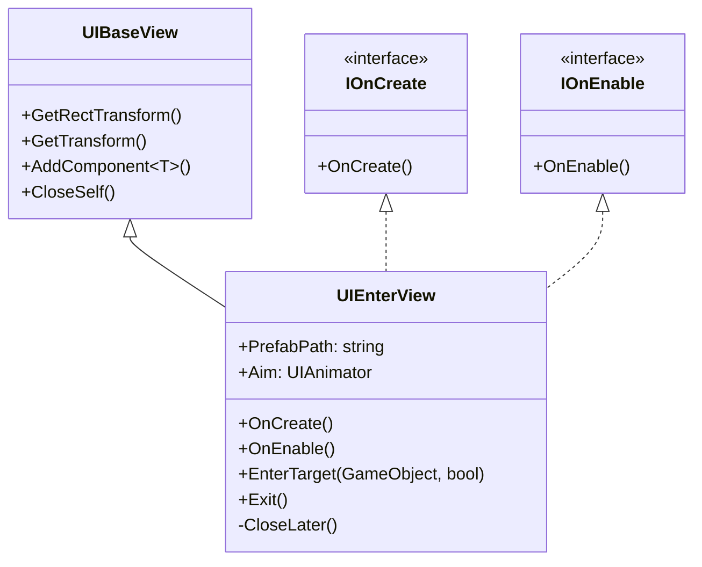

# UIEnterView.cs 注解文档

## 文件基本信息

| 属性 | 值 |
|------|-----|
| **文件名** | UIEnterView.cs |
| **路径** | Assets/Scripts/Code/Game/UI/UILoading/UIEnterView.cs |
| **所属模块** | 游戏层 → Code/Game/UI/UILoading |
| **文件职责** | 入场动画 UI 视图，用于场景切换时指向目标的入场动画效果 |

---

## 类/结构体说明

### UIEnterView

| 属性 | 说明 |
|------|------|
| **职责** | 显示入场动画，指向场景中的目标对象，播放动画后自动关闭 |
| **泛型参数** | 无 |
| **继承关系** | 继承 `UIBaseView` 类 |
| **实现的接口** | `IOnCreate`, `IOnEnable` |

**设计模式**: 组件模式

```csharp
// 使用方式
// 通过 UIManager 打开
var enterView = await UIManager.Instance.OpenWindow<UIEnterView>(UIEnterView.PrefabPath, UILayerNames.TopLayer);
await enterView.EnterTarget(targetGameObject);
```

---

## 字段与属性（按重要程度排序）

| 名称 | 类型 | 访问级别 | 说明 |
|------|------|----------|------|
| `PrefabPath` | `string` | `public static` | 预制体路径："UI/UILoading/Prefabs/UIEnterView.prefab" |
| `Aim` | `UIAnimator` | `public` | 目标指示器动画组件 |

---

## 方法说明（按重要程度排序）

### OnCreate()

**签名**:
```csharp
public void OnCreate()
```

**职责**: 创建 UI 组件

**核心逻辑**:
```
1. 添加 UIAnimator 组件（路径："Aim"）
```

**调用者**: `UIManager`（窗口创建时）

---

### OnEnable()

**签名**:
```csharp
public void OnEnable()
```

**职责**: UI 启用时的初始化

**核心逻辑**:
```
1. 设置 Aim 为非激活状态
```

**调用者**: `UIManager`（窗口启用时）

---

### EnterTarget()

**签名**:
```csharp
public async ETTask EnterTarget(GameObject target, bool autoClose = true)
```

**职责**: 执行入场动画，指向目标对象

**核心逻辑**:
```
1. 如果目标不为 null：
   - 如果目标没有 RectTransform：
     * 获取主摄像机
     * 将世界坐标转换为 UI 本地坐标
     * 设置 Aim 位置
   - 如果有 RectTransform：
     * 直接使用目标 transform 位置
2. 如果目标为 null：
   - 设置 Aim 位置为 (0, 0)
3. 激活 Aim
4. 播放 "Enter" 动画
5. 如果 autoClose 为 true，1 秒后自动关闭
```

**调用者**: `CreateScene.OnLeave()`, 场景切换代码

**被调用者**: `UIManager.Instance.ScreenPointToUILocalPoint()`, `Aim.Play()`, `CloseLater()`

---

### Exit()

**签名**:
```csharp
public async ETTask Exit()
```

**职责**: 执行退出动画

**核心逻辑**:
```
1. 播放 "Exit" 动画
2. 关闭自身
```

**调用者**: `CreateScene.OnLeave()`

**被调用者**: `Aim.Play()`, `CloseSelf()`

---

### CloseLater()

**签名**:
```csharp
private async ETTask CloseLater()
```

**职责**: 延迟关闭自身

**核心逻辑**:
```
1. 等待 1000ms
2. 关闭自身
```

**调用者**: `EnterTarget()`（当 autoClose 为 true 时）

**被调用者**: `TimerManager.Instance.WaitAsync()`, `CloseSelf()`

---

## Mermaid 流程图

### UIEnterView 类继承关系



### EnterTarget 流程

```mermaid
sequenceDiagram
    participant C as Caller
    participant UE as UIEnterView
    participant UM as UIManager
    participant Aim as UIAnimator
    target as GameObject

    C->>UE: EnterTarget(target, autoClose)
    alt target != null
        alt target has RectTransform
            UE->>UE: Aim.position = target.position
        else
            UE->>UM: ScreenPointToUILocalPoint
            UM-->>UE: 返回 UI 坐标
            UE->>Aim: 设置 anchoredPosition
        end
    else
        UE->>Aim: 设置位置为 (0,0)
    end
    UE->>Aim: SetActive(true)
    UE->>Aim: Play("Enter")
    opt autoClose
        UE->>UE: CloseLater()
        UE->>UE: WaitAsync(1000)
        UE->>UE: CloseSelf()
    end
```

---

## 使用示例

### 打开入场动画

```csharp
// 打开 UIEnterView
var enterView = await UIManager.Instance.OpenWindow<UIEnterView>(
    UIEnterView.PrefabPath, 
    UILayerNames.TopLayer
);

// 执行入场动画（指向目标）
await enterView.EnterTarget(targetGameObject);

// 或手动退出
await enterView.Exit();
```

### 自动关闭

```csharp
// 打开后自动关闭（1 秒后）
await enterView.EnterTarget(targetGameObject, autoClose: true);
```

---

## 相关文档链接

- [UIBaseView.cs.md](../../../Module/UI/UIBaseView.cs.md) - UI 基类视图
- [UIAnimator.cs.md](../../../Module/UIComponent/UIAnimator.cs.md) - UI 动画组件
- [UIManager.cs.md](../../../Module/UI/UIManager.cs.md) - UI 管理器
- [CreateScene.cs.md](../../Scene/Map/CreateScene.cs.md) - 角色创建场景

---

*文档生成时间：2026-03-02*
