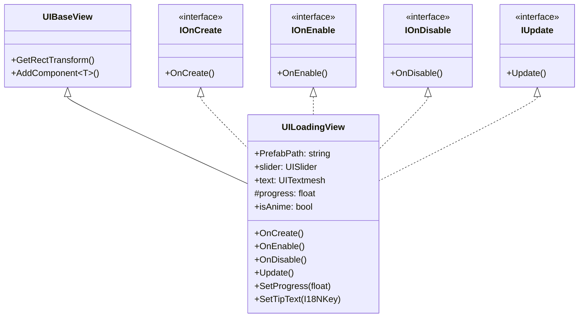

# UILoadingView.cs 注解文档

## 文件基本信息

| 属性 | 值 |
|------|-----|
| **文件名** | UILoadingView.cs |
| **路径** | Assets/Scripts/Code/Game/UI/UILoading/UILoadingView.cs |
| **所属模块** | 游戏层 → Code/Game/UI/UILoading |
| **文件职责** | 加载界面 UI 视图基类，提供进度条显示和自动增长动画功能 |

---

## 类/结构体说明

### UILoadingView

| 属性 | 说明 |
|------|------|
| **职责** | 显示加载进度条和提示文本，支持自动增长动画，作为 UILoadingView2 的基类 |
| **泛型参数** | 无 |
| **继承关系** | 继承 `UIBaseView` 类 |
| **实现的接口** | `IOnCreate`, `IOnEnable`, `IOnDisable`, `IUpdate` |

**设计模式**: 模板方法模式

```csharp
// 使用方式
// 通过 UIManager 打开
var loadingView = await UIManager.Instance.OpenWindow<UILoadingView>(UILoadingView.PrefabPath, UILayerNames.TipLayer);
loadingView.SetProgress(0.5f);
```

---

## 字段与属性（按重要程度排序）

| 名称 | 类型 | 访问级别 | 说明 |
|------|------|----------|------|
| `PrefabPath` | `string` | `public static` | 预制体路径："UI/UILoading/Prefabs/UILoadingView.prefab" |
| `slider` | `UISlider` | `public` | 进度条组件 |
| `text` | `UITextmesh` | `public` | 提示文本组件 |
| `progress` | `float` | `protected` | 当前进度值（0-1） |
| `isAnime` | `bool` | `public` | 是否禁用自动增长动画 |

---

## 方法说明（按重要程度排序）

### OnCreate()

**签名**:
```csharp
public virtual void OnCreate()
```

**职责**: 创建 UI 组件

**核心逻辑**:
```
1. 添加 UITextmesh 组件（路径："Loadingscreen/Text"）
2. 添加 UISlider 组件（路径："Loadingscreen/Slider"）
```

**调用者**: `UIManager`（窗口创建时）

---

### OnEnable()

**签名**:
```csharp
public virtual void OnEnable()
```

**职责**: UI 启用时的初始化

**核心逻辑**:
```
1. 重置进度为 0
2. 设置提示文本为国际化 key（I18NKey.Loading_Tip_0）
```

**调用者**: `UIManager`（窗口启用时）

**被调用者**: `text.SetI18NKey()`

---

### OnDisable()

**签名**:
```csharp
public void OnDisable()
```

**职责**: UI 禁用时的清理

**核心逻辑**:
```
1. 重置进度为 0
```

**调用者**: `UIManager`（窗口禁用时）

---

### Update()

**签名**:
```csharp
public void Update()
```

**职责**: 每帧更新，实现自动增长动画

**核心逻辑**:
```
1. 如果 isAnime 为 true，跳过自动增长
2. 计算新进度：progress + deltaTime / max(5, progress*100)
   - 进度越慢，增长越快
   - 进度越快，增长越慢
3. 调用 SetProgress() 更新显示
```

**调用者**: `ManagerProvider.Update()`（每帧调用）

**被调用者**: `SetProgress()`

---

### SetProgress()

**签名**:
```csharp
public virtual void SetProgress(float value)
```

**职责**: 设置加载进度

**核心逻辑**:
```
1. 如果新值大于当前进度，更新 progress
2. 更新 slider 显示
```

**调用者**: `SceneManager`, `Scene` 实现类，`Update()`

**被调用者**: `slider.SetValue()`

---

### SetTipText()

**签名**:
```csharp
public void SetTipText(I18NKey key)
```

**职责**: 设置提示文本

**核心逻辑**:
```
1. 设置 text 的国际化 key
```

**调用者**: 需要自定义提示文本的代码

**被调用者**: `text.SetI18NKey()`

---

## Mermaid 流程图

### UILoadingView 类继承关系



### 自动增长动画流程

```mermaid
flowchart TD
    A[Update 每帧调用] --> B{isAnime?}
    B -->|是 | C[跳过自动增长]
    B -->|否 | D[计算新进度]
    D --> E[progress += deltaTime / max(5, progress*100)]
    E --> F[SetProgress]
    F --> G[更新 slider 显示]
    G --> C
```

---

## 使用示例

### 打开加载界面

```csharp
// 打开 UILoadingView
var loadingView = await UIManager.Instance.OpenWindow<UILoadingView>(
    UILoadingView.PrefabPath, 
    UILayerNames.TipLayer
);

// 设置进度
loadingView.SetProgress(0.5f);
```

### 禁用自动增长

```csharp
// 禁用自动增长（手动控制进度）
loadingView.isAnime = true;
loadingView.SetProgress(0.3f);
```

### 自定义提示文本

```csharp
// 设置自定义提示文本
loadingView.SetTipText(I18NKey.Loading_Tip_1);
```

---

## 相关文档链接

- [UIBaseView.cs.md](../../../Module/UI/UIBaseView.cs.md) - UI 基类视图
- [UISlider.cs.md](../../../Module/UIComponent/UISlider.cs.md) - UI 滑动条组件
- [UITextmesh.cs.md](../../../Module/UIComponent/UITextmesh.cs.md) - UI 文本组件
- [UILoadingView2.cs.md](UILoadingView2.cs.md) - 加载界面版本 2
- [GuideScene.cs.md](../../Scene/Map/GuideScene.cs.md) - 引导场景

---

*文档生成时间：2026-03-02*
