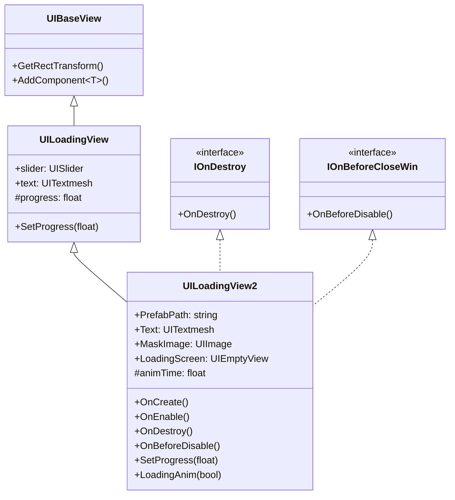
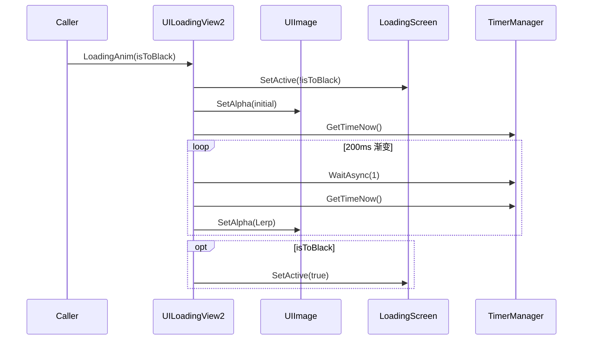

# UILoadingView2.cs 注解文档

## 文件基本信息

| 属性 | 值 |
|------|-----|
| **文件名** | UILoadingView2.cs |
| **路径** | Assets/Scripts/Code/Game/UI/UILoading/UILoadingView2.cs |
| **所属模块** | 游戏层 → Code/Game/UI/UILoading |
| **文件职责** | 加载界面 UI 视图（版本 2），支持渐变遮罩动画和百分比文本显示 |

---

## 类/结构体说明

### UILoadingView2

| 属性 | 说明 |
|------|------|
| **职责** | 显示加载进度，支持黑屏渐变动画、百分比文本显示，用于场景切换时的加载界面 |
| **泛型参数** | 无 |
| **继承关系** | 继承 `UILoadingView` 类 |
| **实现的接口** | `IOnDestroy`, `IOnBeforeCloseWin` |

**设计模式**: 模板方法模式（继承 UILoadingView）

```csharp
// 使用方式
// 通过 UIManager 打开
var loadingView = await UIManager.Instance.OpenWindow<UILoadingView2>(UILoadingView2.PrefabPath, UILayerNames.TipLayer);
loadingView.SetProgress(0.5f);
```

---

## 字段与属性（按重要程度排序）

| 名称 | 类型 | 访问级别 | 说明 |
|------|------|----------|------|
| `PrefabPath` | `string` | `public new static` | 预制体路径："UI/UILoading/Prefabs/UILoadingView2.prefab" |
| `Text` | `UITextmesh` | `public` | 百分比文本显示组件 |
| `MaskImage` | `UIImage` | `public` | 遮罩图片（用于渐变动画） |
| `LoadingScreen` | `UIEmptyView` | `public` | 加载屏幕容器 |
| `animTime` | `float` | `private const` | 动画时间：200ms |

---

## 方法说明（按重要程度排序）

### OnCreate()

**签名**:
```csharp
public override void OnCreate()
```

**职责**: 创建 UI 组件

**核心逻辑**:
```
1. 调用 base.OnCreate()（初始化 slider 和 text）
2. 添加 UITextmesh 组件（路径："Loadingscreen/Slider/Text"）
3. 添加 UIEmptyView 组件（路径："Loadingscreen"）
4. 添加 UIImage 组件（路径："Mask"）
```

**调用者**: `UIManager`（窗口创建时）

---

### OnEnable()

**签名**:
```csharp
public override void OnEnable()
```

**职责**: UI 启用时的初始化

**核心逻辑**:
```
1. 播放加载音效（"Audio/Sound/dockEnter.mp3"）
2. 重置进度为 0
```

**调用者**: `UIManager`（窗口启用时）

**被调用者**: `SoundManager.Instance.PlaySound()`

---

### OnDestroy()

**签名**:
```csharp
public void OnDestroy()
```

**职责**: UI 销毁时的清理（当前为空实现）

**调用者**: `UIManager`（窗口销毁时）

---

### OnBeforeDisable()

**签名**:
```csharp
public async ETTask OnBeforeDisable()
```

**职责**: UI 禁用前的渐变动画

**核心逻辑**:
```
1. 获取当前时间 startTime
2. 渐变显示遮罩（0 → 1，200ms）：
   - 每帧更新遮罩透明度
   - 使用 Lerp 插值
   - 等待 200ms
3. 隐藏 LoadingScreen
4. 渐变隐藏遮罩（1 → 0，200ms）：
   - 每帧更新遮罩透明度
   - 使用 Lerp 插值
   - 等待 200ms
```

**调用者**: `UIManager`（窗口禁用前）

**被调用者**: `TimerManager.Instance.WaitAsync()`, `MaskImage.SetImageAlpha()`

---

### SetProgress()

**签名**:
```csharp
public override void SetProgress(float val)
```

**职责**: 设置加载进度并更新百分比文本

**核心逻辑**:
```
1. 调用 base.SetProgress(val)（更新 slider）
2. 计算百分比（val * 100，限制在 0-100）
3. 更新文本显示（格式："X%"）
```

**调用者**: `SceneManager`, `Scene` 实现类

**被调用者**: `base.SetProgress()`, `Text.SetText()`

---

### LoadingAnim()

**签名**:
```csharp
public async ETTask LoadingAnim(bool isToBlack)
```

**职责**: 执行黑屏/亮屏渐变动画

**核心逻辑**:
```
1. 设置 LoadingScreen 可见性（!isToBlack）
2. 设置遮罩初始透明度（isToBlack ? 0 : 1）
3. 渐变动画（200ms）：
   - isToBlack = true: 0 → 1（变黑）
   - isToBlack = false: 1 → 0（变亮）
   - 每帧更新遮罩透明度
   - 使用 Lerp 插值
4. 如果 isToBlack 为 true，显示 LoadingScreen
```

**调用者**: `MapScene.OnEnter()`, `GuideScene` 等

**被调用者**: `TimerManager.Instance.WaitAsync()`, `MaskImage.SetImageAlpha()`

---

## Mermaid 流程图

### UILoadingView2 类继承关系



### LoadingAnim 流程



---

## 使用示例

### 打开加载界面

```csharp
// 打开 UILoadingView2
var loadingView = await UIManager.Instance.OpenWindow<UILoadingView2>(
    UILoadingView2.PrefabPath, 
    UILayerNames.TipLayer
);

// 设置进度
loadingView.SetProgress(0.5f); // 显示 50%
```

### 执行黑屏渐变

```csharp
// 渐变到黑屏
await loadingView.LoadingAnim(isToBlack: true);

// 渐变到亮屏
await loadingView.LoadingAnim(isToBlack: false);
```

### 场景切换使用

```csharp
// 在 MapScene 中使用
public async ETTask OnEnter()
{
    win = await UIManager.Instance.OpenWindow<UIMatchView, int>(...);
    win.SetProgress(0);
    await win.LoadingAnim(true);   // 变黑
    await win.LoadingAnim(false);  // 变亮
}
```

---

## 相关文档链接

- [UILoadingView.cs.md](UILoadingView.cs.md) - 加载界面基类
- [UIBaseView.cs.md](../../../Module/UI/UIBaseView.cs.md) - UI 基类视图
- [UITextmesh.cs.md](../../../Module/UIComponent/UITextmesh.cs.md) - UI 文本组件
- [UIImage.cs.md](../../../Module/UIComponent/UIImage.cs.md) - UI 图片组件
- [MapScene.cs.md](../../Scene/Map/MapScene.cs.md) - 地图场景

---

*文档生成时间：2026-03-02*
