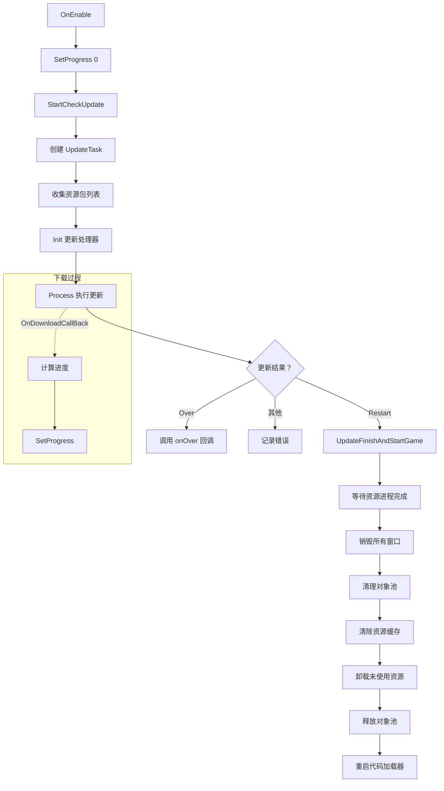
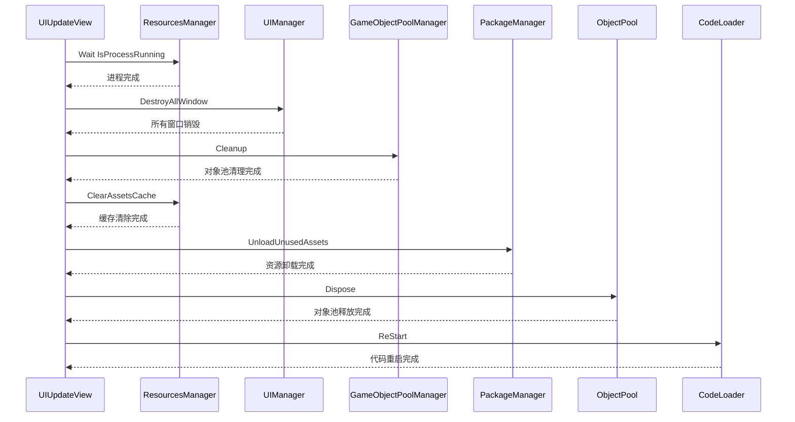

# UIUpdateView.cs 注解文档

## 文件基本信息

| 属性 | 值 |
|------|-----|
| **文件名** | UIUpdateView.cs |
| **路径** | Assets/Scripts/Code/Game/UI/UIUpdate/UIUpdateView.cs |
| **所属模块** | 玩法层 → UI 更新界面 |
| **文件职责** | 热更新界面，显示更新进度并执行更新流程 |

---

## 类/结构体说明

### UIUpdateView

| 属性 | 说明 |
|------|------|
| **职责** | 热更新界面视图类 |
| **泛型参数** | 无 |
| **继承关系** | 继承 `UIBaseView` |
| **实现的接口** | `IOnCreate`, `IOnEnable<Action>`, `IOnWidthPaddingChange` |

**设计模式**: 状态机 + 进度回调

```csharp
// 使用示例
UIManager.Instance.OpenWindow<UIUpdateView, Action>(
    UIUpdateView.PrefabPath,
    () => {
        Debug.Log("更新完成，进入游戏");
    }
);
```

---

## 字段与属性（按重要程度排序）

| 名称 | 类型 | 访问级别 | 说明 |
|------|------|----------|------|
| `PrefabPath` | `string` | `public static` | 预制体路径：`"UI/UIUpdate/Prefabs/UIUpdateView.prefab"` |
| `mSlider` | `UISlider` | `private` | 进度条组件 |
| `lastProgress` | `float` | `private` | 上次进度值（防止回退） |
| `onOver` | `Action` | `private` | 更新完成回调 |

---

## 生命周期方法

### OnCreate()

**签名**:
```csharp
public void OnCreate()
```

**职责**: 初始化进度条组件

**核心逻辑**:
```
1. 获取 mSlider 进度条组件（"Loadingscreen/Slider"）
```

**调用者**: UIManager（窗口创建时自动调用）

---

### OnEnable(Action func)

**签名**:
```csharp
public void OnEnable(Action func)
```

**职责**: 启用时初始化进度并启动更新流程

**核心逻辑**:
```
1. 保存完成回调 onOver = func
2. 重置进度 lastProgress = 0
3. 设置进度条为 0 mSlider.SetValue(0)
4. 启动协程 StartCheckUpdate()
```

**调用者**: UIManager（窗口打开时自动调用）

---

## 私有方法

### SetProgress(float value)

**签名**:
```csharp
void SetProgress(float value)
```

**职责**: 设置更新进度

**核心逻辑**:
```
1. 如果 value > lastProgress 或 value == 0:
   - 更新 lastProgress = value
   - 设置进度条 mSlider.SetNormalizedValue(lastProgress)
```

**设计意图**: 进度只增不减，避免下载波动导致进度条回退

**调用者**: OnDownloadCallBack

---

### StartCheckUpdate()

**签名**:
```csharp
async ETTask StartCheckUpdate()
```

**职责**: 执行完整的热更新流程

**核心逻辑**:
```
1. 设置进度为 0
2. 创建 UpdateTask 实例
3. 创建资源包名称列表:
   - 遍历 PackageManager.Instance.Config.OtherPackageMaxVer
   - 收集所有资源包名称
4. 初始化更新任务 task.Init():
   - 进度回调：OnDownloadCallBack
   - 更新流程处理器:
     * SetWhiteListProcess - 设置白名单
     * SetUpdateListProcess - 设置更新列表
     * UpdateIsSHProcess - 检查是否为上海版本
     * AppUpdateProcess - 应用更新
     * MainPackageUpdateProcess - 主包更新
     * OtherPackageUpdateProcess - 其他包更新
5. 执行更新任务 await task.Process()
6. 根据结果处理:
   - UpdateRes.Restart → 需要重启 → UpdateFinishAndStartGame()
   - UpdateRes.Over → 无需重启 → 调用 onOver 回调
   - 其他 → 记录错误日志
```

**调用者**: OnEnable()

**异步行为**: 等待整个更新流程完成

**更新流程处理器顺序**:
```
1. SetWhiteListProcess      → 设置更新白名单
2. SetUpdateListProcess     → 设置需要更新的文件列表
3. UpdateIsSHProcess        → 检查版本区域
4. AppUpdateProcess         → 应用层面更新
5. MainPackageUpdateProcess → 主资源包更新
6. OtherPackageUpdateProcess → 其他资源包更新
```

---

### OnDownloadCallBack(long c, long d)

**签名**:
```csharp
private void OnDownloadCallBack(long c, long d)
```

**职责**: 下载进度回调

**参数说明**:
- `c`: 总字节数（count）
- `d`: 已下载字节数（downloaded）

**核心逻辑**:
```
1. 计算进度百分比 percent = (float)d / c
2. 调用 SetProgress(percent) 更新进度条
3. （注释掉）显示下载大小文本
```

**调用者**: UpdateTask（下载过程中持续调用）

---

### UpdateFinishAndStartGame()

**签名**:
```csharp
private async ETTask UpdateFinishAndStartGame()
```

**职责**: 更新完成后清理资源并重启游戏

**核心逻辑**:
```
1. 等待资源管理进程完成:
   - while(ResourcesManager.Instance.IsProcessRunning()) 等待
2. 销毁所有窗口 await UIManager.Instance.DestroyAllWindow()
3. 清理对象池 GameObjectPoolManager.GetInstance().Cleanup()
4. 清除资源缓存 ResourcesManager.Instance.ClearAssetsCache()
5. 卸载未使用资源 await PackageManager.Instance.UnloadUnusedAssets()
6. 释放对象池 ObjectPool.Instance.Dispose()
7. 重启代码加载器 CodeLoader.Instance.ReStart()
```

**调用者**: StartCheckUpdate()（当更新结果为 Restart 时）

**异步行为**: 等待所有清理操作完成

**重启流程**:
```
等待资源进程完成 → 销毁 UI → 清理对象池 → 清除缓存 → 卸载资源 → 重启代码
```

---

## 使用场景

### 1. 启动时检查更新
```csharp
// 在 Entry.cs 的 StartAsync 中
if (needUpdate)
{
    UIManager.Instance.OpenWindow<UIUpdateView, Action>(
        UIUpdateView.PrefabPath,
        () => {
            // 更新完成，进入游戏
            StartGameAsync().Coroutine();
        }
    );
}
else
{
    StartGameAsync().Coroutine();
}
```

### 2. 强制更新
```csharp
// 服务器返回强制更新标志
if (serverConfig.ForceUpdate)
{
    UIManager.Instance.OpenWindow<UIUpdateView, Action>(
        UIUpdateView.PrefabPath,
        () => {
            // 更新完成，重启游戏
            Application.Quit();
            // 或 CodeLoader.Instance.ReStart();
        }
    );
}
```

---

## UI 结构

```
UIUpdateView (UIBaseView)
└── Loadingscreen
    └── Slider (UISlider) - mSlider 进度条
```

---

## 更新结果枚举（UpdateRes）

| 值 | 说明 | 处理方式 |
|----|------|----------|
| `Restart` | 需要重启 | 清理资源并重启 |
| `Over` | 更新完成（无需重启） | 调用 onOver 回调 |
| 其他 | 更新失败 | 记录错误日志 |

---

## 更新流程图



---

## 资源清理顺序



---

## 关键设计点

### 1. 进度只增不减
```csharp
if (value > lastProgress || value == 0)
    lastProgress = value;
```
防止下载波动导致进度条回退，提升用户体验

### 2. 多阶段更新流程
使用责任链模式，按顺序执行多个更新处理器：
- 白名单设置
- 更新列表设置
- 版本检查
- 应用更新
- 主包更新
- 其他包更新

### 3. 完整的资源清理
更新完成后彻底清理所有资源，确保重启后状态干净

---

## 相关文档

- [UIManager.cs.md](../../Module/UI/UIManager.cs.md) - UI 管理器
- [UIBaseView.cs.md](../../Module/UI/UIBaseView.cs.md) - UI 视图基类
- [UISlider.cs.md](../../Module/UIComponent/UISlider.cs.md) - 进度条组件
- [UpdateTask.cs.md](../Update/UpdateTask.cs.md) - 更新任务
- [UpdateRes.cs.md](../Update/UpdateRes.cs.md) - 更新结果枚举
- [UpdateProcess/*.cs.md](../Update/UpdateProcess/) - 更新流程处理器
- [ResourcesManager.cs.md](../../Module/Resource/ResourcesManager.cs.md) - 资源管理器
- [GameObjectPoolManager.cs.md](../../Module/Resource/GameObjectPoolManager.cs.md) - 对象池管理器
- [PackageManager.cs](#) - 资源包管理器
- [CodeLoader.cs](#) - 代码加载器

---

*文档生成时间：2026-03-01 | OpenClaw AI 助手*
