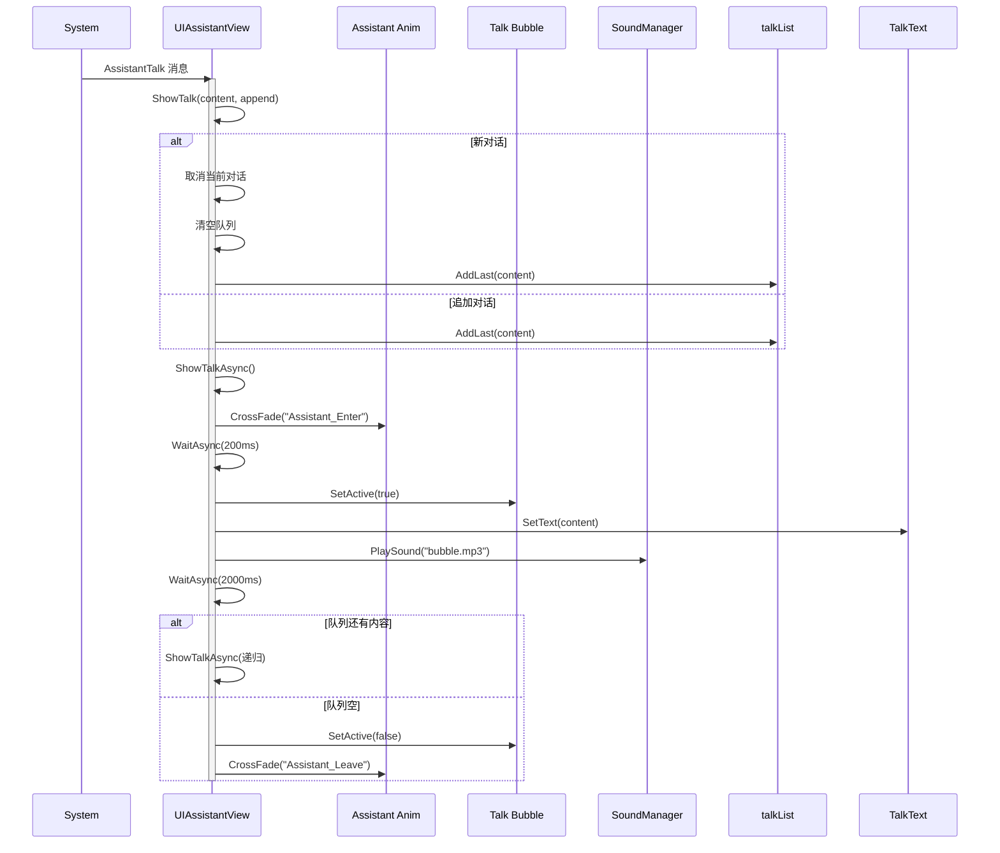

# UIAssistantView.cs - 助手对话视图

## 📄 文件信息

| 属性 | 值 |
|------|------|
| 文件路径 | `Assets/Scripts/Code/Game/UIGame/UIAuction/UIAssistantView.cs` |
| 命名空间 | `TaoTie` |
| 基类 | `UIBaseView` |
| 实现接口 | `IOnCreate`, `IOnEnable`, `IOnDisable` |

---

## 🎯 类说明

`UIAssistantView` 是助手对话视图，用于在游戏过程中显示助手的对话气泡和手势引导，帮助玩家理解游戏规则和操作。

### 核心职责

- **对话显示**: 显示助手的对话文本和动画
- **队列管理**: 支持对话内容队列，自动连续播放
- **手势引导**: 显示指向 3D 物体的手势标识
- **音效播放**: 播放对话气泡音效
- **自动关闭**: 对话结束后自动隐藏

---

## 📋 字段说明

### UI 组件字段

| 字段名 | 类型 | 说明 |
|--------|------|------|
| `Talk` | `UIAnimator` | 对话气泡动画控制器 |
| `TalkText` | `UITextmesh` | 对话文本 |
| `Assistant` | `UIAnimator` | 助手角色动画控制器 |
| `Hand` | `UIEmptyView` | 手势引导容器 |

### 数据字段

| 字段名 | 类型 | 说明 |
|--------|------|------|
| `talkList` | `LinkedList<string>` | 对话内容队列 |
| `cancellationToken` | `ETCancellationToken` | 当前对话的取消令牌 |

### 常量

| 常量名 | 类型 | 值 | 说明 |
|--------|------|-----|------|
| `PrefabPath` | `string` | `"UIGame/UIAuction/Prefabs/UIAssistantView.prefab"` | 预制体路径 |

---

## 🔧 方法说明

### 生命周期方法

#### `OnCreate()`
视图创建时初始化所有 UI 组件。

**主要功能:**
1. 初始化手势引导容器
2. 初始化助手和对话动画组件
3. 初始化对话文本

#### `OnEnable()`
视图启用时注册消息监听。

**主要功能:**
1. 隐藏手势和对话（默认状态）
2. 注册 `AssistantTalk` 消息监听（显示对话）
3. 注册 `GuideBox` 消息监听（显示手势）

#### `OnDisable()`
视图禁用时清理资源。

**主要功能:**
1. 取消当前对话
2. 清空对话队列
3. 移除消息监听

---

### 业务方法

#### `ShowTalk(string content, bool append)`
显示对话内容。

**参数说明:**
- `content`: 对话文本内容
- `append`: 是否追加到队列（true=追加，false=新对话）

**逻辑:**
- 如果是新对话：取消当前对话，清空队列，开始新对话
- 如果是追加：添加到队列末尾，等待当前对话完成后播放

#### `ShowTalkAsync(ETCancellationToken cancel)`
异步播放对话。

**流程:**
1. 播放助手进入动画
2. 等待 200ms
3. 显示对话气泡
4. 设置对话文本
5. 播放气泡音效
6. 等待 2000ms（阅读时间）
7. 如果队列还有内容：继续播放下一条
8. 否则：隐藏对话，播放助手离开动画

#### `SetActiveObj(Transform entity, int confId)`
设置手势引导指向的目标。

**参数说明:**
- `entity`: 目标实体 Transform
- `confId`: 单位配置 ID（用于获取高度）

**坐标转换:**
```csharp
Vector2 pt = UIManager.Instance.ScreenPointToUILocalPoint(
    GetRectTransform(),
    mainCamera.WorldToScreenPoint(
        entity.position + Vector3.up * height
    )
);
```

---

## 🔄 流程图



---

## 💡 使用示例

### 显示助手对话

```csharp
// 通过消息系统触发
Messager.Instance.Trigger(MessageId.AssistantTalk, "欢迎来到拍卖行！点击按钮开始竞拍。", false);

// 追加对话（连续播放）
Messager.Instance.Trigger(MessageId.AssistantTalk, "这次竞拍有三个选项。", true);
Messager.Instance.Trigger(MessageId.AssistantTalk, "选择你认为合适的价格。", true);
```

### 显示手势引导

```csharp
// 指向 3D 场景中的物体
Transform target = SceneManager.Instance.GetCurrentScene<MapScene>()
    .collector.GetGameObject("Collection").transform;
int configId = unitEntity.Id;

Messager.Instance.Trigger(MessageId.GuideBox, target, configId);

// 隐藏手势
Messager.Instance.Trigger(MessageId.GuideBox, null, 0);
```

---

## 🔗 相关文档

- [UIGameView.cs.md](./UIGameView.cs.md) - 游戏主界面
- [UIGuideGameView.cs.md](./UIGuideGameView.cs.md) - 引导游戏视图
- [Messager.cs.md](../../../Module/Messager/Messager.cs.md) - 消息系统

---

*最后更新：2026-03-02*
