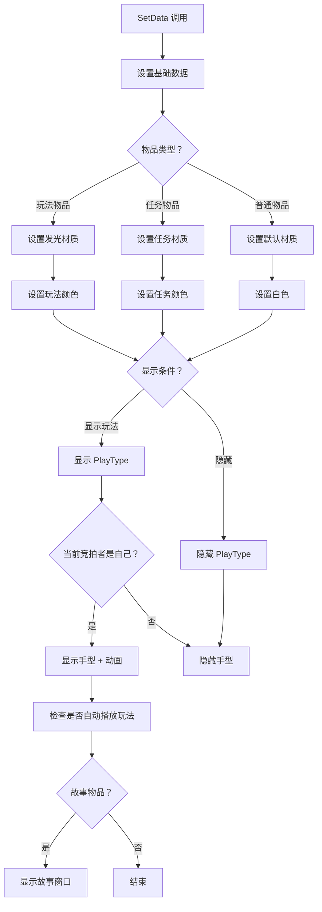

# UIAuctionItem.cs - 拍卖物品项组件

## 📄 文件信息

| 属性 | 值 |
|------|------|
| 文件路径 | `Assets/Scripts/Code/Game/UIGame/UIAuction/UIAuctionItem.cs` |
| 命名空间 | `TaoTie` |
| 基类 | `UIButton` |
| 实现接口 | `IOnCreate` |

---

## 🎯 类说明

`UIAuctionItem` 是拍卖物品项组件，继承自 `UIButton`，用于在物品列表中展示单个宝盒/物品的详细信息，包括图标、名称、价格、玩法标识等。

### 核心职责

- **物品展示**: 显示物品的图标、名称、基础价格
- **类型标识**: 根据物品类型显示不同的视觉效果（普通/玩法/任务）
- **价格动画**: 支持价格数字动画和情报加成显示
- **玩法交互**: 支持点击触发玩法小游戏
- **状态管理**: 根据竞拍状态显示/隐藏手型标识和动画

---

## 📋 字段说明

### UI 组件字段

| 字段名 | 类型 | 说明 |
|--------|------|------|
| `TextPrice` | `UITextmesh` | 价格显示文本 |
| `Name` | `UITextmesh` | 物品名称 |
| `Icon` | `UIImage` | 物品图标 |
| `IconAnim` | `UIAnimator` | 图标动画控制器 |
| `IconCash` | `UIImage` | 金币图标（普通物品） |
| `Bottom` | `UIEmptyView` | 底部信息区域 |
| `PlayType` | `UIPointerClick` | 玩法标识点击区域 |
| `TextPriceAddOn` | `UITextmesh` | 价格加成文本（情报效果） |
| `TextBottomImg` | `UIImage` | 加成文本背景 |
| `Hand` | `UIImage` | 手型标识（可互动提示） |
| `PlayOne` | `UITextmesh` | "玩法"标识文本 |
| `Animator` | `UIAnimator` | 文本底部动画控制器 |

### 数据字段

| 字段名 | 类型 | 说明 |
|--------|------|------|
| `ConfigId` | `int` | 物品配置 ID |
| `BoxType` | `BoxType` | 宝盒类型（普通/任务） |
| `hidePlayType` | `bool` | 是否隐藏玩法标识 |
| `Config` | `ItemConfig` | 物品配置数据（只读属性） |
| `price` | `BigNumber` | 缓存的价格值 |

---

## 🔧 方法说明

### 生命周期方法

#### `OnCreate()`
组件创建时初始化所有 UI 子组件。

**主要功能:**
1. 初始化所有 UI 组件引用
2. 绑定玩法标识点击事件

---

### 业务方法

#### `SetData(ItemConfig cfg, bool hide, bool hidePlayType, BoxType boxType)`
设置物品数据并刷新显示。

**参数说明:**
- `cfg`: 物品配置
- `hide`: 是否隐藏（播放动画时）
- `hidePlayType`: 是否隐藏玩法标识
- `boxType`: 宝盒类型

**主要功能:**
1. **基础设置**: 重置价格缓存、设置配置 ID 和类型
2. **图标加载**: 设置物品图标路径
3. **文本设置**: 设置名称和价格（任务物品显示特殊文本）
4. **视觉效果**:
   - 玩法物品：设置发光材质、特殊颜色
   - 任务物品：设置任务材质、任务颜色
   - 普通物品：默认白色
5. **显示控制**: 根据条件显示/隐藏玩法标识和手型

#### `OnClickPlayType()`
处理玩法标识点击事件。

**触发条件:**
- 当前玩家是竞拍者
- 物品有玩法配置
- 价格未被锁定
- 玩法已解锁（或已过竞拍阶段）

**功能:** 调用 `AuctionHelper.ShowPlayView()` 显示玩法预览

#### `SetChangeItemResult(int newId, bool isAI)`
响应鉴定结果，更新物品信息。

**参数说明:**
- `newId`: 新的物品配置 ID
- `isAI`: 是否是 AI 操作

**主要功能:**
1. 更新配置 ID 和图标
2. 如果是 AI 操作：播放 "PlayOne" 动画
3. 计算新价格（应用情报加成）
4. 隐藏手型和动画

#### `SetChangePriceResult(BigNumber value)`
响应价格变化事件。

**参数说明:**
- `value`: 新的价格值

**主要功能:**
1. 缓存价格值
2. 更新价格显示（带颜色：负数=红色）
3. 隐藏手型和动画

#### `IntenItem()`
高亮显示物品（情报效果触发时）。

**主要功能:**
1. 显示名称和底部信息
2. 计算并显示情报加成价格
3. 播放价格动画（加法或乘法）
4. 根据条件自动播放玩法预览或故事

#### `Animate(BigNumber val, BigNumber mul, bool isMul)`
播放价格变化动画。

**参数说明:**
- `val`: 基础价格
- `mul`: 加成数值
- `isMul`: 是否是乘法（true=乘法，false=加法）

**动画效果:**
- 6 次渐变动画
- 每次包含放大和缩小效果
- 数字平滑过渡

#### `PlayOneAnimate()`
播放 "玩法" 标识出现动画。

**流程:**
1. 逐字显示 "玩法" 文本
2. 等待 1 秒
3. 淡出消失

---

## 🔄 流程图



---

## 💡 使用示例

### 设置物品数据

```csharp
// 获取物品配置
ItemConfig config = ItemConfigCategory.Instance.Get(itemId);

// 设置为普通物品
auctionItem.SetData(config, hide: false, hidePlayType: false, BoxType.Normal);

// 设置为任务物品
auctionItem.SetData(config, hide: false, hidePlayType: true, BoxType.Task);
```

### 响应鉴定结果

```csharp
// 当鉴定完成后，更新物品显示
auctionItem.SetChangeItemResult(newItemId, isAI: false);

// 当价格变化时（如情报效果）
auctionItem.SetChangePriceResult(newPrice);
```

### 高亮显示物品

```csharp
// 当情报效果触发时，高亮显示受影响的物品
auctionItem.IntenItem();
// 会自动播放价格变化动画并显示加成信息
```

---

## 🔗 相关文档

- [UILoopListView2.cs.md](../../../UIComponent/UILoopListView2.cs.md) - 滚动列表组件
- [ItemConfig.cs.md](../../../../Module/Generate/Config/ItemConfig.cs.md) - 物品配置表
- [AuctionHelper.cs.md](../../../System/Auction/AuctionHelper.cs.md) - 拍卖助手
- [UIItemStoryWin.cs.md](./UIItemStoryWin.cs.md) - 物品故事窗口

---

*最后更新：2026-03-02*
