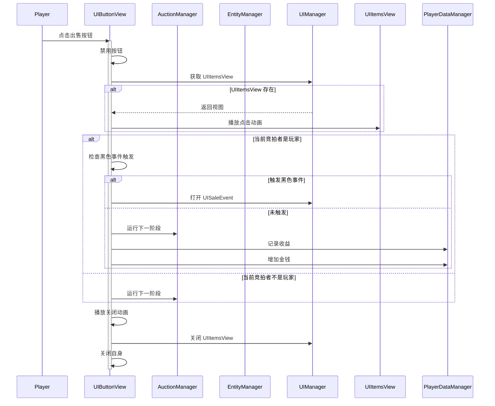

# UIButtonView.cs - 拍卖结算按钮视图

## 📄 文件信息

| 属性 | 值 |
|------|------|
| 文件路径 | `Assets/Scripts/Code/Game/UIGame/UIAuction/UIButtonView.cs` |
| 命名空间 | `TaoTie` |
| 基类 | `UIBaseView` |
| 实现接口 | `IOnCreate`, `IOnEnable<List<long>,bool>`, `IOnEnable<List<long>>`, `IOnDestroy`, `IOnDisable`, `II18N` |

---

## 🎯 类说明

`UIButtonView` 是拍卖阶段的结算按钮视图，负责展示当前宝盒总价值、盈亏情况，并提供出售/继续竞拍的操作按钮。

### 核心职责

- **价值展示**: 显示当前所有宝盒的总价值
- **盈亏计算**: 对比当前价值与上次竞拍价格，显示盈亏结果
- **状态管理**: 根据竞拍状态显示不同的按钮（出售/继续）
- **事件响应**: 处理玩家点击出售按钮后的逻辑
- **国际化支持**: 支持多语言文本显示

---

## 📋 字段说明

### UI 组件字段

| 字段名 | 类型 | 说明 |
|--------|------|------|
| `Button1` | `UIButton` | 按钮 1（出售/继续） |
| `Button3` | `UIButton` | 按钮 3（备用按钮） |
| `Total` | `UITextmesh` | 总价值显示文本 |
| `Title` | `UIImage` | 盈亏标题图片（赢/输） |
| `Result` | `UITextmesh` | 盈亏金额显示 |
| `Text` | `UIImage` | "总计"文本图片（国际化） |
| `MidRight` | `UIEmptyView` | 右侧信息区域容器 |
| `Animator` | `UIAnimator` | 底部按钮动画控制器 |

### 状态字段

| 字段名 | 类型 | 说明 |
|--------|------|------|
| `boxes` | `List<long>` | 宝盒 ID 列表 |
| `isOver` | `bool` | 游戏是否结束标记 |

---

## 🔧 方法说明

### 生命周期方法

#### `OnCreate()`
界面创建时初始化所有 UI 组件并注册消息监听。

**主要功能:**
1. 初始化所有 UI 组件引用
2. 注册 `SetChangeItemResult` 消息监听（鉴定结果）
3. 注册 `SetChangePriceResult` 消息监听（价格变化结果）

#### `OnEnable(List<long> data)`
启用界面并显示宝盒总价值（非结束状态）。

**参数说明:**
- `data`: 宝盒 ID 列表

**主要功能:**
1. 播放打开动画
2. 计算宝盒总价值
3. 对比上次竞拍价格，显示盈亏
4. 根据盈亏设置颜色（绿色=赢，红色=输）

#### `OnEnable(List<long> data, bool isOver)`
启用界面并显示结算按钮（结束状态）。

**参数说明:**
- `data`: 宝盒 ID 列表
- `isOver`: 游戏是否结束

**主要功能:**
1. 设置结束状态标记
2. 绑定按钮点击事件
3. 根据当前竞拍者决定显示哪个按钮
4. 计算并显示盈亏

#### `OnDisable()`
界面禁用时重置状态。

#### `OnDestroy()`
界面销毁时移除消息监听。

#### `OnLanguageChange()`
语言切换时更新国际化文本图片。

---

### 业务方法

#### `RefreshPrice()`
刷新价格显示，响应鉴定或价格变化事件。

**触发条件:**
- 收到 `SetChangeItemResult` 消息（鉴定完成）
- 收到 `SetChangePriceResult` 消息（价格变化）

**主要功能:**
1. 重新计算所有宝盒的总价值
2. 对比上次竞拍价格
3. 更新盈亏显示（数字动画 + 颜色）

---

### 事件处理方法

#### `OnClickButtonSale()`
处理出售按钮点击事件。

**主要功能:**
1. 禁用按钮防止重复点击
2. 播放物品点击动画
3. 如果是当前竞拍者：
   - 检查是否触发黑色事件
   - 记录今日收益
   - 增加玩家金钱
4. 播放关闭动画
5. 关闭当前窗口和物品列表窗口

---

## 🔄 流程图



---

## 💡 使用示例

### 打开结算按钮视图

```csharp
// 非结束状态 - 仅显示价值
UIManager.Instance.OpenWindow<UIButtonView, List<long>>(
    UIButtonView.PrefabPath, 
    boxIds  // 宝盒 ID 列表
);

// 结束状态 - 显示结算按钮
UIManager.Instance.OpenWindow<UIButtonView, List<long>, bool>(
    UIButtonView.PrefabPath, 
    boxIds,     // 宝盒 ID 列表
    true        // 游戏结束
);
```

### 刷新价格显示

```csharp
// 当鉴定结果或价格变化时，自动触发 RefreshPrice()
// 通过消息系统监听：
Messager.Instance.AddListener<int, int, bool>(0, MessageId.SetChangeItemResult, OnAppraisalResult);
Messager.Instance.AddListener<int, BigNumber, bool>(0, MessageId.SetChangePriceResult, OnChangePriceResult);
```

---

## 🔗 相关文档

- [UIGameView.cs.md](./UIGameView.cs.md) - 游戏主界面
- [UIItemsView.cs.md](./UIItemsView.cs.md) - 物品列表视图
- [UISaleEvent.cs.md](./UISaleEvent.cs.md) - 出售事件窗口
- [AuctionManager.cs.md](../../../System/Auction/AuctionManager.cs.md) - 拍卖管理器

---

*最后更新：2026-03-02*
