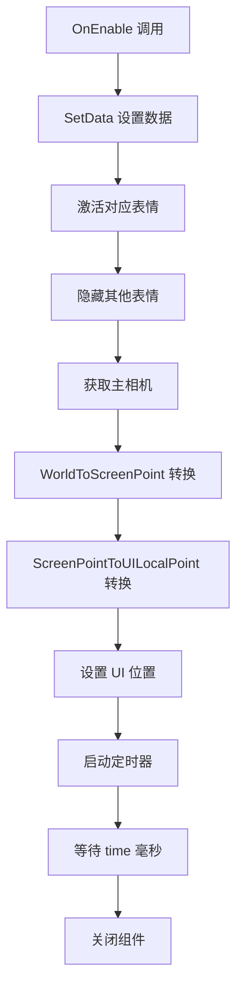

# UIEmojiItem.cs - 表情项组件

## 📄 文件信息

| 属性 | 值 |
|------|------|
| 文件路径 | `Assets/Scripts/Code/Game/UIGame/UIAuction/UIEmojiItem.cs` |
| 命名空间 | `TaoTie` |
| 基类 | `UIBaseView` |
| 实现接口 | `IOnCreate`, `IOnEnable<int,Vector3>`, `IOnEnable<int,Vector3,int,ETCancellationToken>` |

---

## 🎯 类说明

`UIEmojiItem` 是表情项组件，用于在玩家头顶显示表情图标，支持自动消失功能。

### 核心职责

- **表情展示**: 显示 7 种表情图标之一
- **坐标追踪**: 跟随 3D 世界坐标定位
- **自动消失**: 指定时间后自动关闭

---

## 📋 字段说明

### UI 组件字段

| 字段名 | 类型 | 说明 |
|--------|------|------|
| `Emoji` | `UIImage[]` | 表情图标数组（7 个，索引 0-6） |

### 常量

| 常量名 | 类型 | 值 | 说明 |
|--------|------|-----|------|
| `PrefabPath` | `string` | `"UIGame/UIAuction/Prefabs/UIEmojiItem.prefab"` | 预制体路径 |

---

## 🔧 方法说明

### 生命周期方法

#### `OnCreate()`
组件创建时初始化 7 个表情图标。

#### `OnEnable(int emoji, Vector3 worldSpace)`
启用组件并显示指定表情（默认 1500ms 后消失）。

**参数说明:**
- `emoji`: 表情索引（0-6）
- `worldSpace`: 3D 世界坐标

#### `OnEnable(int emoji, Vector3 worldSpace, int time, ETCancellationToken cancel)`
启用组件并指定显示时长。

**参数说明:**
- `emoji`: 表情索引（0-6）
- `worldSpace`: 3D 世界坐标
- `time`: 显示时长（毫秒）
- `cancel`: 取消令牌

---

### 业务方法

#### `SetData(int emoji, Vector3 worldSpace)`
设置表情数据并定位。

**参数说明:**
- `emoji`: 表情索引（0-6）
- `worldSpace`: 3D 世界坐标

**主要功能:**
1. **表情显示**: 激活对应索引的表情，隐藏其他
2. **坐标转换**:
   - 获取主相机
   - 将 3D 世界坐标转换为 UI 坐标
   - 设置组件位置

---

## 🔄 流程图



---

## 💡 使用示例

### 显示玩家表情

```csharp
// 获取玩家位置
Vector3 playerPos = playerEntity.Position;

// 显示笑脸表情（索引 2）
UIManager.Instance.OpenWindow<UIEmojiItem, int, Vector3>(
    UIEmojiItem.PrefabPath,
    2,  // 表情索引
    playerPos
);

// 显示表情（指定时长 3 秒）
UIManager.Instance.OpenWindow<UIEmojiItem, int, Vector3, int, ETCancellationToken>(
    UIEmojiItem.PrefabPath,
    2,      // 表情索引
    playerPos,
    3000,   // 3 秒
    cancellationToken
);
```

### 表情索引说明

| 索引 | 表情 | 使用场景 |
|------|------|----------|
| 0 | 😐 中性 | 默认表情 |
| 1 | 🙂 微笑 | 友好互动 |
| 2 | 😊 开心 | 竞拍成功 |
| 3 | 😠 生气 | 竞拍失败 |
| 4 | 😂 大笑 | 搞笑时刻 |
| 5 | 😏 得意 | 抬价成功 |
| 6 | 😭 哭泣 | 损失惨重 |

---

## 🔗 相关文档

- [UIBubbleItem.cs.md](./UIBubbleItem.cs.md) - 对话气泡项
- [CameraManager.cs.md](../../../Manager/CameraManager.cs.md) - 相机管理器

---

*最后更新：2026-03-02*
