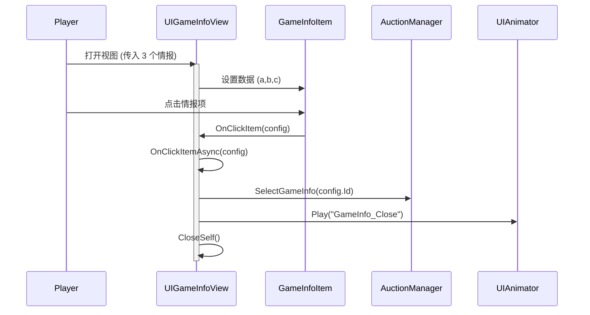

# UIGameInfoView.cs - 游戏情报选择视图

## 📄 文件信息

| 属性 | 值 |
|------|------|
| 文件路径 | `Assets/Scripts/Code/Game/UIGame/UIAuction/UIGameInfoView.cs` |
| 命名空间 | `TaoTie` |
| 基类 | `UIBaseView` |
| 实现接口 | `IOnCreate`, `IOnEnable<GameInfoConfig,GameInfoConfig,GameInfoConfig>` |

---

## 🎯 类说明

`UIGameInfoView` 是游戏情报选择视图，在每局游戏开始时展示三个随机情报供玩家选择。玩家选择的情报会影响本局游戏的物品价格或提供特殊效果。

### 核心职责

- **情报展示**: 同时展示三个随机情报选项
- **选择交互**: 允许玩家点击选择一个情报
- **动画效果**: 播放选择后的关闭动画
- **数据传递**: 将选择结果传递给拍卖管理器

---

## 📋 字段说明

### UI 组件字段

| 字段名 | 类型 | 说明 |
|--------|------|------|
| `GameInfoItem` | `GameInfoItem[]` | 三个情报项组件数组（索引 0-2） |
| `UIAnimator` | `UIAnimator` | 窗口动画控制器 |

---

## 🔧 方法说明

### 生命周期方法

#### `OnCreate()`
视图创建时初始化三个情报项组件。

**主要功能:**
1. 初始化动画控制器
2. 为三个情报项槽位添加 GameInfoItem 组件

#### `OnEnable(GameInfoConfig a, GameInfoConfig b, GameInfoConfig c)`
视图启用时设置三个情报的数据。

**参数说明:**
- `a`: 第一个情报配置
- `b`: 第二个情报配置
- `c`: 第三个情报配置

**主要功能:**
1. 为每个情报项设置数据和点击回调
2. 所有情报项共享相同的点击处理逻辑

---

### 业务方法

#### `OnClickItem(GameInfoConfig config)`
处理情报项点击事件。

**参数说明:**
- `config`: 被点击的情报配置

**主要功能:**
1. 调用异步处理方法
2. 启动协程执行

#### `OnClickItemAsync(GameInfoConfig config)`
异步处理情报选择。

**流程:**
1. 调用拍卖管理器的 `SelectGameInfo` 方法记录选择
2. 播放关闭动画
3. 关闭当前视图

---

## 🔄 流程图



---

## 💡 使用示例

### 打开情报选择视图

```csharp
// 从拍卖管理器或其他逻辑打开
var configA = GameInfoConfigCategory.Instance.Get(configIdA);
var configB = GameInfoConfigCategory.Instance.Get(configIdB);
var configC = GameInfoConfigCategory.Instance.Get(configIdC);

UIManager.Instance.OpenWindow<UIGameInfoView, GameInfoConfig, GameInfoConfig, GameInfoConfig>(
    UIGameInfoView.PrefabPath,
    configA, configB, configC
);
```

### 情报配置示例

```csharp
// GameInfoConfig 配置结构
{
    Id: 101,
    Name: "古董鉴定师",
    Text: "古董类物品价格 +50%",
    TargetType: GameInfoTargetType.ItemType,  // 目标类型
    TargetValue: (int)ItemType.Antique,       // 目标值
    AwardType: 1,                              // 奖励类型：0=加法，1=乘法
    RewardCount: 50                            // 奖励数值
}
```

---

## 🔗 相关文档

- [GameInfoItem.cs.md](./GameInfoItem.cs.md) - 情报项组件
- [AuctionManager.cs.md](../../../System/Auction/AuctionManager.cs.md) - 拍卖管理器
- [GameInfoConfig.cs.md](../../../../Module/Generate/Config/GameInfoConfig.cs.md) - 游戏情报配置表

---

*最后更新：2026-03-02*
