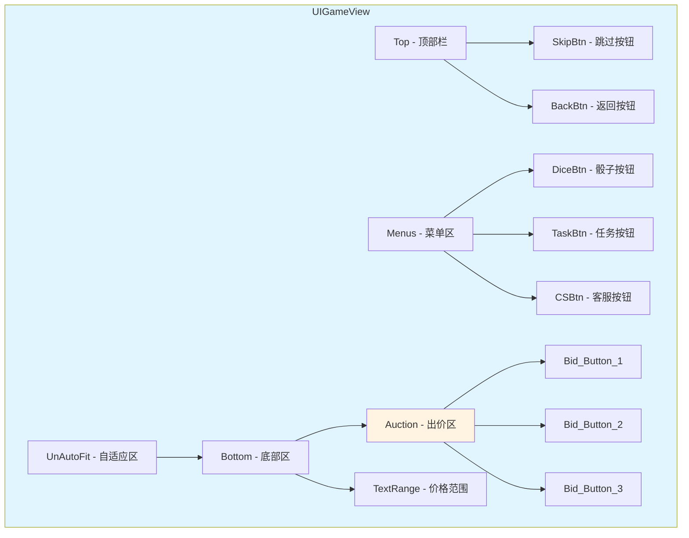

# UIGameView.cs 注解文档

## 文件基本信息

| 属性 | 值 |
|------|-----|
| **文件名** | UIGameView.cs |
| **路径** | Assets/Scripts/Code/Game/UIGame/UIAuction/UIGameView.cs |
| **所属模块** | 游戏 UI → UIAuction (拍卖 UI) |
| **文件职责** | 拍卖游戏主界面，展示竞拍流程、出价按钮、骰子/任务入口等 |

---

## 类/结构体说明

### UIGameView

| 属性 | 说明 |
|------|------|
| **职责** | 拍卖游戏主界面，管理竞拍流程、出价交互、辅助功能入口 |
| **泛型参数** | 无 |
| **继承关系** | `UIBaseView` |
| **实现的接口** | `IOnCreate`, `IOnEnable`, `IOnDisable`, `IOnWidthPaddingChange` |

**设计模式**: MVC 视图模式 + 状态管理

```csharp
public class UIGameView : UIBaseView, IOnCreate, IOnEnable, IOnDisable, IOnWidthPaddingChange
{
    public static string PrefabPath => "UIGame/UIAuction/Prefabs/UIGameView.prefab";
}
```

---

## 字段与属性（按重要程度排序）

| 名称 | 类型 | 访问级别 | 说明 |
|------|------|----------|------|
| `PrefabPath` | `string` | `public static` | Prefab 资源路径 |
| `Menu` | `UIEmptyView` | `public` | 菜单容器 |
| `DiceBtn` | `UIButton` | `public` | 骰子按钮 |
| `CSBtn` | `UIButton` | `public` | 客服按钮 |
| `TaskBtn` | `UIButton` | `public` | 任务按钮 |
| `BidButtons` | `UIButton[]` | `public` | 出价按钮数组 (3 个) |
| `BidAdIcon` | `UIImage[]` | `public` | 出价按钮广告图标 |
| `BidIcon` | `UIImage[]` | `public` | 出价按钮普通图标 |
| `ButtonText` | `UITextmesh[]` | `public` | 出价按钮文本 |
| `TextRangePrice` | `UITextmesh` | `public` | 价格范围文本 |
| `SkipBtn` | `UIButton` | `public` | 跳过按钮 (仅编辑器) |
| `BackBtn` | `UIButton` | `public` | 返回按钮 |
| `Dice` | `UINumRedDot` | `public` | 骰子红点组件 |
| `Task` | `UINumRedDot` | `public` | 任务红点组件 |
| `Animator` | `UIAnimator` | `public` | 主动画组件 |
| `Button` | `UIAnimator` | `public` | 出价按钮动画 |
| `CashGroup` | `UICashGroup` | `public` | 顶部金币组件 |
| `auctionMoney` | `BigNumber[]` | `private` | 竞拍金额数组 (3 个) |
| `cancel` | `ETCancellationToken` | `private` | 取消令牌 |
| `cancelAnim` | `ETCancellationToken` | `private` | 动画取消令牌 |
| `actionLineVolume` | `ActionLineVolume` | `private` | 后处理体积 (场景) |
| `canBack` | `bool` | `private` | 是否可返回 |

---

## 方法说明（按重要程度排序）

### OnCreate()

**签名**:
```csharp
public void OnCreate()
```

**职责**: 创建视图时初始化所有组件

**核心逻辑**:
```
1. 添加所有 UI 组件 (按钮、文本、红点、动画等)
2. 初始化出价按钮数组 (3 个)
3. 获取场景的 ActionLineVolume (后处理效果)
4. 禁用 ActionLineVolume (避免干扰 UI)
```

**调用者**: UIManager (窗口创建时)

---

### OnEnable()

**签名**:
```csharp
public void OnEnable()
```

**职责**: 启用视图时初始化事件和数据

**核心逻辑**:
```
1. 设置客服按钮显隐和点击事件
2. 绑定任务、骰子按钮点击事件
3. 刷新骰子状态
4. 设置跳过按钮 (仅编辑器模式)
5. 绑定返回按钮点击事件
6. 启动异步启用流程 (OnEnableAsync)
7. 绑定出价按钮点击事件
```

**调用者**: UIManager (窗口启用时)

---

### OnDisable()

**签名**:
```csharp
public void OnDisable()
```

**职责**: 禁用视图时清理资源

**核心逻辑**:
```
1. 取消所有异步操作
2. 恢复场景 ActionLineVolume
3. 清理事件监听
```

**调用者**: UIManager (窗口禁用时)

---

### OnAuction(int index)

**签名**:
```csharp
private void OnAuction(int index)
```

**职责**: 出价按钮点击处理

**核心逻辑**:
```
1. 检查索引有效性
2. 执行出价逻辑
3. 播放出价动画
```

**调用者**: BidButtons 点击事件

---

### OnClickDice()

**签名**:
```csharp
private void OnClickDice()
```

**职责**: 骰子按钮点击处理

**核心逻辑**:
```
1. 打开骰子小游戏窗口
```

**调用者**: DiceBtn 点击事件

---

### OnClickTask()

**签名**:
```csharp
private void OnClickTask()
```

**职责**: 任务按钮点击处理

**核心逻辑**:
```
1. 打开任务窗口
```

**调用者**: TaskBtn 点击事件

---

### OnClickBack()

**签名**:
```csharp
private void OnClickBack()
```

**职责**: 返回按钮点击处理

**核心逻辑**:
```
1. 检查是否可返回
2. 关闭当前窗口
```

**调用者**: BackBtn 点击事件

---

### RefreshDice()

**签名**:
```csharp
private void RefreshDice()
```

**职责**: 刷新骰子状态

**核心逻辑**:
```
1. 获取玩家骰子数量
2. 更新红点显示
```

**调用者**: OnEnable(), 骰子数量变化时

---

## 界面结构

### UI 层级图



---

## 使用示例

### 示例 1: 打开拍卖游戏界面

```csharp
// 打开拍卖游戏界面
await UIManager.Instance.OpenWindow<UIGameView>(UIGameView.PrefabPath);
```

### 示例 2: 触发助手对话

```csharp
// 触发助手对话 (通过消息)
Messager.Instance.Broadcast(0, MessageId.AssistantTalk, "欢迎来到拍卖场！", false);
```

---

## 与其他模块的交互

```mermaid
graph TD
    subgraph UIGameView["UIGameView"]
        V[视图组件]
        B[出价按钮]
        M[菜单]
    end
    
    subgraph Systems["游戏系统"]
        Auction[AuctionManager]
        Player[PlayerDataManager]
        Dice[骰子系统]
        Task[任务系统]
    end
    
    subgraph UI["其他 UI"]
        DiceWin[UIDiceWin]
        TaskWin[UITaskInfoWin]
        Assistant[UIAssistantView]
    end
    
    V --> B
    V --> M
    V --> Auction
    V --> Player
    V --> Dice
    V --> Task
    V --> DiceWin
    V --> TaskWin
    V --> Assistant
    
    note right of V "拍卖游戏主界面<br/>管理竞拍流程和交互"
    
    style UIGameView fill:#e1f5ff
    style Systems fill:#fff4e1
    style UI fill:#e8f5e9
```

---

## 阅读指引

### 建议的阅读顺序

1. **理解界面作用** - 拍卖游戏主界面用于竞拍交互
2. **看字段定义** - 了解各个组件的作用
3. **重点看 OnCreate/OnEnable** - 理解初始化和事件绑定
4. **了解出价流程** - 理解 OnAuction 方法
5. **查看辅助功能** - 了解骰子、任务入口

### 最值得学习的技术点

1. **数组组件管理**: 使用数组管理 3 个出价按钮
2. **红点集成**: 与 RedDotManager 集成显示未读提示
3. **编辑器支持**: SkipBtn 仅在编辑器模式显示
4. **场景后处理**: 临时禁用 ActionLineVolume 避免干扰 UI
5. **取消令牌**: 使用 ETCancellationToken 管理异步操作

---

## 相关文档

- [UIAssistantView.cs.md](./UIAssistantView.cs.md) - 助手视图
- [UIDiceWin.cs.md](./UIDiceWin.cs.md) - 骰子小游戏窗口
- [UITaskInfoWin.cs.md](./UITaskInfoWin.cs.md) - 任务信息窗口
- [AuctionManager.cs.md](../../System/Auction/AuctionManager.cs.md) - 拍卖管理器
- [UICashGroup.cs.md](../UILobby/UICashGroup.cs.md) - 金币显示组件

---

*文档生成时间：2026-03-02 | OpenClaw AI 助手*
